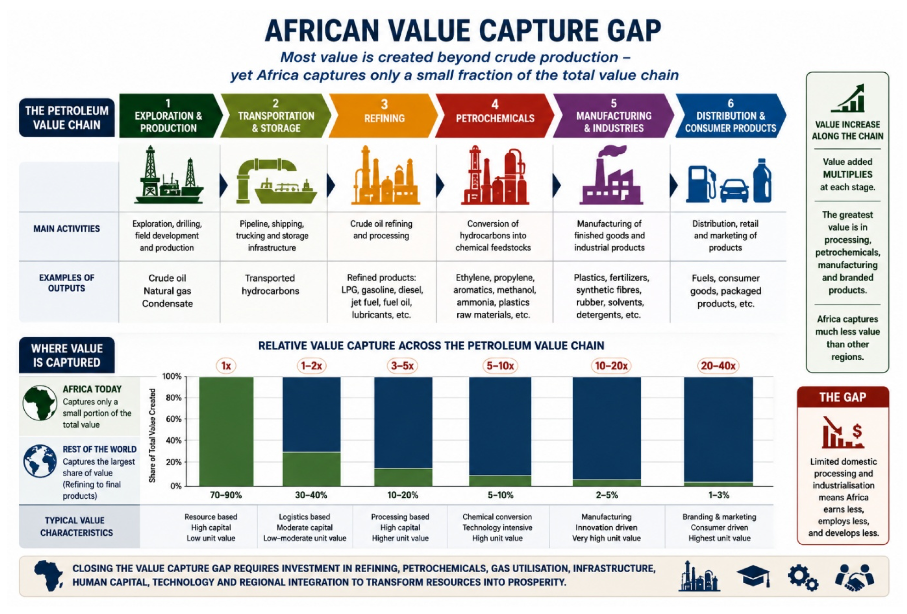
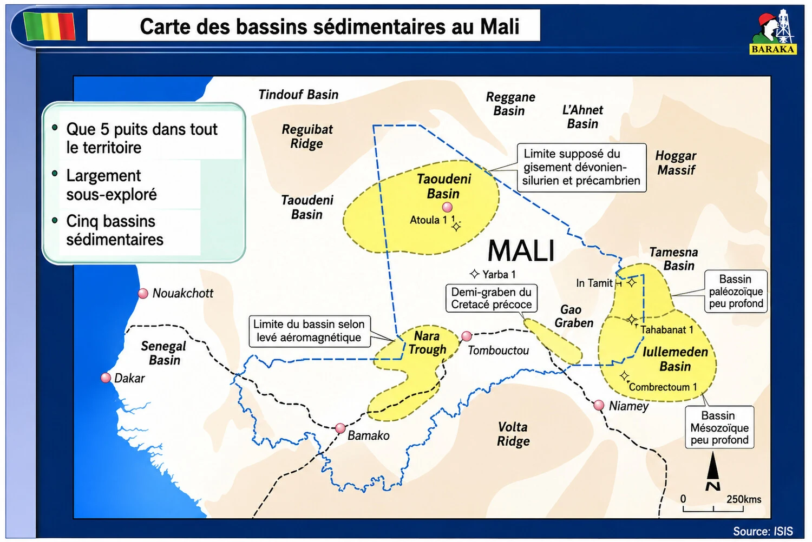

# Chapter 1: General Introduction

## 1.1- Hydrocarbon Resources and Economic Development

West Africa possesses significant hydrocarbon resources that have accumulated within the subsurface over millions of years and continue to play an important role in the region's economic development. Despite growing investment in renewable energy and increasing global efforts to reduce greenhouse gas emissions, oil and natural gas remain among the world's most important sources of primary energy. Beyond their role as energy commodities, hydrocarbons provide essential feedstocks for the petrochemical industry and support a wide range of products used in transportation, agriculture, healthcare, construction, manufacturing, and numerous other sectors of the global economy.

## 1.2- West Africa's Strategic Importance in Global Energy Markets

West Africa occupies a position of growing strategic importance within the global energy industry. The region possesses substantial oil and natural gas resources, extensive sedimentary basins, favourable offshore geology, and significant remaining exploration potential. Over the past several decades, it has evolved into one of the world's most important hydrocarbon-producing regions, attracting major international investment and contributing significantly to global energy supplies.

The region is home to several established petroleum producers, including Nigeria, Ghana, Côte d'Ivoire, and Equatorial Guinea, while recent discoveries in Mauritania and Senegal have transformed the Mauritania-Senegal-Guinea-Bissau-Guinea (MSGBC) Basin into one of the most promising emerging petroleum provinces worldwide. Significant exploration opportunities remain across both mature and frontier basins, extending from the Gulf of Guinea to the Atlantic Margin of Northwest Africa.

**Contribution to Global Energy Supply**

West Africa accounts for a significant share of Africa's oil and natural gas production and remains an important source of crude oil, liquefied natural gas (LNG), and petroleum products for international markets. The region's crude oils are generally characterised by favourable refining qualities, including relatively low sulphur content, making them attractive to refiners worldwide.

Its strategic location along major Atlantic shipping routes provides efficient access to markets in Europe, North America, South America, and Asia. As energy-importing nations seek to diversify supply sources and enhance energy security, West Africa has become an increasingly important component of the global energy system.

The continued expansion of LNG developments in countries such as Nigeria, Mauritania, and Senegal is further strengthening the region's role within international gas markets. These projects are expected to contribute to global energy diversification while supporting domestic power generation and industrial development.

**World-Class Offshore Petroleum Provinces**

One of West Africa's principal competitive advantages lies in its offshore petroleum potential. The deepwater and ultra-deepwater provinces of the Gulf of Guinea contain some of the most prolific hydrocarbon systems discovered during the past three decades.

The geological evolution associated with the opening of the South Atlantic Ocean created highly prospective petroleum systems extending across much of the West African margin. These systems have generated numerous world-class oil and gas discoveries and continue to attract international oil companies, national oil companies, and independent exploration firms.

Advances in seismic imaging, drilling technology, subsea production systems, and floating production facilities have enabled the successful development of increasingly complex offshore resources, establishing West Africa as one of the world's leading deepwater petroleum provinces.

**Natural Gas and the Energy Transition**

Although oil has historically dominated petroleum development within the region, natural gas is expected to play an increasingly important role in West Africa's future energy landscape. Major gas discoveries in Nigeria, Mauritania, Senegal, and Côte d'Ivoire provide opportunities for power generation, industrialisation, fertiliser production, petrochemical development, and LNG exports.

Natural gas also offers a pathway for reducing routine gas flaring, improving energy access, and supporting lower-carbon economic development. As global energy systems evolve, the region's substantial gas resources are expected to become an increasingly important component of both domestic and international energy strategies.

**Future Exploration Potential**

Despite decades of exploration activity, significant portions of West Africa remain underexplored relative to many mature petroleum provinces elsewhere in the world. Opportunities continue to exist in frontier offshore basins, deepwater plays, stratigraphic traps, and emerging petroleum systems.

The combination of favourable geology, expanding geophysical datasets, technological innovation, and improving regulatory frameworks continues to attract investor interest. As a result, West Africa is expected to remain an important destination for petroleum exploration and development throughout the coming decades.

**Conclusion**

West Africa occupies a unique position within the global energy system. Its combination of abundant hydrocarbon resources, prolific offshore basins, expanding natural gas developments, strategic geographic location, and continuing exploration potential makes the region one of the world's most important petroleum provinces.

The challenge facing West African nations is not simply to discover and produce hydrocarbons, but to manage these resources responsibly and transform petroleum wealth into sustainable economic development, industrial growth, energy security, and long-term prosperity for future generations.

West Africa has assumed growing importance in international energy security, particularly as consuming nations seek to diversify hydrocarbon supply sources and reduce dependence on traditional producing regions. European countries have increasingly strengthened energy partnerships with African producers, recognising the strategic value of the region's crude oil and natural gas resources. The development of new LNG export projects in Nigeria, Mauritania, and Senegal has further enhanced West Africa's ability to supply international markets and support global energy diversification efforts.

## 1.3- The Petroleum Industry: A Multidisciplinary Sector

The petroleum industry has evolved into one of the world's most technologically advanced and multidisciplinary sectors. Its successful operation requires expertise across a broad range of scientific, engineering, commercial, legal, economic, environmental, and political disciplines. Petroleum exploration and production activities depend upon the integration of geology, geophysics, geochemistry, drilling engineering, reservoir engineering, production engineering, facilities engineering, refining technologies, petrochemicals, petroleum economics, and project management. Equally important are the legal and regulatory frameworks that govern petroleum operations, together with the fiscal systems that determine how the economic benefits generated from petroleum resources are shared between States and investors.

The discovery, development, production, and monetisation of hydrocarbon resources rely upon advanced technologies that continue to evolve in response to increasingly complex geological environments, operational challenges, environmental considerations, and changing market conditions. The technical studies, economic evaluations, and commercial analyses undertaken by petroleum professionals are fundamental to determining whether petroleum projects can be developed safely, efficiently, and profitably.

## 1.4- Purpose and Scope of This Book

This book provides a comprehensive examination of the exploration, development, management, and governance of petroleum resources in West Africa. Its principal objective is to analyse the technical, economic, fiscal, institutional, and socio-political factors that influence the development of the petroleum sector and to evaluate how hydrocarbon resources can contribute to long-term economic growth and sustainable development throughout the region.

The work examines the roles and responsibilities of governments, regulators, national oil companies, investors, operators, service companies, and other stakeholders involved in petroleum resource management. It further explores the geological foundations of the region's hydrocarbon potential, the evolution of petroleum exploration and production activities, the operation of petroleum fiscal systems, and the institutional frameworks required to ensure that petroleum resources are managed effectively and responsibly.

The ultimate aim is to demonstrate how petroleum resources can serve as a catalyst for broader economic transformation. Rather than viewing hydrocarbons solely as sources of export revenue, the book examines how they can support industrialisation, energy security, employment creation, infrastructure development, technical capacity building, regional integration, and improved living standards across West Africa.

Particular attention is given to emerging petroleum provinces, country-specific petroleum developments, integrated petroleum value chains, gas monetisation, refining and petrochemical industries, national oil companies, petroleum data management, governance, transparency, and long-term resource stewardship. Throughout the book, emphasis is placed on maximising the value derived from petroleum resources while ensuring that their benefits extend beyond the petroleum sector itself.

The central question addressed throughout this work is not simply how petroleum resources are discovered and produced, but how they can be managed, developed, and utilised to create lasting economic and social value for present and future generations throughout West Africa.

## 1.5- Organisation of the Book

This book is organised into twelve chapters that collectively examine the exploration, development, management, governance, and future of petroleum resources in West Africa. The chapters are structured to provide readers with a progressive understanding of the region's petroleum industry, beginning with its geological foundations and regional context before examining technical operations, fiscal systems, institutions, governance, and future opportunities.

Chapter 1 introduces the historical development and strategic importance of petroleum resources in West Africa and establishes the broader economic, social, and developmental context within which the region's petroleum industry operates.

Chapter 2 examines the emerging petroleum provinces of West Africa and provides an overview of the region's principal sedimentary basins, petroleum systems, and hydrocarbon potential. The chapter reviews both established and frontier exploration areas and highlights the geological factors that continue to attract petroleum investment throughout the region.

Chapter 3 presents a country-by-country analysis of the petroleum sector across West Africa. It reviews the petroleum potential, exploration history, production status, regulatory frameworks, fiscal systems, national oil companies, opportunities, and challenges associated with each country.

Chapter 4 examines the petroleum value chain and the strategic role of hydrocarbons in supporting economic growth, industrialisation, energy security, regional integration, and broader socio-economic development throughout West Africa.

Chapter 5 is devoted to upstream petroleum operations and provides a detailed examination of petroleum exploration, appraisal, development planning, drilling, production operations, reserves and resources evaluation, and field abandonment.

Chapter 6 examines petroleum fiscal regimes and explains the principal contractual and fiscal mechanisms through which States derive value from petroleum resources. Particular attention is given to royalties, taxation, production sharing contracts, bonuses, and State participation.

Chapter 7 applies these concepts through a comparative analysis of fiscal regimes used across selected West African countries and evaluates their implications for government revenues, investment attractiveness, and project economics.

Chapter 8 examines the role of national oil companies within West Africa and analyses their contribution to resource management, petroleum sector development, revenue generation, local content, and national energy security.

Chapter 9 investigates the socio-political factors that influence petroleum sector performance, including governance, transparency, accountability, political stability, institutional effectiveness, and corruption.

Chapter 10 examines petroleum data management and highlights the strategic importance of geological, geophysical, drilling, reservoir, and production data throughout the petroleum project life cycle. The chapter emphasises the role of national data repositories and the preservation of petroleum data as a strategic national asset.

Chapter 11 presents the principal conclusions derived from the technical, economic, fiscal, institutional, and governance analyses developed throughout the book.

Finally, Chapter 12 presents a strategic vision for the future of the West African petroleum industry to 2050 and examines the opportunities and challenges associated with energy transition policies, natural gas development, local content, industrialisation, regional cooperation, technological innovation, decarbonisation, and long-term energy security.

## 1.6- Petroleum Resources as a Driver of Sustainable Development

This book ultimately argues that the future success of West Africa's petroleum industry should not be measured solely by reserves discovered, production achieved, or revenues generated. Rather, success should be measured by the extent to which petroleum resources contribute to sustainable economic development, stronger institutions, energy security, industrialisation, technical capability, improved infrastructure, and enhanced quality of life for the people of the region.

The responsible management of hydrocarbon resources therefore represents not only an economic opportunity but also a strategic pathway towards long-term prosperity and development throughout West Africa. While petroleum resources remain finite, the revenues and capabilities generated through their development can create lasting benefits when supported by sound governance, effective institutions, prudent fiscal management, investment in human capital, and long-term national planning.

To explore these issues comprehensively, the book examines the geological, technical, economic, fiscal, institutional, and governance dimensions of petroleum resource development across West Africa. Together, the twelve chapters provide an integrated framework for understanding how petroleum resources can be developed responsibly and utilised to support sustainable economic growth, regional cooperation, energy security, and long-term socio-economic development throughout the region.

Ultimately, the central theme of this work is that petroleum resources should serve as a catalyst for broader national development rather than an end in themselves. The countries most likely to benefit from their hydrocarbon resources will be those that successfully transform petroleum wealth into productive investment, economic diversification, institutional strengthening, technological advancement, and improved living standards for present and future generations.

## 1.7- Petroleum Resources, Industrialisation and Africa's Future

### 1.7.1- The African Development Paradox

Africa possesses some of the world's most significant petroleum and natural gas resources. Countries such as Nigeria, Angola, Ghana, Senegal, Côte d’Ivoire, and Mauritania have attracted billions of dollars of investment and collectively contribute significant volumes of crude oil and natural gas to global energy markets.

Despite this resource wealth, many African countries continue to face major development challenges. Large segments of the population lack reliable access to electricity, modern energy services, healthcare, education, and industrial employment opportunities. In many cases, petroleum-producing countries continue to experience relatively high levels of poverty despite decades of hydrocarbon production.

This situation is often referred to as the African development paradox: countries rich in natural resources frequently struggle to convert resource wealth into broad-based socio-economic development.

The challenge facing African governments is therefore not simply how to produce oil and gas, but how to transform petroleum resources into long-term economic prosperity, industrial development, energy security, employment creation, and improved living standards.

Figure 1 African Petroleum Development Paradox. Resource wealth does not automatically translate into broad-based economic development.

### 1.7.2- The African Value Capture Gap

Historically, many African petroleum-producing countries have operated within a resource-export model in which crude oil and natural gas are exported with limited domestic processing.

Under this model, hydrocarbons are produced and sold to international markets, while many higher-value products such as refined fuels, petrochemicals, fertilisers, plastics, synthetic materials, and industrial feedstocks are imported back into Africa.

As a consequence, a significant proportion of the value generated from African petroleum resources is captured outside the continent through refining, petrochemical manufacturing, engineering services, technology development, equipment manufacturing, and associated industrial activities.

The result is that many African economies capture only a fraction of the total value chain associated with their petroleum resources.

Closing this value capture gap represents one of the greatest economic opportunities available to African petroleum-producing countries during the coming decades.

Figure 2 African Value Capture Gap. Most value generated from hydrocarbon resources is created beyond crude oil production through refining, petrochemicals, manufacturing, and consumer products.

### 1.7.3- Petroleum as a Catalyst for Industrialisation

The greatest economic benefits from petroleum resources are often generated not through crude oil production itself, but through the development of industries that utilise hydrocarbons as feedstock or energy sources.

Hydrocarbons can support the development of:

- Refineries;
- Petrochemical complexes;
- Fertiliser plants;
- Gas processing facilities;
- Power generation infrastructure;
- Manufacturing industries;
- Transportation networks;
- Industrial parks;
- Export processing zones; and
- Domestic energy-intensive industries.

Countries that successfully integrate petroleum development with broader industrial policies are generally able to create significantly greater economic value, employment opportunities, and government revenues than those relying solely on crude oil exports.

For Africa, the long-term objective should be the development of integrated petroleum value chains capable of supporting economic diversification and industrial growth.

### 1.7.4- Energy Security and Energy Access

One of the most striking challenges facing Africa is that many hydrocarbon-producing countries continue to experience energy shortages and limited access to reliable electricity.

Although Africa exports significant volumes of crude oil and natural gas, millions of people across the continent still lack access to modern energy services.

This situation highlights the importance of balancing export revenues with domestic energy needs.

Natural gas, in particular, offers significant opportunities to support:

- Electricity generation;
- Industrial development;
- Fertiliser production;
- Domestic cooking fuel;
- Transportation fuels; and
- Regional energy integration.

The responsible development of petroleum resources should therefore contribute not only to export revenues but also to improved energy access and energy security for African populations.

### 1.7.5- The Role of African National Oil Companies

National Oil Companies (NOCs) play an increasingly important role in the management and development of Africa's petroleum resources.

Examples include:

- NNPC Limited;
- GNPC;
- PETROSEN;
- PETROCI;
- SONANGOL; and
- SONATRACH.

In addition to participating in petroleum projects, many African NOCs are expected to support national energy strategies, promote local content development, strengthen technical capacity, facilitate technology transfer, and contribute to broader economic development objectives.

The effectiveness of these organisations will play a critical role in determining how successfully African countries manage and monetise their petroleum resources in the future.

### 1.7.6- Regional Cooperation and Petroleum Integration

Many petroleum challenges facing African countries are too large to be addressed effectively by individual nations acting alone.

Regional cooperation offers opportunities to improve:

- Energy security;
- Petroleum infrastructure development;
- Cross-border pipeline systems;
- Refining capacity;
- Natural gas utilisation;
- Electricity generation;
- Technical training;
- Research and development; and
- Regional trade.

Institutions such as Economic Community of West African States, African Petroleum Producers’ Organisation, and African Energy Commission have important roles to play in promoting regional collaboration and supporting the development of a more integrated African petroleum industry.

The implementation of the African Continental Free Trade Area may further strengthen opportunities for regional industrial development, trade, and investment across the continent.

### 1.7.7- Financing Africa's Petroleum Future

The development of petroleum resources requires substantial capital investment.

Historically, African petroleum projects have relied heavily on financing provided by international oil companies, commercial banks, export credit agencies, and foreign investors.

While international investment will continue to play an important role, many African policymakers increasingly recognise the need to strengthen African sources of financing.

Potential mechanisms include:

- Sovereign wealth funds;
- National petroleum funds;
- Regional development banks;
- African commercial banks;
- Pension funds;
- Capital markets; and
- Emerging African energy financing institutions.

Increasing African participation in project financing may enhance local ownership, improve value retention within the continent, and support long-term economic development objectives.

### 1.7.8- Vision for Africa's Petroleum Future

The future success of Africa's petroleum industry should not be measured solely by the volume of hydrocarbons produced or exported.

Rather, success should be measured by the extent to which petroleum resources contribute to:

- Economic diversification;
- Industrialisation;
- Energy security;
- Employment creation;
- Technology transfer;
- Infrastructure development;
- Local capacity building;
- Regional integration; and
- Sustainable socio-economic development.

The ultimate objective should be to transform Africa from a predominantly resource-exporting region into a continent that captures increasing value from its natural resources through processing, manufacturing, innovation, and industrial development.

Petroleum resources are finite. The infrastructure, institutions, technical capabilities, and economic opportunities created through their responsible development can, however, generate benefits for future generations long after the resources themselves have been depleted.

Figure 3 Integrated African Petroleum Industry Model. Transforming hydrocarbon resources into long-term economic growth and sustainable development.
