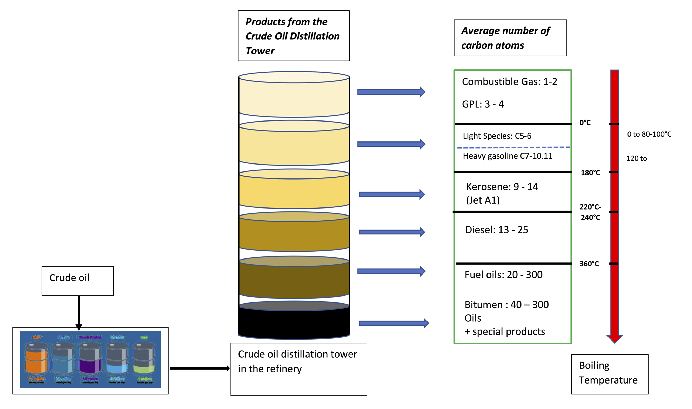

# Chapter 2: Emerging Petroleum Provinces in West Africa

## 2.1- Introduction

Over the past two decades, the petroleum industry in West Africa has undergone significant transformation. While established producers such as Nigeria and Angola continue to dominate regional hydrocarbon production, exploration success in previously underexplored basins has created a new generation of emerging petroleum provinces.

Advances in seismic imaging, deepwater drilling technologies, basin modelling and petroleum systems analysis have enabled exploration companies to identify and evaluate plays that were previously considered inaccessible or poorly understood. These technological developments, combined with improvements in regional geological knowledge and growing demand for natural gas, have contributed to a renewed interest in frontier and emerging petroleum provinces across West Africa.

Recent discoveries in Senegal, Mauritania, Côte d'Ivoire and Namibia have demonstrated that significant hydrocarbon resources remain to be discovered across the African continent. Several emerging provinces are now attracting substantial investment from international oil companies, independent operators and national oil companies seeking new opportunities beyond mature producing areas.

Emerging petroleum provinces are particularly important because they provide opportunities to:

- Increase national hydrocarbon production;
- Diversify government revenues;
- Attract foreign direct investment;
- Develop local technical capacity;
- Expand domestic energy supplies;
- Support industrial development;
- Improve energy security;
- Stimulate economic growth.

The future of West Africa's petroleum sector is therefore likely to be influenced not only by mature producing regions but also by the successful development of emerging petroleum provinces.

Figure 4 Key emerging petroleum provinces across West Africa.

## 2.2- Characteristics of Emerging Petroleum Provinces

Emerging petroleum provinces typically possess several common characteristics.

These include:

- Limited historical drilling activity;
- Relatively low geological maturity;
- Incomplete petroleum system understanding;
- Sparse well control;
- Limited production infrastructure;
- High exploration risk;
- Significant remaining resource potential.

Unlike mature petroleum provinces where geological risk is relatively well understood, emerging provinces often require extensive geological and geophysical evaluation before commercial development can occur.

Successful exploration within these provinces can significantly alter national energy strategies and transform economic development prospects.

## 2.3- The MSGBC Basin: West Africa's New Petroleum Frontier

The Mauritania-Senegal-Guinea-Bissau-Conakry (MSGBC) Basin has emerged as one of the most important petroleum provinces discovered globally during the twenty-first century.

Stretching along the Atlantic Margin from Mauritania to Guinea, the basin contains a series of sedimentary depocentres that have generated substantial oil and gas discoveries.

### 2.3.1- Geological Setting

The MSGBC Basin formed during the opening of the Atlantic Ocean and contains thick sequences of Jurassic, Cretaceous and Tertiary sediments.

The basin possesses all the essential elements of a working petroleum system:

- Mature source rocks;
- Effective migration pathways;
- High-quality reservoirs;
- Regional seals;
- Large structural and stratigraphic traps.

### 2.3.2- Major Discoveries

Significant discoveries include:

- Greater Tortue Ahmeyim (Mauritania/Senegal);
- Yakaar;
- Teranga;
- BirAllah;
- Sangomar.

These discoveries have confirmed the presence of a world-class petroleum system capable of supporting large-scale oil and gas developments.

### 2.3.3- Strategic Importance

The MSGBC Basin is expected to become a major source of:

- Liquefied Natural Gas (LNG);
- Domestic gas supply;
- Regional power generation;
- Export revenues.

The basin is increasingly viewed as one of Africa's most attractive petroleum provinces.

## 2.4- Senegal: From Frontier Basin to Producing Nation

Senegal has undergone one of the most remarkable petroleum transformations in Africa.

Prior to 2014, Senegal was considered a frontier exploration province with limited commercial production.

The discovery of major offshore oil and gas accumulations fundamentally altered this perception.

### 2.4.1- Sangomar Development

The Sangomar Field represents Senegal's first major offshore oil development.

The field demonstrated that commercial oil production could be achieved from deepwater reservoirs within the MSGBC Basin.

### 2.4.2- Greater Tortue Ahmeyim

The Greater Tortue Ahmeyim development, shared with Mauritania, ranks among Africa's largest offshore gas projects.

The project has positioned Senegal as an emerging LNG exporter.

### 2.4.3- Future Potential

Several undrilled prospects remain within Senegal's offshore acreage, suggesting considerable exploration upside remains.

## 2.5- Mauritania: Emerging Gas Superpower

Mauritania has rapidly emerged as one of Africa's most promising natural gas provinces.

Although historically overshadowed by larger oil-producing nations, recent discoveries have transformed perceptions of the country's petroleum potential.

### 2.5.1- Greater Tortue Ahmeyim

The GTA project represents one of the largest gas discoveries made in Africa in recent decades.

### 2.5.2- BirAllah Discovery

The BirAllah gas accumulation has further demonstrated the enormous gas potential of the Mauritanian margin.

### 2.5.3- Future Development Opportunities

Mauritania possesses substantial opportunities for:

- LNG exports;
- Gas-to-power projects;
- Industrial development;
- Regional energy integration.

## 2.6- Côte d'Ivoire: Resurgence of Offshore Exploration

Côte d'Ivoire has emerged as one of the most exciting exploration provinces in West Africa.

Recent offshore discoveries have significantly increased international interest in the country's petroleum sector.

### 2.6.1- Geological Setting

The Ivorian offshore margin forms part of the Gulf of Guinea petroleum province and contains a variety of structural and stratigraphic plays.

### 2.6.2- Baleine Discovery

The Baleine discovery represents one of the largest hydrocarbon discoveries made in Sub-Saharan Africa in recent years.

The field contains both oil and natural gas resources and has significantly improved Côte d'Ivoire's production outlook.

### 2.6.3- Exploration Potential

Large areas of the offshore margin remain underexplored, creating substantial opportunities for future discoveries.

## 2.7- Guinea-Bissau and The Gambia: Frontier Opportunities

Although neither country has yet achieved commercial production, both possess attractive exploration potential due to their location within the MSGBC Basin.

### 2.7.1- Geological Prospectivity

Regional seismic interpretation suggests the continuation of petroleum systems identified in Senegal and Mauritania.

### 2.7.2- Exploration Challenges

Challenges include:

- Limited drilling history;
- Sparse subsurface data;
- Lack of infrastructure;
- Financing constraints.

### 2.7.3- Future Outlook

Future exploration success in neighbouring countries may significantly increase investor interest.

## 2.8- Liberia and Sierra Leone: Transform Margin Potential

The transform margin extending from Côte d'Ivoire through Liberia and Sierra Leone represents another emerging petroleum province.

### 2.8.1- Geological Characteristics

Transform margin basins exhibit geological similarities to productive provinces in:

- Ghana;
- Côte d'Ivoire;
- Guyana;
- Suriname.

### 2.8.2- Exploration Results

Several offshore wells have confirmed the existence of active petroleum systems.

Although commercial success has been limited, exploration continues.

### 2.8.3- Remaining Potential

Many geoscientists consider these basins significantly underexplored.

Future advances in seismic imaging and petroleum systems understanding may unlock additional opportunities.

## 2.9- Guinea: Emerging Offshore Potential

Guinea remains one of the least explored petroleum jurisdictions in West Africa.

However, its offshore margin shares geological characteristics with neighbouring countries where hydrocarbon accumulations have been identified.

Future regional exploration success could stimulate increased activity within Guinean waters.

## 2.10- Benin and Togo: Re-Evaluating Historical Petroleum Systems

Benin and Togo occupy a strategic position within the Gulf of Guinea petroleum province.

### 2.10.1- Historical Exploration

Both countries have experienced periods of exploration activity and limited production.

### 2.10.2- New Technologies

Modern seismic processing and basin modelling techniques have improved understanding of petroleum systems previously considered marginal.

### 2.10.3- Future Opportunities

Re-evaluation of historical discoveries and undrilled prospects may reveal additional commercial opportunities.

## 2.11- Deepwater Exploration and the Future of West African Petroleum

Much of the future growth in West African hydrocarbon production is expected to originate from deepwater developments.

Key drivers include:

- Improved seismic imaging;
- Advanced drilling technologies;
- Floating production systems;
- LNG developments;
- Increased natural gas demand.

Deepwater exploration continues to unlock new petroleum systems that were previously inaccessible.

## 2.12- Challenges Facing Emerging Petroleum Provinces

Despite their potential, emerging petroleum provinces face several challenges.

## 2.13- Infrastructure Limitations

Many frontier areas lack:

- Pipelines;
- Processing facilities;
- Export terminals;
- Support bases.

### 2.13.1- Financing Constraints

Large-scale developments require significant capital investment.

### 2.13.2- Regulatory Capacity

Governments must develop institutions capable of managing complex petroleum projects.

### 2.13.3- Environmental and Social Considerations

Future developments must address:

- Environmental protection;
- Climate commitments;
- Community engagement;
- Sustainable development objectives.

## 2.14- Strategic Importance for West Africa

Emerging petroleum provinces are expected to play a critical role in the future development of West Africa.

They offer opportunities to:

- Increase hydrocarbon reserves;
- Improve energy security;
- Expand gas utilisation;
- Create employment;
- Generate government revenues;
- Support industrialisation.

Successful development of these provinces could significantly alter the economic landscape of several West African countries.

## 2.15- Conclusion

The emergence of new petroleum provinces across West Africa demonstrates that the region remains one of the world's most prospective hydrocarbon areas. Recent discoveries in Senegal, Mauritania and Côte d'Ivoire have confirmed the presence of world-class petroleum systems capable of supporting major oil and gas developments.

While established producers such as Nigeria continue to dominate regional production, future growth is likely to be increasingly driven by emerging provinces within the MSGBC Basin, the transform margin and underexplored offshore areas of the Gulf of Guinea. The successful development of these resources will depend upon continued exploration investment, effective governance, strong regulatory frameworks, modern infrastructure and responsible resource management.

As global energy markets evolve, emerging petroleum provinces will play a vital role in shaping the future of West Africa's petroleum industry and in supporting economic growth, energy security and sustainable development across the region.
