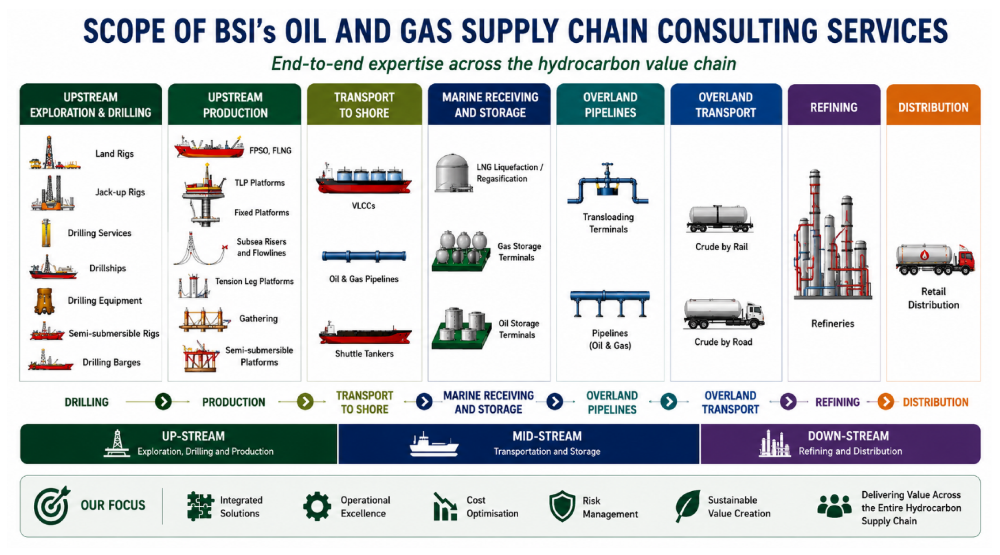
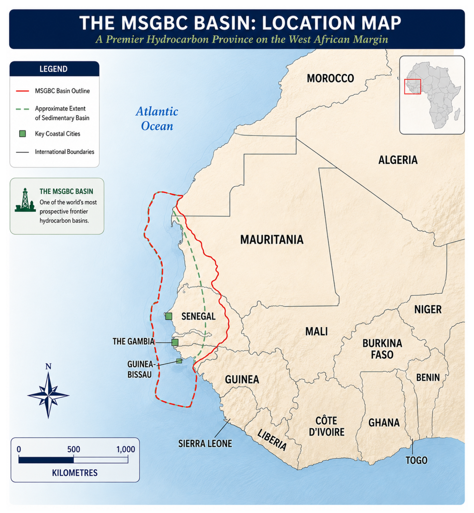
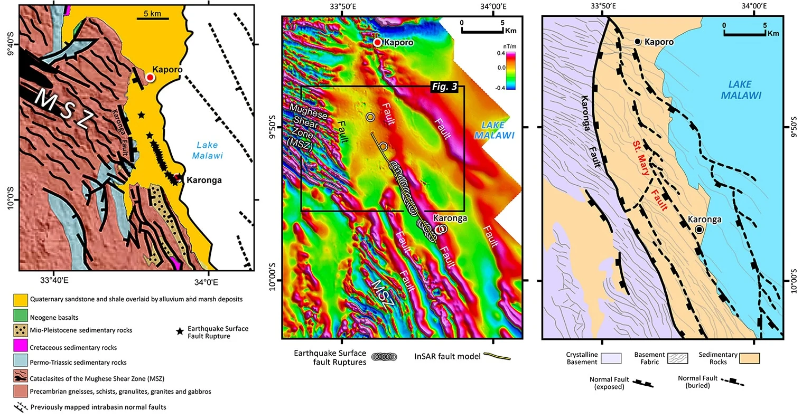
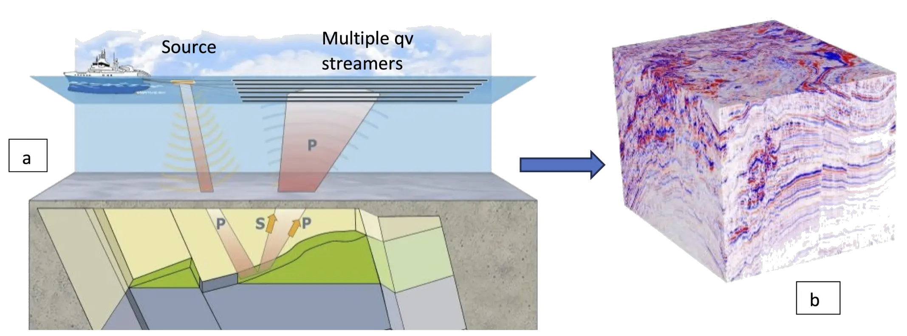
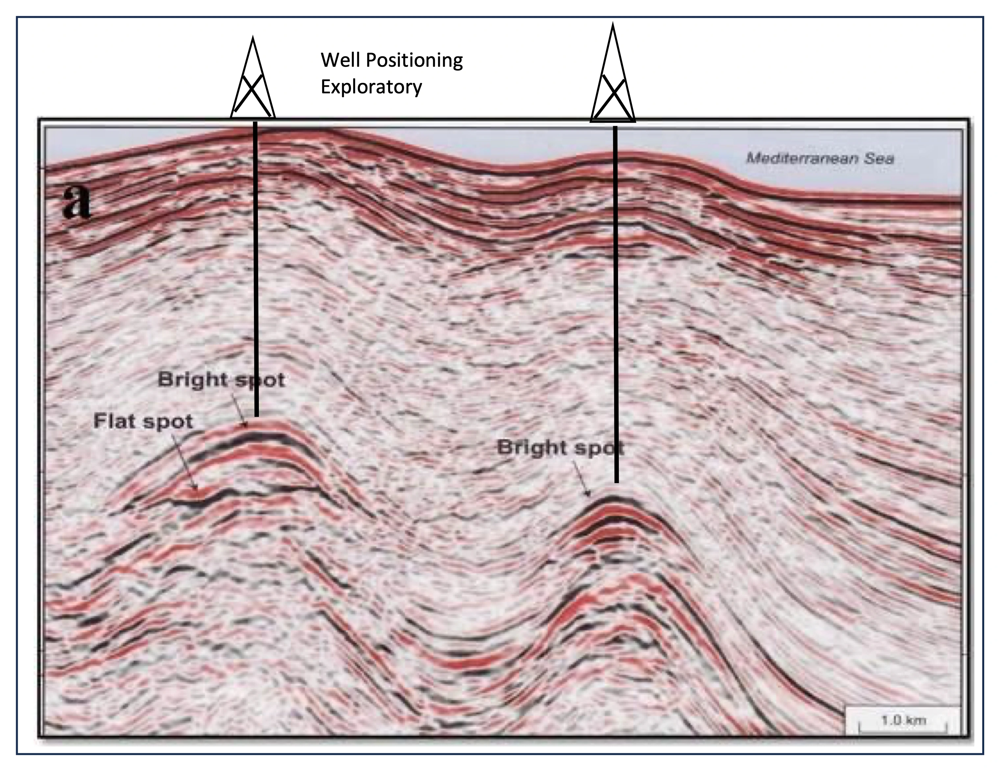
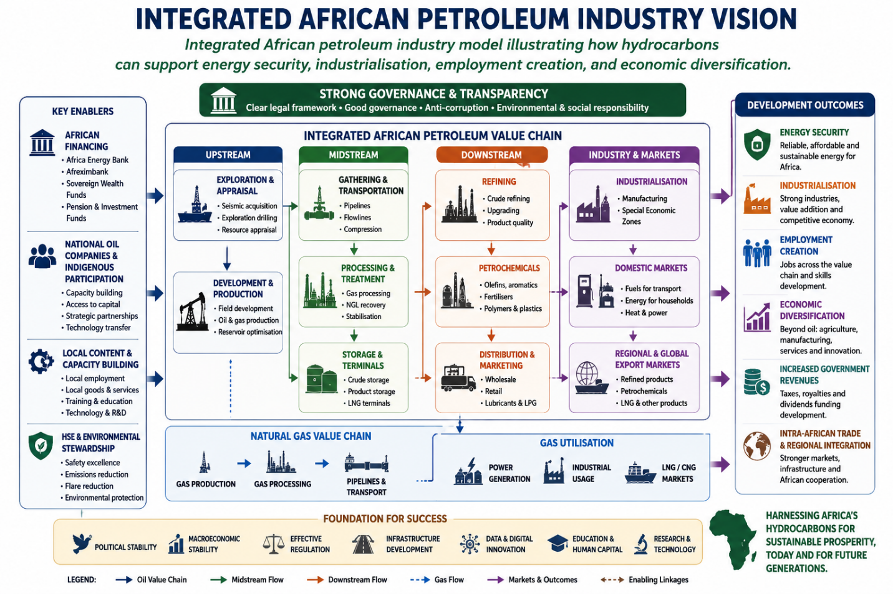
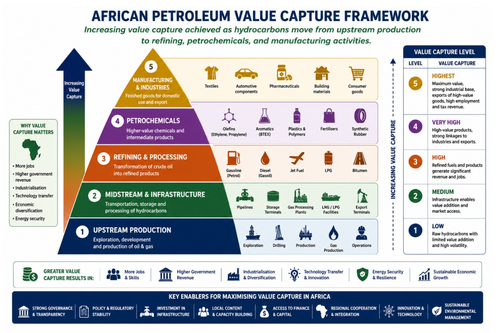
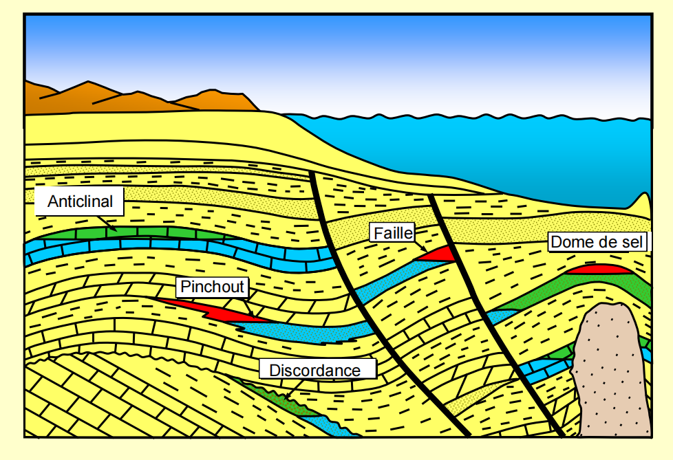

# Chapter 5: Hydrocarbon Value Chain

Figure 5: the upstream sector, the midstream sector, and the downstream sector.

## 5.1- Upstream Sector

### 5.1.1- Characteristics

The upstream petroleum sector forms the foundation of the petroleum industry and represents the earliest stages of industry development. It encompasses a range of complex activities aimed at discovering and producing crude oil and natural gas that were generated and accumulated in the subsurface millions of years ago.

The upstream sector primarily includes activities ranging from petroleum exploration through to hydrocarbon production. It focuses on identifying potential hydrocarbon accumulations, drilling exploration wells, and producing crude oil and natural gas.

The sector can be broadly divided into three principal stages:

**Exploration**

Exploration involves identifying hydrocarbon accumulations through various geological and geophysical methods, both surface and subsurface, following the award of an exploration licence or petroleum authorisation.

**Development and Production**

Hydrocarbon exploitation consists of two distinct sub-phases:

**Development**

Development involves determining and implementing the technical, operational, and infrastructure requirements necessary for hydrocarbon extraction based on geological, reservoir, engineering, and economic considerations.

**Production**

Production is the stage during which hydrocarbons are extracted from the reservoir using appropriate production and recovery techniques.

**Decommissioning and Abandonment**

Decommissioning and abandonment generally occur once economically recoverable reserves have been depleted. This phase involves securing, dismantling, and removing production facilities and infrastructure to minimise environmental impacts and ensure long-term site safety.

The fundamental characteristics of upstream petroleum operations include:

**High Geological Risk**

Exploration activities involve significant geological uncertainty and provide no guarantee that commercially recoverable hydrocarbon reserves will be discovered.

**Significant Capital Investment**

Exploration and development activities require substantial capital expenditure due to the sophisticated technologies, specialised equipment, and extensive infrastructure necessary to undertake these operations.

**Environmental and Safety Risk Management**

Upstream activities inherently involve environmental, health, safety, and operational risks associated with seismic acquisition, drilling, production operations, oil spills, gas emissions, gas flaring, fires, and other industrial incidents affecting terrestrial, marine, and atmospheric environments.

### 5.1.2- Current Status in West Africa

West Africa holds approximately one-third of Africa's oil and natural gas reserves. According to ECOWAS (2019), approximately 30% of global petroleum reserves are located within the Gulf of Guinea region.

Following recent discoveries across several West African countries, hydrocarbon resources are estimated at approximately 39 billion barrels of oil and 372 trillion cubic feet (TCF) of natural gas, as shown in Table 2.

<table>
<caption>
Table 2 Estimated Hydrocarbon Resources in West Africa
</caption>
<thead>
<tr>
  <th>
<strong>Country</strong>
</th>
  <th>
<strong>Crude Oil Reserves (MMbbl)</strong>
</th>
  <th>
<strong>Gas Reserves (BCF)</strong>
</th>
</tr>
</thead>
<tbody>
<tr>
  <td>
Nigeria
</td>
  <td>
30,031*
</td>
  <td>
202,000*
</td>
</tr>
<tr>
  <td>
Ghana
</td>
  <td>
1,813 (732 proved)
</td>
  <td>
4,100 (1,771 proved)
</td>
</tr>
<tr>
  <td>
Senegal
</td>
  <td>
2,030*
</td>
  <td>
42,024*
</td>
</tr>
<tr>
  <td>
Mauritania
</td>
  <td>
20 (proved)*
</td>
  <td>
110,000 (estimated)*
</td>
</tr>
<tr>
  <td>
Côte d'Ivoire
</td>
  <td>
3,100 (estimated)*
</td>
  <td>
4,600 (estimated)*
</td>
</tr>
<tr>
  <td>
Niger
</td>
  <td>
150
</td>
  <td>
—
</td>
</tr>
<tr>
  <td>
Benin
</td>
  <td>
331 (estimated)
</td>
  <td>
477
</td>
</tr>
<tr>
  <td>
Guinea-Bissau
</td>
  <td>
840
</td>
  <td>
—
</td>
</tr>
<tr>
  <td>
Mali
</td>
  <td>
645 (estimated)**
</td>
  <td>
9,000 (estimated)**
</td>
</tr>
<tr>
  <td>
<strong>Total</strong>
</td>
  <td>
<strong>38,960</strong>
</td>
  <td>
<strong>371,724</strong>
</td>
</tr>
</tbody>
</table>

According to Trading Economics (2025), the four largest oil producers in West Africa during 2024 were (Table 3):

- Nigeria - 1.539 million barrels per day (MMbopd)
- Ghana - 188,000 barrels per day
- Niger - 53,000 barrels per day
- Côte d'Ivoire - 47,000 barrels per day

<table>
<caption>
Table 3 Daily Oil Production by Country (Trading Economics, 2025)
</caption>
<thead>
<tr>
  <th>
<strong>Country</strong>
</th>
  <th>
<strong>Latest</strong>
</th>
  <th>
<strong>Previous</strong>
</th>
  <th>
<strong>Reference Period</strong>
</th>
  <th>
<strong>Unit</strong>
</th>
</tr>
</thead>
<tbody>
<tr>
  <td>
Nigeria
</td>
  <td>
1,539
</td>
  <td>
1,485
</td>
  <td>
2025-01
</td>
  <td>
Mbbl/d
</td>
</tr>
<tr>
  <td>
Ghana
</td>
  <td>
188
</td>
  <td>
188
</td>
  <td>
2024-10
</td>
  <td>
Mbbl/d
</td>
</tr>
<tr>
  <td>
Niger
</td>
  <td>
53
</td>
  <td>
43
</td>
  <td>
2024-10
</td>
  <td>
Mbbl/d
</td>
</tr>
<tr>
  <td>
Côte d'Ivoire
</td>
  <td>
47
</td>
  <td>
42
</td>
  <td>
2024-10
</td>
  <td>
Mbbl/d
</td>
</tr>
</tbody>
</table>

Significant oil and, particularly, gas discoveries have been made both onshore and offshore in Senegal and Mauritania within sedimentary basins that form part of the extensive MSGBC Basin (Mauritania-Senegal-The Gambia-Guinea-Bissau-Guinea-Conakry), illustrated in Figure 6.

These two countries, already oil producers, have commenced production from the major cross-border Greater Tortue Ahmeyim (GTA) offshore gas field. The resource, discovered in 2015 by Kosmos Energy, is estimated to contain more than 15 trillion cubic feet (TCF) of natural gas.

The field is being developed and produced with the support of BP, with the first LNG cargo entering international markets in April 2025.

Benin, located within the Gulf of Guinea petroleum province (Figure 7), previously produced oil between 1982 and 1998 from the marginal Sèmè Field located in Block 1 of its Coastal Sedimentary Basin. The field was originally discovered in 1968 by Union Oil of California.

Production from the Sèmè Field has recently resumed through Akrake Petroleum, a subsidiary of Rex International, while exploration activities have also been restarted.

Several additional countries remain in the exploration phase and may ultimately achieve commercial discoveries owing to their favourable geological settings:

**The Gambia, Guinea-Bissau and Guinea**

These countries share the MSGBC Basin with Senegal and possess attractive exploration potential. Exploration activities have already confirmed the presence of hydrocarbons within their offshore basins.

Similarly, Sierra Leone and Liberia occupy comparable geological settings situated between the MSGBC Basin and the Côte d'Ivoire Basin, both of which have yielded significant discoveries.

**Mali**

Mali contains several promising sedimentary basins, including the Taoudeni Basin, the Nara Rift, the Gao Graben and the Tamesna Basin, which represents the extension of the Iullemmeden Basin in Niger (Figure 8).

As early as 2006, RPS Energy estimated that five blocks held by Baraka Petroleum within the Taoudeni Basin could contain up to 645 million barrels of oil and 9 TCF of natural gas.

**Burkina Faso**

Burkina Faso benefits from its proximity to Mali and from hydrocarbon indications identified within its western basin adjacent to the Nara Basin.

**Togo**

Togo's coastal sedimentary basin forms an integral part of the Gulf of Guinea petroleum province, which has been proven through discoveries in Nigeria, Benin, Ghana and Côte d'Ivoire.

Figure 6 Map of the MSGBC Basin

Figure 7 Map showing sedimentary basins within the northern Gulf of Guinea region of West Africa

Figure 8 Map showing the sedimentary basins of Mali and Niger

Crude oils discovered and produced in several West African countries range from light to heavy grades and generally exhibit relatively low sulphur content (sweet crude), as summarised in Table 4.

<table>
<caption>
Table 4 Crude Oil Characteristics in Selected West African Countries
</caption>
<thead>
<tr>
  <th>
<strong>Country</strong>
</th>
  <th>
<strong>API Gravity</strong>
</th>
  <th>
<strong>Sulphur Content (%)</strong>
</th>
  <th>
<strong>Quality</strong>
</th>
</tr>
</thead>
<tbody>
<tr>
  <td>
Benin (Sèmè Field)
</td>
  <td>
22° API
</td>
  <td>
0.32
</td>
  <td>
Medium, Sweet
</td>
</tr>
<tr>
  <td>
Benin (Deepwater Block)
</td>
  <td>
42° API
</td>
  <td>
0.10
</td>
  <td>
Light, Sweet
</td>
</tr>
<tr>
  <td>
Niger
</td>
  <td>
30° API
</td>
  <td>
Very Low
</td>
  <td>
Medium, Sweet
</td>
</tr>
<tr>
  <td>
Nigeria (Niger Delta Crude)
</td>
  <td>
20–25° API
</td>
  <td>
0.17 (Egina) / 0.60 (Qua Iboe and Forcados)
</td>
  <td>
Heavy to Medium, Sweet
</td>
</tr>
<tr>
  <td>
Nigeria
</td>
  <td>
36° API
</td>
  <td>
—
</td>
  <td>
Light, Sweet
</td>
</tr>
<tr>
  <td>
Côte d'Ivoire
</td>
  <td>
28°, 31°, 48° API
</td>
  <td>
—
</td>
  <td>
Medium to Light, Sweet
</td>
</tr>
<tr>
  <td>
Ghana (Saltpond)
</td>
  <td>
35.1° API
</td>
  <td>
0.16
</td>
  <td>
Light, Sweet
</td>
</tr>
<tr>
  <td>
Ghana (Jubilee)
</td>
  <td>
35° API
</td>
  <td>
0.23
</td>
  <td>
Light, Sweet
</td>
</tr>
</tbody>
</table>

Major international companies involved in upstream petroleum operations include:

- ExxonMobil
- Chevron
- BP
- Shell
- ConocoPhillips
- Eni
- TotalEnergies
- Sinopec

These major companies are complemented by independent operators investing across West Africa, including Tullow in Ghana, Cairn in Senegal, Kosmos in Mauritania, Conoil in Nigeria and CNPC in Niger.

Africa has also witnessed the growing importance of National Oil Companies (NOCs), including:

- PETROCI (Côte d'Ivoire)
- NNPC Limited (Nigeria)
- Sonangol (Angola)
- Petrosen (Senegal)
- Sonidep (Niger)
- GNPC (Ghana)
- Sonatrach (Algeria)

In addition, several indigenous private companies have emerged, including SAPETRO and Oranto Petroleum in Nigeria.

### 5.1.3- Principal Challenges

Despite the considerable hydrocarbon potential of West Africa, the upstream petroleum sector continues to face numerous structural, technical, financial, and environmental challenges that limit its contribution to sustainable economic development.

While recent discoveries have attracted international investment and improved production outlooks in several countries, significant obstacles remain before the region can fully realise the value of its petroleum resources.

The principal challenges include:

**Access to Financing**

One of the most significant constraints affecting the development of upstream petroleum activities in Africa is access to financing.

Exploration and production projects require substantial capital investment and are characterised by long development periods and high levels of risk. Many African states and indigenous petroleum companies lack the financial resources required to independently fund exploration, appraisal, development, and production activities.

As a result, governments often rely heavily on International Oil Companies (IOCs) and foreign investors to finance petroleum projects. While such partnerships are necessary, they may also reduce the bargaining power of governments during contract negotiations and can result in fiscal terms that are less favourable to the host country.

The challenge has become more pronounced in recent years due to increasing global pressure on financial institutions to reduce investments in fossil fuel projects as part of the energy transition agenda.

Consequently, African petroleum-producing countries face growing difficulties in securing financing for new upstream developments despite continuing global demand for hydrocarbons.

**Technology Transfer and Local Capacity Development**

The petroleum industry is highly technology-intensive and requires advanced technical expertise across multiple disciplines, including:

- Exploration geology
- Geophysics
- Drilling engineering
- Reservoir engineering
- Production engineering
- Subsea engineering
- Facilities engineering
- Data science and digital technologies

Many African countries continue to rely heavily on foreign expertise and imported technologies to undertake petroleum operations.

Although local content legislation has been introduced in several jurisdictions, the transfer of technology and development of local technical capacity remain limited in many cases.

The absence of sufficient technical expertise within regulatory agencies and National Oil Companies (NOCs) can reduce the effectiveness of government oversight and weaken the ability of states to evaluate technical proposals submitted by operators.

Developing local technical capacity should therefore be considered a strategic priority for petroleum-producing countries.

**Infrastructure Deficiencies**

The development of a competitive petroleum industry requires extensive infrastructure, including:

- Ports
- Roads
- Pipelines
- Export terminals
- Storage facilities
- Refineries
- Gas processing facilities
- Power generation infrastructure

Many West African countries continue to face infrastructure deficits that increase project costs and reduce operational efficiency.

The lack of adequate midstream and downstream infrastructure often forces countries to export crude oil and natural gas in raw form rather than capturing additional value through domestic processing and industrial development.

This situation limits employment creation and reduces the overall economic impact of petroleum resources.

**Environmental and Climate Change Pressures**

Environmental management represents one of the most important challenges facing the petroleum industry globally.

Petroleum exploration and production activities can generate a range of environmental impacts, including:

- Greenhouse gas emissions
- Gas flaring
- Oil spills
- Soil contamination
- Groundwater contamination
- Marine pollution
- Biodiversity loss

At the same time, increasing international commitments to reduce carbon emissions are creating pressure on governments and investors to transition towards lower-carbon energy systems.

Many African countries face a difficult balancing act between:

- Exploiting petroleum resources to support economic development;
- Meeting international climate commitments; and
- Diversifying their energy mix.

This challenge is particularly significant given that many African economies continue to rely heavily on petroleum revenues to fund public expenditure and development programmes.

**Political and Security Risks**

Political instability remains a major risk factor in several parts of Africa.

Changes in government, civil unrest, armed conflict, terrorism, and insecurity can significantly affect petroleum operations and investor confidence.

Examples include:

- Militancy and crude oil theft in the Niger Delta;
- Terrorist activity in parts of the Sahel region;
- Political instability affecting investment decisions in certain jurisdictions.

These risks can lead to:

- Increased operating costs;
- Delays in project execution;
- Production interruptions;
- Higher insurance costs;
- Reduced foreign direct investment.

Maintaining political stability and strengthening institutions are therefore essential for attracting long-term investment into the petroleum sector.

**Governance and Transparency**

Weak governance remains one of the most significant challenges affecting petroleum resource management across many resource-rich countries.

Challenges commonly include:

- Weak institutional capacity;
- Corruption;
- Lack of transparency;
- Poor revenue management;
- Political interference;
- Limited public accountability.

Where governance frameworks are weak, petroleum revenues often fail to translate into meaningful improvements in living standards and economic development.

The experiences of several resource-rich countries demonstrate that petroleum wealth alone does not guarantee prosperity. Strong institutions, transparent governance, and effective oversight are essential to ensuring that petroleum resources contribute to sustainable national development.

**Regional Integration Challenges**

Although West Africa possesses substantial petroleum resources, cooperation among countries remains relatively limited.

Regional challenges include:

- Fragmented regulatory frameworks;
- Limited cross-border infrastructure;
- Inadequate regional refining capacity;
- Insufficient intra-regional trade in petroleum products;
- Weak coordination between producing countries.

Greater regional cooperation through organisations such as Economic Community of West African States and African Petroleum Producers' Organization could facilitate:

- Shared infrastructure development;
- Knowledge transfer;
- Regional energy security;
- Harmonisation of regulatory frameworks;
- Increased local value creation.

**Summary of Key Challenges**

The principal challenges facing the West African upstream petroleum sector can be summarised as follows (Table 5):

<table>
<caption>
Table 5 Challenges Facing West Africa
</caption>
<thead>
<tr>
  <th>
<strong>Challenge</strong>
</th>
  <th>
<strong>Impact</strong>
</th>
</tr>
</thead>
<tbody>
<tr>
  <td>
Financing Constraints
</td>
  <td>
Limits exploration and development activities
</td>
</tr>
<tr>
  <td>
Technology Gap
</td>
  <td>
Increases dependence on foreign expertise
</td>
</tr>
<tr>
  <td>
Infrastructure Deficiencies
</td>
  <td>
Raises costs and limits value creation
</td>
</tr>
<tr>
  <td>
Environmental Pressures
</td>
  <td>
Increases compliance requirements and operational risk
</td>
</tr>
<tr>
  <td>
Political and Security Risks
</td>
  <td>
Reduces investor confidence
</td>
</tr>
<tr>
  <td>
Weak Governance
</td>
  <td>
Limits economic benefits from petroleum revenues
</td>
</tr>
<tr>
  <td>
Limited Regional Integration
</td>
  <td>
Restricts economies of scale and collaboration
</td>
</tr>
</tbody>
</table>

Despite these challenges, West Africa remains one of the world's most prospective petroleum regions. Continued exploration success, improvements in governance, infrastructure development, local capacity building, and regional cooperation will be critical to unlocking the full value of the region's hydrocarbon resources.

## 5.2- Midstream Sector

### 5.2.1- Characteristics

The midstream sector forms the link between upstream production activities and downstream processing and distribution operations. It encompasses the transportation, storage, processing, and marketing of crude oil, natural gas, and petroleum products.

The primary objective of the midstream sector is to ensure the safe, reliable, and efficient movement of hydrocarbons from production facilities to refineries, processing plants, export terminals, and end-users.

The principal activities of the midstream sector include:

**Transportation**

Hydrocarbons are transported through various means, including:

- Pipelines
- Tankers
- Barges
- Rail transport
- Road tankers

Pipeline transportation is generally the most cost-effective solution for moving large volumes of crude oil and natural gas over long distances.

**Storage**

Storage facilities play a critical role in balancing fluctuations between production and demand.

Typical storage infrastructure includes:

- Crude oil storage tanks
- Petroleum product terminals
- LNG storage facilities
- Strategic petroleum reserves

**Processing**

Natural gas frequently requires processing before commercialisation. Processing activities may include:

- Gas dehydration
- Removal of carbon dioxide (CO₂)
- Removal of hydrogen sulphide (H₂S)
- Natural gas liquids (NGL) extraction
- Gas compression

Crude oil may also undergo stabilisation and treatment before transportation or export.

**Export Infrastructure**

Export terminals, offshore loading facilities, Single Point Moorings (SPMs), and Floating Storage and Offloading (FSO) facilities are often required to facilitate the export of hydrocarbons to international markets.

**Commercialisation**

The midstream sector also includes commercial activities associated with hydrocarbon transportation agreements, gas sales agreements, storage contracts, and export logistics.

**Key Characteristics of the Midstream Sector**

The midstream sector is characterised by:

**Capital-Intensive Infrastructure**

Large-scale infrastructure projects require substantial investment and long development periods.

**Lower Geological Risk**

Unlike exploration activities, midstream operations involve limited geological uncertainty because they are typically developed following the discovery of commercial hydrocarbon reserves.

**Regulated Operations**

Transportation and storage infrastructure often operate under regulatory frameworks that govern tariffs, access rights, safety requirements, and environmental standards.

**Strategic Importance**

Midstream infrastructure is essential for monetising hydrocarbon resources and ensuring energy security.

Without adequate transportation and processing infrastructure, discovered resources may remain stranded and commercially undeveloped.

### 5.2.2- Current Status in West Africa

The development of midstream infrastructure across West Africa remains uneven.

Although the region possesses significant oil and gas resources, transportation and processing infrastructure has generally not developed at the same pace as upstream production activities.

This situation has contributed to several challenges, including:

- High transportation costs;
- Limited gas monetisation;
- Dependence on imported petroleum products;
- Reduced industrial development.

**Pipeline Infrastructure**

Several significant regional pipeline projects have been developed.

One of the most important examples is the West African Gas Pipeline (WAGP), which transports natural gas from Nigeria to Benin, Togo, and Ghana.

The project was designed to:

- Improve regional energy security;
- Reduce reliance on imported fuels;
- Support industrial development;
- Promote regional economic integration.

Despite its strategic importance, the pipeline has experienced periodic operational and supply disruptions.

**Crude Oil Export Infrastructure**

Nigeria possesses the most extensive export infrastructure in West Africa, including numerous export terminals located within the Niger Delta region.

Other countries with significant export facilities include:

- Ghana
- Côte d'Ivoire
- Senegal
- Mauritania

The recent commencement of production from the Greater Tortue Ahmeyim gas project has also strengthened gas export capabilities within the region.

**Gas Processing and LNG Development**

Historically, much of West Africa's natural gas was either flared or remained undeveloped.

Recent years have seen increased investment in:

- LNG projects;
- Gas processing plants;
- Domestic gas infrastructure.

Notable developments include:

- The Greater Tortue Ahmeyim LNG Project (Mauritania-Senegal);
- Nigeria LNG;
- Domestic gas utilisation programmes in Ghana and Côte d'Ivoire.

These developments are helping countries capture greater value from their gas resources while reducing gas flaring.

**Storage Facilities**

Storage capacity remains limited in several countries.

Insufficient storage infrastructure can result in:

- Supply disruptions;
- Market volatility;
- Increased import dependence;
- Operational inefficiencies.

Many governments continue to explore opportunities to expand strategic petroleum storage facilities and commercial storage terminals.

### 5.2.3- Principal Challenges

**Infrastructure Deficit**

The most significant challenge facing the midstream sector is the shortage of infrastructure.

Many producing countries continue to lack sufficient:

- Pipelines;
- Storage facilities;
- Export terminals;
- Gas processing plants;
- LNG infrastructure.

This deficiency limits the ability of countries to maximise the value of discovered resources.

**Financing Constraints**

Midstream projects require substantial capital investment.

Pipeline networks, LNG facilities, and export terminals often involve investments measured in billions of US dollars.

Many governments face difficulties securing funding due to:

- Budgetary constraints;
- Sovereign debt levels;
- Perceived political risk;
- Global investment trends favouring lower-carbon energy projects.

**Cross-Border Coordination**

Many of the region's most promising infrastructure opportunities involve multiple countries.

Cross-border projects require alignment on:

- Regulatory frameworks;
- Fiscal terms;
- Tariff structures;
- Commercial agreements;
- Security arrangements.

Achieving such alignment can be complex and time-consuming.

**Security Risks**

Pipeline vandalism, sabotage, theft, and illegal tapping remain significant challenges in certain regions.

Nigeria provides one of the most notable examples, where attacks on petroleum infrastructure and crude oil theft have resulted in substantial financial losses.

Security concerns increase operating costs and discourage investment.

**Gas Commercialisation Challenges**

Although the region possesses significant gas resources, commercialisation remains constrained by:

- Limited domestic markets;
- Insufficient gas infrastructure;
- Financing challenges;
- Pricing issues;
- Regulatory uncertainty.

As a result, large volumes of gas remain underutilised.

**Environmental and Social Considerations**

Midstream infrastructure projects frequently traverse populated areas and environmentally sensitive regions.

Project developers must therefore address:

- Land acquisition issues;
- Community engagement;
- Environmental protection;
- Biodiversity conservation;
- Resettlement obligations where necessary.

Failure to address these issues can lead to project delays, cost overruns, and reputational damage.

**The Strategic Importance of Midstream Development**

For many West African countries, strengthening the midstream sector represents one of the most effective means of increasing the economic value generated from petroleum resources.

Investment in transportation, storage, gas processing, and export infrastructure can:

- Increase government revenues;
- Reduce gas flaring;
- Improve energy security;
- Support industrial development;
- Create employment opportunities;
- Enhance regional economic integration.

A robust midstream sector therefore serves as the critical bridge between hydrocarbon discoveries and sustainable economic development.

## 5.3- Downstream Sector

### 5.3.1- Characteristics

The downstream sector represents the final segment of the petroleum value chain. It encompasses all activities associated with the refining, processing, distribution, marketing, and sale of petroleum products to end-users.

Whereas the upstream sector is concerned with finding and producing hydrocarbons and the midstream sector focuses on transportation and storage, the downstream sector converts crude oil and natural gas into marketable products used by consumers and industry.

The downstream sector therefore plays a critical role in transforming hydrocarbon resources into economic value and supporting industrial and social development.

The principal activities of the downstream sector include:

**Refining**

Refining involves processing crude oil into usable petroleum products through a series of physical and chemical processes (Figure 9).

Common petroleum products produced by refineries include:

- Liquefied Petroleum Gas (LPG)
- Petrol (Gasoline)
- Aviation Fuel (Jet A-1)
- Kerosene
- Diesel
- Fuel Oil
- Bitumen
- Lubricants
- Petrochemical Feedstocks

The complexity of a refinery determines its ability to process different crude oil grades and maximise the production of higher-value products.

Figure 9 Products Obtained from Atmospheric Distillation of Crude Oil in a Refinery

**Petrochemicals**

Petrochemical industries convert hydrocarbons into products used in:

- Agriculture
- Construction
- Pharmaceuticals
- Textiles
- Packaging
- Consumer goods manufacturing

Examples include:

- Plastics
- Fertilisers
- Synthetic fibres
- Solvents
- Industrial chemicals

Petrochemicals represent one of the highest value-added segments of the hydrocarbon industry.

**Distribution and Marketing**

Refined products are distributed through:

- Pipelines
- Road tankers
- Rail networks
- Coastal shipping
- Retail service stations

Marketing activities involve wholesale and retail sales to industrial, commercial, and domestic consumers.

**Import and Export Operations**

Many countries import refined petroleum products while exporting crude oil.

The balance between crude exports and refined product imports is often an important indicator of the maturity of a country's downstream sector.

**Key Characteristics of the Downstream Sector**

The downstream sector is characterised by:

**Relatively Lower Geological Risk**

Unlike upstream activities, downstream operations are not dependent upon exploration success.

**High Infrastructure Requirements**

Refineries, petrochemical plants, terminals, pipelines, and distribution networks require substantial investment.

**Strong Economic Multipliers**

The downstream sector generates significant employment and stimulates broader industrial development.

**Direct Impact on Consumers**

The sector directly affects fuel availability, energy security, transportation costs, and the cost of living.

For this reason, governments often regulate fuel pricing, product quality standards, and strategic fuel reserves.

### 5.3.2- Current Status in West Africa

Despite being a major hydrocarbon-producing region, West Africa remains heavily dependent on imports of refined petroleum products.

This situation reflects one of the major structural weaknesses of the regional petroleum industry.

Historically, many countries focused on exporting crude oil while underinvesting in refining and petrochemical infrastructure.

As a consequence, substantial value addition occurs outside the region.

**Refining Capacity**

Several countries possess refining infrastructure, including:

- Nigeria
- Ghana
- Côte d'Ivoire
- Senegal
- Niger

Important refineries include:

- Nigerian National Petroleum Company Limited refining assets
- Tema Oil Refinery (TOR)
- Société Ivoirienne de Raffinage (SIR)
- Société Africaine de Raffinage (SAR)
- Société de Raffinage de Zinder (SORAZ)

However, many facilities have historically operated below design capacity due to:

- Maintenance challenges;
- Feedstock constraints;
- Ageing infrastructure;
- Financial difficulties.

**Nigeria's Refining Transformation**

Nigeria possesses Africa's largest crude oil reserves and historically imported significant quantities of refined products despite being a major crude oil exporter.

The commissioning of the Dangote Refinery represents a major development that could substantially alter regional fuel supply dynamics.

The refinery has the potential to reduce import dependency and strengthen regional energy security.

**Petroleum Product Imports**

Many West African countries continue to import:

- Petrol
- Diesel
- Aviation fuel
- LPG

This dependence exposes economies to:

- International price volatility;
- Foreign exchange pressures;
- Supply chain disruptions.

**Petrochemical Development**

Petrochemical development remains relatively limited throughout much of West Africa.

Most countries export crude oil and natural gas with limited local processing into higher-value petrochemical products.

As a result, significant opportunities remain for:

- Fertiliser production;
- Plastics manufacturing;
- Industrial chemicals;
- Value-added exports.

### 5.3.3- Principal Challenges

**Limited Refining Capacity**

Insufficient refining capacity remains one of the most significant challenges facing the region.

Many countries continue to export crude oil while importing refined products at higher prices.

This reduces economic value capture and increases vulnerability to external market conditions.

**Ageing Infrastructure**

Several refineries and storage facilities require:

- Modernisation;
- Expansion;
- Rehabilitation.

Deferred maintenance and underinvestment have negatively affected operational reliability and efficiency.

**High Operating Costs**

Refineries require:

- Reliable power supply;
- Skilled personnel;
- Efficient logistics networks;
- Stable regulatory environments.

These conditions are not always available, increasing operating costs and reducing competitiveness.

**Competition from Imported Products**

Imported fuels can sometimes be cheaper than domestically refined products due to:

- Economies of scale;
- Government subsidies elsewhere;
- Larger and more efficient international refineries.

This creates challenges for local refining industries.

**Regulatory and Pricing Issues**

Government intervention in fuel pricing can create market distortions.

Although subsidies may provide short-term social benefits, they can also:

- Discourage investment;
- Reduce refinery profitability;
- Create fiscal burdens;
- Encourage smuggling and arbitrage.

**Energy Transition**

The global energy transition presents both risks and opportunities.

While petroleum products are expected to remain important for decades, governments must balance:

- Refinery investments;
- Environmental obligations;
- Renewable energy development;
- Long-term demand uncertainty.

**Strategic Importance of the Downstream Sector**

The downstream sector represents one of the greatest opportunities for West Africa to increase the economic benefits derived from its petroleum resources.

A strong downstream sector can:

- Create skilled employment;
- Support industrialisation;
- Improve energy security;
- Reduce import dependence;
- Increase government revenues;
- Enhance regional trade.

The development of refining, petrochemical, storage, and distribution infrastructure should therefore be considered a strategic priority for countries seeking to maximise the value of their hydrocarbon resources.

## 5.4- West African Value Chain Weaknesses

Despite possessing significant petroleum resources and substantial geological potential, the West African petroleum industry remains characterised by structural weaknesses throughout the value chain.

These weaknesses reduce the economic benefits generated from petroleum resources and limit the contribution of the sector to regional industrialisation and sustainable development.

The principal shortcomings affect all segments of the value chain, from exploration and production through to refining, petrochemicals, transportation, and distribution.

Several common challenges can be observed across the region.

**Limited Integration of the Value Chain**

One of the most significant weaknesses of the petroleum industry in West Africa is the limited integration between upstream, midstream, and downstream activities.

Most producing countries continue to focus primarily on:

- Exploration;
- Field development;
- Crude oil production;
- Export of raw hydrocarbons.

In contrast, investment in:

- Refining;
- Petrochemicals;
- Gas processing;
- Manufacturing industries;

has generally remained insufficient.

As a consequence, many countries export crude oil while importing refined petroleum products and petrochemical derivatives at significantly higher prices.

This situation reduces the economic value retained within producing countries and increases dependence on external markets.

**Weak Industrialisation**

Petroleum resources have not yet served as a sufficient catalyst for broad industrial development across much of the region.

The downstream and petrochemical sectors remain underdeveloped in many countries.

As a result:

- Job creation remains limited;
- Industrial diversification is constrained;
- Opportunities for technology transfer are reduced;
- Domestic manufacturing industries remain weak.

The absence of integrated industrial clusters linked to the petroleum sector has restricted the multiplier effect that hydrocarbon resources could otherwise generate.

**Insufficient Technical Capacity**

Many countries continue to face shortages of highly qualified personnel in key petroleum disciplines, including:

- Petroleum geology;
- Geophysics;
- Reservoir engineering;
- Drilling engineering;
- Production engineering;
- Petroleum economics;
- Petroleum law and regulation.

This shortage often results in significant dependence on foreign expertise for both operational activities and regulatory oversight.

The lack of technical capacity can negatively affect:

- Contract negotiations;
- Resource evaluations;
- Regulatory supervision;
- Production monitoring;
- Revenue verification.

Building national expertise remains essential if states are to maximise the value of their petroleum resources.

**Dependence on Foreign Investment**

The petroleum industry requires substantial financial resources.

Most West African countries rely heavily on International Oil Companies (IOCs) to:

- Finance exploration activities;
- Develop petroleum infrastructure;
- Provide technical expertise;
- Manage complex projects.

Although foreign investment remains indispensable, excessive dependence can weaken government negotiating positions and limit national control over strategic decisions.

This challenge is particularly significant during the negotiation of:

- Production Sharing Contracts (PSCs);
- Exploration Licences;
- Development Agreements;
- Gas Commercialisation Agreements.

**Inadequate Infrastructure**

Infrastructure deficits continue to affect every segment of the value chain.

Common deficiencies include:

**Upstream**

- Limited logistics infrastructure;
- Inadequate support bases;
- Insufficient local service capacity.

**Midstream**

- Limited pipeline networks;
- Insufficient gas processing facilities;
- Inadequate storage capacity.

**Downstream**

- Limited refining capacity;
- Underdeveloped petrochemical industries;
- Inadequate fuel distribution networks.

These shortcomings increase operating costs and reduce competitiveness.

**Governance Challenges**

Governance remains a critical issue throughout the region.

Challenges include:

- Weak institutional capacity;
- Corruption;
- Political interference;
- Limited transparency;
- Revenue mismanagement.

Where governance frameworks are weak, petroleum revenues may fail to generate broad-based economic development.

The effective management of petroleum resources therefore requires:

- Strong institutions;
- Transparent regulatory frameworks;
- Independent oversight mechanisms;
- Public accountability.

**Limited Regional Cooperation**

Although many petroleum-producing countries face similar challenges, cooperation between states remains limited.

Areas requiring stronger collaboration include:

- Infrastructure development;
- Energy security;
- Regulatory harmonisation;
- Technology transfer;
- Local content development.

Greater regional integration would improve economies of scale and increase competitiveness.

Regional organisations such as Economic Community of West African States and African Petroleum Producers' Organization have important roles to play in addressing these challenges.

**Environmental and Energy Transition Pressures**

The global energy transition presents additional challenges for petroleum-producing countries.

Investors, lenders, and governments increasingly prioritise:

- Carbon reduction;
- Environmental sustainability;
- Renewable energy development.

This trend may affect future access to financing for petroleum projects.

At the same time, many African countries continue to rely heavily on petroleum revenues to support economic development.

Balancing these competing priorities represents one of the major strategic challenges facing the region.

**Consequences for Economic Development**

The weaknesses identified above have contributed to several adverse outcomes:

- Continued dependence on imported refined products;
- Limited industrial development;
- Lower government revenues;
- Reduced employment creation;
- Persistent energy insecurity;
- Increased vulnerability to commodity price fluctuations.

As a result, the petroleum sector has not yet delivered its full potential as a driver of sustainable economic transformation across West Africa.

### 5.4.1- At the ECOWAS Level

The Economic Community of West African States was established to promote economic integration and cooperation among West African countries.

Within the petroleum sector, ECOWAS has sought to support:

- Regional energy security;
- Cross-border infrastructure development;
- Harmonisation of energy policies;
- Promotion of intra-regional trade.

Despite these objectives, several challenges remain.

**Fragmented Energy Markets**

Member states continue to operate largely independent energy systems.

Differences in:

- Regulatory frameworks;
- Fiscal policies;
- Market structures;

can hinder regional integration and discourage investment.

**Limited Regional Infrastructure**

Cross-border infrastructure remains insufficient.

Additional investment is required in:

- Pipelines;
- Electricity interconnections;
- LNG infrastructure;
- Petroleum product storage facilities.

**Financing Constraints**

Regional infrastructure projects often require substantial capital investment and long-term political commitment.

Securing financing remains a significant challenge.

**Security Concerns**

Political instability, terrorism, piracy, and organised crime continue to affect several parts of the region and can undermine energy projects.

Despite these challenges, ECOWAS remains an important platform for promoting regional energy cooperation and infrastructure development.

### 5.4.2- At the APPO Level

The African Petroleum Producers' Organization was established to promote cooperation among African petroleum-producing countries.

Its objectives include:

- Strengthening collaboration among producing countries;
- Promoting knowledge sharing;
- Supporting local content development;
- Encouraging African participation throughout the petroleum value chain.

APPO has increasingly emphasised the need for African countries to retain greater value from their petroleum resources by developing domestic industries and strengthening regional cooperation.

**Key Challenges Facing APPO**

**Limited Financial Capacity**

Many member countries continue to depend heavily on external financing for petroleum projects.

**Technology Gap**

African petroleum producers remain dependent on foreign technology providers for many critical activities.

**Limited Intra-African Collaboration**

Opportunities for cooperation among African petroleum-producing countries remain underutilised.

**Energy Transition Pressures**

The global shift towards lower-carbon energy systems creates uncertainty regarding future petroleum investment.

APPO has therefore advocated for a pragmatic energy transition that recognises Africa's continued need to utilise its petroleum resources to support economic development and energy access.

**Strategic Outlook**

To address the weaknesses affecting the West African petroleum value chain, governments should prioritise:

- Strengthening technical capacity.
- Improving governance and transparency.
- Expanding refining and petrochemical industries.
- Developing regional infrastructure.
- Increasing gas monetisation.
- Encouraging regional cooperation.
- Promoting local content and technology transfer.
- Improving investment attractiveness while protecting national interests.

A more integrated petroleum industry would significantly enhance the ability of West African countries to transform hydrocarbon resources into long-term economic and social benefits.

The section below is written as a publication-ready chapter subsection in professional British English and is aligned with the style, tone, and objectives of the book.

## 5.5- Building an Integrated African Petroleum Industry

### 5.5.1- Introduction

Despite possessing some of the world's most significant hydrocarbon resources, Africa continues to capture only a limited proportion of the value generated from its petroleum industry. For decades, many African petroleum-producing countries have remained heavily dependent on the export of crude oil and natural gas while importing refined petroleum products, petrochemicals, specialised equipment, technology, and technical expertise from outside the continent.

This structural imbalance has prevented many African economies from fully benefiting from the development of their petroleum resources. While substantial revenues have been generated from crude oil exports, the majority of value-added activities associated with refining, petrochemicals, manufacturing, technology development, financing, and specialised services have traditionally been captured elsewhere.

The challenge facing Africa is therefore not solely the discovery and production of hydrocarbons, but the creation of an integrated petroleum industry capable of generating sustainable economic development, industrialisation, employment, energy security, and long-term prosperity.

The future success of Africa's petroleum sector will depend increasingly on its ability to move beyond the traditional role of resource supplier and develop an integrated value chain that connects exploration, production, transportation, refining, petrochemicals, power generation, manufacturing, financing, and regional trade.

### 5.5.2- Structural Weaknesses of the Current African Petroleum Value Chain

The petroleum value chain in Africa remains fragmented and insufficiently integrated. In many producing countries, upstream petroleum operations are relatively well developed, while midstream and downstream infrastructure remain inadequate.

Historically, African countries have exported crude oil and natural gas primarily to Europe, Asia, and North America, where the resources are refined and transformed into higher-value products. These same products are then imported back into Africa at significantly higher prices.

As a consequence:

- Africa exports raw hydrocarbons but imports value-added products.
- African countries have limited influence over international crude pricing mechanisms.
- Refining margins are captured largely outside Africa.
- Significant foreign exchange is spent importing refined products.
- Industrial development linked to hydrocarbons remains limited.
- Energy security remains vulnerable to external supply disruptions.

This situation has often resulted in the paradox whereby petroleum-producing nations experience fuel shortages, power deficits, and high energy costs despite possessing substantial hydrocarbon resources.

The absence of a fully integrated African petroleum market has also limited economies of scale and reduced opportunities for regional cooperation.

Figure 10 Simplified representation of the current petroleum value chain in many African countries, where crude oil is exported and higher-value refined products are subsequently imported.

### 5.5.3- Strengthening Regional Refining Capacity

One of the most significant weaknesses within Africa's petroleum industry has historically been insufficient refining capacity.

Although Africa possesses approximately 7-8% of global proven oil reserves, many countries have lacked the capacity to refine their own crude oil, resulting in substantial dependence on imported petroleum products. Significant portions of the continent's refining infrastructure have suffered from:

- Underinvestment;
- Operational inefficiencies;
- Poor maintenance;
- Low utilisation rates;
- Limited upgrading capability.

The emergence of large-scale refining projects represents an important step towards addressing this imbalance.

The most notable example is the Dangote Refinery in Nigeria, which has a design capacity of approximately 650,000 barrels per day and has already exceeded this capacity during performance testing. The refinery has rapidly become a major supplier of petrol, diesel, aviation fuel, and other petroleum products to Nigeria and neighbouring African countries. (refinery.dangote.com)

The development of modern refining capacity offers several strategic benefits:

- Reduced dependence on imported fuels;
- Improved energy security;
- Lower transportation costs;
- Increased foreign exchange retention;
- Creation of skilled employment;
- Development of associated petrochemical industries.

Africa should continue to encourage the development of strategically located refining hubs capable of serving regional markets rather than relying solely on national-scale facilities.

Potential regional refining hubs include:

- Nigeria;
- Angola;
- Algeria;
- Egypt;
- Senegal;
- Côte d'Ivoire;
- Ghana.

Such facilities could become catalysts for broader industrial development throughout their respective regions.

Figure 11 Integrated African petroleum industry model illustrating how hydrocarbons can support energy security, industrialisation, employment creation, and economic diversification.

### 5.5.4- Developing a Continental Petroleum Market

Africa currently lacks a fully integrated petroleum trading system capable of efficiently connecting producers, refiners, distributors, and consumers across national boundaries.

Many African petroleum markets remain fragmented by:

- Regulatory differences;
- Customs barriers;
- Inadequate infrastructure;
- Limited cross-border transportation systems;
- Currency constraints;
- Political considerations.

The implementation of the African Continental Free Trade Area (AfCFTA) provides a unique opportunity to strengthen intra-African petroleum trade.

A more integrated African petroleum market could facilitate:

- Regional crude oil trading;
- Regional refined product distribution;
- Cross-border natural gas sales;
- Shared storage facilities;
- Harmonised fuel specifications;
- Increased competition and market efficiency.

A functioning continental petroleum market would reduce reliance on distant international suppliers while strengthening African energy security.

### 5.5.5- Expanding Midstream Infrastructure

The development of upstream resources alone cannot deliver maximum value without corresponding investment in midstream infrastructure.

Many African countries continue to face significant infrastructure deficits, including:

- Crude oil pipelines;
- Product pipelines;
- Natural gas gathering systems;
- Gas processing facilities;
- LNG export facilities;
- Regasification terminals;
- Storage terminals;
- Marine export facilities.

These limitations often delay project development, increase operating costs, and restrict access to domestic energy markets.

Strategic regional infrastructure projects such as the West African Gas Pipeline demonstrate the potential benefits of cross-border cooperation.

Future investment priorities should include:

- Regional gas transmission networks;
- Strategic petroleum storage facilities;
- Integrated export corridors;
- LNG and compressed natural gas infrastructure;
- Industrial gas distribution networks.

Improved infrastructure would strengthen both regional energy security and industrial competitiveness.

### 5.5.6- Gas Monetisation and Value Creation

Natural gas represents one of the greatest opportunities for West African countries to increase the economic benefits derived from their hydrocarbon resources. Historically, many petroleum-producing countries have focused primarily on crude oil production and exports, while significant volumes of associated and non-associated natural gas have remained underutilised. In some cases, gas has been flared due to the absence of commercial markets or the lack of adequate infrastructure for transportation, processing, and utilisation.

Unlike crude oil, natural gas offers multiple pathways for value creation beyond simple export. When effectively monetised, gas can support electricity generation, industrial development, fertiliser production, petrochemical industries, domestic energy access, and export revenues. Consequently, natural gas has the potential to become a catalyst for broader economic development and industrialisation.

Several gas monetisation options are available to producing countries:

Domestic Power GenerationNatural gas can be used as a reliable and relatively low-carbon fuel for electricity generation. Expanding gas-fired power generation can improve energy security, reduce dependence on imported fuels, and support industrial growth. Improved access to affordable electricity also contributes to economic development and improved living standards.

Liquefied Natural Gas (LNG) ExportsWhere domestic markets are insufficient to absorb available gas volumes, countries may develop LNG export projects. Liquefaction enables natural gas to be transported to international markets by specialised LNG carriers. Major projects such as the Greater Tortue Ahmeyim (GTA) development between Mauritania and Senegal demonstrate the importance of LNG exports as a means of monetising large offshore gas resources.

Petrochemical IndustriesNatural gas serves as a feedstock for a range of petrochemical products, including methanol, ammonia, and various industrial chemicals. The development of downstream petrochemical industries enables countries to capture greater value from their resources while creating skilled employment opportunities.

Fertiliser ProductionNatural gas is the primary feedstock for ammonia and urea production. Developing fertiliser industries can support agricultural development, improve food security, reduce imports, and create additional industrial activity.

Industrial DevelopmentAffordable and reliable gas supplies can stimulate the growth of manufacturing industries, including cement, steel, aluminium, and other energy-intensive sectors. In this way, natural gas can contribute directly to economic diversification.

Despite these opportunities, several challenges continue to constrain gas monetisation across West Africa. These include limited pipeline networks, insufficient gas processing facilities, inadequate domestic markets, financing constraints, regulatory uncertainties, and the substantial capital investment required for gas infrastructure development.

As global energy systems continue to evolve, natural gas is increasingly viewed as a transitional fuel capable of supporting economic development while contributing to lower carbon emissions relative to coal and heavy fuel oil. For many West African countries, the effective monetisation of natural gas resources may represent one of the most important pathways towards industrialisation, energy security, and sustainable economic growth.

Figure 12 Examples of Natural Gas Monetisation Pathways in West Africa

This figure illustrates how natural gas can create value across multiple sectors of the economy, extending benefits well beyond the upstream petroleum industry..

### 5.5.7- Building an African Petrochemical Industry

One of the greatest missed opportunities in Africa's petroleum sector has been the limited development of petrochemical industries.

Hydrocarbons provide feedstock for a wide range of products including:

- Plastics;
- Synthetic fibres;
- Rubber products;
- Fertilisers;
- Pharmaceuticals;
- Solvents;
- Detergents;
- Industrial chemicals.

The export of crude oil without corresponding petrochemical development results in significant value leakage from African economies.

Integrated refinery-petrochemical complexes can generate substantially greater economic value than crude exports alone.

Recent investments in Nigeria's refining and petrochemical sector demonstrate the potential for Africa to move further along the value chain and become a major producer of higher-value petroleum-derived products. (Reuters)

Figure 13 Increasing value capture achieved as hydrocarbons move from upstream production to refining, petrochemicals, and manufacturing activities.

### 5.5.8- Strengthening Indigenous African Petroleum Companies

Over recent decades, indigenous African petroleum companies have become increasingly important participants in the continent's petroleum industry.

Companies such as:

- Seplat Energy;
- Oando;
- Oranto Petroleum;
- SAPETRO;
- Sahara Group;
- Africa Oil Corporation;

have demonstrated that African-owned companies can successfully participate in exploration, development, production, and petroleum services.

The growth of indigenous companies provides several benefits:

- Retention of expertise within Africa;
- Development of local supply chains;
- Increased employment opportunities;
- Strengthening of technical capabilities;
- Improved national participation in resource development.

African governments should continue to encourage indigenous participation through transparent regulatory frameworks, local content policies, and access to financing.

### 5.5.9- Developing African Technical Capacity, Research Institutions and Petroleum Data Management

The long-term success of Africa's petroleum industry depends not only on the discovery and development of hydrocarbon resources but also on the development of the human capital, technical expertise, institutions, and knowledge systems required to manage those resources effectively. While many African countries have adopted local content policies designed to increase national participation in petroleum activities, local content alone does not guarantee the development of sustainable technical capabilities.

Historically, much of the technical expertise required for petroleum exploration, field development, reservoir management, drilling operations, production optimisation, and petroleum economics has been provided by international oil companies, service companies, and foreign consultants. Although these partnerships have played an important role in the development of the sector, excessive dependence on external expertise can limit a country's ability to independently evaluate petroleum opportunities, negotiate favourable agreements, supervise operations, and maximise the long-term value of its resources.

To fully benefit from their hydrocarbon endowment, African countries must invest in education, training, research institutions, and petroleum data management systems capable of supporting the entire petroleum value chain.

**Petroleum Geoscience and Engineering Education**

The petroleum industry relies on a highly specialised workforce comprising geologists, geophysicists, reservoir engineers, drilling engineers, production engineers, facilities engineers, economists, environmental specialists, and legal professionals. The development of these skills requires sustained investment in universities, technical institutes, and specialised petroleum training programmes.

Several African countries have established petroleum-related degree programmes and centres of excellence. However, significant skills shortages remain in many jurisdictions, particularly in emerging petroleum provinces. These shortages often result in heavy reliance on expatriate personnel and external consultants for critical technical and commercial functions.

Governments should therefore prioritise the development of petroleum-focused educational programmes that combine academic training with practical industry experience. Partnerships between universities, national oil companies, regulators, international operators, and service companies can play an important role in ensuring that graduates possess the technical competencies required by industry.

In addition to traditional engineering and geoscience disciplines, increasing attention should be given to petroleum economics, energy policy, data science, digital technologies, environmental management, and energy transition studies, all of which are becoming increasingly important to the future of the petroleum sector.

**Technical Training and Workforce Development**

Beyond formal education, continuous professional development is essential throughout the petroleum project life cycle. Petroleum operations involve complex technical, operational, health, safety, environmental, and commercial challenges that require ongoing training and competency development.

Workforce development programmes should focus on:

- Petroleum geology and geophysics;
- Reservoir engineering and reserves estimation;
- Drilling and well engineering;
- Production operations;
- Health, Safety and Environment (HSE);
- Petroleum economics and fiscal analysis;
- Contract negotiation and administration;
- Project management;
- Digital technologies and data analytics.

Vocational and technical training institutions also play a critical role in developing the technicians, operators, inspectors, and skilled trades personnel required to support petroleum operations.

Investment in workforce development not only increases local participation but also improves operational efficiency, strengthens safety performance, and enhances national competitiveness.

**Strengthening Regulatory Institutions**

The effective management of petroleum resources requires competent and well-resourced regulatory institutions capable of supervising petroleum operations throughout the exploration, development, production, and decommissioning phases.

Regulators are responsible for reviewing and approving exploration programmes, field development plans, reserves estimates, production forecasts, environmental impact assessments, decommissioning plans, and cost recovery claims. These responsibilities require highly specialised technical expertise.

In many developing petroleum provinces, regulatory agencies face challenges related to limited staffing, insufficient technical capacity, budget constraints, and inadequate access to modern technologies. These limitations can reduce the effectiveness of regulatory oversight and weaken the State's ability to safeguard national interests.

Capacity-building programmes for regulators should therefore be regarded as a strategic investment rather than an administrative expense. Strong regulatory institutions improve governance, increase investor confidence, strengthen resource management, and enhance the State's ability to maximise petroleum revenues.

**Petroleum Data Management and National Data Centres**

Petroleum data represents one of the most valuable strategic assets owned by a resource-holding State. While hydrocarbons remain undiscovered or undeveloped, the geological, geophysical, engineering, and production data collected during exploration and development activities often constitute the primary source of value available to governments, regulators, national oil companies, and investors.

In many cases, petroleum data may be more valuable than individual licence areas themselves, as investment decisions, exploration strategies, resource assessments, and field development plans are all dependent upon access to reliable technical information. The quality, accessibility, and preservation of petroleum data can therefore have a direct impact on a country's ability to attract investment and maximise the value of its hydrocarbon resources.

Petroleum data encompasses a wide range of information, including:

- Seismic surveys;
- Geological studies;
- Well logs;
- Drilling reports;
- Reservoir engineering data;
- Production histories;
- Core samples;
- Cuttings samples;
- Fluid samples;
- Laboratory analyses;
- Environmental baseline studies.

These datasets are often acquired at considerable cost. A modern offshore 3D seismic survey may require investments of tens or hundreds of millions of dollars, while exploration wells can cost substantially more. Consequently, the loss, deterioration, or mismanagement of petroleum data can result in significant destruction of national value.

The preservation of physical geological material is particularly important. Core samples, cuttings, and fluid samples provide a permanent record of subsurface conditions and often remain valuable long after a field has entered production. Advances in analytical techniques frequently allow older samples to be re-examined, generating new insights that were not possible when the samples were originally collected.

National core repositories therefore play an important role in petroleum resource management. Facilities such as the PETROCI core repository in Côte d'Ivoire provide secure storage and preservation of geological material while supporting research, exploration activities, resource assessments, and technical studies. These repositories serve as a critical link between past exploration programmes and future resource development opportunities.

Equally important is the development of modern digital data management systems. Historically, petroleum data was often stored in paper archives, analogue seismic media, and dispersed databases that were difficult to access and maintain. Today, digital technologies allow governments and national oil companies to create integrated petroleum data management systems capable of securely storing, cataloguing, and distributing information to authorised users.

National petroleum data centres provide several strategic benefits:

- Preservation of valuable technical information;
- Improved resource evaluation and reserve estimation;
- Enhanced investor confidence;
- Reduced duplication of exploration activities;
- Improved regulatory oversight;
- Greater efficiency in licence promotion activities;
- Preservation of institutional knowledge.

For emerging petroleum provinces, the establishment of a national petroleum data centre should be regarded as a strategic investment in long-term resource management. Such facilities enable governments to maintain ownership and control of critical subsurface information while ensuring that future generations can continue to benefit from knowledge acquired through previous exploration and development activities.

As Africa seeks to strengthen its petroleum industry and increase local participation across the hydrocarbon value chain, effective petroleum data management will become increasingly important. The ability to collect, preserve, analyse, and utilise petroleum data is fundamental to informed decision-making, successful resource management, and the sustainable development of hydrocarbon resources.

**Research, Innovation and Technology Development**

Research and innovation are fundamental drivers of long-term competitiveness within the petroleum industry. Technological advances have transformed exploration, drilling, reservoir management, production optimisation, and environmental performance over recent decades.

African countries should seek to strengthen research institutions capable of supporting:

- Basin analysis and petroleum systems studies;
- Reservoir characterisation;
- Enhanced oil recovery technologies;
- Carbon management solutions;
- Gas monetisation strategies;
- Digital transformation initiatives;
- Environmental monitoring and protection.

Collaboration between universities, national oil companies, regulators, service companies, and international research organisations can accelerate technology transfer while fostering indigenous innovation.

Developing local research capabilities also helps countries address region-specific technical challenges and reduce dependence on imported technologies.

**Building a Sustainable Knowledge-Based Petroleum Industry**

The development of technical capacity should be viewed as a long-term national investment rather than a short-term local content requirement. Sustainable petroleum development requires not only physical infrastructure and financial capital but also the knowledge, expertise, and institutions necessary to manage resources effectively across generations.

Countries that successfully develop skilled workforces, strong regulatory institutions, robust data management systems, and effective research capabilities are better positioned to negotiate equitable petroleum agreements, supervise operations effectively, attract investment, and maximise the value derived from their hydrocarbon resources.

Ultimately, the transformation of petroleum wealth into sustainable economic development depends not only on the resources contained within the subsurface, but also on the technical capabilities and institutional strength of the people responsible for managing them.

### 5.5.10- Financing Africa's Petroleum Future

Access to capital remains one of the most significant constraints facing African petroleum development.

Traditionally, the majority of project financing has originated from:

- International commercial banks;
- Export credit agencies;
- Multilateral development institutions;
- International investors.

However, increasing environmental pressures and ESG-related investment restrictions have reduced the willingness of some international financial institutions to finance oil and gas projects.

This has highlighted the need for African-controlled financing mechanisms.

The proposed Africa Energy Bank, being developed through collaboration between the African Petroleum Producers' Organization (APPO) and Afreximbank, represents an important initiative aimed at financing oil, gas, and energy infrastructure projects across the continent. The institution is expected to provide approximately US$5 billion in initial capital to support African energy development. (Energy Capital & Power)

Additional financing mechanisms could include:

- Sovereign wealth funds;
- National development banks;
- Regional investment funds;
- Pension funds;
- Public-private partnerships.

Developing indigenous financing capacity will be critical to ensuring that Africa retains greater control over its energy future.

### 5.5.11- Governance, Transparency and Resource Management

The successful development of an integrated petroleum industry requires strong governance institutions.

Many African countries have made significant progress through initiatives such as:

- The Extractive Industries Transparency Initiative (EITI);
- Petroleum revenue management laws;
- Sovereign wealth funds;
- Independent regulatory authorities.

However, governance challenges remain in several jurisdictions.

Effective governance requires:

- Transparent licensing systems;
- Strong regulatory oversight;
- Independent auditing mechanisms;
- Transparent revenue reporting;
- Robust anti-corruption measures;
- Clear fiscal frameworks.

Without effective governance, the economic benefits generated by petroleum resources may fail to translate into broader national development.

### 5.5.12- Energy Transition and Africa's Development Imperative

The global energy transition presents both opportunities and challenges for Africa.

While long-term global demand for fossil fuels may evolve, Africa's immediate priority remains economic development, industrialisation, poverty reduction, and universal access to modern energy.

More than half of Africa's population still lacks reliable access to modern energy services. Consequently, oil and natural gas are expected to remain important components of the continent's energy mix for many decades.

Africa's petroleum industry must therefore pursue a balanced approach that:

- Supports economic development;
- Expands energy access;
- Reduces routine gas flaring;
- Encourages cleaner technologies;
- Improves operational efficiency;
- Promotes responsible environmental stewardship.

The objective should not be to choose between development and sustainability, but rather to achieve both simultaneously.

### 5.5.13- African Petroleum Industrialisation Model

The long-term objective of petroleum resource development should extend beyond hydrocarbon production and export. Through refining, gas processing, petrochemicals, manufacturing, exports, and effective revenue management, petroleum resources can support broader economic development, employment creation, infrastructure expansion, education, healthcare, and improved living standards. This integrated approach enables countries to maximise the value derived from their natural resources while promoting sustainable and inclusive economic growth.

Figure 14 African Petroleum Industrialisation Model: From Hydrocarbon Resources to Economic Development

## 5.6- Strengthening the Petroleum Industry

Despite the considerable hydrocarbon potential of West Africa, the petroleum sector has not yet delivered the level of economic transformation expected by many countries.

While petroleum revenues have contributed significantly to national budgets, the broader developmental impact has often remained limited. This situation is reflected in persistent poverty, inadequate infrastructure, energy shortages, and continued dependence on imported petroleum products despite substantial hydrocarbon production.

Transforming the petroleum sector into a genuine driver of sustainable development requires a strategic and coordinated approach involving governments, National Oil Companies (NOCs), regulators, investors, financial institutions, academia, and local communities.

Several priority actions should be considered.

**Strengthening Government Capacity**

The State remains the primary custodian of petroleum resources and therefore plays a central role in ensuring that these resources are developed in the national interest.

Governments must strengthen their capacity in:

- Petroleum geology;
- Geophysics;
- Reservoir engineering;
- Drilling engineering;
- Production engineering;
- Petroleum economics;
- Fiscal analysis;
- Petroleum law and regulation;
- Environmental management.

Strong technical capacity enables governments to:

- Negotiate better contracts;
- Evaluate development plans;
- Monitor petroleum operations;
- Verify production volumes;
- Optimise fiscal returns.

Without adequate expertise, states risk becoming overly dependent on external advisors and investors.

**Developing Strong Regulatory Institutions**

Effective regulation is essential for ensuring:

- Transparency;
- Operational efficiency;
- Environmental protection;
- Revenue accountability;
- Investor confidence.

Regulatory authorities should possess:

- Technical independence;
- Adequate financial resources;
- Skilled personnel;
- Modern digital systems;
- Clear legal mandates.

Regulators must be capable of independently assessing:

- Exploration programmes;
- Field Development Plans (FDPs);
- Production forecasts;
- Cost recovery claims;
- Abandonment and decommissioning plans.

Strong regulatory institutions are fundamental to maximising national benefits from petroleum resources.

**Promoting Local Content Development**

Local content should extend beyond employment quotas and procurement requirements.

A successful local content strategy should promote:

- Technology transfer;
- Skills development;
- Knowledge retention;
- Local entrepreneurship;
- Industrial diversification.

Governments should encourage operators and service companies to invest in:

- Technical training;
- Research and development;
- University partnerships;
- Professional development programmes.

The long-term objective should be to increase national participation throughout the petroleum value chain.

**Building Technical and Educational Capacity**

One of the most important investments a country can make is the development of its human capital.

Petroleum-producing countries should strengthen educational programmes in:

- Petroleum engineering;
- Geosciences;
- Environmental sciences;
- Data analytics;
- Project management;
- Petroleum economics.

Specialised petroleum training centres and partnerships with industry can help ensure that future generations possess the skills necessary to manage increasingly sophisticated operations.

The development of indigenous expertise reduces dependence on foreign personnel and improves national competitiveness.

**Expanding Midstream and Downstream Infrastructure**

The export of crude oil alone is insufficient to maximise the value of petroleum resources.

Governments should promote investment in:

- Refineries;
- Gas processing facilities;
- LNG infrastructure;
- Petrochemical complexes;
- Pipeline networks;
- Storage facilities.

Greater domestic processing creates:

- Employment;
- Industrial growth;
- Additional tax revenues;
- Export diversification.

Countries that export only crude oil capture only a fraction of the potential value available from their hydrocarbon resources.

**Accelerating Gas Monetisation**

Natural gas represents one of the greatest opportunities for economic development in West Africa.

Gas can support:

- Electricity generation;
- Industrial development;
- Fertiliser production;
- Petrochemicals;
- LNG exports.

Many countries still possess substantial undeveloped gas resources.

Governments should therefore prioritise:

- Domestic gas utilisation programmes;
- Gas infrastructure development;
- Reduction of gas flaring;
- Regional gas markets.

Projects such as the West African Gas Pipeline (WAGP) demonstrate the potential benefits of regional gas integration.

**Enhancing Regional Cooperation**

Regional cooperation offers significant opportunities to improve efficiency and competitiveness.

Through organisations such as:

- Economic Community of West African States
- African Petroleum Producers' Organization

countries can collaborate on:

- Shared infrastructure;
- Technology transfer;
- Training programmes;
- Energy security initiatives;
- Harmonisation of regulations.

The West African Gas Pipeline (WAGP) and WAPCo provide practical examples of how regional cooperation can facilitate energy trade and economic integration.

Future initiatives may include:

- Cross-border gas infrastructure;
- Regional storage facilities;
- Joint refining projects;
- Shared technical training centres.

**Improving Governance and Transparency**

Good governance is essential if petroleum resources are to contribute to sustainable development.

Governments should promote:

- Transparent licensing processes;
- Competitive bidding systems;
- Public disclosure of contracts;
- Independent audits;
- Effective anti-corruption measures.

Initiatives such as the:

Extractive Industries Transparency Initiative

have demonstrated the importance of transparency in improving public confidence and accountability.

Petroleum revenues should be managed responsibly and invested in projects that generate long-term social and economic benefits.

**Strengthening Environmental Stewardship**

The development of petroleum resources must be balanced with environmental protection.

Governments and operators should ensure:

- Compliance with environmental regulations;
- Effective spill prevention measures;
- Reduction of greenhouse gas emissions;
- Responsible decommissioning practices;
- Biodiversity protection.

Environmental considerations should be integrated into every stage of the petroleum lifecycle.

**Preparing for the Energy Transition**

Although hydrocarbons are expected to remain important for decades, the global energy system is evolving.

West African countries should prepare for this transition by:

- Diversifying their economies;
- Developing renewable energy resources;
- Investing in gas as a transition fuel;
- Strengthening energy security.

The objective should not be to abandon petroleum resources prematurely but rather to maximise their value while preparing for a more diversified energy future.

**Establishing Sustainable Financing Mechanisms**

Access to capital remains one of the greatest barriers to petroleum sector development.

Governments should explore:

- Sovereign wealth funds;
- Regional investment vehicles;
- Development finance institutions;
- Public-private partnerships;
- African-led financing mechanisms.

Future editions of this book should discuss the role of the proposed African Energy Bank (AEB) once fully operational, particularly with respect to financing African petroleum and energy projects.

The establishment of African financing institutions could reduce dependence on external capital sources and improve the ability of African countries to develop their own energy resources.

**Strategic Vision for West Africa**

The long-term success of the petroleum sector in West Africa should not be measured solely by production volumes or export revenues.

Success should also be evaluated through:

- Job creation;
- Industrial development;
- Energy access;
- Infrastructure development;
- Technology transfer;
- Human capital development;
- Environmental sustainability.

A successful petroleum industry is one that transforms finite natural resources into lasting economic and social benefits for future generations.

Petroleum resources should therefore be viewed not merely as commodities for export, but as strategic assets capable of driving industrialisation, regional integration, and sustainable development throughout West Africa.

## 5.7- West African Perspective: The Hydrocarbon Value Chain in West Africa

The hydrocarbon value chain in West Africa extends from exploration and production activities through transportation, processing, refining, petrochemicals, marketing, and final consumption. While the region possesses substantial oil and natural gas resources, the distribution of value along the petroleum chain varies significantly between countries. In many cases, resource-rich nations continue to export crude oil and natural gas while importing refined petroleum products, highlighting both the opportunities and challenges associated with developing integrated energy industries.

The ability to capture greater value from petroleum resources remains a key objective for governments throughout the region.

### 5.7.1- Regional Overview

West Africa contains a diverse range of petroleum-producing countries operating at different stages of value chain development.

Some countries have established upstream sectors but limited downstream capacity, while others have developed refining, gas processing, and export infrastructure capable of generating additional economic value beyond crude oil production.

The region therefore presents a mixture of mature, emerging, and developing petroleum value chains.

**Upstream Value Creation**

The upstream sector remains the primary source of petroleum revenue throughout West Africa.

Major value-generating activities include:

- Geological and geophysical studies
- Exploration drilling
- Appraisal programmes
- Field development
- Production operations
- Reservoir management

Countries such as Nigeria, Ghana, Côte d'Ivoire, Senegal, Mauritania, and Equatorial Guinea have attracted significant upstream investment through successful exploration and development activities.

Recent offshore discoveries have reinforced the importance of the upstream sector as the foundation of the regional petroleum industry.

**Midstream Infrastructure Challenges**

The midstream sector often represents one of the most significant constraints within the West African petroleum value chain.

Common challenges include:

- Limited pipeline infrastructure
- Insufficient storage capacity
- Inadequate gas gathering systems
- Export logistics constraints
- Cross-border transportation limitations

As a result, many petroleum projects require substantial investment in dedicated infrastructure before commercial production can commence.

Recent LNG developments in Mauritania and Senegal demonstrate how strategic infrastructure investments can unlock previously stranded resources and create access to international markets.

**Downstream Development Opportunities**

Despite being a major petroleum-producing region, West Africa continues to import substantial quantities of refined petroleum products.

Key downstream challenges include:

- Limited refining capacity
- Ageing infrastructure
- Operational inefficiencies
- Product import dependency
- Market access constraints

Expanding domestic refining and petrochemical capacity offers significant opportunities for economic diversification, job creation, and increased value retention within producing countries.

**Natural Gas Value Chain Development**

Natural gas is becoming increasingly important within the regional energy landscape.

Opportunities include:

- LNG exports
- Domestic power generation
- Industrial feedstock supply
- Fertiliser production
- Regional energy integration

The development of gas infrastructure has the potential to transform regional energy security while supporting broader economic growth.

### 5.7.2- Key West African Examples

**Nigeria**

Nigeria possesses the most extensive petroleum value chain in the region, including:

- Large-scale upstream production
- Natural gas processing
- LNG exports
- Refining facilities
- Petrochemical operations
- Domestic fuel distribution networks

The country demonstrates both the opportunities and challenges associated with managing a large and complex petroleum industry.

**Ghana**

Ghana's petroleum sector illustrates how a relatively new producer can leverage offshore discoveries to support economic growth while developing supporting infrastructure and local industry participation.

**Côte d'Ivoire**

Recent discoveries have strengthened Côte d'Ivoire's position within the regional petroleum industry and created opportunities for expanding both upstream and downstream activities.

**Senegal and Mauritania**

The development of large offshore gas projects highlights the increasing importance of natural gas within the West African value chain and demonstrates how emerging producers can rapidly integrate into global energy markets.

### 5.7.3- Basin-Specific Considerations

**Niger Delta Basin**

The Niger Delta remains the region's most mature petroleum province and supports extensive upstream, midstream, and downstream activities. However, infrastructure integrity, security, and environmental management remain important challenges.

**Tano Basin**

The Tano Basin has become a major centre of offshore petroleum development and continues to attract investment due to its proven petroleum systems and commercial discoveries.

**MSGBC Basin**

The Mauritania-Senegal-Guinea-Bissau-Guinea Basin represents one of the most important emerging petroleum provinces globally and is increasingly influencing regional energy development strategies.

### 5.7.4- Operational Lessons from West Africa

**Resource Ownership Does Not Guarantee Value Creation**

Countries generate the greatest economic benefits when they develop multiple stages of the value chain rather than relying solely on crude oil exports.

**Infrastructure Is Critical**

Pipelines, storage facilities, export terminals, gas processing plants, and refineries are essential for maximising the value of petroleum resources.

**Natural Gas Offers Long-Term Opportunities**

Gas development can support domestic industrialisation, power generation, and export revenues while contributing to regional energy security.

**Local Content Enhances Value Retention**

Developing local expertise, service industries, and supply chains increases the proportion of petroleum expenditure retained within national economies.

**Regional Cooperation Can Improve Economics**

Cross-border infrastructure and regional energy initiatives may reduce development costs and improve commercial outcomes for petroleum projects.

### 5.7.5- Key Takeaways

The West African hydrocarbon value chain continues to evolve as new discoveries, infrastructure investments, and gas developments reshape the regional energy landscape. While upstream activities remain the primary source of petroleum revenues, significant opportunities exist to capture additional value through midstream infrastructure, downstream processing, gas commercialisation, and local content development. The long-term success of the region's petroleum industry will depend on its ability to move beyond resource extraction and develop integrated value chains that maximise economic benefits for producing countries.

## 5.8- Conclusion

Africa possesses the geological resources, human capital, and market potential necessary to build a fully integrated petroleum industry.

The continent's long-term success will depend not only on discovering and producing hydrocarbons, but on capturing a greater share of the value generated throughout the entire petroleum value chain.

Achieving this objective will require:

- Expanded refining capacity;
- Modern infrastructure;
- Regional energy integration;
- Indigenous financing institutions;
- Strong governance frameworks;
- Competitive indigenous companies;
- Enhanced petrochemical development;
- Greater utilisation of natural gas.

By transforming hydrocarbons into a catalyst for industrialisation, energy security, and economic diversification, Africa can move beyond its traditional role as a supplier of raw materials and establish a more resilient and prosperous energy future for its people.
