# Chapter 6: Upstream Operations and Government Roles

The upstream petroleum sector encompasses all activities associated with the discovery, appraisal, development, production, and eventual abandonment of hydrocarbon resources.

The successful development of petroleum resources depends not only on the technical capabilities of operators and investors but also on the ability of governments to establish appropriate regulatory, fiscal, institutional, and commercial frameworks.

The upstream lifecycle is generally divided into five principal phases:

- Pre-Licensing Phase
- Exploration Phase
- Development Phase
- Production Phase
- Decommissioning and Abandonment Phase

Each phase involves distinct technical, financial, legal, environmental, and regulatory requirements as shown in Figure 15.

The role of government evolves throughout the lifecycle, ranging from resource promotion and licence allocation to operational oversight, revenue management, and environmental stewardship.

Figure 15 Petroleum Project Lifecycle - Investment Profile, Revenue Generation and Regulatory Milestones

## 6.1- Pre-Licensing Phase

### 6.1.1- Definition of the Concept

The pre-licensing phase refers to all activities undertaken by a government before granting petroleum rights to investors for exploration and production activities.

This phase is critical because it establishes the technical, legal, commercial, and institutional foundations upon which future petroleum operations will be conducted.

The primary objective of the pre-licensing phase is to maximise the value of petroleum resources by ensuring that:

- Geological potential is adequately understood;
- Petroleum acreage is properly evaluated;
- Investors receive reliable information;
- Appropriate contractual and fiscal frameworks are established;
- National interests are protected.

The quality of decisions made during the pre-licensing phase can significantly influence the long-term economic benefits generated from petroleum resources.

In many countries, deficiencies during this phase have resulted in:

- Under-valued acreage awards;
- Unfavourable fiscal terms;
- Poor contract negotiations;
- Limited government revenues;
- Increased disputes between governments and investors.

Consequently, the pre-licensing phase should be considered one of the most important stages in the petroleum value chain.

Figure 16 shows the process for the award of petroleum blocks to International Oil Companies (IOCs) for exploration and production activities.

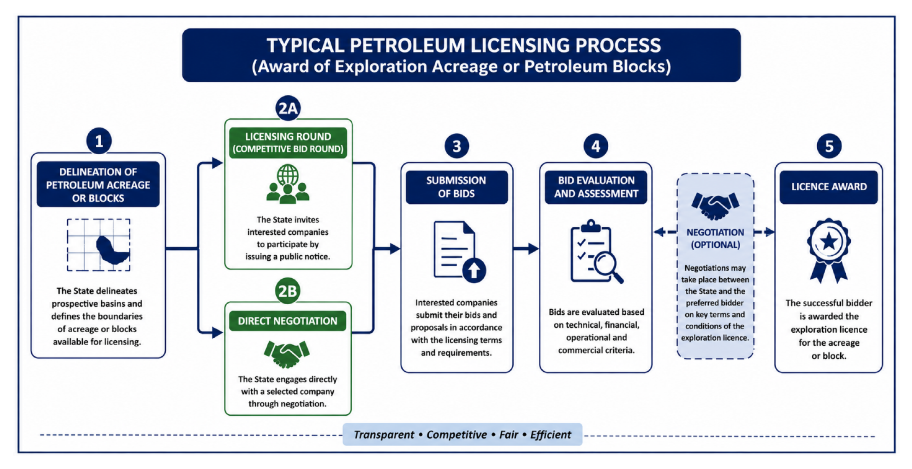

Figure 16 Typical Petroleum Licensing Process for the Award of Exploration Acreage or Petroleum Blocks

**Objectives of the Pre-Licensing Phase**

The principal objectives include:

**Resource Assessment**

Governments seek to improve understanding of the petroleum potential of sedimentary basins through the acquisition and interpretation of geological and geophysical data.

This may include:

- Regional geological studies;
- Basin analysis;
- Gravity surveys;
- Magnetic surveys;
- Seismic acquisition programmes;
- Exploration well data analysis.

The objective is to reduce geological uncertainty and improve the attractiveness of petroleum acreage to investors.

**Creation of an Attractive Investment Environment**

Governments must establish a stable investment framework that balances:

- National interests;
- Investor returns;
- Long-term resource management objectives.

This requires:

- Clear legislation;
- Transparent regulations;
- Competitive fiscal terms;
- Efficient regulatory institutions.

**Petroleum Acreage Promotion**

Following technical evaluation, governments typically promote available acreage to potential investors through:

- Data rooms;
- Industry conferences;
- Roadshows;
- Licensing rounds;
- Direct negotiations where permitted.

The objective is to attract technically competent and financially capable investors.

**Maximisation of National Benefits**

Governments seek to ensure that petroleum resources generate:

- Fiscal revenues;
- Employment opportunities;
- Technology transfer;
- Local content development;
- Economic diversification.

These objectives should be incorporated into petroleum legislation and contractual arrangements.

**Importance of the Pre-Licensing Phase**

The pre-licensing phase determines many of the conditions under which petroleum resources will ultimately be developed.

A well-executed pre-licensing strategy can:

- Increase competition among investors;
- Improve licence award outcomes;
- Enhance government revenues;
- Reduce future disputes;
- Improve resource governance.

Conversely, weaknesses during this phase can result in significant long-term losses for the host country.

The experience of several petroleum-producing countries demonstrates that poorly negotiated contracts may remain in force for decades, limiting the ability of governments to capture an equitable share of petroleum revenues.

For this reason, governments should invest significant resources in strengthening technical, legal, and commercial capabilities before launching licensing processes.

**Key Components of the Pre-Licensing Phase**

**Geological and Geophysical Data Acquisition**

Governments frequently acquire regional geological and geophysical data before offering acreage to investors.

Activities may include:

- Geological mapping;
- Gravity surveys;
- Aeromagnetic surveys;
- 2D seismic surveys;
- 3D seismic surveys;
- Geochemical studies.

These datasets provide investors with critical information regarding:

- Basin architecture;
- Source rock potential;
- Reservoir distribution;
- Trap development;
- Hydrocarbon migration pathways.

High-quality data acquisition can significantly increase investor interest.

**Establishment of the Legal Framework**

Before awarding petroleum rights, governments should establish:

- Petroleum legislation;
- Petroleum regulations;
- Environmental regulations;
- Fiscal legislation;
- Local content requirements.

The legal framework should clearly define:

- Ownership of petroleum resources;
- Licensing procedures;
- Government rights and obligations;
- Investor rights and obligations;
- Environmental responsibilities.

A stable and predictable legal framework is essential for attracting investment.

**Fiscal Framework Design**

The fiscal regime determines how petroleum revenues are shared between the government and investors.

Key fiscal instruments may include:

- Royalties;
- Production sharing mechanisms;
- Corporate income tax;
- Surface rentals;
- Signature bonuses;
- Production bonuses;
- State participation.

The fiscal framework should achieve an appropriate balance between:

- Government revenue generation;
- Investment attractiveness;
- Long-term resource development.

An excessively onerous fiscal regime may discourage investment, while an excessively generous regime may deprive governments of significant revenues.

**International Approaches to Resource Ownership**

Petroleum resources are generally owned by the State on behalf of the population.

Three broad approaches are commonly observed:

**State Ownership**

Under this system, subsurface petroleum resources belong to the State.

This approach is the most common internationally and is used throughout most of Africa.

Investors are granted rights to explore and produce petroleum under licences or contracts but do not own the resource in situ.

**State Participation**

Governments may participate directly in petroleum projects through National Oil Companies (NOCs).

Participation may take various forms:

- Carried interests;
- Paid working interests;
- Joint venture arrangements;
- Production sharing mechanisms.

**Hybrid Models**

Many countries combine state ownership with varying degrees of private sector participation.

The objective is typically to attract investment while maintaining national control over strategic resources.

**Government Responsibilities During the Pre-Licensing Phase**

Governments bear several critical responsibilities.

**Resource Stewardship**

The State must manage petroleum resources in a manner that serves the interests of both current and future generations.

This includes:

- Protecting national interests;
- Maximising resource value;
- Promoting sustainable development.

**Data Management**

Governments should establish national petroleum data repositories capable of securely storing:

- Geological data;
- Geophysical data;
- Well data;
- Production data.

Effective data management enhances transparency and facilitates future licensing activities.

**Institutional Capacity Building**

Governments should develop:

- Skilled technical personnel;
- Independent regulatory authorities;
- Effective National Oil Companies;
- Modern data management systems.

Institutional strength is a prerequisite for effective petroleum sector governance.

**Investment Promotion**

Governments must actively promote petroleum opportunities to potential investors.

This requires:

- High-quality technical data;
- Transparent licensing processes;
- Competitive fiscal frameworks;
- Political stability.

The objective is to attract investors capable of conducting safe, efficient, and responsible petroleum operations.

**Strategic Importance of the Pre-Licensing Phase**

The pre-licensing phase establishes the foundation upon which the entire petroleum industry is built.

Success during this phase increases the probability of:

- Attracting quality investors;
- Discovering commercial resources;
- Maximising government revenues;
- Enhancing local participation;
- Achieving long-term economic benefits.

Governments that invest in geological knowledge, institutional capacity, regulatory quality, and fiscal design are generally better positioned to derive sustainable value from their petroleum resources.

### 6.1.2- Petroleum Licensing Strategy

The allocation of petroleum exploration and production rights is one of the most important decisions undertaken by a government during the pre-licensing phase. The quality of this process directly influences the level of investment attracted, the revenues generated for the State, and the long-term development of the petroleum sector.

An effective licensing strategy should be designed to:

- Maximise the value of petroleum resources;
- Promote transparency and accountability;
- Encourage competition among investors;
- Attract technically capable operators;
- Ensure efficient resource development;
- Protect national interests.

The choice of licensing strategy should reflect:

- Geological knowledge of the basin;
- Level of exploration maturity;
- Investment climate;
- National development objectives;
- Institutional capacity.

**Petroleum Licensing Systems**

Several approaches are commonly used worldwide for awarding petroleum rights.

**Open Acreage Licensing**

Under an open acreage system, petroleum blocks are available for application at any time.

Interested companies submit applications directly to the government, which evaluates proposals based on predefined criteria.

Advantages include:

- Administrative simplicity;
- Continuous investment opportunities;
- Faster licence awards.

However, open acreage systems may reduce competition and potentially limit the value obtained by the State.

This approach is often used in frontier basins where investor interest is relatively limited.

**Competitive Licensing Rounds**

Competitive licensing rounds are widely regarded as the most transparent and effective method of awarding petroleum rights.

Under this approach, governments:

- Define available blocks;
- Publish bidding criteria;
- Promote acreage internationally;
- Invite bids from interested companies;
- Evaluate submissions;
- Award licences to successful bidders.

Advantages include:

- Increased competition;
- Improved transparency;
- Higher government revenues;
- Better technical work commitments.

Licensing rounds are particularly effective where geological knowledge is sufficient to attract multiple investors.

Countries such as Ghana, Senegal, Nigeria, and Côte d'Ivoire have increasingly adopted competitive bidding processes.

**Direct Negotiation**

In certain circumstances, governments may negotiate directly with investors without a formal licensing round.

This approach is sometimes used when:

- Investor interest is limited;
- Basins are highly speculative;
- Strategic partnerships are being pursued.

While direct negotiation can accelerate investment, it may also create concerns regarding transparency and value optimisation if not properly managed.

Governments using this approach should establish clear procedures and maintain robust oversight mechanisms.

**Hybrid Approaches**

Many countries employ a combination of licensing systems depending on:

- Basin maturity;
- Geological risk;
- Market conditions.

For example:

- Mature basins may utilise competitive licensing rounds;
- Frontier basins may use direct negotiation or open acreage systems.

This flexibility allows governments to tailor licensing strategies to specific circumstances.

**Evaluation Criteria for Licence Awards**

The selection of investors should not be based solely on financial considerations.

Governments should evaluate bidders using a range of technical, financial, operational, and strategic criteria.

**Technical Capability**

Investors should demonstrate:

- Relevant exploration experience;
- Operational expertise;
- Health, Safety and Environmental (HSE) performance;
- Project management capability.

Technical competence is particularly important in complex offshore environments.

**Financial Capacity**

Petroleum projects require substantial investment.

Applicants should demonstrate:

- Adequate financial resources;
- Access to capital;
- Ability to fund exploration commitments;
- Financial resilience during commodity price downturns.

The financial strength of the operator is often a key determinant of project success.

**Work Programme Commitments**

Governments typically evaluate proposed work programmes, including:

- Geological studies;
- Seismic acquisition;
- Exploration drilling;
- Appraisal activities.

A strong work programme demonstrates commitment to resource evaluation and development.

**Local Content Commitments**

Governments increasingly require commitments relating to:

- Employment of local personnel;
- Training programmes;
- Procurement of local goods and services;
- Technology transfer initiatives.

These commitments can significantly enhance the developmental impact of petroleum projects.

The petroleum licensing process typically follows the sequence below:

- Basin Evaluation and Data Acquisition
- Petroleum Acreage Delineation
- Development of Legal and Fiscal Framework
- Promotion of Acreage to Investors
- Bid Submission
- Technical and Commercial Evaluation
- Negotiation of Licence or Contract Terms
- Licence Award and Contract Execution
- Regulatory Approval
- Commencement of Exploration Activities

**Risks Associated with Poor Licensing Strategies**

The consequences of poorly designed licensing systems can be severe and long-lasting.

Common risks include:

**Under-Valued Acreage Awards**

Insufficient geological knowledge may result in governments awarding highly prospective acreage under terms that do not adequately reflect resource value.

**Lack of Transparency**

Opaque licensing processes may create opportunities for:

- Corruption;
- Political interference;
- Legal disputes;
- Reduced investor confidence.

**Speculative Licence Holding**

Some investors acquire licences primarily for speculative purposes rather than active exploration.

This can delay resource development and reduce economic benefits.

**Weak Work Commitments**

Insufficient exploration obligations may result in acreage remaining inactive for extended periods.

Governments should therefore establish minimum work programme requirements and licence relinquishment provisions.

**Role of National Oil Companies During Licensing**

National Oil Companies (NOCs) often play an important role during the licensing process.

Depending on the country, NOCs may:

- Participate in evaluations;
- Hold equity interests in licences;
- Act as commercial partners;
- Manage national petroleum data repositories;
- Promote investment opportunities.

Examples include:

- GNPC
- PETROCI
- PETROSEN
- NNPC Limited

The effectiveness of NOCs depends upon:

- Technical competence;
- Governance structures;
- Commercial independence;
- Financial capability.

**Strategic Considerations for Governments**

Before launching a licensing round, governments should seek answers to several key questions:

**Do We Understand the Resource Potential?**

Governments should possess sufficient geological knowledge to evaluate the value of the acreage being offered.

**Is the Fiscal Regime Competitive?**

Fiscal terms must attract investment while ensuring an equitable share of revenues for the State.

**Are Regulatory Institutions Ready?**

Licensing should only proceed when regulators possess the capacity to evaluate and oversee petroleum operations effectively.

**What National Benefits Are Expected?**

Governments should clearly define objectives relating to:

- Revenue generation;
- Employment;
- Infrastructure development;
- Technology transfer;
- Local content.

**Best Practice Principles for Petroleum Licensing**

International experience demonstrates that successful licensing systems generally exhibit the following characteristics:

- Transparency;
- Competitiveness;
- Predictability;
- Technical rigour;
- Strong governance;
- Efficient administration.

Countries that consistently apply these principles are generally more successful in attracting investment and maximising long-term benefits from petroleum resources.

### 6.1.3- Pre-Licensing Investment Financing

The pre-licensing phase requires significant investment by governments before any exploration licences are awarded and long before petroleum revenues are generated.

Although the financial requirements of this phase are generally lower than those associated with exploration, development, and production activities, they remain substantial, particularly for developing countries with limited financial resources.

Governments must invest in:

- Geological studies;
- Geophysical surveys;
- Data acquisition programmes;
- Petroleum data management systems;
- Institutional development;
- Regulatory capacity building;
- Petroleum promotion activities;
- Environmental baseline studies.

These investments are essential for reducing geological uncertainty and increasing the attractiveness of petroleum acreage to investors.

**Government-Funded Data Acquisition**

Traditionally, governments finance regional geological and geophysical studies using public funds.

Typical expenditures may include:

**Geological Mapping**

Regional geological mapping programmes provide a fundamental understanding of:

- Basin architecture;
- Structural geology;
- Stratigraphy;
- Petroleum systems.

These studies often form the basis for subsequent exploration activities.

**Gravity and Magnetic Surveys**

Gravity and aeromagnetic surveys are relatively cost-effective methods of evaluating large frontier areas.

They can provide valuable information regarding:

- Basin extent;
- Sediment thickness;
- Structural trends;
- Basement configuration.

Such surveys are frequently conducted before more expensive seismic acquisition programmes.

**Seismic Data Acquisition**

Seismic acquisition typically represents the largest expenditure during the pre-licensing phase.

Governments may acquire:

- 2D seismic data;
- 3D seismic data;
- Reprocessed legacy seismic datasets.

These datasets significantly improve understanding of:

- Structural traps;
- Stratigraphic traps;
- Reservoir distribution;
- Hydrocarbon migration pathways.

High-quality seismic data can substantially increase investor interest and improve licence award outcomes.

**Multi-Client Data Financing**

Many countries utilise multi-client financing arrangements to reduce the financial burden associated with data acquisition.

Under this model:

- Specialised geophysical companies acquire data at their own risk.
- The data are subsequently licensed to multiple clients.
- Governments receive access to the data without bearing the full acquisition cost.

Advantages include:

- Reduced government expenditure;
- Accelerated data acquisition;
- Access to modern technology;
- Increased investor participation.

This approach has been successfully employed in numerous petroleum-producing countries.

**International Financial Support**

Some governments obtain technical and financial assistance from:

- Multilateral development institutions;
- Bilateral development agencies;
- Regional development banks;
- International cooperation programmes.

Support may be provided for:

- Capacity building;
- Regulatory reform;
- Data management systems;
- Environmental studies;
- Institutional strengthening.

Such assistance can improve the effectiveness of the pre-licensing phase while reducing financial pressures on governments.

**National Oil Company Participation**

National Oil Companies (NOCs) frequently contribute to financing activities during the pre-licensing phase.

Their responsibilities may include:

- Acquisition of technical data;
- Data interpretation;
- Promotion of petroleum opportunities;
- Maintenance of national data repositories.

Examples include:

- GNPC
- PETROCI
- PETROSEN
- NNPC Limited

Where adequately funded and technically competent, NOCs can play an important role in reducing dependence on foreign expertise.

**Risks Associated with Inadequate Investment**

Insufficient investment during the pre-licensing phase can have significant long-term consequences.

**Poor Resource Understanding**

Without adequate geological and geophysical data, governments may:

- Underestimate resource potential;
- Misjudge acreage value;
- Attract lower-quality investors.

**Reduced Investor Interest**

Investors are generally more willing to commit capital when high-quality technical data are available.

Data-poor basins often struggle to attract competitive bids.

**Weaker Contract Negotiations**

Governments lacking technical information may be at a disadvantage when negotiating petroleum agreements.

This can result in:

- Unfavourable fiscal terms;
- Excessive concessions;
- Reduced future revenues.

**Delayed Resource Development**

Poor understanding of resource potential can slow exploration activities and delay investment decisions.

**Strategic Importance of Early Investment**

Investment during the pre-licensing phase should be viewed as a strategic national investment rather than a cost.

Every dollar invested in improving geological understanding and institutional capacity has the potential to generate substantial long-term returns through:

- Increased exploration activity;
- Improved licence awards;
- Higher government revenues;
- Better contract outcomes;
- Enhanced investor confidence.

Countries that invest effectively during the pre-licensing phase are generally better positioned to maximise the value of their petroleum resources.

### 6.1.4- Government Responsibilities During Pre-Licensing

The pre-licensing phase is arguably the most important stage in the petroleum value chain from a government perspective.

Decisions taken during this phase can influence the economic performance of the petroleum sector for decades.

Many of the challenges currently faced by petroleum-producing countries can be traced back to weaknesses in:

- Resource evaluation;
- Institutional capacity;
- Fiscal design;
- Contract negotiation;
- Regulatory oversight.

Consequently, governments must approach the pre-licensing phase with a long-term strategic perspective.

**Core Government Responsibilities**

**Establishing a Clear Petroleum Policy**

Governments should define a national petroleum policy that clearly articulates:

- Strategic objectives;
- Resource management principles;
- Investment priorities;
- Local content objectives;
- Environmental commitments.

A coherent policy provides guidance to investors and regulators alike.

**Developing the Legal and Regulatory Framework**

Governments must establish legislation and regulations that govern:

- Petroleum rights;
- Licensing procedures;
- Fiscal obligations;
- Environmental protection;
- Health and safety requirements;
- Local content obligations.

The framework should provide certainty while remaining sufficiently flexible to adapt to changing industry conditions.

**Building Institutional Capacity**

Strong institutions are essential for effective petroleum sector governance.

Governments should invest in:

- Regulatory agencies;
- National Oil Companies;
- Geological surveys;
- Environmental authorities;
- Revenue management institutions.

Institutional capacity should be developed before major petroleum discoveries occur wherever possible.

**Safeguarding National Interests**

Governments act as custodians of petroleum resources on behalf of their populations.

Their responsibilities include:

- Maximising resource value;
- Ensuring fair fiscal returns;
- Protecting the environment;
- Promoting local participation;
- Supporting sustainable development.

Short-term revenue objectives should not undermine long-term national interests.

**Promoting Transparency and Accountability**

Transparency is critical for maintaining public confidence and reducing corruption risks.

Governments should promote:

- Competitive licensing processes;
- Public disclosure of petroleum contracts;
- Independent audits;
- Transparent revenue reporting.

International initiatives such as the:

Extractive Industries Transparency Initiative

provide useful frameworks for improving governance and accountability.

**Preparing for Future Development**

Governments should use the pre-licensing phase to prepare for future exploration and production activities.

Preparation should include:

- Development of petroleum regulations;
- Training of regulatory personnel;
- Establishment of monitoring systems;
- Creation of emergency response frameworks;
- Environmental baseline studies.

Proactive preparation significantly improves the ability of governments to manage future petroleum developments effectively.

**Strategic Conclusion**

The pre-licensing phase is the foundation upon which the entire petroleum industry is built.

Countries that invest in:

- Geological knowledge;
- Institutional capacity;
- Regulatory quality;
- Fiscal design;
- Transparency;

are generally better positioned to attract investment, maximise revenues, and ensure that petroleum resources contribute to long-term national development.

The success or failure of many petroleum-producing countries can often be traced to decisions made long before the first exploration well was drilled.

## 6.2- Exploration Phase

### 6.2.1- Exploration Methods and Strategies

Following the award of an Exploration Licence or execution of a petroleum contract, the exploration phase begins.

The primary objective of exploration is to identify and evaluate hydrocarbon accumulations that may be commercially developed.

Exploration represents one of the most technically challenging and financially risky phases of the petroleum lifecycle. Despite advances in technology, there is never any guarantee that exploration activities will result in the discovery of commercially recoverable hydrocarbons.

Success requires the integration of multiple disciplines, including:

- Petroleum geology;
- Geophysics;
- Geochemistry;
- Reservoir engineering;
- Petroleum economics;
- Data science and digital technologies.

The exploration process aims to progressively reduce geological uncertainty through the acquisition and interpretation of technical data.

**Petroleum Exploration Workflow**

Exploration activities generally follow a structured workflow:

- Basin Evaluation
- Petroleum System Analysis
- Prospect Identification
- Prospect Evaluation
- Exploration Well Planning
- Exploration Drilling
- Well Testing and Evaluation
- Discovery Assessment

Each stage reduces uncertainty and improves understanding of subsurface conditions.

**Basin Evaluation**

Exploration begins with an assessment of the sedimentary basin.

The objective is to determine whether geological conditions exist for hydrocarbon generation and accumulation.

Key questions include:

- Is there an effective source rock?
- Has the source rock reached thermal maturity?
- Are reservoir rocks present?
- Is there an effective seal?
- Are hydrocarbon traps present?
- Has hydrocarbon migration occurred?

These questions form the basis of Petroleum System Analysis.

**Petroleum System Analysis**

A petroleum system consists of the geological elements and processes necessary for the generation and accumulation of hydrocarbons.

The essential elements include:

**Source Rock**

A source rock contains sufficient organic matter to generate hydrocarbons when subjected to appropriate temperature and pressure conditions.

Examples include:

- Marine shales;
- Lacustrine shales;
- Organic-rich mudstones.

The quality of the source rock is commonly assessed using:

- Total Organic Carbon (TOC);
- Hydrogen Index (HI);
- Rock-Eval Pyrolysis;
- Vitrinite Reflectance.

**Reservoir Rock**

A reservoir rock stores and transmits hydrocarbons.

Typical reservoir rocks include:

- Sandstones;
- Carbonates;
- Fractured basement reservoirs.

Key reservoir properties include:

- Porosity;
- Permeability;
- Net-to-Gross Ratio;
- Fluid Saturation.

**Seal**

A seal prevents hydrocarbons from escaping the reservoir.

Common seals include:

- Shales;
- Evaporites;
- Tight carbonates.

The effectiveness of the seal is critical to preserving hydrocarbon accumulations.

**Trap**

A trap is the geological configuration that allows hydrocarbons to accumulate.

Traps are generally classified as:

**Structural Traps**

Created by deformation of the subsurface, including:

- Anticlines;
- Fault traps;
- Fold structures.

**Stratigraphic Traps**

Created by variations in rock deposition and reservoir distribution.

Examples include:

- Pinch-outs;
- Unconformities;
- Reef complexes.

**Combination Traps**

Created by a combination of structural and stratigraphic processes.

**Migration Pathways**

Hydrocarbons generated within the source rock must migrate into reservoir rocks through permeable pathways.

Successful migration is essential for commercial hydrocarbon accumulations to form.

**Exploration Techniques**

**Geological Studies**

Geological investigations form the foundation of exploration.

Activities include:

- Surface mapping;
- Stratigraphic analysis;
- Structural interpretation;
- Basin modelling;
- Outcrop studies.

These studies help identify areas with favourable geological conditions.

**Gravity Surveys**

Gravity surveys measure variations in the Earth's gravitational field (Figure 17).

They are commonly used to:

- Define basin geometry;
- Estimate sediment thickness;
- Identify major structural features.

Gravity surveys are particularly useful in frontier exploration areas.

**Aeromagnetic Surveys**

Aeromagnetic surveys measure variations in the Earth's magnetic field (Figure 18).

They provide valuable information regarding:

- Basement structure;
- Fault systems;
- Sedimentary basin architecture.

Aeromagnetic data are frequently integrated with gravity data during early-stage exploration.

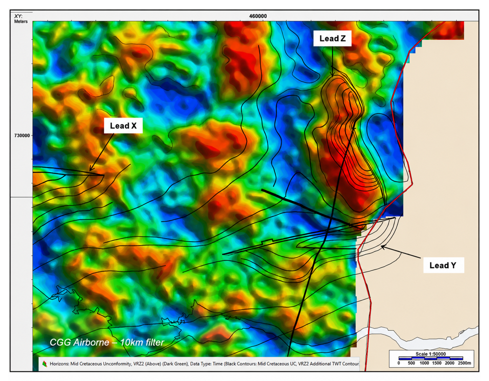

Figure 17 Gravimetric Survey

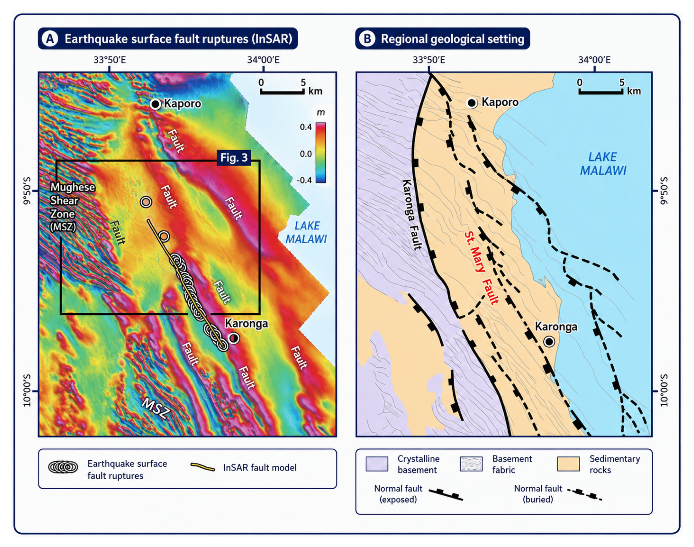

Figure 18 Aeromagnetic Anomalies and Structural Interpretation of the Benin Coastal Sedimentary Basin. (a) Aeromagnetic anomaly map highlighting subsurface structural trends and fault systems within the basin. (b) Geological and structural interpretation derived

**Seismic Reflection Surveys**

Seismic reflection surveying is the most important exploration technique used in the petroleum industry (Figure 19 and Figure 20).

The method involves:

- Generating seismic energy;
- Recording reflected signals;
- Processing seismic data;
- Interpreting subsurface geology.

Seismic surveys provide detailed images of subsurface structures and stratigraphy.

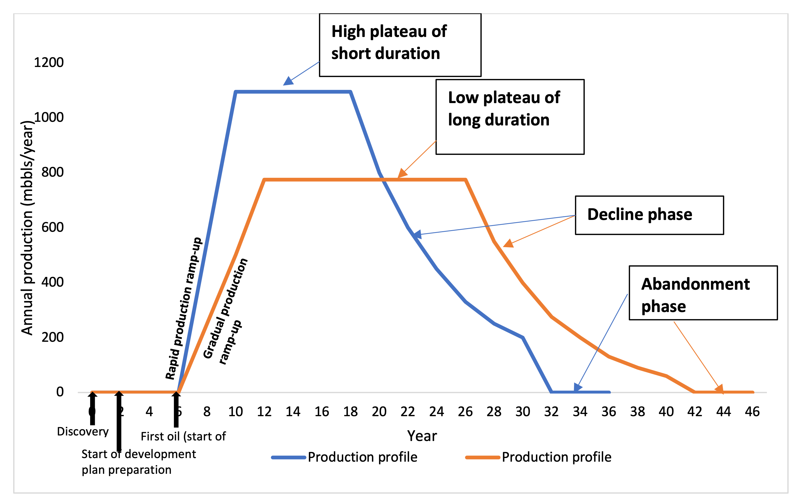

Figure 19 Principle of 3D Seismic Acquisition

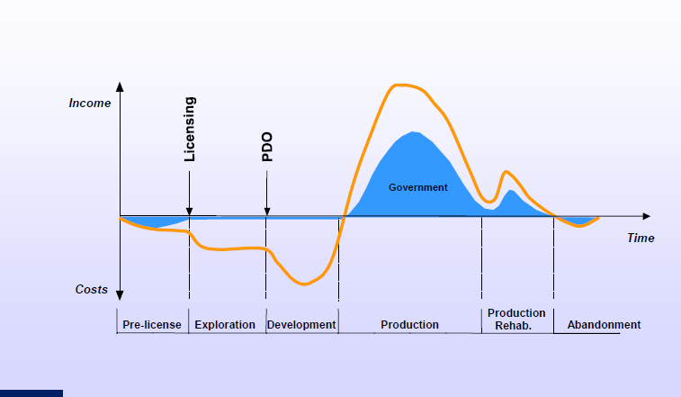

Figure 20 Seismic Reflection Section Showing Direct Hydrocarbon Indicators and Exploration Well Placement

Two-dimensional (2D) seismic surveys acquire data along individual survey lines.

They are generally used for:

- Regional basin evaluation;
- Frontier exploration;
- Initial prospect identification.

Advantages include:

- Lower cost;
- Rapid acquisition;
- Large area coverage.

However, interpretation uncertainty is generally greater than with 3D seismic data.

Three-dimensional (3D) seismic surveys provide volumetric images of the subsurface.

Advantages include:

- Improved structural definition;
- Better stratigraphic imaging;
- Reduced drilling risk;
- Enhanced reservoir characterisation.

Modern exploration programmes increasingly rely on 3D seismic datasets.

**Direct Hydrocarbon Indicators (DHIs)**

Certain seismic anomalies may indicate the presence of hydrocarbons.

These features are known as Direct Hydrocarbon Indicators (DHIs).

Examples include:

**Bright Spots**

High-amplitude seismic reflections caused by significant acoustic impedance contrasts.

**Flat Spots**

Horizontally oriented reflections that may represent fluid contacts.

**Dim Spots**

Amplitude reductions potentially associated with hydrocarbons.

**Amplitude Versus Offset (AVO)**

Changes in reflection amplitude with offset that may indicate the presence of hydrocarbons.

DHIs can significantly reduce exploration risk when properly interpreted.

Figure 21 illustrates the typical workflow used to transform raw seismic data into drilling decisions. The process begins with seismic acquisition and data processing, followed by geological and geophysical interpretation to identify horizons, faults and potential hydrocarbon traps. Seismic data are then integrated with well, geological and reservoir information to build subsurface models, evaluate prospects and assess exploration risk. The workflow culminates in well planning and placement, where the optimum drilling target and trajectory are selected to maximise the likelihood of a successful hydrocarbon discovery.

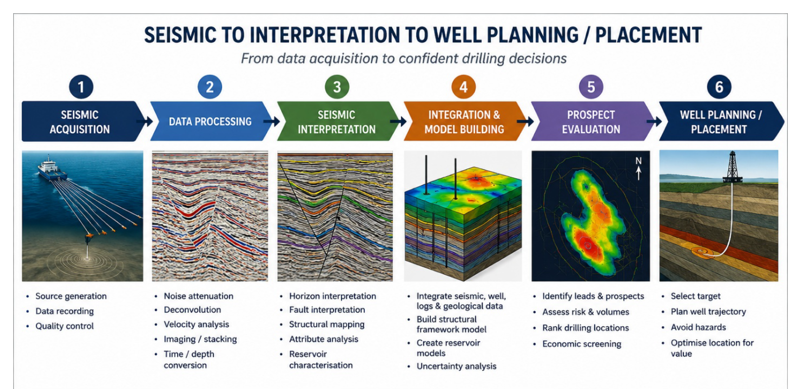

Figure 21 Workflow from Seismic Acquisition and Interpretation to Prospect Evaluation and Well Planning.

**Controlled-Source Electromagnetic Surveys (CSEM)**

Controlled-Source Electromagnetic (CSEM) surveys are increasingly used alongside seismic surveys (Figure 22).

The technique measures variations in subsurface resistivity.

Hydrocarbon-filled reservoirs often exhibit higher resistivity than water-saturated formations.

CSEM surveys can therefore provide an additional dataset for reducing exploration risk.

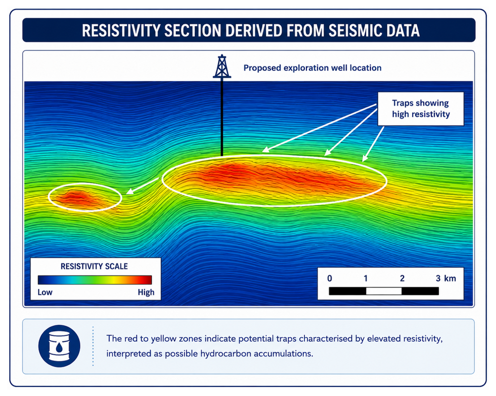

Figure 22 Integrated Electromagnetic and Seismic Interpretation Showing High-Resistivity Anomalies Associated with Potential Hydrocarbon Traps and Exploration Well Positioning

**Petroleum System Modelling**

Petroleum system modelling is used to reconstruct the geological evolution of a basin and evaluate:

- Source rock maturity;
- Hydrocarbon generation;
- Migration pathways;
- Timing relationships;
- Trap formation.

These analyses help determine whether the critical elements of a petroleum system are present and effective, as shown in Figure 23.

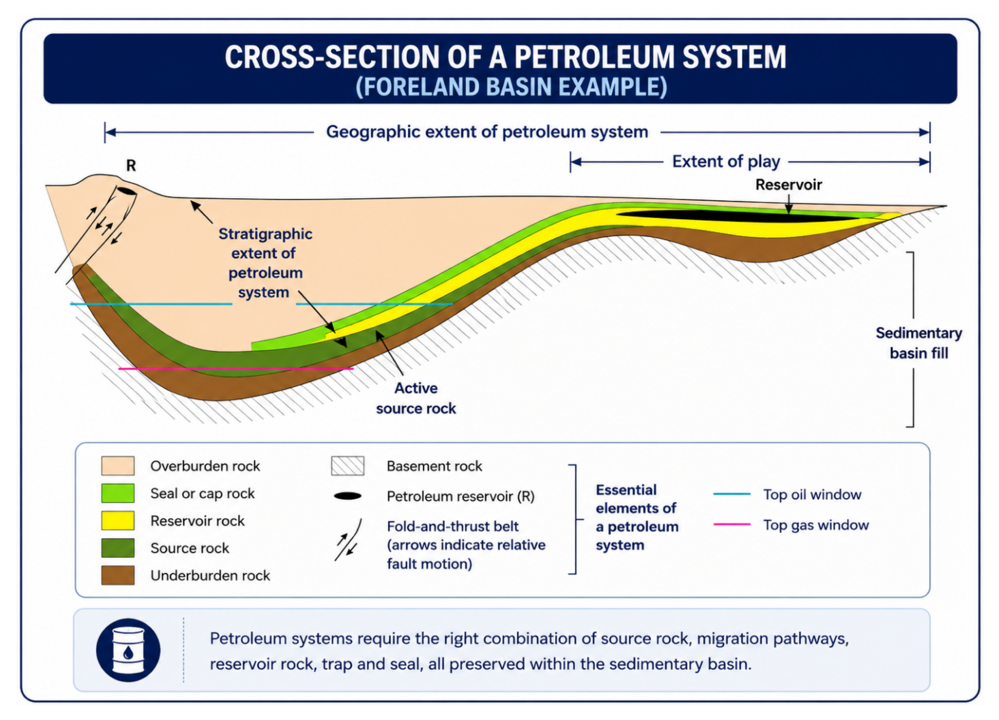

Figure 23 Geological Cross-Section of the Deer-Boar Petroleum System at the Critical Moment (250 Ma), Illustrating Source Rock Maturation, Hydrocarbon Migration Pathways, Reservoir Development, and the Stratigraphic and Geographic Extent of the Petroleum System

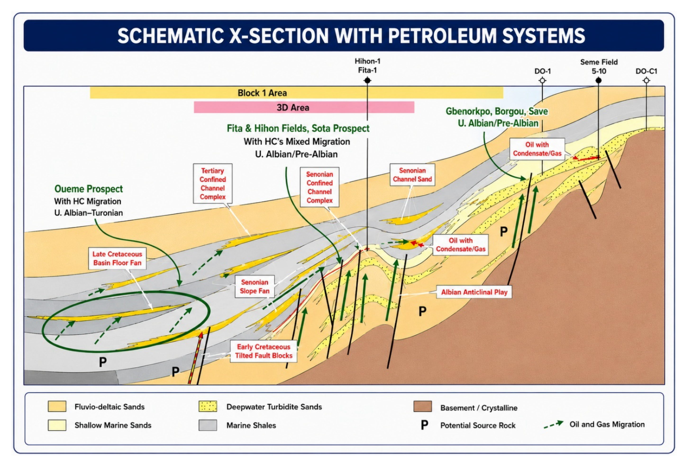

Figure 24 Regional Geological and Petroleum Systems Cross-Section of the Benin Coastal Sedimentary Basin, Illustrating Source Rock Distribution, Hydrocarbon Migration Pathways, Reservoir Intervals, Structural Traps, and Identified Prospects and Discoveries (Modified after Kerr-McGee, 2003)

**Exploration Strategy**

Exploration strategies vary depending on basin maturity and available data.

**Frontier Exploration**

Frontier basins are characterised by:

- Limited well control;
- Sparse data coverage;
- High geological uncertainty.

Exploration strategies focus on regional evaluation and risk reduction.

Examples in West Africa may include:

- Parts of Mali;
- Guinea-Bissau;
- Guinea;
- Liberia;
- Sierra Leone.

**Mature Basin Exploration**

Mature basins generally possess:

- Extensive well data;
- High-quality seismic coverage;
- Proven petroleum systems.

Exploration efforts focus on:

- Smaller prospects;
- Stratigraphic plays;
- Near-field opportunities.

Examples include:

- Niger Delta Basin;
- Tano Basin;
- Côte d'Ivoire Offshore Basin.

**Exploration Risk Assessment**

Exploration risk is commonly evaluated through four key geological factors:

<table>
<caption>
Table 6 Exploration Risk
</caption>
<thead>
<tr>
  <th>
<strong>Risk Element</strong>
</th>
  <th>
<strong>Key Question</strong>
</th>
</tr>
</thead>
<tbody>
<tr>
  <td>
Source
</td>
  <td>
Was hydrocarbon generated?
</td>
</tr>
<tr>
  <td>
Reservoir
</td>
  <td>
Can hydrocarbons be stored and produced?
</td>
</tr>
<tr>
  <td>
Seal
</td>
  <td>
Can hydrocarbons be retained?
</td>
</tr>
<tr>
  <td>
Trap
</td>
  <td>
Is there an effective accumulation geometry?
</td>
</tr>
</tbody>
</table>

Failure of any one of these elements can result in an unsuccessful exploration well.

**Government Responsibilities During Exploration Strategy Development**

Governments should ensure that operators:

- Conduct technically sound evaluations;
- Meet licence obligations;
- Comply with environmental requirements;
- Acquire high-quality data;
- Report findings accurately.

Effective oversight during exploration helps maximise the value of national petroleum resources while protecting the environment.

### 6.2.2- Prospect Evaluation Techniques

Following prospect identification, a detailed technical and commercial evaluation must be undertaken to determine whether sufficient geological justification exists to drill an exploration well.

Prospect evaluation represents one of the most critical stages in the exploration process because it directly influences capital allocation decisions and exploration success rates.

The objective is to quantify:

- Geological risk;
- Resource potential;
- Commercial viability;
- Exploration uncertainty.

Only after a prospect has undergone rigorous evaluation should drilling be considered.

**Prospect Definition**

A prospect is a mapped subsurface feature that contains all of the elements necessary for a potentially commercial hydrocarbon accumulation.

A valid prospect should demonstrate:

- An effective source rock;
- Migration pathways;
- Reservoir presence;
- Seal integrity;
- Trap geometry.

The prospect must also be sufficiently defined to justify drilling.

**Geological Interpretation**

The first stage of prospect evaluation involves detailed geological interpretation.

This typically includes:

**Structural Mapping**

Structural interpretation seeks to identify:

- Fault systems;
- Fold structures;
- Closures;
- Trap geometries.

The objective is to determine whether hydrocarbons could accumulate within the structure.

**Stratigraphic Analysis**

Stratigraphic evaluation focuses on:

- Reservoir distribution;
- Depositional environments;
- Reservoir continuity;
- Seal development.

This analysis helps determine reservoir quality and trap effectiveness.

**Petroleum System Verification**

Geoscientists must confirm that all petroleum system elements are present and properly timed.

Critical questions include:

- Was hydrocarbon generation sufficient?
- Did migration occur?
- Did trap formation occur before migration?
- Has the accumulation been preserved?

Timing relationships are particularly important.

A high-quality trap is of little value if hydrocarbons migrated before the trap formed.

**Seismic Interpretation**

Seismic data typically provide the primary dataset used for prospect evaluation.

Interpretation may include:

**Horizon Mapping**

Mapping of key geological horizons allows construction of:

- Structural maps;
- Time maps;
- Depth maps.

These maps form the basis for volumetric calculations.

**Fault Interpretation**

Fault analysis helps evaluate:

- Trap geometry;
- Seal integrity;
- Compartmentalisation;
- Migration pathways.

Faults may either enhance or reduce prospectivity.

**Seismic Attribute Analysis**

Modern interpretation often incorporates seismic attributes such as:

- Amplitude;
- Frequency;
- Coherency;
- Curvature;
- Spectral decomposition.

These tools can improve reservoir prediction and prospect definition.

Figure 25 illustrates an interpreted seismic reflection section containing an anticlinal structural closure, one of the most common hydrocarbon trapping mechanisms in petroleum exploration. The high-amplitude, laterally continuous reflectors observed within the closure may indicate the presence of hydrocarbon-bearing reservoir rocks sealed beneath an impermeable cap rock. Seismic interpretation is a critical exploration tool used to identify potential traps, evaluate reservoir geometry, and optimise exploration well placement.

Figure 26 presents the principal structural and stratigraphic trap types responsible for hydrocarbon accumulation. Structural traps, such as anticlines, fault traps, and salt dome traps, result from tectonic deformation, whereas stratigraphic traps, including pinch-out, unconformity, reef, and channel traps, are created by variations in sediment deposition and erosion. Effective hydrocarbon accumulations occur where reservoir rocks, seal rocks, migration pathways, and trapping mechanisms coincide within a functioning petroleum system.

Figure 27 presents a Two-Way Travel Time (TWT) structural contour map of the top reservoir horizon at the Hihon Prospect. The map illustrates the geometry of the mapped structural closure, with lower TWT values representing structurally higher areas that form the crest of the prospect. The interpreted fault system influences the shape and extent of the closure and may contribute to hydrocarbon trapping. The green outline defines the interpreted structural closure, while the Hihon-1 well was drilled to evaluate the prospect. TWT structure maps are a fundamental tool in petroleum exploration, allowing geoscientists to identify structural highs, estimate closure area, and assess the potential for hydrocarbon accumulation.

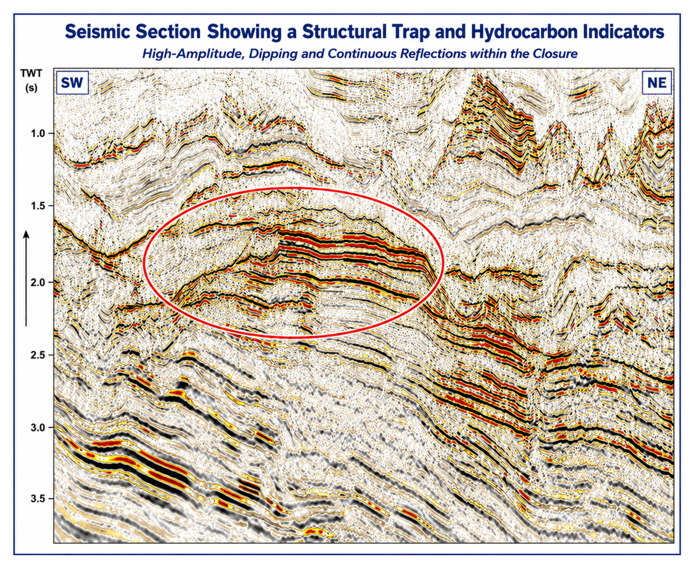

Figure 25 Seismic Reflection Section Showing a Structural Closure (Anticline) with High-Amplitude Reflectors Indicative of a Potential Hydrocarbon Accumulation.

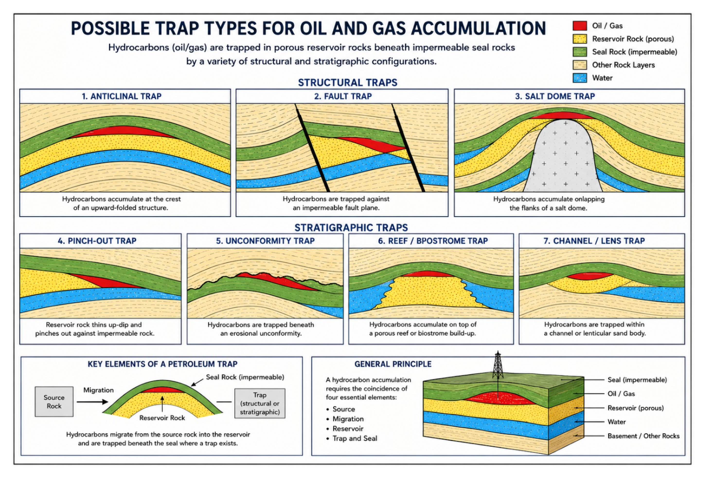

Figure 26 Common Structural and Stratigraphic Hydrocarbon Trap Types Showing the Principal Geological Configurations that Enable Oil and Gas Accumulation Beneath Effective Seal Rocks.

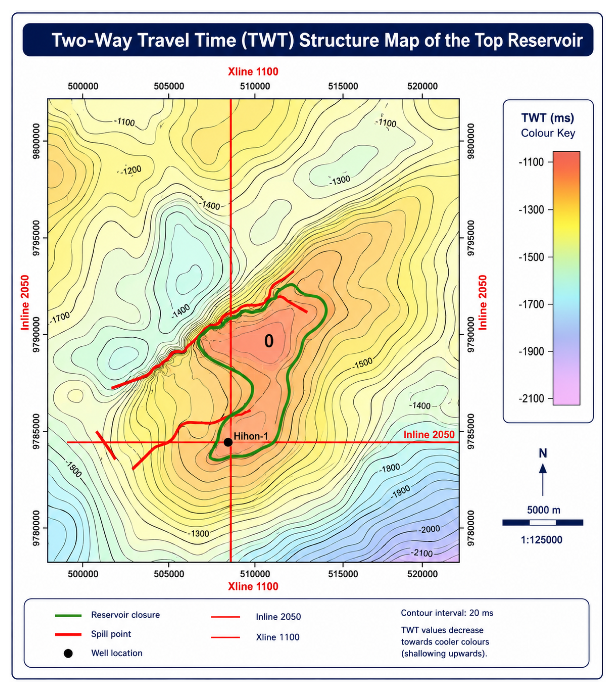

Figure 27 Two-Way Travel Time (TWT) Structure Map of the Top Reservoir Horizon of a Prospect Showing Structural Closure, Crest Position, Fault Control, and the Hihon-1 Well Location.

**Volumetric Evaluation of Hydrocarbon Resources**

The volumetric evaluation of hydrocarbon resources within a prospect involves estimating the volume of oil or natural gas that may be contained within the prospect. This assessment is carried out using the geological and petrophysical properties of the reservoir rock. The evaluation becomes more accurate when based on data acquired from exploration activities, particularly exploration drilling results. Where such data are unavailable, parameters derived from seismic interpretation or from nearby wells within the exploration area are used.

**Stock Tank Oil Initially in Place (STOIIP)**

For oil prospects.

**Gas Initially in Place (GIIP)**

For gas prospects.

Key input parameters include:

- Gross Rock Volume (GRV);
- Net-to-Gross Ratio (NTG);
- Porosity;
- Hydrocarbon Saturation;
- Formation Volume Factor.

Because considerable uncertainty exists, volumetric estimates are generally expressed as probabilistic ranges.

<!-- parity-ignore:start -->
<section class="formula-group formula-group--volumetric" data-equation-label="6.1" aria-label="Volumetric evaluation formulas">
  

    VHcP = GRV × N/G × ϕ × Shc × 1/FVF
  

  

    
Where:

    

      <article class="formula-spec-item">
        
GRV (Gross Rock Volume) - the gross volume of the reservoir rock. It is determined from the geometric shape and thickness of the reservoir.

        

          GRV = ∑(Reservoir Area × Reservoir Thickness)
        

      </article>
      <article class="formula-spec-item">
        
N/G (Net-to-Gross Ratio) - the ratio of net reservoir thickness to gross reservoir thickness. Reservoir intervals rarely exhibit uniform lithology and are often interbedded with impermeable shale layers.

      </article>
      <article class="formula-spec-item">
        
ϕ (Phi) - Reservoir Porosity - estimated from well logs, core measurements, and analogue reservoir data. It is defined as:

        

          ϕ = Pore Volume (Vv) / Bulk Reservoir Volume (V)
        

      </article>
      <article class="formula-spec-item">
        
Shc (Hydrocarbon Saturation) - determined from the water saturation (Sw). It is generally calculated from well log data within the effective porosity interval.

        

          Shc = 1 &minus; Sw
        

      </article>
      <article class="formula-spec-item">
        
FVF (Formation Volume Factor) - expresses the change in fluid volume between reservoir conditions and standard surface conditions (pressure = 1 atmosphere and temperature = 15°C). For oil, the formation volume factor is represented by Bo, while for gas it is represented by Bg.

        

          FVF = Reservoir Volume / Surface Volume
        

      </article>
      <article class="formula-spec-item formula-spec-item--empty" aria-hidden="true"></article>
    

  

  

    

      <section class="formula-case" aria-label="Oil volume derivation">
        
Oil Volumes

        

          
For Oil

          

            FVF = Bo
          

          
and

          

            Shc = So
          

          
where So is the oil saturation.

          
Therefore

          

            STOIIP = GRV × N/G × ϕ × So × 1/Bo
          

          

            
The volume of associated gas in place is calculated as:

            

              Associated Gas In Place = STOIIP × GOR
            

          

        

      </section>
      <section class="formula-case" aria-label="Gas volume derivation">
        
Gas Volumes

        

          
For Gas

          

            FVF = Bg
          

          
and

          

            Shc = Sg
          

          
where Sg is the gas saturation.

          
Therefore

          

            GIIP = GRV × N/G × ϕ × Sg × 1/Bg
          

          

            
The volume of condensate in place is calculated as:

            

              Condensate In Place = GIIP × CGR
            

          

        

      </section>
    

    

      
Where:

      
GOR: the ratio of produced gas volume to produced oil volume.

      
CGR: the ratio of produced condensate volume to produced gas volume.

    

  

</section>
<!-- parity-ignore:end -->

VHcP=GRV×N/G×ϕ×Shc×1/FVF

Where:

GRV (Gross Rock Volume) - the gross volume of the reservoir rock. It is determined from the geometric shape and thickness of the reservoir.

GRV=∑(ReservoirArea×ReservoirThickness)

N/G (Net-to-Gross Ratio) - the ratio of net reservoir thickness to gross reservoir thickness. Reservoir intervals rarely exhibit uniform lithology and are often interbedded with impermeable shale layers.

φ (Phi) - Reservoir Porosity - estimated from well logs, core measurements, and analogue reservoir data. It is defined as:

ϕ=PoreVolume(Vv)/BulkReservoirVolume(V)

Shc (Hydrocarbon Saturation) - determined from the water saturation (Sw). It is generally calculated from well log data within the effective porosity interval.

Shc=1-Sw

FVF (Formation Volume Factor) - expresses the change in fluid volume between reservoir conditions and standard surface conditions (pressure = 1 atmosphere and temperature = 15°C). For oil, the formation volume factor is represented by Bo, while for gas it is represented by Bg.

FVF=ReservoirVolume/SurfaceVolume

Oil Volumes

For oil:

FVF=Bo

Shc=So

where So is the oil saturation.

Therefore:

STOIIP=GRV×N/G×ϕ×So×1/Bo

The volume of associated gas in place is calculated as:

AssociatedGasInPlace=STOIIP×GOR

Gas Volumes

For gas:

FVF=Bg

Shc=Sg

where Sg is the gas saturation.

Therefore:

GIIP=GRV×N/G×ϕ×Sg×1/Bg

The volume of condensate in place is calculated as:

CondensateInPlace=GIIP×CGR

Where:

GOR (Gas-Oil Ratio) - the ratio of produced gas volume to produced oil volume.

CGR (Condensate-Gas Ratio) - the ratio of produced condensate volume to produced gas volume.

**Prospect Ranking and Appraisal**

When several prospects have been mapped within a contracted block, a prospect ranking exercise is undertaken. This ranking is based on geological risk (probability of success), the estimated volume and type of hydrocarbons potentially in place, and other key petrophysical parameters. The selection of prospect(s) for drilling takes account of this ranking in order to maximise the likelihood of exploration success.

Once a discovery has been made, the International Oil Company (IOC) undertakes appraisal activities to evaluate the field. These activities typically include appraisal or delineation drilling, reservoir geological and geophysical studies, and reserve estimation. The results of these studies are used to determine whether the field is commercially viable and should proceed to development.

**Probabilistic Resource Assessment**

Modern prospect evaluation generally employs probabilistic methods rather than single deterministic estimates.

Three principal cases are commonly reported:

<table>
<caption>
Table 7 Probabilistic Resource Assessment
</caption>
<thead>
<tr>
  <th>
<strong>Case</strong>
</th>
  <th>
<strong>Interpretation</strong>
</th>
</tr>
</thead>
<tbody>
<tr>
  <td>
P90
</td>
  <td>
Conservative estimate (high confidence)
</td>
</tr>
<tr>
  <td>
P50
</td>
  <td>
Best estimate
</td>
</tr>
<tr>
  <td>
P10
</td>
  <td>
Upside estimate (low probability, high potential)
</td>
</tr>
</tbody>
</table>

These estimates provide decision-makers with a range of possible outcomes.

One of the most important outputs of prospect evaluation is the Geological Chance of Success (GCoS).

GCoS represents the probability that all essential petroleum system elements are present and effective.

Typical risk factors include:

<table>
<caption>
Table 8 Risk Factors
</caption>
<thead>
<tr>
  <th>
<strong>Element</strong>
</th>
  <th>
<strong>Probability</strong>
</th>
</tr>
</thead>
<tbody>
<tr>
  <td>
Source
</td>
  <td>
Ps
</td>
</tr>
<tr>
  <td>
Reservoir
</td>
  <td>
Pr
</td>
</tr>
<tr>
  <td>
Seal
</td>
  <td>
Pse
</td>
</tr>
<tr>
  <td>
Trap
</td>
  <td>
Pt
</td>
</tr>
</tbody>
</table>

The overall Geological Chance of Success is calculated as:

  GCoS = Ps × Pr × Pse × Pt

For example:

<table>
<caption>
Table 9 Risk Factor Example
</caption>
<thead>
<tr>
  <th>
<strong>Element</strong>
</th>
  <th>
<strong>Probability</strong>
</th>
</tr>
</thead>
<tbody>
<tr>
  <td>
Source
</td>
  <td>
0.90
</td>
</tr>
<tr>
  <td>
Reservoir
</td>
  <td>
0.80
</td>
</tr>
<tr>
  <td>
Seal
</td>
  <td>
0.85
</td>
</tr>
<tr>
  <td>
Trap
</td>
  <td>
0.90
</td>
</tr>
</tbody>
</table>

  GCoS = 0.90 × 0.80 × 0.85 × 0.90
  = 0.55 (55%)

This indicates approximately a 55% probability that the prospect contains hydrocarbons.

The probability of discovering a commercial hydrocarbon accumulation is commonly expressed as the Geological Chance of Success (Pg), which reflects the likelihood that the essential elements of a petroleum system are present and effective. The simplified Pg assessment shown in Figure 28 focuses on the three fundamental exploration risk components: source rock, reservoir, and trap.

In practice, however, a more detailed evaluation is usually undertaken, as illustrated in Figure 29. This expanded Geological Chance of Success (CoS) workflow considers additional petroleum system elements and risk factors, including seal integrity, migration pathways, timing of hydrocarbon generation relative to trap formation, and preservation of the accumulation. By systematically evaluating and combining these geological risks, exploration teams can quantify prospect uncertainty, rank opportunities, and support investment and drilling decisions.

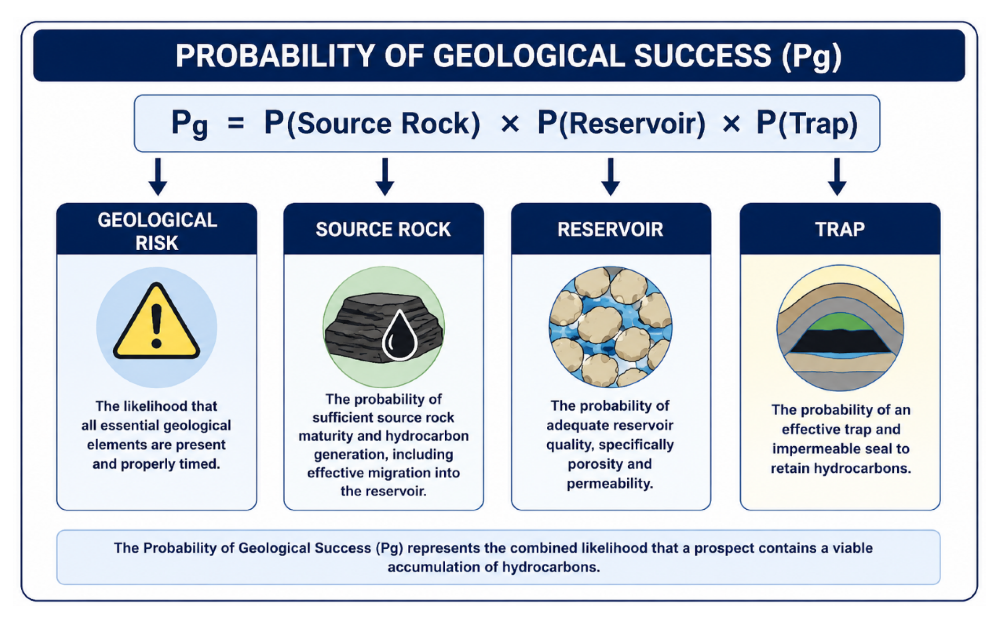

Figure 28 Simplified Geological Chance of Success (Pg) Assessment Showing the Three Fundamental Exploration Risk Elements: Source Rock, Reservoir, and Trap.

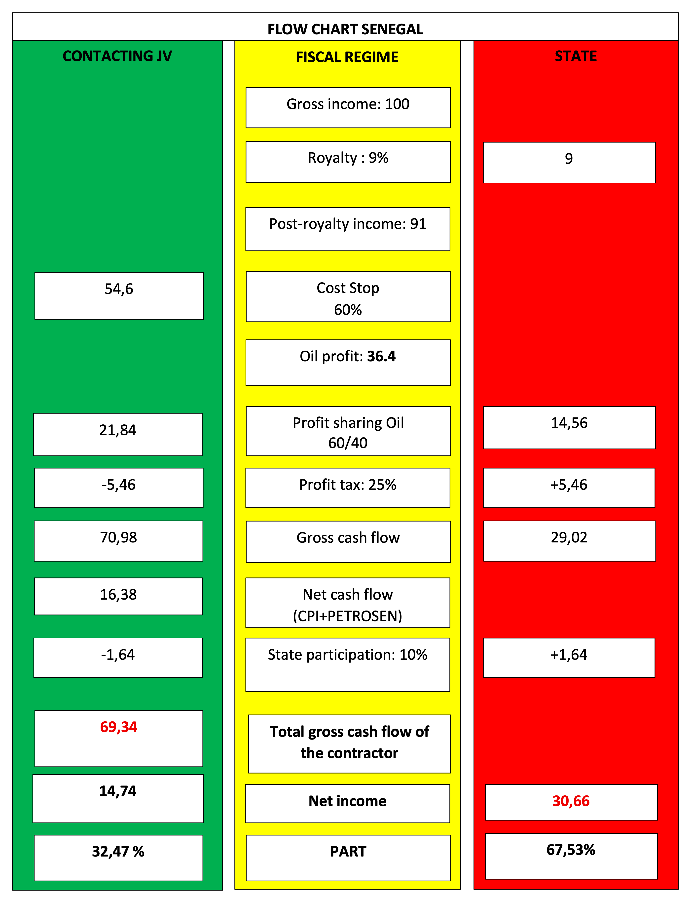

Figure 29 Example Geological Chance of Success (CoS) Assessment Workflow Showing the Evaluation and Integration of Key Petroleum System Risk Elements.

**Economic Evaluation**

Technical success alone does not guarantee commercial success.

A prospect must also demonstrate economic viability.

Key factors include:

**Expected Resource Size**

Larger prospects generally offer greater economic potential.

**Water Depth**

Offshore developments become increasingly expensive with increasing water depth.

**Reservoir Quality**

Poor reservoir quality can negatively affect production rates and recovery factors.

**Hydrocarbon Type**

Economics vary significantly between:

- Oil;
- Dry gas;
- Wet gas;
- Condensate.

**Distance from Infrastructure**

Prospects located near existing infrastructure may be commercially attractive even when relatively small.

**Economic Screening Metrics**

Common evaluation metrics include:

**Net Present Value (NPV)**

Represents the discounted value of future cash flows.

**Internal Rate of Return (IRR)**

Represents the expected rate of return on investment.

**Payback Period**

Represents the time required to recover capital expenditure.

**Breakeven Price**

Represents the commodity price required to achieve commercial viability.

**Exploration Portfolio Management**

Petroleum companies rarely evaluate prospects individually.

Instead, they construct exploration portfolios containing multiple prospects with varying:

- Risk profiles;
- Resource sizes;
- Geological settings.

The objective is to balance:

- High-risk/high-reward opportunities;
- Lower-risk opportunities;
- Geographic diversity;
- Play diversity.

Portfolio management improves the probability of achieving commercial discoveries.

**Independent Technical Reviews**

Before drilling approval, many operators undertake independent peer reviews.

These reviews assess:

- Geological interpretation;
- Resource estimates;
- Risk assessments;
- Economic evaluations.

Independent reviews help identify weaknesses and improve decision quality.

**Government Responsibilities During Prospect Evaluation**

Governments and regulators should ensure that operators:

- Meet licence obligations;
- Follow accepted technical standards;
- Report results accurately;
- Protect confidential data;
- Comply with environmental requirements.

Regulators should also possess sufficient expertise to independently evaluate prospect assessments and drilling proposals.

**Common Causes of Exploration Failure**

Despite extensive evaluation, many exploration wells fail to discover commercial hydrocarbons.

Common causes include:

**Trap Failure**

The trap does not provide sufficient closure.

**Reservoir Failure**

Reservoir quality is poorer than predicted.

**Seal Failure**

Hydrocarbons have leaked from the accumulation.

**Charge Failure**

Insufficient hydrocarbons were generated or migrated into the trap.

**Timing Failure**

Trap formation and hydrocarbon migration occurred at different times.

These risks explain why exploration remains one of the highest-risk activities in the petroleum industry.

**Strategic Importance of Prospect Evaluation**

Prospect evaluation serves as the critical link between geological interpretation and drilling investment.

The quality of prospect evaluation directly influences:

- Exploration success rates;
- Capital efficiency;
- Investor confidence;
- Resource discovery rates.

Rigorous technical evaluation therefore remains essential for responsible petroleum resource development.

### 6.2.3- Exploration Drilling

Following completion of prospect evaluation and approval of the exploration investment decision, an exploration well is drilled to test the geological model and determine whether hydrocarbons are present.

Exploration drilling represents one of the most expensive, technically complex, and highest-risk activities in the petroleum industry.

An exploration well may cost:

- Several million US dollars onshore;
- Tens of millions of US dollars offshore;
- More than USD 100 million in ultra-deepwater environments.

Despite these expenditures, many exploration wells do not result in commercial discoveries.

For this reason, exploration drilling must be planned and executed with exceptional technical rigour.

**Objectives of Exploration Drilling**

The principal objectives are to:

- Confirm the presence of hydrocarbons;
- Evaluate reservoir quality;
- Validate geological interpretations;
- Assess hydrocarbon volumes;
- Reduce subsurface uncertainty;
- Support future appraisal decisions.

The exploration well provides the first direct evidence of subsurface conditions.

**Exploration Well Planning**

Before drilling begins, a detailed well planning process is undertaken.

This involves the integration of:

- Geology;
- Geophysics;
- Drilling engineering;
- Reservoir engineering;
- HSE management;
- Operations planning.

The objective is to design a well that can safely and efficiently test the prospect.

**Well Location Selection**

The proposed well location is selected based on:

- Structural interpretation;
- Reservoir distribution;
- Hydrocarbon indicators;
- Risk assessment;
- Operational constraints.

The well is normally positioned to maximise the probability of intersecting the target reservoir and hydrocarbon accumulation.

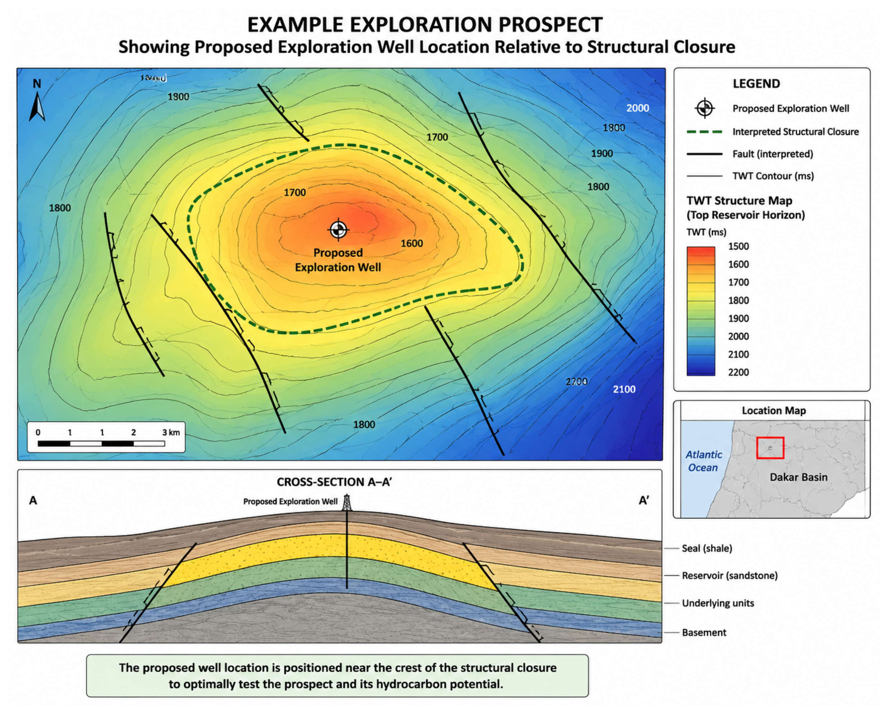

Figure 30 Example Exploration Prospect Showing the Proposed Exploration Well Location Relative to the Interpreted Structural Closure and Top Reservoir Structure.

**Well Design**

The well design defines the technical architecture of the well.

Elements typically include:

**Surface Hole Section**

Designed to:

- Establish well control;
- Protect shallow formations;
- Support subsequent casing strings.

**Intermediate Hole Sections**

Designed to:

- Isolate unstable formations;
- Manage pore pressure variations;
- Improve drilling safety.

**Reservoir Section**

Designed to:

- Penetrate the target reservoir;
- Acquire geological data;
- Evaluate hydrocarbon potential.

**Casing Programme**

The casing programme establishes the number and depth of casing strings required.

Typical casing strings include:

- Conductor casing;
- Surface casing;
- Intermediate casing;
- Production casing or liner.

The design must ensure:

- Well integrity;
- Pressure containment;
- Safe drilling operations.

**Mud Programme**

Drilling fluid selection is critical.

The drilling fluid must:

- Control formation pressures;
- Stabilise the wellbore;
- Transport cuttings to surface;
- Cool and lubricate the drill bit;
- Protect reservoir quality.

Common drilling fluid systems include:

- Water-Based Mud (WBM);
- Oil-Based Mud (OBM);
- Synthetic-Based Mud (SBM).

The choice depends on:

- Geological conditions;
- Environmental requirements;
- Reservoir characteristics.

**Exploration Drilling Rig Selection**

The type of drilling rig selected depends on:

- Water depth;
- Environmental conditions;
- Well complexity;
- Operational objectives.

**Land Rig**

Used for onshore operations.

**Jack-up Rig**

Typically used in shallow-water environments.

**Semi-submersible Rig**

Commonly used in deepwater drilling programmes.

**Drillship**

Typically utilised in ultra-deepwater exploration campaigns.

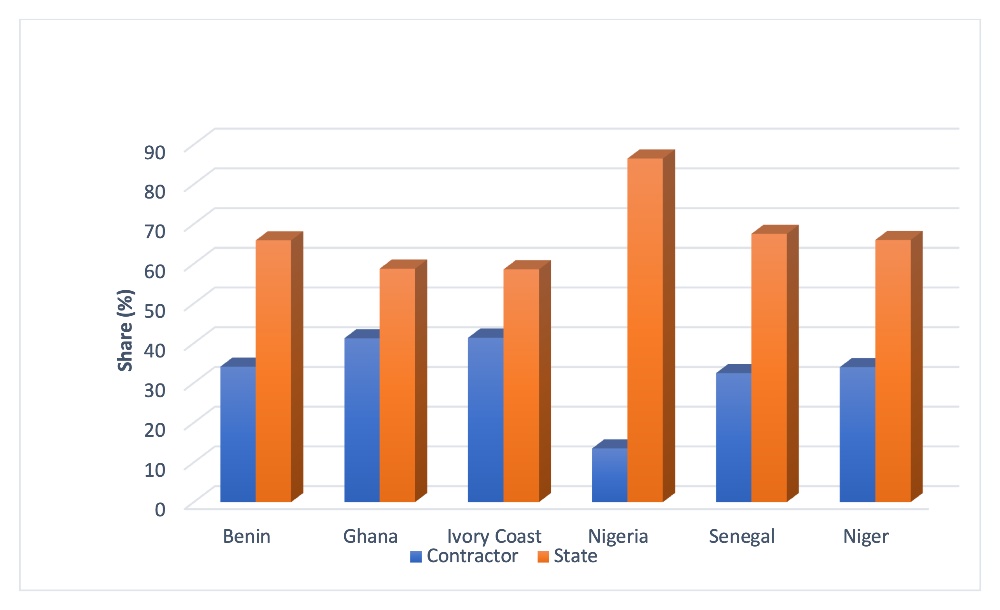

Figure 31 Typical Offshore Drilling Units Used During Exploration Activities, Including Drilling Barges, Jack-Up Rigs, Semi-Submersible Rigs, and Drillships, and Their Relative Water Depth Operating Ranges.

**Data Acquisition While Drilling**

One of the principal objectives of an exploration well is the acquisition of geological and reservoir data.

Several techniques are employed.

**Mud Logging**

Mud logging provides real-time information regarding:

- Lithology;
- Hydrocarbon shows;
- Gas composition;
- Drilling parameters.

Mud logging personnel continuously monitor drilling operations and identify potential hydrocarbon-bearing intervals.

**Wireline Logging**

Wireline logging tools are deployed within the wellbore to measure formation properties.

Common logging measurements include:

**Gamma Ray**

Used to distinguish between:

- Shales;
- Sandstones;
- Carbonates.

**Resistivity**

Used to evaluate:

- Fluid saturation;
- Hydrocarbon presence.

**Density**

Used to estimate:

- Porosity;
- Lithology.

**Neutron Porosity**

Used to estimate:

- Formation porosity.

**Sonic Log**

Used to evaluate:

- Formation properties;
- Seismic calibration.

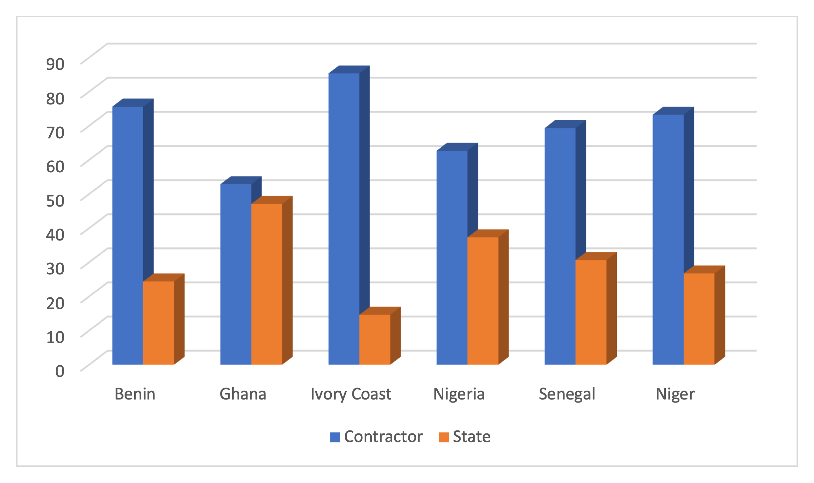

Figure 32 Example Wireline Logging Suite Used for Reservoir Evaluation, Illustrating the Integration of Gamma Ray, Resistivity, Density, Neutron, Sonic, and Photoelectric Logs for Lithology, Porosity, Fluid Saturation, and Reservoir Quality Assessment.

**Formation Pressure Testing**

Formation pressure testing tools are used to:

- Measure reservoir pressure;
- Determine fluid gradients;
- Obtain fluid samples.

These measurements assist in determining:

- Fluid type;
- Reservoir connectivity;
- Hydrocarbon contacts.

**Coring Operations**

Core samples provide direct measurements of reservoir properties.

Core analysis may be used to determine:

- Porosity;
- Permeability;
- Fluid saturation;
- Rock mechanics properties.

Core data are often considered the most reliable reservoir dataset.

**Discovery Assessment**

Once drilling has reached total depth and all data have been acquired, the results are evaluated.

Possible outcomes include:

**Dry Hole**

No commercial hydrocarbons are encountered.

**Hydrocarbon Discovery**

Hydrocarbons are encountered, but commercial viability remains uncertain.

**Commercial Discovery**

Hydrocarbons are encountered in sufficient quantities to justify further appraisal and development activities.

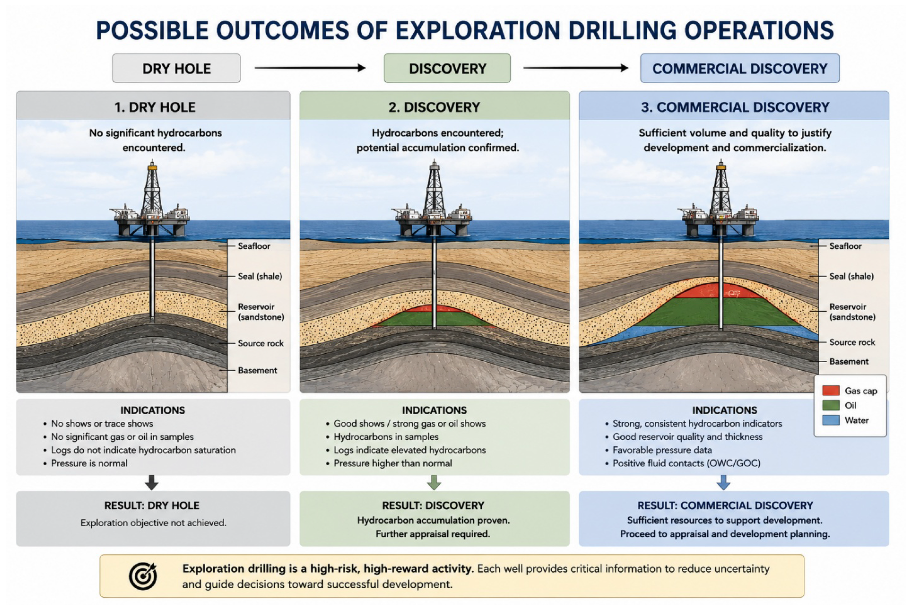

Figure 33 Possible Outcomes of Exploration Drilling Operations, Ranging from a Dry Hole to a Hydrocarbon Discovery and Ultimately a Commercial Discovery Suitable for Field Development.

**Exploration Well Testing**

Where hydrocarbons are encountered, a Drill Stem Test (DST) or production test may be conducted.

The objectives include:

- Measuring flow rates;
- Evaluating reservoir productivity;
- Obtaining fluid samples;
- Determining commercial potential.

Well testing provides critical information for subsequent appraisal activities.

**Government Responsibilities During Exploration Drilling**

Governments and regulators play an important oversight role.

Responsibilities include:

**Regulatory Approval**

Approval of:

- Well programmes;
- Environmental permits;
- Safety cases;
- Well abandonment plans.

**Operational Oversight**

Monitoring:

- Licence compliance;
- HSE performance;
- Data acquisition activities;
- Reporting obligations.

**Resource Protection**

Ensuring:

- Efficient resource evaluation;
- Prevention of waste;
- Protection of national interests.

**Environmental and Safety Considerations**

Exploration drilling involves significant operational risks.

Potential hazards include:

- Blowouts;
- Well control incidents;
- Hydrocarbon releases;
- Environmental contamination;
- Marine pollution.

Operators must implement robust:

- Well control procedures;
- Emergency response plans;
- Environmental management systems.

The lessons learned from major incidents such as the Deepwater Horizon Oil Spill continue to influence exploration drilling standards worldwide.

**Exploration Drilling Success Rates**

Exploration success rates vary significantly depending on basin maturity.

Typical industry averages include:

<table>
<caption>
Table 10 Exploration Drilling Success Rates
</caption>
<thead>
<tr>
  <th>
<strong>Basin Type</strong>
</th>
  <th>
<strong>Success Rate</strong>
</th>
</tr>
</thead>
<tbody>
<tr>
  <td>
Frontier Basin
</td>
  <td>
10–25%
</td>
</tr>
<tr>
  <td>
Emerging Basin
</td>
  <td>
20–40%
</td>
</tr>
<tr>
  <td>
Mature Basin
</td>
  <td>
30–60%
</td>
</tr>
</tbody>
</table>

These figures illustrate the inherently high-risk nature of exploration activities.

**Strategic Importance of Exploration Drilling**

Exploration drilling transforms geological concepts into verifiable discoveries.

It represents the critical step that converts:

- Leads into prospects;
- Prospects into discoveries;
- Discoveries into future developments.

Without exploration drilling, petroleum resources cannot be confirmed or developed.

Consequently, exploration drilling remains one of the most important activities in the upstream petroleum sector.

**2.2.4 Discovery Evaluation and Appraisal**

The discovery of hydrocarbons marks a major milestone in the exploration process. However, a discovery alone does not confirm commercial viability.

Following a discovery, operators undertake appraisal activities to determine:

- Reservoir extent;
- Reservoir quality;
- Hydrocarbon volumes;
- Reservoir continuity;
- Production potential;
- Commercial viability.

The appraisal phase serves as the bridge between exploration and field development.

Its primary objective is to reduce uncertainty sufficiently to support a final investment decision.

**Definition of Appraisal**

Appraisal refers to the process of acquiring additional geological, geophysical, reservoir, and production data following a discovery.

The purpose is to determine whether the accumulation can be developed commercially.

Appraisal activities typically include:

- Appraisal drilling;
- Well testing;
- Reservoir studies;
- Seismic reinterpretation;
- Static modelling;
- Dynamic modelling;
- Economic evaluation.

The extent of the appraisal programme depends upon:

- Reservoir complexity;
- Resource size;
- Geological uncertainty;
- Development concept.

**Objectives of Appraisal**

The principal objectives include:

**Delineation of Reservoir Extent**

Operators seek to determine:

- Reservoir boundaries;
- Hydrocarbon contacts;
- Structural limits;
- Fault compartmentalisation.

This information is essential for estimating recoverable resources.

**Reservoir Characterisation**

Reservoir quality must be evaluated in detail.

Key parameters include:

- Porosity;
- Permeability;
- Net pay thickness;
- Fluid saturation;
- Pressure behaviour.

These properties directly influence field performance and recovery potential.

**Fluid Characterisation**

Fluid sampling and laboratory analysis are conducted to determine:

- Oil properties;
- Gas composition;
- Condensate yield;
- Fluid phase behaviour.

Fluid characteristics strongly influence development planning and facilities design.

**Reduction of Resource Uncertainty**

Resource estimates generated immediately following discovery are often associated with considerable uncertainty.

Appraisal activities aim to improve confidence in:

- Resource volumes;
- Reservoir continuity;
- Recovery factors;
- Production forecasts.

**Appraisal Drilling**

Appraisal wells are drilled to obtain additional information regarding the accumulation.

These wells may:

- Confirm reservoir continuity;
- Establish reservoir limits;
- Test different reservoir compartments;
- Acquire additional cores and logs.

The number of appraisal wells depends upon:

- Reservoir complexity;
- Geological uncertainty;
- Commercial significance.

Some simple fields may require only one or two appraisal wells, whereas complex offshore developments may require extensive appraisal campaigns.

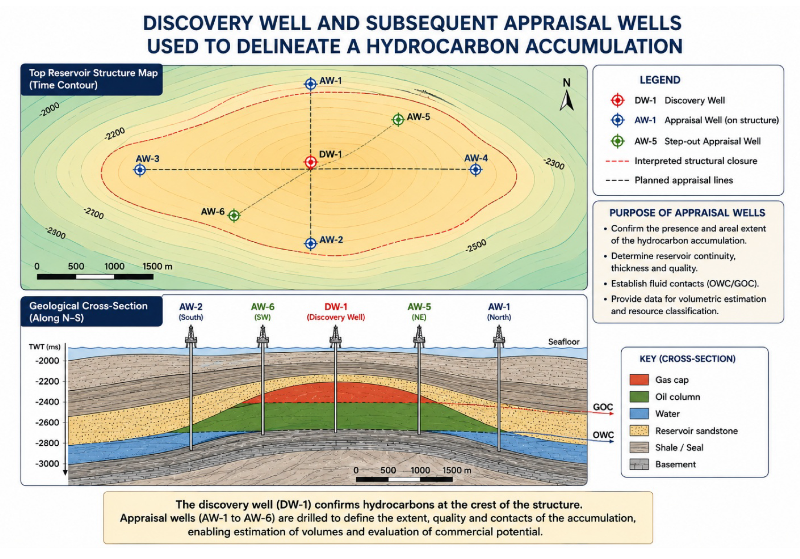

Figure 34 Discovery Well and Subsequent Appraisal Wells Used to Delineate the Extent, Geometry, Reservoir Quality, Fluid Contacts, and Commercial Potential of a Hydrocarbon Accumulation.

**Well Testing During Appraisal**

Well testing provides critical dynamic information that cannot be obtained from static data alone.

The objectives of appraisal well testing include:

**Productivity Assessment**

Determining the ability of the reservoir to produce hydrocarbons.

**Pressure Behaviour Analysis**

Evaluating:

- Reservoir size;
- Reservoir connectivity;
- Flow characteristics.

**Fluid Sampling**

Obtaining representative reservoir fluid samples for laboratory analysis.

**Reservoir Continuity Assessment**

Identifying barriers and compartments that may influence field development.

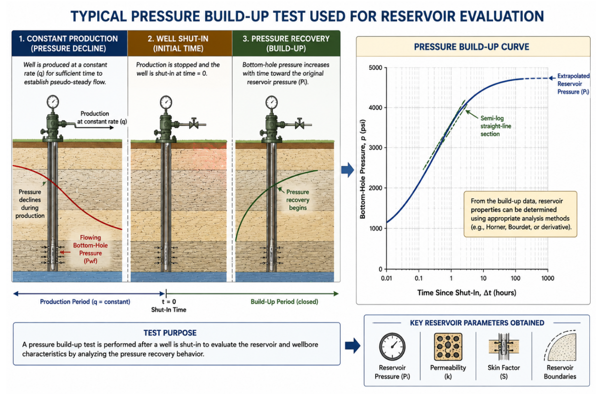

Figure 35 Typical Pressure Build-Up Test Showing Pressure Recovery Following Well Shut-In and the Determination of Reservoir Pressure, Permeability, Skin Factor, and Reservoir Boundaries.

**Reservoir Studies**

Appraisal data are integrated into detailed reservoir studies.

These studies form the basis of future development planning.

**Static Reservoir Modelling**

Static models describe:

- Reservoir geometry;
- Geological architecture;
- Petrophysical properties.

The model integrates:

- Well data;
- Seismic interpretation;
- Core analysis;
- Geological understanding.

**Dynamic Reservoir Modelling**

Dynamic models simulate fluid flow through the reservoir.

These models are used to forecast:

- Production rates;
- Pressure decline;
- Recovery factors;
- Development performance.

Dynamic modelling is one of the most important tools used during field development planning.

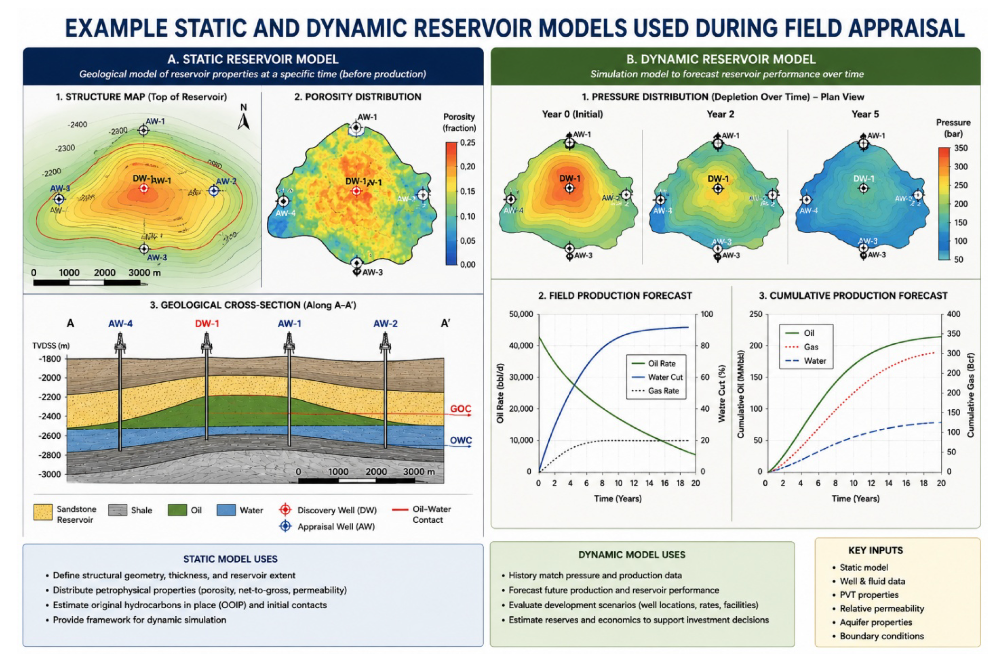

Figure 36 Example Static and Dynamic Reservoir Models Used During Field Appraisal to Characterise Reservoir Geometry, Petrophysical Properties, Fluid Distribution, and Forecast Future Reservoir Performance.

**Resource Classification**

As confidence increases, discovered hydrocarbons are progressively reclassified.

Industry classification systems commonly follow the framework developed by the:

Society of Petroleum Engineers

and the Petroleum Resources Management System (PRMS).

Resources may be classified as:

**Contingent Resources**

Discovered hydrocarbons that are not yet considered commercially recoverable due to technical, commercial, or regulatory uncertainties.

**Reserves**

Discovered hydrocarbons considered commercially recoverable under defined economic conditions.

Reserves are generally categorised as:

- Proved (1P)
- Proved plus Probable (2P)
- Proved plus Probable plus Possible (3P)

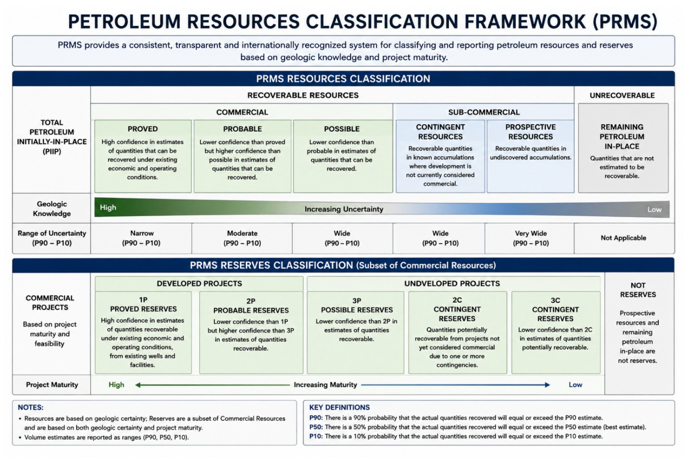

Figure 37 Petroleum Resources Management System (PRMS) Classification Framework Showing the Relationship Between Reserves, Contingent Resources, and Prospective Resources According to Project Maturity and Geological Certainty.

**Commercial Evaluation**

Technical success alone is insufficient.

Operators must demonstrate that the discovery is commercially viable.

Key considerations include:

**Resource Size**

Larger accumulations generally offer greater economic potential.

**Reservoir Productivity**

Production rates significantly influence project economics.

**Development Costs**

Development concepts must be technically and economically feasible.

**Commodity Prices**

Project economics are highly sensitive to oil and gas prices.

**Fiscal Terms**

Government take can significantly influence project viability.

**Economic Screening**

Economic assessments typically evaluate:

**Net Present Value (NPV)**

Represents the discounted value of future project cash flows.

**Internal Rate of Return (IRR)**

Represents the project's expected rate of return.

**Breakeven Price**

Represents the minimum commodity price required for commercial viability.

**Payback Period**

Represents the period required to recover capital investment.

Only projects meeting investment criteria generally proceed to development planning.

**Declaration of Commerciality**

Following completion of appraisal activities, the operator may submit a Declaration of Commerciality to the government.

This declaration confirms that:

- Commercial hydrocarbons have been discovered;
- Technical viability has been demonstrated;
- Economic viability has been established;
- Development planning can commence.

The declaration often triggers contractual obligations relating to:

- Development planning;
- Government approvals;
- Field Development Plans (FDPs);
- State participation rights.

**Government Responsibilities During Appraisal**

Governments and regulators have important oversight responsibilities during the appraisal phase.

These include:

**Monitoring Licence Compliance**

Ensuring that operators fulfil contractual obligations.

**Reviewing Appraisal Programmes**

Assessing proposed:

- Appraisal wells;
- Well tests;
- Reservoir studies.

**Resource Verification**

Confirming:

- Resource estimates;
- Reserve evaluations;
- Commerciality assessments.

**Data Management**

Ensuring that all acquired data are properly reported and preserved.

**Protection of National Interests**

Verifying that future development plans maximise value for the State.

**West African Examples**

Numerous major West African developments progressed through extensive appraisal programmes before development approval.

Examples include:

**Jubilee Field (Ghana)**

The Jubilee discovery underwent detailed appraisal to confirm reservoir continuity, reserves, and production potential before development.

**Sangomar Field (Senegal)**

Extensive appraisal activities reduced uncertainty and supported Senegal's first offshore oil development.

**GTA LNG Project (Mauritania-Senegal)**

Appraisal programmes confirmed the scale of gas resources and supported one of Africa's most significant gas developments.

**Agbami Field (Nigeria)**

Appraisal drilling played a critical role in confirming the commercial viability of this deepwater development.

Figure 38 and Figure 39 illustrate the importance of preserving geological samples and subsurface data acquired during petroleum exploration and development activities. The photographs were taken in the core library of Côte d’Ivoire at the Direction of the PETROCI Analysis and Research Center, where drill core samples are systematically archived, catalogued, and maintained for long-term access.

Such facilities play a critical role in safeguarding valuable geological information that can be re-examined as new exploration concepts, analytical techniques, and technologies emerge. Core samples provide direct evidence of lithology, sedimentary structures, reservoir quality, diagenetic processes, and hydrocarbon occurrences, making them an essential complement to seismic, well log, and production data. National core repositories therefore represent strategic assets that support ongoing exploration, field appraisal, academic research, and future resource development while ensuring that subsurface information remains accessible to industry, government, and research institutions.

Figure 38 Geological Core Storage Facility Used for the Preservation, Cataloguing, and Long-Term Management of Subsurface Data to Support Exploration, Appraisal, and Future Resource Development Activities.

Figure 39 Preserved Drill Core Samples Stored in a Geological Repository, Providing Direct Evidence of Lithology, Sedimentary Structures, Reservoir Quality, and Hydrocarbon Occurrence for Exploration and Development Studies.

**Transition to Development**

The ultimate objective of appraisal is to provide sufficient confidence to support a development decision.

At the conclusion of appraisal, decision-makers generally face one of three outcomes:

**Commercial Development**

Proceed to field development planning.

**Additional Appraisal Required**

Acquire further data to reduce uncertainty.

**Abandonment**

Terminate the project if commercial viability cannot be demonstrated.

The decision reached at this stage determines whether the discovery progresses to the development phase.

## 6.3- Development Phase

### 6.3.1- Field Development Planning and Approval

Once a hydrocarbon discovery has been declared commercial, the project enters the development phase.

The objective of this phase is to design, construct, install, commission, and operate the facilities necessary to safely and economically produce hydrocarbons.

The development phase is generally the most capital-intensive stage of the petroleum lifecycle and often requires investments ranging from hundreds of millions to several billions of US dollars.

Consequently, extensive technical, economic, environmental, and regulatory studies are required before development activities can commence.

**Definition of Field Development**

Field development refers to the process of transforming a discovered hydrocarbon accumulation into a producing asset.

This process involves:

- Reservoir development planning;
- Well design;
- Production system design;
- Facilities engineering;
- Infrastructure development;
- Economic evaluation;
- Government approvals.

The ultimate objective is to maximise economic recovery while ensuring safe and environmentally responsible operations.

**Field Development Plan (FDP)**

The Field Development Plan (FDP) is the principal document submitted to the government for approval following a commercial discovery.

In some jurisdictions the document may also be referred to as a:

- Plan of Development (POD);
- Development and Production Plan;
- Plan of Development and Operations (PDO).

For consistency throughout this translation, the preferred term will be:

**Field Development Plan (FDP)**

except where the source text specifically refers to a PDO or POD under a particular regulatory system.

**Objectives of the FDP**

The FDP provides a comprehensive description of how the operator intends to develop the field.

The plan should demonstrate:

- Technical viability;
- Commercial viability;
- Environmental compliance;
- Resource optimisation;
- Economic benefits to the State.

The FDP forms the basis for government approval of the development project.

**Components of an FDP**

A typical Field Development Plan includes the following elements.

**Reservoir Description**

The operator must provide a detailed description of the reservoir, including:

- Geological model;
- Reservoir model;
- Hydrocarbon volumes;
- Fluid properties;
- Reservoir uncertainty.

This section establishes the technical basis for development planning.

**Reserves Assessment**

The FDP should include:

- Proved Reserves (1P);
- Proved plus Probable Reserves (2P);
- Proved plus Probable plus Possible Reserves (3P).

Reserve estimates should be supported by:

- Geological data;
- Reservoir studies;
- Production forecasts;
- Economic analysis.

All reserve estimates must comply with recognised industry standards.

**Development Concept Selection**

Operators typically evaluate multiple development concepts before selecting a preferred option.

Examples include:

**Onshore Development**

May include:

- Production wells;
- Flowlines;
- Gathering systems;
- Processing facilities.

**Fixed Offshore Platforms**

Commonly used in shallow-water developments.

**Floating Production Storage and Offloading Facilities (FPSOs)**

Frequently used in deepwater developments.

**Subsea Tie-Back Developments**

Used where existing infrastructure is available nearby.

Figure 40 illustrates a range of development concepts commonly used in hydrocarbon field developments, selected according to reservoir characteristics, water depth, production requirements, economics and project objectives. The examples range from conventional onshore wells and fixed offshore platforms to floating production systems (FPSOs), subsea tie-backs, subsea processing facilities and converted Mobile Offshore Production Units (MOPUs). Each concept offers distinct advantages in terms of cost, technical complexity, production capacity and field location, highlighting the importance of selecting the most appropriate development solution to maximise project value and hydrocarbon recovery.

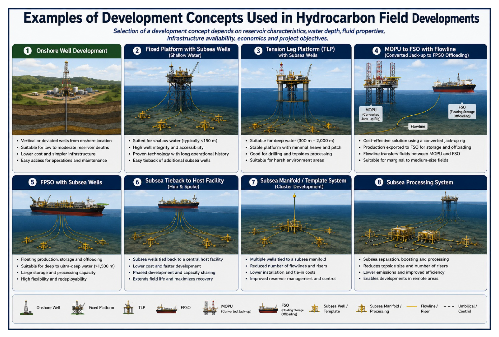

Figure 40 Examples of Development Concepts for Oil & Gas Developments

**Production Well Programme**

The FDP should define:

- Number of production wells;
- Number of injection wells;
- Well locations;
- Drilling sequence;
- Completion designs.

Well planning should be based upon reservoir management objectives.

**Production Forecasts**

Operators must provide forecasts for:

- Oil production;
- Gas production;
- Water production;
- Condensate production.

Forecasts typically include:

- Plateau production rates;
- Decline profiles;
- Ultimate recovery estimates.

These forecasts form the basis of economic evaluations.

### 6.3.2- Reservoir Management Strategy

A robust reservoir management strategy is essential to maximise hydrocarbon recovery.

Key considerations include:

**Pressure Maintenance**

Pressure support may be required through:

- Water injection;
- Gas injection;
- Produced water reinjection.

**Recovery Optimisation**

The objective is to maximise the recovery factor.

Strategies may include:

- Infill drilling;
- Enhanced Oil Recovery (EOR);
- Artificial lift systems;
- Production optimisation.

**Reservoir Surveillance**

Continuous monitoring may involve:

- Pressure surveys;
- Production logging;
- Well testing;
- 4D seismic monitoring.

Reservoir surveillance enables operators to optimise field performance throughout the life of the asset.

Figure 41 shows the typical workflow used to evaluate hydrocarbon reservoirs and develop field development strategies, progressing from data acquisition and interpretation through reservoir modelling, recovery option assessment, production forecasting, and economic evaluation to support investment and development decisions.

Figure 42 shows a 3D reservoir model integrating geological structure, petrophysical properties, fluid contacts, and well data to support volumetric estimation, reservoir simulation, well placement, production forecasting, and field development optimisation.

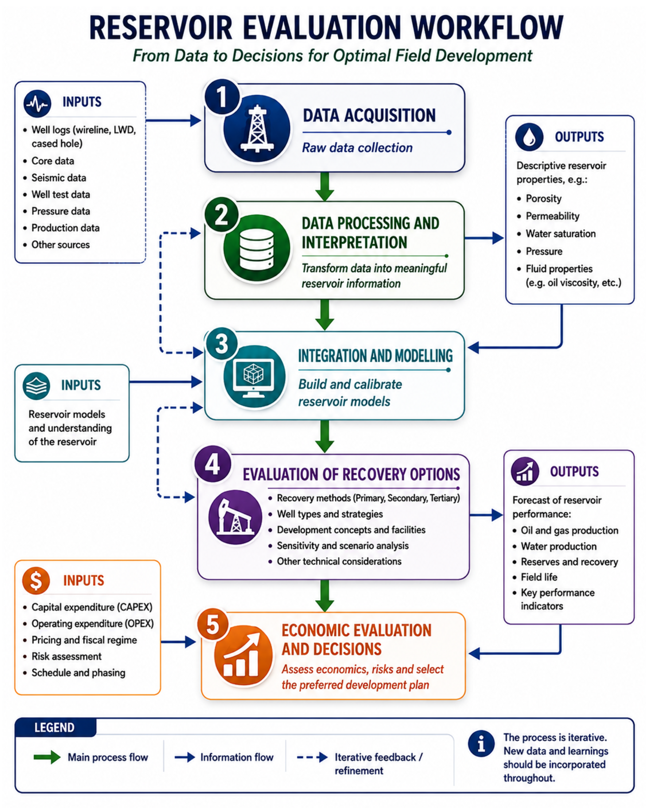

Figure 41 Reservoir Evaluation and Field Development Planning Workflow.

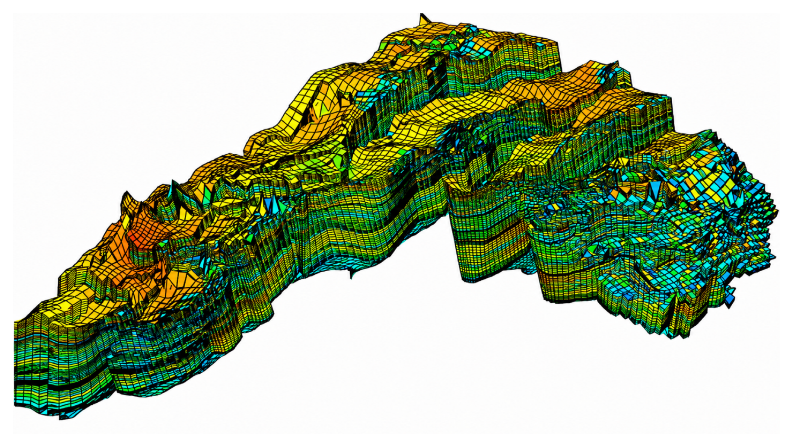

Figure 42 Example of a Three-Dimensional Reservoir Model Used for Field Development Planning.

**Facilities Engineering**

Development projects require extensive surface and subsurface infrastructure.

Typical facilities include:

**Production Facilities**

Used for:

- Separation;
- Processing;
- Metering;
- Export.

**Export Infrastructure**

May include:

- Pipelines;
- Export terminals;
- Offshore loading systems;
- LNG facilities.

**Utilities and Support Systems**

Including:

- Power generation;
- Water treatment;
- Communications systems;
- Safety systems.

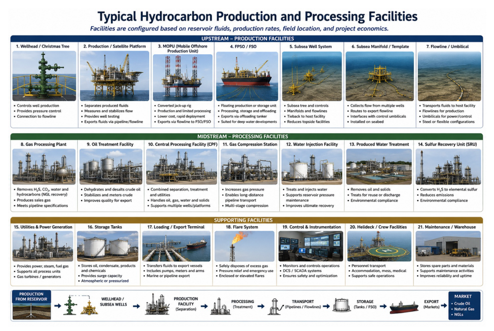

Figure 43 Typical Hydrocarbon Production and Processing Facilities.

**Economic Evaluation**

The development phase requires extensive economic analysis.

Key inputs include:

**Capital Expenditure (CAPEX)**

Including:

- Drilling;
- Facilities;
- Infrastructure;
- Installation costs.

**Operating Expenditure (OPEX)**

Including:

- Personnel;
- Maintenance;
- Logistics;
- Energy consumption.

**Fiscal Terms**

Including:

- Royalties;
- Cost recovery;
- Profit sharing;
- Corporate taxation.

**Commodity Price Assumptions**

Project economics are highly sensitive to oil and gas prices.

**Investment Decision**

Following completion of technical and economic studies, the operator may seek approval for a:

**Final Investment Decision (FID)**

FID represents the formal commitment to proceed with development.

The decision is generally based on:

- Economic returns;
- Technical feasibility;
- Regulatory approvals;
- Commercial agreements.

Without FID, development activities generally do not proceed.

**Government Review and Approval**

Governments play a critical role in evaluating proposed developments.

Regulatory review typically focuses on:

**Resource Management**

Ensuring efficient recovery of petroleum resources.

**Economic Returns**

Ensuring that development delivers appropriate benefits to the State.

**Environmental Compliance**

Reviewing environmental and social impact assessments.

**Health and Safety**

Ensuring compliance with recognised industry standards.

**Local Content**

Evaluating commitments relating to:

- Employment;
- Procurement;
- Training;
- Technology transfer.

**Environmental and Social Impact Assessment (ESIA)**

Most jurisdictions require a comprehensive ESIA before development approval.

The assessment typically examines:

- Environmental impacts;
- Community impacts;
- Biodiversity impacts;
- Marine impacts;
- Greenhouse gas emissions.

Mitigation measures must be identified before project approval.

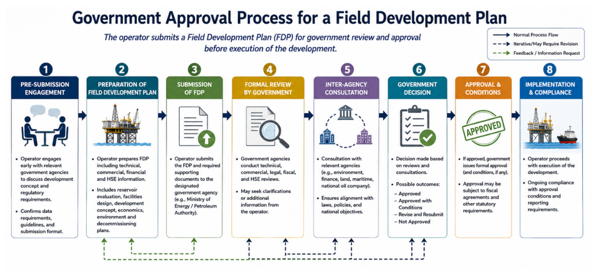

Figure 44 Government Approval Process for a Field Development Plan. Typical sequence of regulatory reviews, consultations, and approvals required before a hydrocarbon field development can proceed to implementation and production.

**Government Responsibilities During Development**

Governments should ensure that:

- Development plans maximise resource recovery;
- National interests are protected;
- Environmental standards are maintained;
- Local content obligations are fulfilled;
- Petroleum revenues are optimised.

Strong regulatory oversight during this phase can significantly increase the long-term benefits generated from petroleum resources.

**West African Examples**

Several major West African developments progressed through extensive FDP review and approval processes.

Examples include:

**Jubilee Field (Ghana)**

Development utilised an FPSO-based concept supported by subsea production systems.

**TEN Project (Ghana)**

Development planning focused on efficient deepwater production and reservoir management.

**Sangomar Field (Senegal)**

Senegal's first offshore oil development required comprehensive appraisal, FDP preparation, and government approval.

**GTA LNG Project (Mauritania-Senegal)**

The development concept incorporated offshore gas production, subsea infrastructure, and LNG export facilities.

**Egina Field (Nigeria)**

One of the largest deepwater developments in Africa, requiring extensive engineering, procurement, and construction activities.

**Strategic Importance of the Development Phase**

The development phase converts discovered resources into productive assets capable of generating:

- Government revenues;
- Employment;
- Energy supplies;
- Economic growth.

The quality of planning undertaken during this phase has a direct influence on:

- Recovery factors;
- Project profitability;
- Environmental performance;
- Long-term field value.

For this reason, development planning represents one of the most important responsibilities shared between operators and governments.

### 6.3.3- Development Drilling and Field Construction

Following approval of the Field Development Plan (FDP) and Final Investment Decision (FID), the project enters the execution phase.

This phase involves:

- Development drilling;
- Well completions;
- Facilities construction;
- Installation of production infrastructure;
- Commissioning activities.

Development drilling and field construction typically represent the largest expenditure within the petroleum project lifecycle.

The successful execution of these activities is essential for achieving production objectives, maximising hydrocarbon recovery, and generating economic returns.

**Development Drilling**

Development drilling involves the drilling of wells required to produce hydrocarbons and manage reservoir performance throughout the life of the field.

Unlike exploration wells, development wells are drilled into reservoirs that have already been discovered and appraised.

Consequently, geological uncertainty is generally lower.

**Objectives of Development Drilling**

Development drilling seeks to:

- Access hydrocarbon reserves;
- Maximise reservoir drainage;
- Optimise recovery factors;
- Support pressure maintenance programmes;
- Improve long-term field performance.

The development drilling programme is designed based on:

- Reservoir models;
- Production forecasts;
- Reservoir management strategies;
- Economic considerations.

**Types of Development Wells**

Several categories of wells may be included within a field development programme.

**Production Wells**

Production wells are drilled to produce hydrocarbons from the reservoir.

Their design depends on:

- Reservoir characteristics;
- Production objectives;
- Completion strategy.

**Water Injection Wells**

Water injection wells are used to:

- Maintain reservoir pressure;
- Improve sweep efficiency;
- Increase hydrocarbon recovery.

Waterflooding is one of the most common secondary recovery techniques used worldwide.

**Gas Injection Wells**

Gas injection wells may be used for:

- Pressure support;
- Gas recycling;
- Enhanced Oil Recovery (EOR).

Gas injection is particularly common in gas-condensate and deepwater developments.

**Disposal Wells**

Disposal wells are used to inject:

- Produced water;
- Waste fluids;
- Other approved disposal streams.

These wells assist with environmental management and field operations.

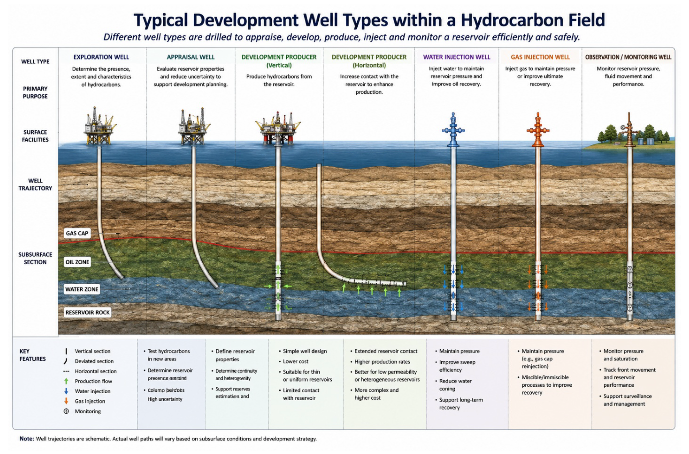

Figure 45 Common well types used to produce, inject, and monitor fluids within a hydrocarbon reservoir.

**Well Placement Optimisation**

Well placement is one of the most important aspects of field development.

The objective is to maximise contact with the reservoir while avoiding:

- Early water breakthrough;
- Gas coning;
- Reservoir bypass;
- Production interference.

Modern well placement relies heavily on:

- Reservoir simulation;
- Geosteering;
- Real-time drilling data.

**Horizontal Wells**

Many developments utilise horizontal wells to improve reservoir contact.

Advantages include:

- Higher production rates;
- Improved reservoir drainage;
- Delayed water breakthrough;
- Enhanced recovery.

Horizontal wells are particularly effective in:

- Thin reservoirs;
- Tight reservoirs;
- Heterogeneous reservoirs.

**Multilateral Wells**

Multilateral wells contain multiple wellbores branching from a single parent well.

Benefits include:

- Reduced drilling costs;
- Increased reservoir exposure;
- Lower surface footprint;
- Improved field economics.

Multilateral technology is increasingly used in mature and complex fields.

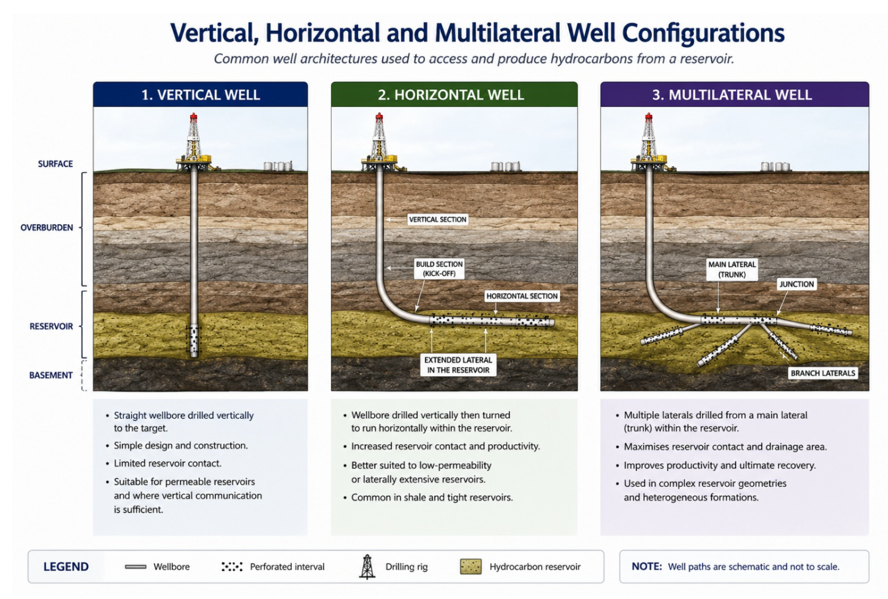

Figure 46 Comparison of common well configurations used in hydrocarbon developments, illustrating how increased reservoir contact can improve production performance and hydrocarbon recovery.

**Well Completions**

Once drilling is complete, the well must be equipped to safely produce hydrocarbons.

This process is known as well completion.

The completion design significantly influences:

- Production performance;
- Well integrity;
- Operating costs;
- Recovery efficiency.

**Open-Hole Completions**

In certain reservoirs, production occurs directly from an uncased section of the wellbore.

Advantages include:

- Simplicity;
- Lower costs;
- Maximum reservoir exposure.

**Cased-Hole Completions**

Most developments utilise cased-hole completions.

These involve:

- Running production casing;
- Cementing the casing;
- Perforating selected intervals.

This approach provides improved control and flexibility.

**Intelligent Completions**

Modern developments increasingly utilise intelligent completion systems incorporating:

- Downhole sensors;
- Flow control valves;
- Fibre-optic monitoring systems.

These technologies enable real-time reservoir management and production optimisation.

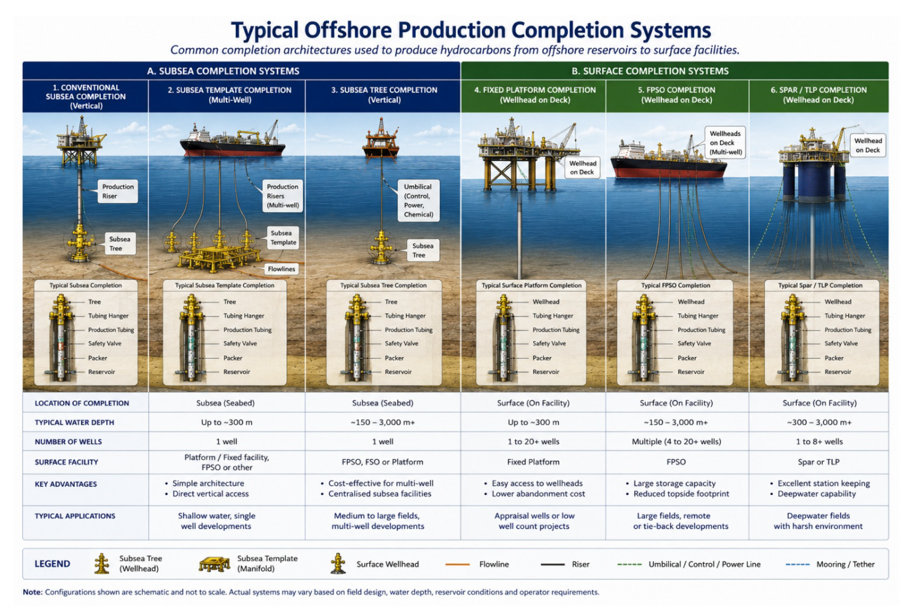

Figure 47 Examples of offshore production completion systems used to safely control, produce, and transport hydrocarbons from subsea reservoirs to surface processing facilities.

**Subsea Development Systems**

Many offshore developments utilise subsea production systems.

A subsea development may include:

- Subsea trees;
- Manifolds;
- Flowlines;
- Umbilicals;
- Risers.

Hydrocarbons are transported from subsea wells to a host facility for processing.

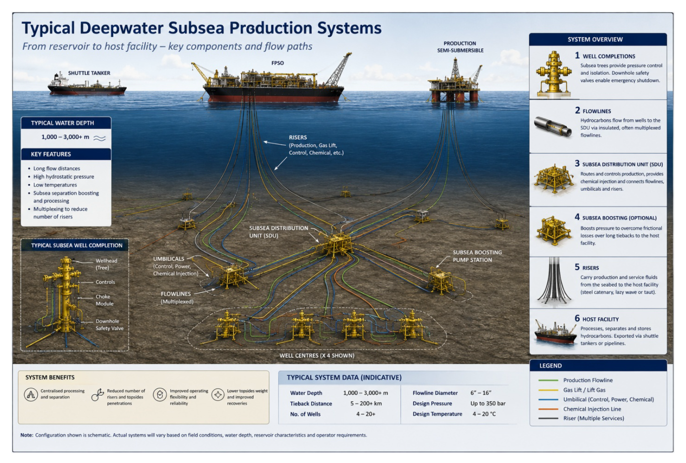

Figure 48 Illustration of a typical deepwater subsea production system showing subsea trees, manifolds, flowlines, umbilicals, and risers used to transport hydrocarbons from the reservoir to offshore production facilities.

**Construction of Production Facilities**

Development projects require the construction of facilities necessary for production, processing, storage, and export.

The nature of the facilities depends on:

- Reservoir size;
- Hydrocarbon type;
- Water depth;
- Location;
- Development concept.

**Onshore Facilities**

May include:

- Separation plants;
- Processing facilities;
- Storage tanks;
- Export pipelines;
- Compression facilities.

**Offshore Facilities**

May include:

- Fixed platforms;
- Tension-leg platforms;
- FPSOs;
- Floating Production Units (FPUs);
- Offshore loading systems.

**Floating Production Storage and Offloading Facilities (FPSOs)**

FPSOs have become the preferred development solution for many deepwater projects in West Africa.

Advantages include:

- Reduced export infrastructure requirements;
- Flexibility;
- Suitability for remote offshore locations.

Notable West African developments utilising FPSOs include:

**Jubilee Field (Ghana)**

FPSO Kwame Nkrumah

**TEN Project (Ghana)**

FPSO Prof. John Evans Atta Mills

**Sangomar Field (Senegal)**

**Egina Field (Nigeria)**

These examples should be retained wherever referenced within the source manuscript.

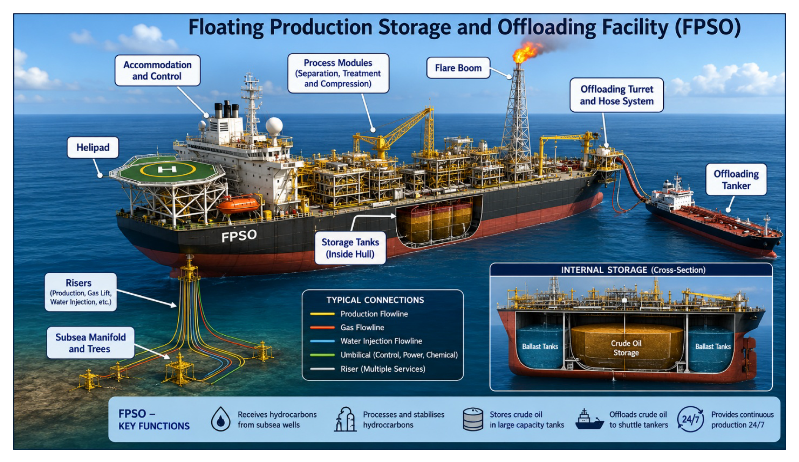

Figure 49 A typical FPSO facility showing the key systems used to receive, process, store, and offload hydrocarbons produced from offshore subsea fields.

**Engineering, Procurement and Construction (EPC)**

Major developments frequently utilise EPC contracts.

Under this approach, contractors are responsible for:

- Engineering design;
- Procurement;
- Construction;
- Commissioning support.

EPC contracts help reduce project execution risk and improve coordination.

**Commissioning and Start-Up**

Before production can commence, facilities must undergo commissioning.

Commissioning verifies that:

- Equipment functions correctly;
- Safety systems operate as intended;
- Production systems are ready for operation.

Following successful commissioning, first production may commence.

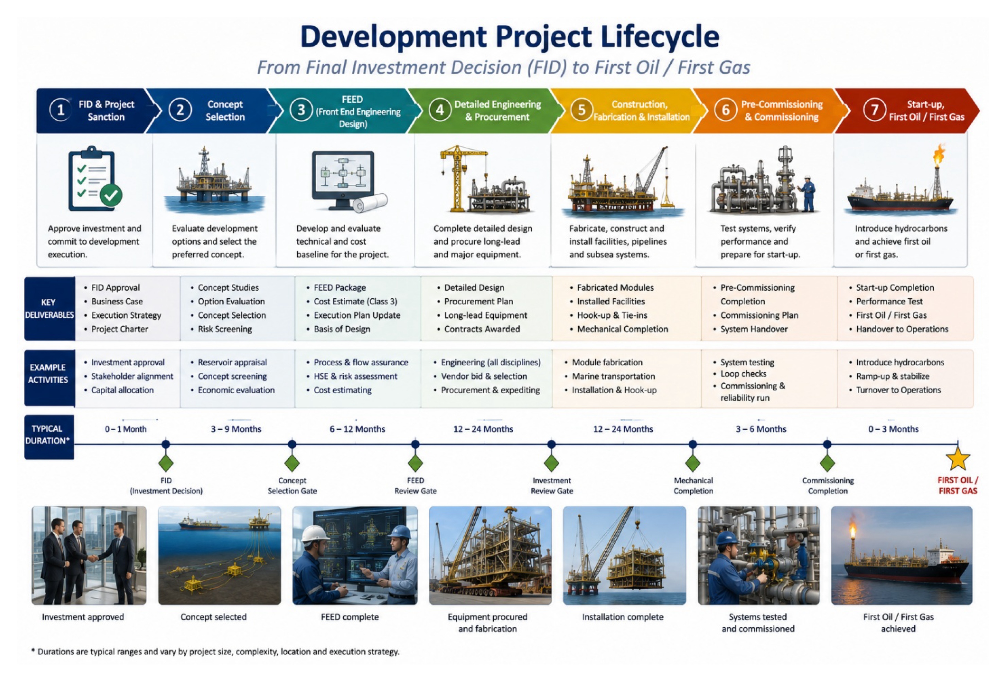

Figure 50 Typical sequence of activities and decision gates required to progress a hydrocarbon development project from FID through engineering, procurement, construction, commissioning, and start-up to first production.

**Government Responsibilities During Development Execution**

Governments and regulators play a critical oversight role during development.

Responsibilities typically include:

**Approval of Development Activities**

Reviewing:

- Drilling programmes;
- Facilities design;
- Environmental management plans.

**Monitoring Compliance**

Ensuring compliance with:

- Petroleum legislation;
- Licence conditions;
- Environmental obligations;
- Health and safety requirements.

**Local Content Oversight**

Monitoring commitments relating to:

- Employment;
- Procurement;
- Technology transfer;
- Training programmes.

**Resource Stewardship**

Ensuring development activities maximise:

- Resource recovery;
- Economic value;
- National benefits.

**Common Development Challenges**

Development projects frequently encounter challenges including:

**Cost Overruns**

Actual project costs may exceed estimates.

**Schedule Delays**

Delays may result from:

- Supply chain issues;
- Technical problems;
- Regulatory approvals;
- Weather conditions.

**Reservoir Uncertainty**

Subsurface conditions may differ from expectations.

**Operational Risks**

Construction and drilling activities involve significant HSE risks.

Effective project management is therefore essential.

**West African Development Examples**

Several major developments illustrate successful project execution.

**Jubilee Field (Ghana)**

One of the fastest deepwater developments in Africa from discovery to production.

**TEN Project (Ghana)**

Demonstrated the successful development of complex deepwater reservoirs.

**Sangomar Field (Senegal)**

Represents Senegal's transition into oil production.

**Egina Field (Nigeria)**

One of Africa's largest deepwater developments and a major local content success story.

**GTA LNG Project (Mauritania-Senegal)**

Illustrates large-scale cross-border gas development and LNG export infrastructure.

These examples should remain throughout the translated manuscript whenever referenced by the author.

**Strategic Importance of Development Execution**

The development phase transforms petroleum resources into productive assets capable of generating:

- Government revenues;
- Employment opportunities;
- Energy supplies;
- Economic growth.

The quality of development execution directly influences:

- Recovery factors;
- Project profitability;
- Operational safety;
- Environmental performance.

For this reason, development drilling and field construction represent some of the most important activities within the petroleum industry.

### 6.3.4- Production Operations and Reservoir Management

Following successful commissioning and commencement of production, the field enters the production phase.

The production phase is typically the longest stage of the petroleum lifecycle and may continue for several decades.

During this phase, hydrocarbons are produced, processed, transported, and sold, generating revenues for:

- Governments;
- National Oil Companies (NOCs);
- Investors;
- Service providers.

The principal objective is to maximise the economic recovery of hydrocarbons while maintaining safe, efficient, and environmentally responsible operations.

**Production Operations**

Production operations encompass all activities associated with the extraction, processing, measurement, and export of hydrocarbons.

Typical production activities include:

- Well operations;
- Flow assurance;
- Production optimisation;
- Reservoir surveillance;
- Facilities operation;
- Export operations;
- Maintenance activities.

Effective production management directly influences:

- Recovery factors;
- Revenue generation;
- Asset value;
- Operational safety.

**Production System Components**

A typical production system consists of several interconnected elements.

**Wells**

Production wells provide the pathway through which hydrocarbons flow from the reservoir to surface facilities.

Well performance depends upon:

- Reservoir pressure;
- Reservoir quality;
- Completion design;
- Production strategy.

**Flowlines and Gathering Systems**

Hydrocarbons are transported from wells to processing facilities through:

- Flowlines;
- Gathering systems;
- Production manifolds.

The design of these systems is critical for maintaining efficient production.

**Processing Facilities**

Produced fluids generally contain:

- Oil;
- Gas;
- Water;
- Impurities.

Processing facilities separate and treat these fluids prior to export.

Typical processing operations include:

- Oil stabilisation;
- Gas processing;
- Water treatment;
- Produced water management.

**Export Facilities**

Export systems may include:

- Pipelines;
- Export terminals;
- Offshore loading systems;
- LNG facilities.

These systems provide access to domestic and international markets.

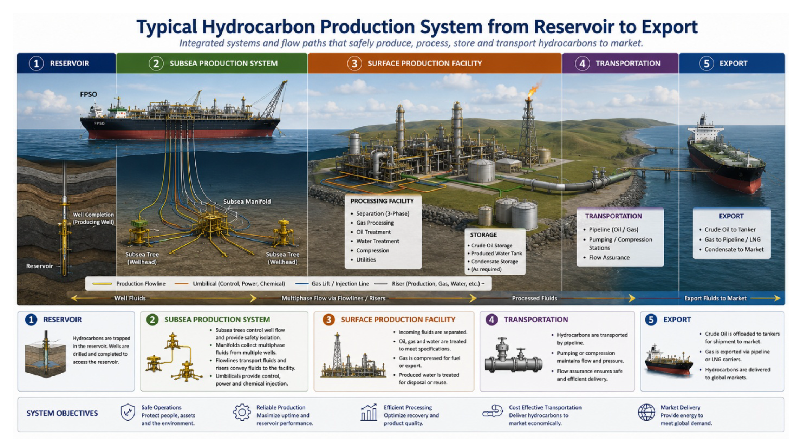

Figure 51 Illustration of the integrated production system used to extract, process, transport, and export hydrocarbons from the reservoir to domestic and international markets.

**Reservoir Management**

Reservoir management refers to the integrated process of monitoring and optimising reservoir performance throughout the life of the field.

The objective is to maximise economic recovery while preserving reservoir integrity.

Effective reservoir management requires collaboration between:

- Geologists;
- Geophysicists;
- Reservoir engineers;
- Production engineers;
- Drilling engineers;
- Operations personnel.

**Reservoir Surveillance**

Reservoir surveillance involves the continuous monitoring of reservoir behaviour.

Data acquired may include:

**Production Data**

Including:

- Oil production rates;
- Gas production rates;
- Water production rates;
- Condensate production rates.

**Pressure Data**

Including:

- Reservoir pressure measurements;
- Bottom-hole pressure surveys;
- Build-up tests.

**Fluid Data**

Including:

- Fluid samples;
- Gas-oil ratio measurements;
- Water chemistry.

Reservoir surveillance enables operators to identify changes in reservoir performance and implement corrective actions.

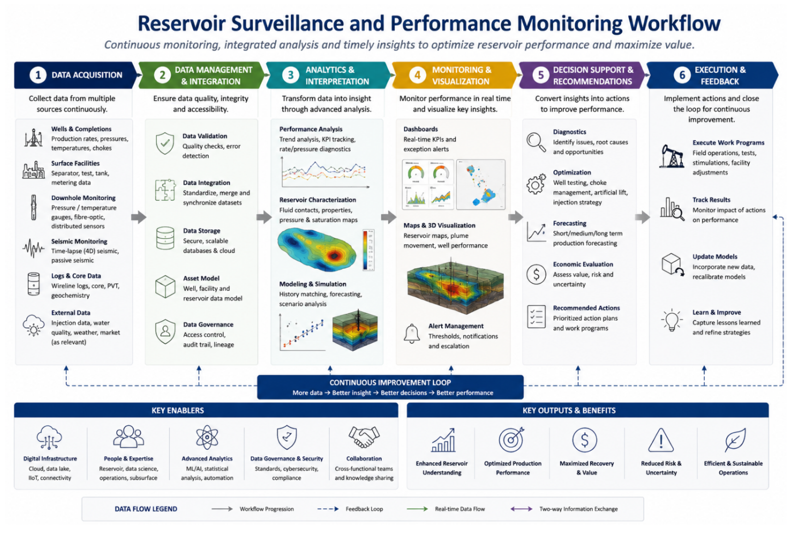

Figure 52 Typical workflow used to acquire, analyse, and interpret reservoir and production data to monitor performance, optimise recovery, and support field management decisions throughout the life of a hydrocarbon field.

**Production Optimisation**

Production optimisation seeks to maximise production efficiency while minimising operating costs.

Common optimisation activities include:

**Well Performance Optimisation**

Adjustments may include:

- Choke management;
- Artificial lift optimisation;
- Stimulation treatments;
- Re-completions.

**Facilities Optimisation**

Improvements may include:

- Debottlenecking;
- Compression upgrades;
- Processing efficiency improvements.

**Production Allocation**

Accurate allocation of production among wells and reservoirs is essential for effective reservoir management.

**Artificial Lift Systems**

As reservoir pressure declines, artificial lift systems may be required to maintain production.

Common systems include:

**Electric Submersible Pumps (ESPs)**

Widely used in both onshore and offshore developments.

**Gas Lift**

Frequently used in offshore fields.

**Progressive Cavity Pumps (PCPs)**

Commonly used in heavy oil developments.

**Rod Pumps**

Frequently used in mature onshore fields.

Artificial lift systems can significantly extend field life and improve recovery.

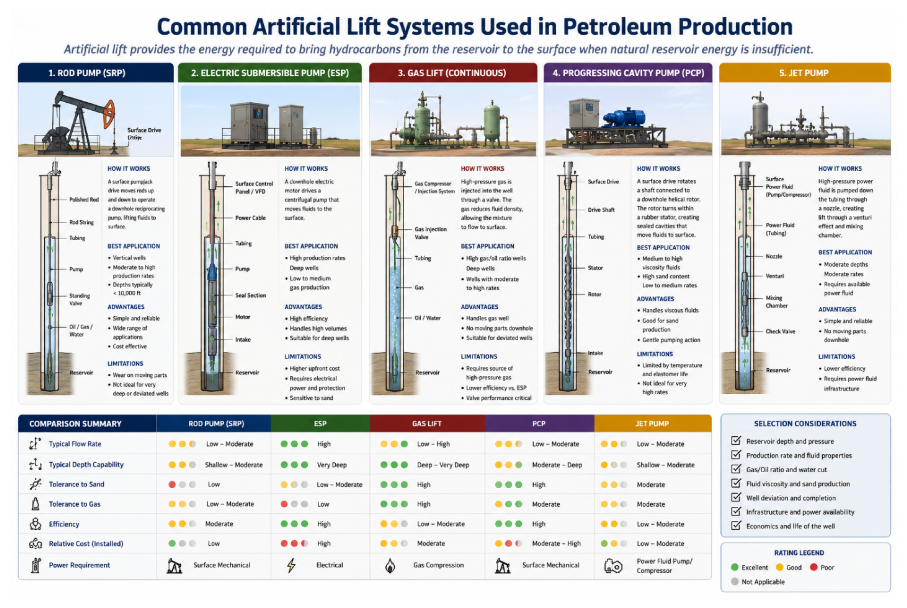

Figure 53 Examples of the principal artificial lift systems used to enhance hydrocarbon production when natural reservoir energy is insufficient to sustain economic flow rates.

**Pressure Maintenance Programmes**

Pressure support is often necessary to maintain reservoir productivity.

Methods include:

**Water Injection**

Water is injected into the reservoir to:

- Maintain pressure;
- Improve sweep efficiency;
- Increase recovery.

**Gas Injection**

Gas may be injected to:

- Maintain pressure;
- Improve recovery;
- Recycle produced gas.

Pressure maintenance programmes play a critical role in maximising reserves recovery.

**Enhanced Oil Recovery (EOR)**

Enhanced Oil Recovery techniques may be implemented after primary and secondary recovery mechanisms become less effective.

Common EOR methods include:

**Thermal Recovery**

Including:

- Steam injection;
- Cyclic steam stimulation.

**Gas Injection**

Including:

- CO₂ injection;
- Miscible gas injection.

**Chemical Flooding**

Including:

- Polymer flooding;
- Surfactant flooding.

EOR projects can significantly increase recovery factors.

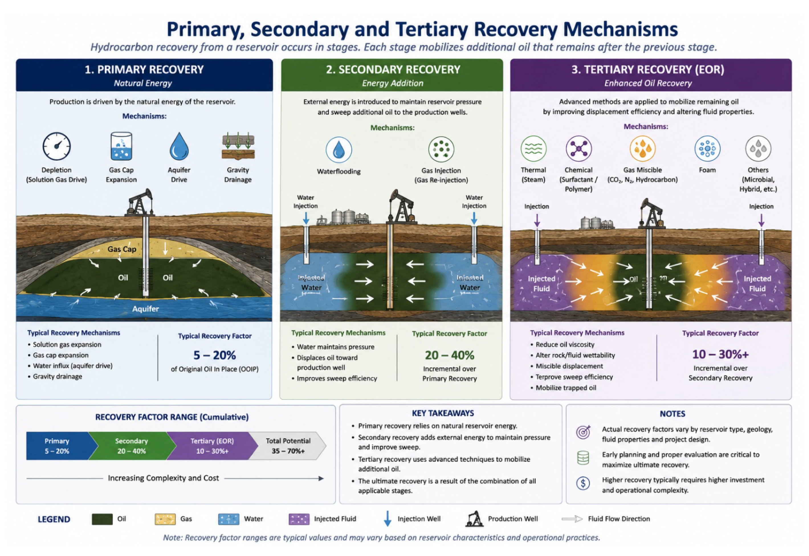

Figure 54 Illustration of the principal hydrocarbon recovery mechanisms, showing how primary, secondary, and tertiary recovery methods are applied to increase reservoir recovery and maximise ultimate hydrocarbon production.

**Production Forecasting**

Production forecasting is a fundamental component of reservoir management.

Forecasts are used for:

- Budgeting;
- Development planning;
- Reserve estimation;
- Government reporting.

Forecasting methods may include:

- Decline curve analysis;
- Material balance methods;
- Reservoir simulation.

Forecasts should be updated regularly as additional production data become available.

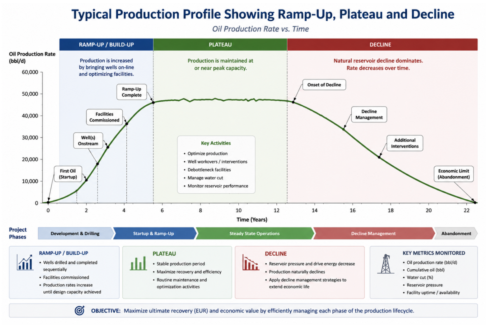

Figure 55 Typical hydrocarbon production profile illustrating the progression from start-up and production ramp-up through plateau production and eventual field decline as reservoir energy is depleted.

**Reserves Management**

Reserve estimates are continuously reviewed throughout field life.

Reserve revisions may result from:

- Additional drilling;
- Reservoir performance;
- Commodity price changes;
- Technological improvements.

Reserve management is essential for:

- Investment planning;
- Corporate reporting;
- Government oversight.

**Operational Integrity**

Production operations must maintain the integrity of:

- Wells;
- Facilities;
- Pipelines;
- Export systems.

Integrity management programmes typically include:

**Inspection**

Routine inspection of equipment and facilities.

**Monitoring**

Continuous monitoring of critical systems.

**Maintenance**

Preventive and corrective maintenance activities.

**Risk Assessment**

Identification and mitigation of operational risks.

Strong integrity management reduces the likelihood of failures and incidents.

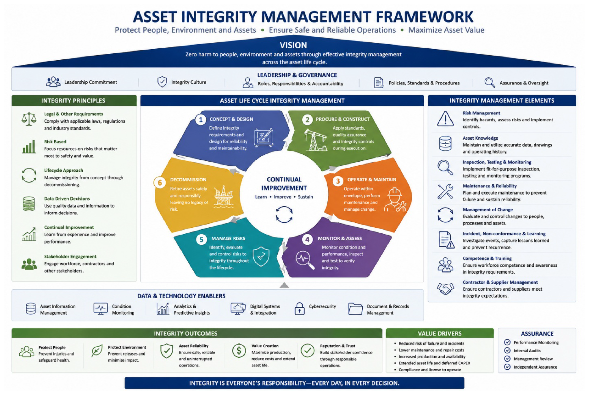

Figure 56 Illustration of a typical asset integrity management framework showing the processes, controls, and continuous improvement activities used to ensure the safe, reliable, and efficient operation of petroleum facilities throughout their lifecycle.

**Government Responsibilities During Production**

Governments and regulators play an important role throughout the production phase.

Responsibilities include:

**Production Monitoring**

Verification of:

- Production volumes;
- Hydrocarbon sales;
- Royalty calculations;
- Fiscal obligations.

**Resource Stewardship**

Ensuring efficient and responsible resource recovery.

**Environmental Oversight**

Monitoring compliance with environmental regulations.

**Health and Safety Oversight**

Ensuring operators maintain safe working environments.

**Revenue Management**

Monitoring:

- Royalties;
- Taxes;
- Profit sharing;
- State participation revenues.

The production phase typically generates the majority of government petroleum revenues.

**West African Production Examples**

Several major developments illustrate successful production management practices.

**Jubilee Field (Ghana)**

Demonstrated the importance of continuous reservoir surveillance and production optimisation.

**TEN Project (Ghana)**

Utilised advanced deepwater production technologies and reservoir management techniques.

**Egina Field (Nigeria)**

One of Africa's highest-capacity deepwater production developments.

**Sangomar Field (Senegal)**

Represents Senegal's entry into offshore oil production and reservoir management.

**GTA LNG Project (Mauritania-Senegal)**

Demonstrates long-term gas production and LNG export operations.

**Strategic Importance of Reservoir Management**

The difference between average and excellent reservoir management can result in billions of dollars of additional value over the life of a field.

Even modest improvements in recovery factor can significantly increase:

- Government revenues;
- Operator profits;
- National resource utilisation.

For this reason, reservoir management remains one of the most important disciplines within the petroleum industry.

## 6.4- Project Expenditures and Revenues

The summary of cash flows from the pre-licensing phase through to abandonment illustrates the expenditures (investments) incurred during petroleum exploration and production activities, as well as the revenues generated from hydrocarbon production.

Financing of pre-licensing activities generally falls within the sovereign responsibilities of the State, and certain activities may be carried out under service contracts. These activities therefore constitute part of the State's sovereign expenditure.

Once a petroleum contract has been signed, the contractor commits to undertaking substantial capital expenditure (CAPEX) at its own risk during the exploration and development phases.

During the production phase, revenues are generated for both parties to the contract (the State and the contractor) through the sale of produced hydrocarbons. Operating expenditure (OPEX), which covers the maintenance of production facilities and equipment, is generally easier to finance as it can be funded from production revenues. At this stage, cash flow becomes positive. Profits generated from production are shared between the parties in accordance with the contractual terms.

During the abandonment phase, expenditure associated with decommissioning and abandonment activities (ABEX) is typically financed from a portion of production revenues. Petroleum contracts generally include provisions requiring the establishment of abandonment funds or reserves to finance these activities.

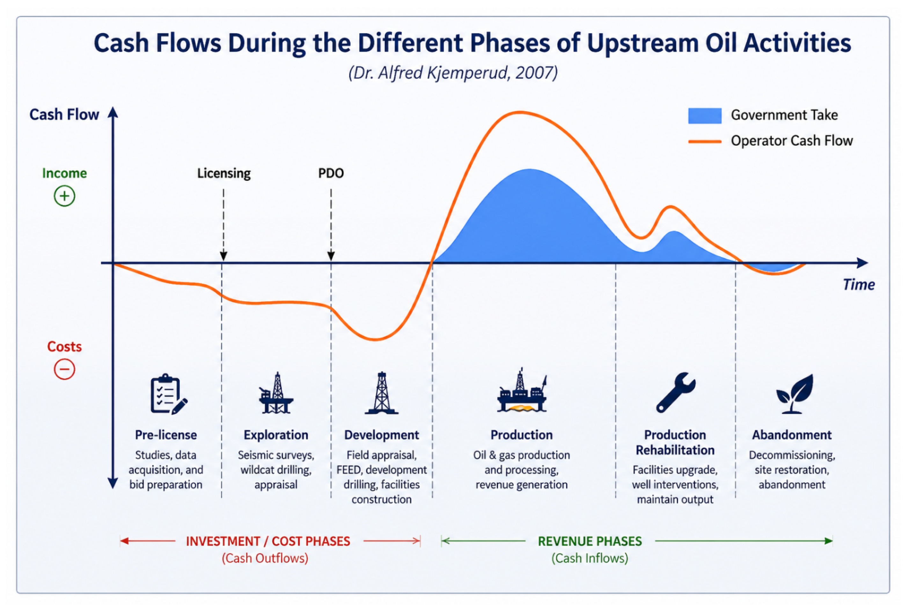

Figure 57 Typical cash flow profile of an upstream petroleum project from licensing and exploration through production and eventual abandonment.

## 6.5- Decommissioning and Abandonment Phase

### 6.5.1- Definition, Objectives and Regulatory Framework

Every petroleum field eventually reaches the end of its economic life.

When hydrocarbon production can no longer be sustained economically, or when petroleum operations cease permanently, the field enters the final stage of the petroleum lifecycle: decommissioning and abandonment.

This phase involves the safe retirement of petroleum infrastructure and the restoration of affected areas in accordance with regulatory, environmental, and safety requirements.

Decommissioning and abandonment are essential components of responsible resource management and should be considered from the earliest stages of field development.

**Definition of Decommissioning**

Decommissioning refers to the process of retiring petroleum facilities and infrastructure once production operations have permanently ceased.

The process may involve:

- Well abandonment;
- Removal of production facilities;
- Removal of subsea infrastructure;
- Site remediation;
- Environmental restoration;
- Long-term monitoring.

The objective is to eliminate future risks to:

- Human safety;
- Navigation;
- Fisheries;
- The environment;
- Future users of the area.

**Definition of Abandonment**

Abandonment refers specifically to the permanent isolation of wells and reservoirs from the surface environment.

Abandonment activities generally include:

- Plugging the well;
- Isolating hydrocarbon-bearing zones;
- Removing wellhead equipment;
- Verifying long-term well integrity.

Proper abandonment ensures that hydrocarbons cannot migrate to surface following cessation of operations.

**Objectives of Decommissioning**

The principal objectives include:

**Protection of Human Life**

Elimination of hazards associated with obsolete petroleum infrastructure.

**Environmental Protection**

Prevention of future pollution risks.

**Restoration of Marine and Terrestrial Environments**

Returning affected areas to an acceptable condition.

**Long-Term Well Integrity**

Ensuring permanent containment of hydrocarbons.

**Regulatory Compliance**

Meeting all legal and contractual obligations.

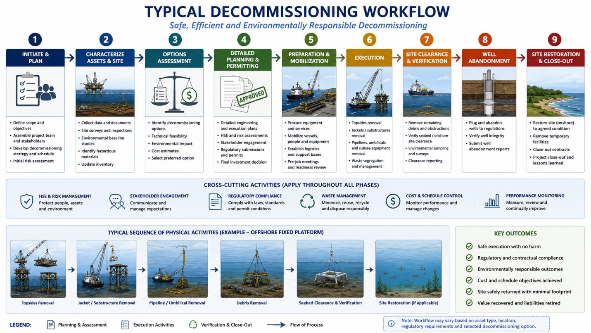

Figure 58 Illustration of the typical petroleum field lifecycle, from exploration and appraisal through development and production to decommissioning, abandonment, and site restoration at the end of field life.

**End-of-Life Planning**

Modern petroleum regulations increasingly require operators to prepare for decommissioning long before production ceases.

Planning often begins during:

- FDP preparation;
- Environmental impact assessments;
- Economic evaluations.

Early planning allows operators and governments to:

- Estimate liabilities;
- Establish funding mechanisms;
- Reduce future risks.

**Regulatory Framework**

Most petroleum-producing countries establish regulatory requirements governing decommissioning activities.

Regulations typically address:

**Well Abandonment Requirements**

Standards for:

- Plugging operations;
- Cement barriers;
- Verification testing.

**Infrastructure Removal**

Requirements relating to:

- Platforms;
- Pipelines;
- Subsea facilities.

**Environmental Obligations**

Requirements relating to:

- Site remediation;
- Environmental monitoring;
- Waste disposal.

**Financial Security**

Requirements ensuring sufficient funding exists to complete decommissioning activities.

**International Standards**

Decommissioning programmes are often guided by international standards and industry best practices.

Relevant organisations may include:

- International Maritime Organization
- International Association of Oil & Gas Producers
- Society of Petroleum Engineers

These standards assist governments and operators in implementing safe and effective decommissioning programmes.

**Financial Provisioning**

One of the most important aspects of decommissioning is ensuring adequate funding.

Decommissioning costs can be substantial and may reach:

- Hundreds of millions of US dollars;
- Billions of US dollars for large offshore developments.

Governments therefore commonly require operators to establish:

**Decommissioning Funds**

Dedicated funds accumulated during field life.

**Financial Guarantees**

Including:

- Bank guarantees;
- Parent company guarantees;
- Surety arrangements.

**Abandonment Provisions**

Accounting provisions established to cover future liabilities.

The objective is to ensure that taxpayers do not bear future decommissioning costs.

**Government Responsibilities**

Governments play a central role in regulating decommissioning activities.

Responsibilities include:

**Approval of Decommissioning Plans**

Reviewing proposed decommissioning programmes.

**Verification of Financial Security**

Ensuring sufficient funding exists.

**Environmental Oversight**

Reviewing environmental impacts and remediation measures.

**Long-Term Resource Protection**

Ensuring abandoned wells remain secure.

**Stakeholder Engagement**

Consulting with:

- Local communities;
- Fisheries;
- Environmental organisations;
- Maritime authorities.

**Decommissioning Planning Process**

The decommissioning process generally follows a structured sequence.

Production is terminated when economic or technical limits are reached.

Detailed engineering and environmental studies are undertaken.

Government approval is obtained.

Wells are permanently plugged and abandoned.

Infrastructure is removed or otherwise managed in accordance with approved plans.

Environmental restoration activities are completed.

Post-decommissioning monitoring may continue for several years.

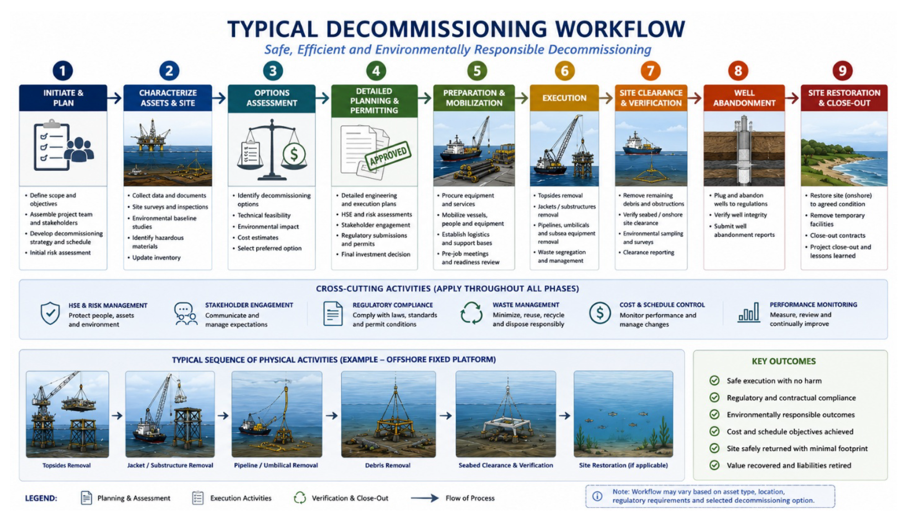

Figure 59 Typical sequence of activities undertaken during petroleum asset decommissioning, including planning, facility removal, well abandonment, site clearance, and environmental restoration.

**Well Plugging and Abandonment (P&A)**

Plugging and Abandonment (P&A) is generally the most technically critical component of decommissioning.

The objective is to create permanent barriers preventing fluid migration.

**Primary Barriers**

Typically consist of:

- Cement plugs;
- Mechanical barriers.

**Secondary Barriers**

Provide additional protection in the event of primary barrier failure.

**Surface Abandonment**

Includes removal of:

- Wellheads;
- Conductors;
- Surface equipment.

Permanent abandonment must comply with recognised industry standards and regulatory requirements.

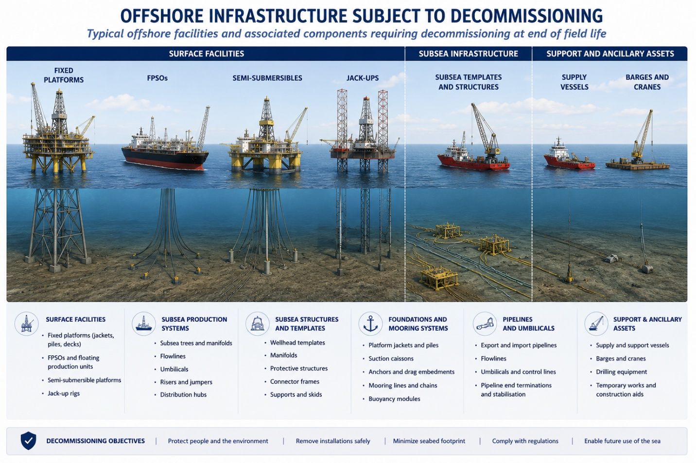

Figure 60 Typical well plugging and abandonment configuration showing barrier placement and the removal of wellheads, conductors, and surface facilities.

**Offshore Decommissioning**

Offshore developments present unique challenges.

Infrastructure requiring consideration may include:

- Fixed platforms;
- FPSOs;
- Subsea wells;
- Flowlines;
- Pipelines;
- Risers;
- Umbilicals.

The selected decommissioning strategy depends on:

- Water depth;
- Infrastructure type;
- Environmental considerations;
- Regulatory requirements.

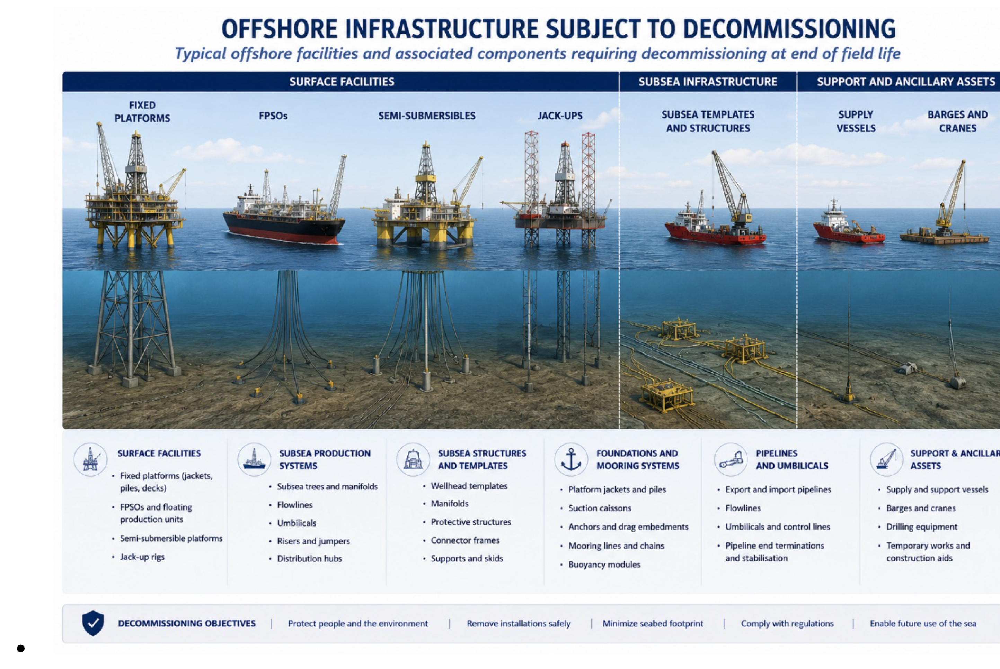

Figure 61 Examples of offshore facilities and subsea infrastructure that may require decommissioning at the end of field life, including platforms, FPSOs, subsea systems, pipelines, umbilicals, and associated support assets.

**Environmental Considerations**

Environmental management remains a central aspect of decommissioning.

Potential concerns include:

**Hydrocarbon Contamination**

Residual hydrocarbons must be managed appropriately.

**Waste Disposal**

Equipment and materials require safe disposal or recycling.

**Marine Ecosystems**

Offshore activities must minimise impacts on marine habitats.

**Land Restoration**

Onshore sites may require remediation and rehabilitation.

Environmental monitoring programmes are often implemented to verify successful restoration.

**Social and Economic Considerations**

Decommissioning may also have social and economic implications.

Potential issues include:

- Employment impacts;
- Community concerns;
- Loss of economic activity;
- Infrastructure repurposing opportunities.

Governments should consider these factors during planning and approval processes.

**Strategic Importance of Decommissioning**

Responsible decommissioning is essential for ensuring that petroleum operations do not create future environmental or financial liabilities.

A properly executed decommissioning programme:

- Protects the environment;
- Protects public safety;
- Preserves government credibility;
- Reduces long-term liabilities.

For this reason, decommissioning should be viewed as an integral component of the petroleum lifecycle rather than simply the final operational activity.

**2.4.2 Financial, Environmental and Social Challenges Associated with Decommissioning**

Although decommissioning is a necessary and unavoidable component of the petroleum lifecycle, it presents significant challenges for governments, operators, investors, regulators, and local communities.

Many of these challenges arise because decommissioning activities occur at the end of field life, when:

- Production revenues are declining;
- Facilities are ageing;
- Infrastructure may have been operating for decades;
- Ownership structures may have changed.

As a result, decommissioning is often one of the most complex phases of petroleum operations.

**Financial Challenges**

Financial considerations represent one of the most significant challenges associated with decommissioning.

The cost of retiring petroleum infrastructure can be substantial and, in some cases, may exceed the remaining value of the asset.

**Escalating Costs**

Decommissioning costs are often higher than originally anticipated.

Factors contributing to cost escalation include:

- Inflation;
- Increased regulatory requirements;
- Ageing infrastructure;
- Technological challenges;
- Limited availability of specialised equipment.

Offshore developments are particularly vulnerable to cost increases due to the complexity of removal operations.

**Long-Term Liability Exposure**

Petroleum operators may remain liable for decommissioning obligations long after production has ceased.

Governments must therefore ensure that:

- Financial provisions are adequate;
- Liability arrangements are clearly defined;
- Responsibility remains enforceable.

Failure to address these issues can result in significant future liabilities.

**Late-Life Asset Transfers**

As fields mature, ownership may change through asset sales and divestments.

Governments must carefully evaluate:

- Financial strength of new owners;
- Technical capability;
- Ability to meet future decommissioning obligations.

Weak oversight of late-life asset transfers can increase the risk that decommissioning liabilities ultimately fall upon the State.

**Funding Mechanisms**

Several mechanisms are commonly used to finance future decommissioning activities.

These include:

- Abandonment funds;
- Escrow accounts;
- Trust funds;
- Parent company guarantees;
- Bank guarantees.

The chosen mechanism should ensure that sufficient resources are available when required.

**Environmental Challenges**

Environmental protection remains a central objective of decommissioning programmes.

The removal of petroleum infrastructure must be conducted in a manner that minimises environmental impacts.

**Hydrocarbon Residues**

Residual hydrocarbons may remain within:

- Pipelines;
- Tanks;
- Processing equipment;
- Flowlines.

These materials must be safely removed and disposed of before infrastructure can be decommissioned.

**Contaminated Sites**

Historical petroleum operations may have resulted in contamination of:

- Soil;
- Groundwater;
- Surface water;
- Marine sediments.

Remediation activities may therefore be required.

**Marine Environmental Impacts**

Offshore decommissioning can affect:

- Marine ecosystems;
- Fisheries;
- Sensitive habitats.

Activities such as platform removal and pipeline recovery must be carefully managed to minimise environmental disturbance.

**Waste Management**

Large quantities of waste materials are generated during decommissioning.

Examples include:

- Steel structures;
- Concrete materials;
- Process equipment;
- Hazardous materials.

Governments increasingly encourage recycling and reuse where feasible.

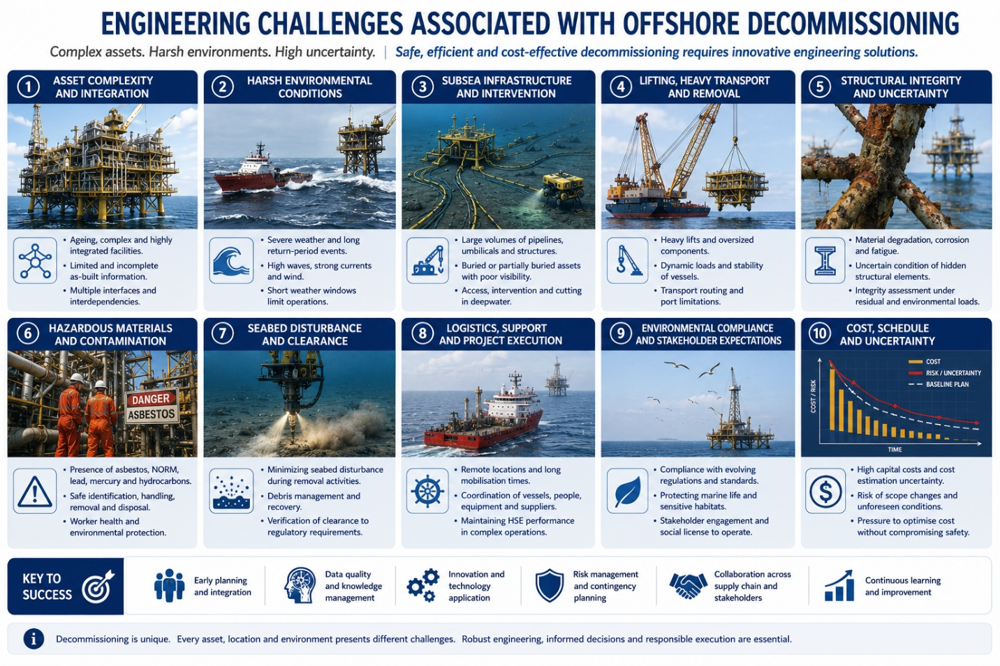

Figure 62 Key environmental considerations during petroleum decommissioning, including habitat protection, waste management, emissions control, seabed disturbance, and site restoration.

**Social Challenges**

Decommissioning activities may have significant social and economic consequences.

These impacts should be carefully considered during planning and implementation.

**Employment Impacts**

The cessation of production often results in:

- Workforce reductions;
- Loss of contractor activity;
- Reduced local business opportunities.

Communities that depend heavily on petroleum operations may be particularly affected.

**Community Expectations**

Communities frequently expect operators to restore sites and address historical impacts associated with petroleum operations.

Failure to meet expectations can create:

- Social tensions;
- Reputational risks;
- Legal disputes.

Meaningful stakeholder engagement is therefore essential.

**Economic Transition**

Petroleum-producing regions often require economic diversification strategies to prepare for the eventual closure of petroleum facilities.

Governments should encourage:

- Alternative industries;
- Skills development;
- Infrastructure repurposing.

This approach can reduce the socioeconomic impacts associated with field closure.

**Technical Challenges**

Decommissioning operations often involve highly complex engineering activities.

Challenges may include:

**Ageing Infrastructure**

Older facilities may have deteriorated significantly during operation.

This can complicate removal activities and increase safety risks.

**Deepwater Infrastructure**

Deepwater developments frequently involve:

- Subsea wells;
- Flowlines;
- Manifolds;
- Risers;
- Umbilicals.

The removal of such infrastructure may require specialised vessels and equipment.

**Well Integrity Risks**

Poorly abandoned wells can present long-term risks including:

- Hydrocarbon leakage;
- Environmental contamination;
- Safety hazards.

Permanent well barriers must therefore be designed and verified carefully.

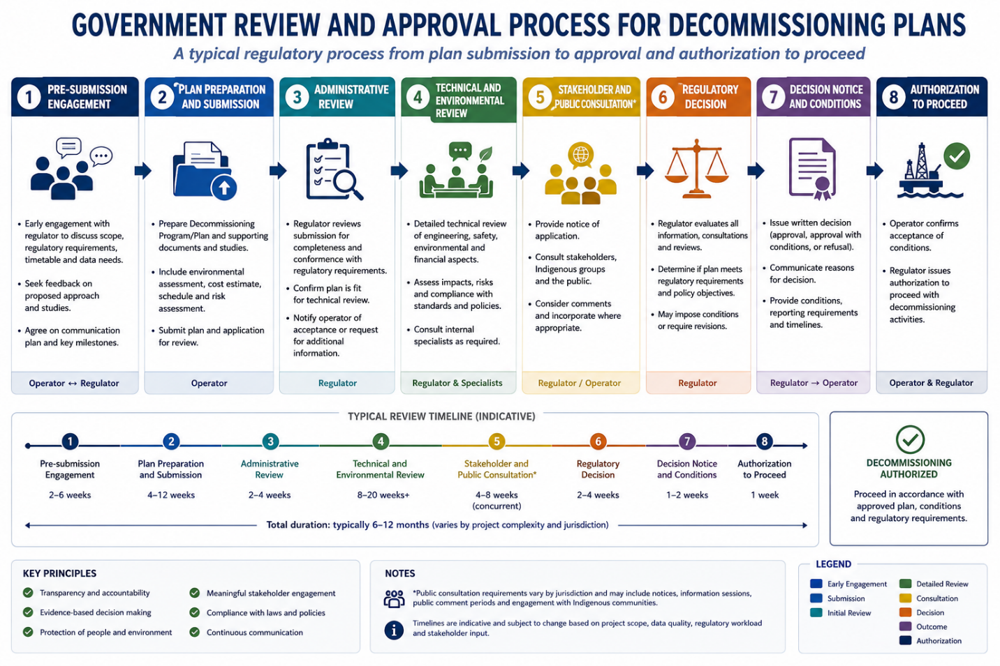

Figure 63 Examples of the principal engineering challenges encountered during offshore decommissioning, including structural integrity, heavy lifting, subsea intervention, environmental constraints, logistics, and cost management.

**Regulatory Challenges**

Governments must establish clear regulatory frameworks governing decommissioning activities.

Key regulatory considerations include:

**Definition of Liability**

Regulations should clearly define responsibility for:

- Decommissioning;
- Site restoration;
- Long-term monitoring.

**Financial Security Requirements**

Governments must ensure that adequate financial provisions are maintained throughout field life.

**Approval Processes**

Clear procedures should exist for:

- Decommissioning plans;
- Environmental assessments;
- Stakeholder consultation.

**Long-Term Monitoring**

Some sites may require post-decommissioning monitoring programmes extending beyond field closure.

**West African Context**

Many West African petroleum provinces remain relatively young compared with mature producing regions such as the North Sea.

Consequently, large-scale decommissioning programmes are only beginning to emerge.

However, governments should act proactively by establishing:

- Decommissioning regulations;
- Financial assurance requirements;
- Environmental standards;
- Liability frameworks.

This is particularly important as offshore developments in:

- Nigeria;
- Ghana;
- Côte d'Ivoire;
- Senegal;
- Mauritania;

continue to mature.

**Future Decommissioning Obligations**

As petroleum developments age, decommissioning liabilities across West Africa are expected to increase significantly.

Governments should therefore:

- Strengthen regulatory oversight;
- Improve financial assurance mechanisms;
- Build technical expertise;
- Develop national decommissioning strategies.

Failure to prepare adequately could result in substantial environmental and financial risks.

**Strategic Importance**

Responsible decommissioning is essential for ensuring that petroleum resources contribute to sustainable development throughout their entire lifecycle.

Effective decommissioning programmes:

- Protect public safety;
- Protect the environment;
- Minimise future liabilities;
- Enhance investor confidence;
- Strengthen resource governance.

The long-term success of the petroleum industry depends not only on discovering and producing hydrocarbons, but also on responsibly managing the end of field life.

### 6.5.2- Government Responsibilities for Decommissioning

The decommissioning and abandonment phase places significant responsibilities upon governments and regulatory authorities.

Although operators are responsible for planning, financing, and executing decommissioning activities, governments remain responsible for ensuring that these activities are conducted safely, effectively, and in accordance with legal, environmental, and societal expectations.

Effective regulatory oversight is essential to protecting national interests and preventing future environmental and financial liabilities.

**Resource Stewardship Responsibilities**

Governments act as custodians of petroleum resources on behalf of present and future generations.

This responsibility extends beyond production activities and includes ensuring that petroleum assets are retired responsibly at the end of their productive lives.

Governments must therefore ensure that:

- Petroleum infrastructure is safely decommissioned;
- Wells are permanently abandoned;
- Environmental obligations are fulfilled;
- Future risks are minimised.

Resource stewardship continues until all decommissioning obligations have been satisfactorily completed.

**Regulatory Oversight**

One of the primary responsibilities of government is the regulation and approval of decommissioning activities.

Regulators should establish clear requirements covering:

- Decommissioning planning;
- Financial assurance;
- Environmental assessments;
- Stakeholder engagement;
- Long-term monitoring.

A comprehensive regulatory framework reduces uncertainty for both operators and investors.

**Review and Approval of Decommissioning Plans**

Before decommissioning activities commence, operators are generally required to submit detailed decommissioning plans for approval.

The review process should assess:

**Technical Feasibility**

Whether the proposed activities can be safely executed.

**Environmental Impacts**

Whether environmental risks have been adequately identified and mitigated.

**Financial Adequacy**

Whether sufficient funds exist to complete the proposed programme.

**Stakeholder Considerations**

Whether affected stakeholders have been consulted appropriately.

Only after regulatory approval should decommissioning activities proceed.

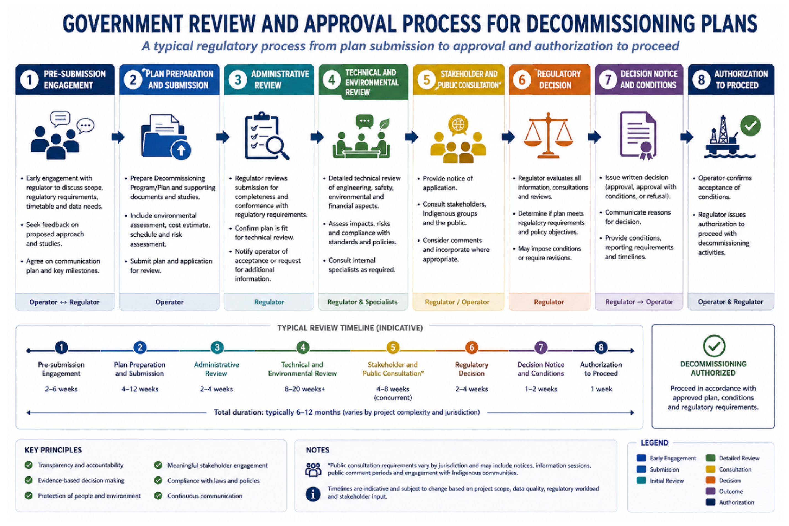

Figure 64 Typical regulatory process for the review, assessment, and approval of petroleum decommissioning plans prior to the commencement of decommissioning activities.

**Verification of Financial Security**

Governments must ensure that operators maintain sufficient financial resources to meet future decommissioning obligations.

This responsibility includes monitoring:

- Decommissioning funds;
- Escrow accounts;
- Trust arrangements;
- Financial guarantees;
- Parent company guarantees.

Periodic reviews should be undertaken throughout field life to ensure that funding remains adequate.

**Liability Management**

Governments must establish clear legal frameworks defining responsibility for decommissioning liabilities.

Important considerations include:

**Current Operators**

Primary responsibility generally rests with the licence holder.

**Former Owners**

In some jurisdictions, previous owners may retain residual liability.

**Parent Companies**

Governments may require parent company support where appropriate.

Clearly defined liability arrangements reduce the risk of future disputes.

**Environmental Oversight**

Environmental protection remains one of the most important government responsibilities during decommissioning.

Regulators should ensure that operators:

- Conduct environmental impact assessments;
- Implement mitigation measures;
- Restore affected sites;
- Comply with environmental regulations.

Monitoring programmes may continue after decommissioning has been completed.

**Site Restoration**

Governments should establish clear criteria defining acceptable restoration outcomes.

Objectives may include:

**Onshore Restoration**

- Removal of equipment;
- Soil remediation;
- Vegetation restoration;
- Groundwater protection.

**Offshore Restoration**

- Removal of infrastructure;
- Protection of marine habitats;
- Management of seabed impacts.

Site restoration standards should be clearly defined within regulations.

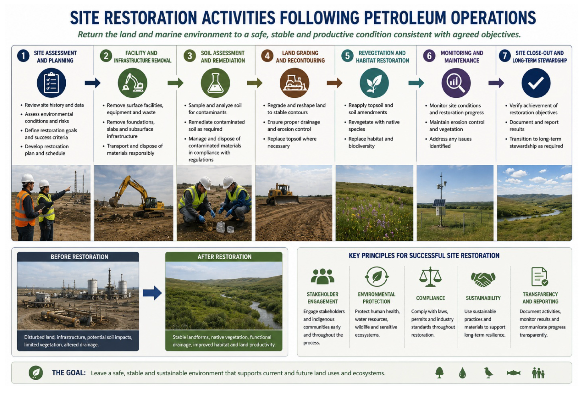

Figure 65 Typical onshore site restoration activities undertaken following petroleum operations, including facility removal, remediation, land recontouring, revegetation, and long-term environmental monitoring.

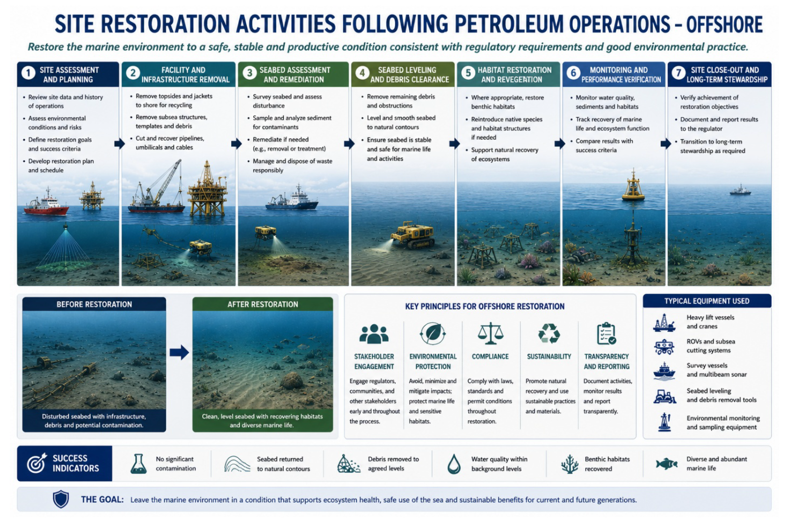

Figure 66 Typical offshore site restoration activities undertaken following petroleum operations, including infrastructure removal, seabed clearance, environmental remediation, habitat recovery, and long-term monitoring

**Stakeholder Engagement**

Governments should ensure that operators engage effectively with stakeholders throughout the decommissioning process.

Stakeholders may include:

- Local communities;
- Fisheries;
- Environmental organisations;
- Maritime authorities;
- Local governments.

Effective engagement promotes transparency and reduces conflict.

**Monitoring and Verification**

Following completion of decommissioning activities, governments may require monitoring programmes to verify:

- Well integrity;
- Environmental recovery;
- Infrastructure removal;
- Long-term safety.

Verification activities may continue for several years depending on the nature of the development.

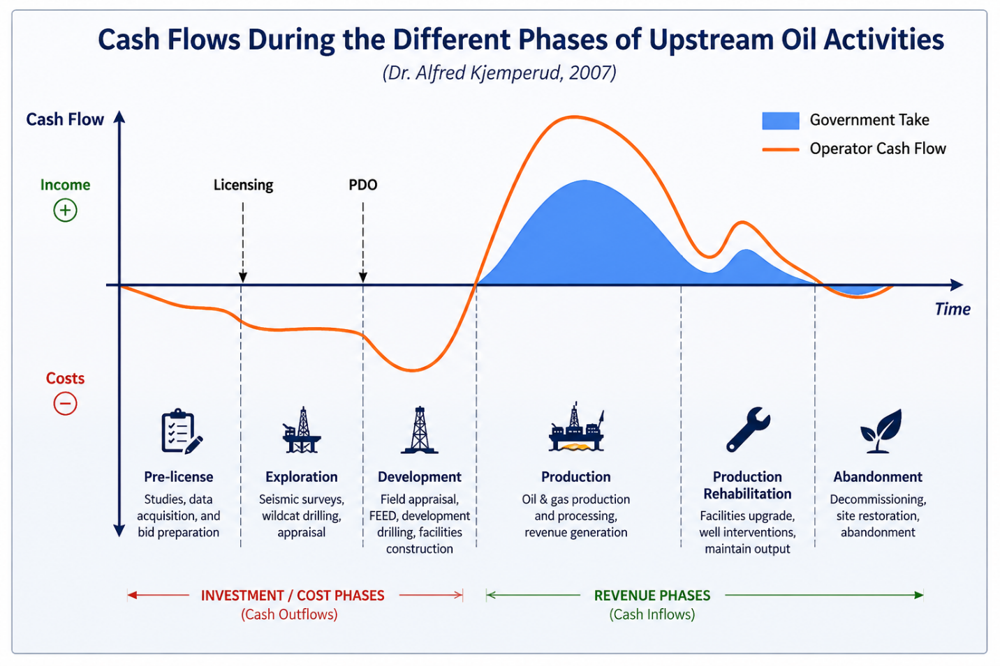

Figure 67 Typical framework used to monitor, verify, and demonstrate the long-term environmental and regulatory performance of decommissioned petroleum facilities and sites.

**Institutional Capacity Requirements**

Effective oversight of decommissioning activities requires specialised expertise.

Governments should develop capacity in:

- Well abandonment;
- Facilities engineering;
- Environmental science;
- Marine ecology;
- Petroleum economics;
- Liability management.

The need for specialised expertise will continue to increase as petroleum infrastructure ages across West Africa.

**Transparency and Public Accountability**

Governments should promote transparency throughout the decommissioning process.

Examples include:

- Publication of approved plans;
- Disclosure of environmental assessments;
- Reporting of monitoring results;
- Public consultation processes.

Transparency helps maintain public confidence and improve governance outcomes.

**Lessons from Mature Petroleum Provinces**

Petroleum-producing regions such as the North Sea provide valuable lessons regarding decommissioning governance.

Key lessons include:

- Early planning is essential;
- Financial provisions should be established early;
- Liability frameworks must be clear;
- Regulatory capacity is critical;
- Environmental oversight must be maintained throughout field life.

West African countries can benefit significantly from these experiences as regional developments mature.

**West African Considerations**

Many West African countries are still in the relatively early stages of offshore petroleum development.

However, governments should prepare now for future decommissioning obligations by:

- Establishing dedicated regulations;
- Building institutional capacity;
- Developing financial assurance frameworks;
- Creating national decommissioning guidelines.

Proactive preparation will significantly reduce future risks.

**Strategic Importance of Government Oversight**

Government oversight is essential to ensuring that decommissioning activities:

- Protect public interests;
- Protect the environment;
- Minimise financial liabilities;
- Maintain investor confidence;
- Promote responsible resource management.

The effectiveness of decommissioning governance will ultimately influence how the petroleum industry is perceived long after production has ceased.

## 6.6- West African Perspective: Government Roles in Upstream Petroleum Operations

The role of government in upstream petroleum operations extends far beyond resource ownership. Across West Africa, governments influence virtually every stage of the petroleum value chain, including exploration, licensing, field development, production operations, environmental management, local content implementation, and resource revenue administration.

The effectiveness of government institutions can significantly affect the pace of petroleum development, investment attractiveness, operational efficiency, and the long-term economic benefits generated from hydrocarbon resources.

### 6.6.1- Regional Examples

Petroleum-producing countries across West Africa have adopted different approaches to government involvement in upstream operations.

In some jurisdictions, government participation is primarily exercised through petroleum ministries, regulatory agencies, and national oil companies. In others, governments maintain a more direct role in project approvals, licence administration, operational oversight, and resource management.

Regardless of structure, governments remain responsible for ensuring that petroleum resources are developed safely, efficiently, and in accordance with national interests.

**Government Involvement Throughout the Upstream Life Cycle**

**Exploration Phase**

Government responsibilities during exploration commonly include:

- Awarding exploration acreage
- Conducting licensing rounds
- Managing petroleum data
- Evaluating work programmes
- Monitoring licence compliance
- Promoting investment opportunities

The availability of high-quality geological and geophysical data has become increasingly important in attracting exploration investment across West African basins.

**Appraisal and Field Development**

Once a discovery has been made, governments typically become involved in:

- Discovery assessments
- Resource classification reviews
- Development plan approvals
- Environmental impact assessments
- Local content planning
- Infrastructure approvals

Efficient approval processes can significantly reduce the time required to progress discoveries to production.

**Production Operations**

During production, governments oversee:

- Production measurement
- Reservoir management compliance
- Safety performance
- Environmental monitoring
- Reporting obligations
- Resource conservation practices

The objective is to maximise long-term resource recovery while ensuring safe and responsible operations.

**Decommissioning and Abandonment**

As fields mature, governments increasingly focus on:

- Decommissioning planning
- Environmental restoration
- Financial security provisions
- Long-term liability management
- Infrastructure removal requirements

The growing number of mature assets throughout West Africa has increased the importance of decommissioning regulation.

### 6.6.2- Key West African Producing Regions

**Niger Delta Basin, Nigeria**

The Niger Delta represents one of the most complex upstream operating environments in Africa.

Government responsibilities include:

- Managing extensive petroleum infrastructure
- Regulating numerous operators
- Monitoring environmental performance
- Addressing community concerns
- Managing security-related challenges

The scale of operations requires extensive coordination between regulators, operators, government agencies, and local communities.

**Deepwater Gulf of Guinea**

Deepwater developments offshore Nigeria, Ghana, Côte d'Ivoire, and Equatorial Guinea require governments to oversee highly technical projects involving:

- Floating production systems
- Subsea infrastructure
- Deepwater drilling operations
- Export facilities
- Complex reservoir management programmes

Regulatory capacity and technical expertise are therefore critical to effective oversight.

**MSGBC Basin**

The emergence of major developments in Mauritania and Senegal has highlighted the importance of establishing strong regulatory frameworks early in the development cycle.

The basin provides an example of how governments can apply lessons learned from more mature petroleum provinces when developing new hydrocarbon resources.

### 6.6.3- Country Case Studies

**Ghana: Regulatory Coordination and Project Development**

Ghana's petroleum sector demonstrates the importance of clear institutional responsibilities and effective coordination between government entities involved in upstream operations.

The development of the Jubilee, TEN, and Sankofa projects benefited from a relatively predictable regulatory environment and structured approval processes.

**Senegal: Building Institutions Before Production**

Prior to achieving first oil production, Senegal invested considerable effort in strengthening petroleum legislation, regulatory institutions, and administrative capacity.

This approach enabled the country to prepare for large-scale project developments before significant production revenues were generated.

**Côte d'Ivoire: Encouraging Exploration Through Regulatory Stability**

Côte d'Ivoire has maintained a relatively stable upstream regulatory environment that has contributed to continued exploration investment and recent major discoveries.

The country's experience demonstrates how regulatory predictability can support long-term sector growth.

**Nigeria: Managing a Mature Petroleum Province**

Nigeria's experience highlights the challenges associated with regulating a large and mature petroleum industry while balancing investment attraction, operational oversight, environmental management, and community expectations.

### 6.6.4- Operational Lessons from West Africa

**Efficient Regulatory Processes Accelerate Development**

Lengthy approval processes can delay exploration programmes, field developments, and production start-up dates. Streamlined regulatory procedures improve investment attractiveness and project economics.

**Technical Capacity Matters**

As petroleum projects become more technically complex, governments require highly skilled personnel capable of evaluating development plans, drilling programmes, reservoir management strategies, and production operations.

**Petroleum Data Is a Strategic Asset**

Governments that effectively manage geological, geophysical, drilling, and production data are generally better positioned to attract investment and support resource development.

**Environmental Oversight Is Increasingly Important**

Stakeholders increasingly expect governments to ensure that petroleum activities comply with modern environmental standards and sustainability objectives.

**Local Content Requires Active Management**

Successful local content programmes depend on realistic targets, industry collaboration, workforce development, and continuous monitoring by government institutions.

**Institutional Stability Supports Investment**

Investors place significant value on clear regulations, consistent decision-making, and stable institutions capable of providing predictable oversight throughout the life of a petroleum project.

### 6.6.5- Key Takeaways

The experience of West Africa demonstrates that governments play a critical role throughout the upstream petroleum value chain, from exploration licensing to field abandonment. Effective government institutions support investment, promote responsible resource development, strengthen local participation, and maximise national benefits from petroleum resources. As petroleum projects become increasingly complex, regulatory effectiveness, technical competence, environmental oversight, and institutional stability will continue to be essential factors influencing the success of upstream operations across the region.
