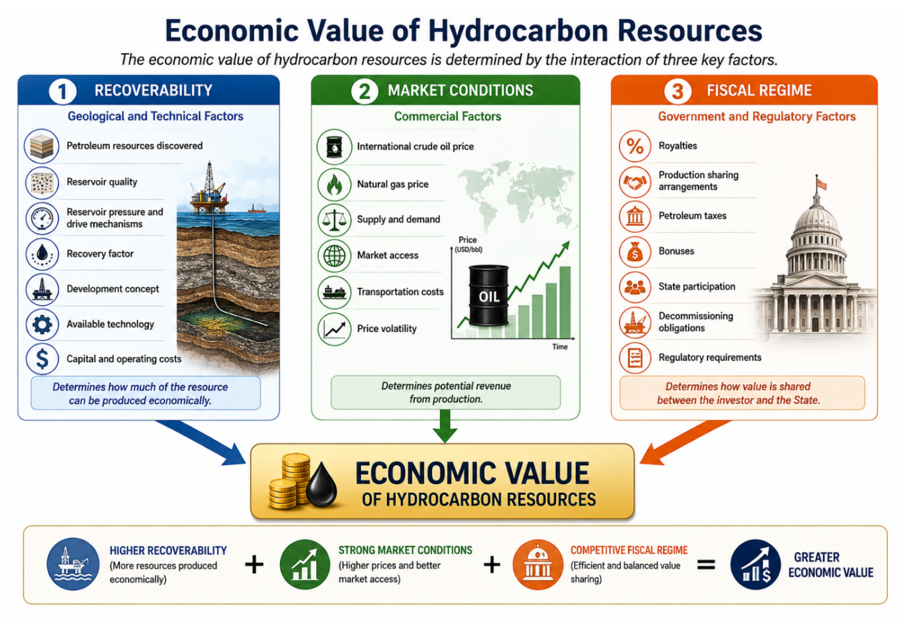
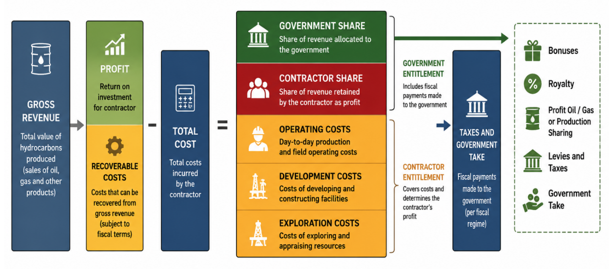
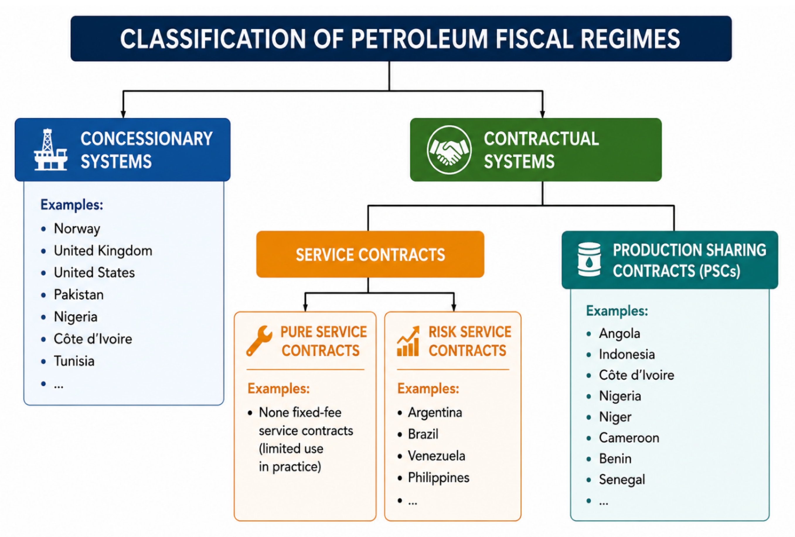

# Chapter 7: Petroleum Fiscal Regimes

Three main factors determine the economic value of a State’s petroleum resources (Figure 21). These are:

i) Recoverability, which is linked to the volume of petroleum resources discovered and the geological and technical conditions required for their development;

ii) Market conditions, defined by the international crude oil price; and

iii) The fiscal regime, which is the regulatory framework established by the State and which defines the instruments governing petroleum resource management.

Economic Value of Resources

- Recoverability (Resource volume, geological environment and development facilities)
- Market conditions (Crude oil price)
- Fiscal regime (Law and regulations)

Figure 68 The economic value of hydrocarbon resources is primarily determined by recoverability, market conditions, and the fiscal regime governing petroleum exploration, development, and production activities.

The petroleum economic rent of a producing State is the benefit derived by that State from the development of its petroleum resources. It is calculated by subtracting from the total monetary value of hydrocarbons in situ the various investments required for their development from exploration through to abandonment, as well as the share of profits allocated to the investor. It therefore represents, for the State as resource owner, the portion or fraction accruing to it, collected through a number of mechanisms including bonuses, royalties, dividends arising from direct State participation, its share of profit oil, and taxes.

The residual oil after deduction of investment costs (profit) known as profit oil is shared between the government (State) and the contractor in accordance with the fiscal regime under which both parties have entered into the petroleum contract.

The apparent and sometimes conflicting interests of the State and the contractor (IOC) observed during contract negotiations are linked to the degree of risk borne by each party.

Indeed, international oil companies (IOCs), which assume significant risks, aim to:i) ensure project profitability;ii) maximise returns to shareholders; and consequentlyiii) achieve high production levels over a relatively short plateau period in order to recover their investments rapidly, i.e. achieve a quick return on investment.

These risks include financial risks linked to the substantial investments required for petroleum exploration, political risks arising from instability (wars, regime change, etc.), economic risks linked to changes in fiscal regimes and/or sharp fluctuations in crude oil prices, and geological and technical risks.

By contrast, the State seeks to ensure:

- long-term benefits for its population;
- employment, welfare, and technology transfer; and consequently
- the longest possible production life with the highest possible recovery factor.

Figure 69 illustrates the typical distribution of revenues generated from petroleum production under a fiscal regime. Gross revenue from the sale of hydrocarbons is first used to recover eligible exploration, development, and operating costs incurred by the contractor. The remaining value, commonly referred to as profit oil or profit gas, is then shared between the contractor and the government in accordance with the terms of the applicable petroleum contract and fiscal framework. In addition to profit sharing, governments may receive revenues through royalties, bonuses, taxes, levies, and other fiscal instruments. The balance between government take and contractor entitlement is a key determinant of project economics and plays an important role in attracting investment while ensuring the State receives an equitable share of the value generated from its petroleum resources.

Figure 69 Illustration of how production revenues are allocated between cost recovery, contractor entitlement, and government take under a typical petroleum fiscal regime.

## 7.1- Fiscal System or Regime: Conceptual Foundations

The fiscal regime is the most important resource management tool available to States. It is therefore essential for all managers and decision-makers in the petroleum sector to understand its basic principles, types, advantages, and disadvantages.

The main objective of petroleum taxation is to capture economic rent, i.e. the surplus remaining after deducting costs and a reasonable return on invested capital. Institutions such as the World Bank and the IMF generally emphasise that governments should secure a fair share of this rent while still allowing investors sufficient upside potential to justify the risks incurred.

Petroleum projects require very large investments and extend over long periods, often several decades. As a result, fiscal systems must take uncertainty into account. A key principle is progressivity: the State’s share should increase with project profitability. This ensures project viability during low-price periods while enabling the State to benefit more during favourable market conditions.

At the same time, investors require stability. Sudden or unpredictable fiscal changes can undermine confidence and delay investment decisions. Governments, however, also require flexibility to adapt to changing economic conditions. Achieving the right balance between stability and adaptability remains one of the key challenges in designing and implementing effective petroleum fiscal systems.

There are two main families of petroleum fiscal systems: concessionary systems and contractual systems (Figure 23). The legal and regulatory framework governing petroleum exploration and production in any country depends on the fiscal regime adopted.

Figure 70 presents a simplified classification of the principal petroleum fiscal regimes used by governments to manage and monetise hydrocarbon resources. Petroleum fiscal systems generally fall into two broad categories: concessionary systems and contractual systems. Under concessionary systems, companies are granted rights to explore for and produce hydrocarbons in return for the payment of taxes, royalties, and other fiscal obligations. Contractual systems include service contracts and production sharing contracts (PSCs), under which the State retains ownership of the petroleum resources while defining how costs, risks, and revenues are allocated between the government and the contractor. The choice of fiscal regime has a significant influence on investment attractiveness, government revenues, and the overall economics of petroleum developments.

Figure 70 Overview of the principal petroleum fiscal regimes used worldwide, including concessionary systems, service contracts, and production sharing contracts, together with examples of countries where they are applied.

PETROLEUM FISCAL REGIMES

- CONCESSIONARY SYSTEMS
- CONTRACTUAL SYSTEMS
- Service Contracts
- Production Sharing Contracts

**Service Contracts**

- Pure service contracts
- Risk service contracts

Countries (examples):

- Norway, USA, UK, Pakistan, Nigeria, Côte d’Ivoire, Tunisia…
- Angola, Indonesia, Côte d’Ivoire, Nigeria, Niger, Cameroon, Benin, Senegal…
- Argentina, Brazil, Venezuela, Philippines…

## 7.2- The Concessionary System

The concession system, also known as a licence or lease system, is the oldest and most widely used petroleum fiscal regime. It is typically characterised by royalty-and-tax-based arrangements.

Key characteristics include:

- The petroleum company has exclusive rights to explore and produce at its own risk and cost;
- The company owns the production;
- The company pays ad valorem royalties and surface rents to the State;
- The company pays income tax on profits;
- The company has the right to export hydrocarbons;
- The company owns the equipment.

## 7.3- The Contractual System

This system comprises two main categories: Production Sharing Contracts (PSC) and Service Contracts.

### 7.3.1- Production Sharing Contract (PSC)

The Production Sharing Contract (PSC), also referred to as a Production Sharing Agreement (PSA), is the most commonly used petroleum contract in Africa. It is fundamentally based on three core elements: recoverable costs, profit oil sharing between the Government and the contractor, and profit taxation.

It was first implemented in Indonesia.

A typical PSC generally includes the following provisions:

a) Bonuses: including signature, discovery, or production bonuses. These are lump-sum payments made by the contractor under regulatory conditions and are generally non-recoverable costs.

b) Work obligations: define the scope of work to be undertaken during the contract period, including seismic acquisition (2D/3D), geological and geophysical studies, and the number and type of wells to be drilled.

c) Royalties: including ad valorem royalties and surface rentals (lease fees for the block or acreage).

d) Cost oil (recoverable costs): defines the petroleum operations and expenditures incurred by the contractor that are recoverable during production under PSC terms.

e) Profit oil: the share of remaining production after cost recovery, split between the contractor and the State according to pre-agreed formulas.

f) State participation: defines the State’s equity participation in exploration and development operations.

g) Domestic market obligations: ensure supply of hydrocarbons to the domestic market, typically at preferential prices, to support national energy security.

h) Local employment and training: includes provisions for local workforce development and knowledge transfer, increasingly formalised under local content laws.

Key characteristics of PSCs:

- The contractor shares risk with the State;
- The contractor receives a share of production, usually in kind;
- The State retains ownership of equipment;
- The State retains ownership of the hydrocarbons at all times.

### 7.3.2- Service Contracts

Service contracts are divided into pure service contracts and risk service contracts.

**Pure service contracts**

Under this model, the State assumes all risks and engages an oil company to explore and produce hydrocarbons in exchange for fixed remuneration unrelated to project profitability. These contracts are rare globally but exist in the Middle East. A similar arrangement was used in Benin in 1979 with SAGA Petroleum for the Sèmè field development. Comparable structures are also used with service companies such as PGS, Schlumberger, and others.

**Risk service contracts**

Risk service contracts involve the contractor assuming part of the risk and represent the most commonly used service contract type.

In this model:

- The contractor shares risk with the State;
- The contractor is remunerated in cash or profit-linked payments;
- The State retains ownership of equipment and hydrocarbons;
- The contractor never owns the hydrocarbons.

Risk service contracts are, in many respects, similar to production sharing contracts, except for the payment mechanism (cash versus in-kind), while the same economic principles govern both structures.

## 7.4- Contractual Frameworks in West Africa

Production Sharing Contracts (PSCs) are the dominant model in West Africa. They allow governments to retain ownership of resources while relying on private companies for capital and technical expertise. Under PSCs, contractors bear exploration and development risk, recover costs from production, and then share remaining profits with the State.

Concession systems are still used in certain countries, particularly those influenced by Anglo-Saxon legal traditions or with more mature petroleum sectors. Service contracts are less common but exist in specific cases. In practice, many countries adopt hybrid approaches combining elements of different systems to meet project-specific or policy objectives.

## 7.5- Structure of Petroleum Fiscal Systems in West Africa

Most fiscal systems in West Africa are based on a combination of instruments, each serving a specific function. Royalties generate early revenue streams but can be regressive, particularly for marginal fields. Cost recovery mechanisms, especially in PSCs, allow investors to recover expenditures, although these are usually capped to ensure the State begins receiving petroleum revenues within a reasonable timeframe.

Profit-based taxes, such as corporate income tax or capital gains tax, are the main instruments for capturing economic rent and introducing progressivity. Bonuses provide upfront payments but generally contribute less to total fiscal revenues. State participation, often through national oil companies, can enhance control and fiscal returns but also exposes the State to financial and operational risk.

It is the interaction between these elements, rather than any single component, that determines the overall government take and influences how investors assess risk and reward.

## 7.6- West African Perspective: Applying Petroleum Fiscal Regime Principles in West Africa

The design of petroleum fiscal regimes has played a critical role in shaping the development of West Africa's hydrocarbon sector. Across the region, governments have sought to balance two often competing objectives: maximising national benefits from petroleum resources while maintaining sufficient commercial incentives to attract investment and manage exploration risk.

The evolution of fiscal systems throughout West Africa illustrates how petroleum-producing countries adapt fiscal instruments to differing geological conditions, project economics, investment climates, and stages of petroleum sector development.

### 7.6.1- Regional Examples

Petroleum developments across West Africa range from:

- Mature onshore oil provinces
- Shallow-water developments
- Deepwater oil fields
- Ultra-deepwater projects
- Large offshore gas developments
- Frontier exploration areas

Because project economics vary significantly between these developments, fiscal systems must remain sufficiently flexible to accommodate different risk and cost profiles.

A fiscal framework suitable for a low-cost onshore oil development may be unsuitable for a high-cost deepwater gas project requiring billions of dollars in capital investment.

**Fiscal Design and Exploration Risk**

One of the most important lessons from West Africa is the relationship between fiscal terms and exploration risk.

**Frontier Areas**

Frontier basins typically exhibit:

- Limited geological information
- High exploration uncertainty
- Limited infrastructure
- Elevated development costs

In these circumstances, governments often provide fiscal incentives to encourage investment during the early stages of basin development.

**Mature Petroleum Provinces**

Once commercial discoveries have been established and geological risks reduced, governments are generally able to secure a larger share of petroleum revenues without significantly reducing investor interest.

This progression has occurred throughout several petroleum-producing regions of West Africa as basin maturity has increased.

**Balancing Government Revenue and Investment Attractiveness**

West African experience demonstrates that maximising government take does not necessarily maximise government revenue.

Excessively burdensome fiscal terms can:

- Reduce exploration activity
- Delay project sanctions
- Encourage capital to move to competing jurisdictions
- Lower long-term petroleum revenues

Conversely, excessively generous terms may result in governments receiving an insufficient share of resource value.

Successful fiscal systems seek to balance these competing objectives by allowing projects to remain commercially attractive while ensuring fair compensation for resource ownership.

**Influence of Petroleum Price Volatility**

West African petroleum projects have experienced multiple commodity price cycles over recent decades.

Periods of high prices often generate pressure for increased government participation and higher fiscal returns, while periods of lower prices frequently expose weaknesses in fiscal systems that are overly dependent on favourable market conditions.

The regional experience highlights the importance of designing fiscal regimes capable of remaining effective throughout both high-price and low-price environments.

**Deepwater Development Economics**

Many of West Africa's largest recent discoveries have occurred in deepwater and ultra-deepwater environments.

These developments typically require:

- Large capital investments
- Long development timelines
- Advanced technology
- Complex infrastructure
- Significant financing commitments

The commercial viability of such projects is highly sensitive to fiscal terms, particularly during the early stages of development when capital recovery is most critical.

West African experience demonstrates the importance of aligning fiscal structures with project economics rather than applying uniform terms across all development types.

**Natural Gas Commercialisation Challenges**

An increasing proportion of recent discoveries in West Africa contain significant natural gas resources.

Unlike crude oil, gas developments often require:

- LNG facilities
- Gas processing infrastructure
- Export pipelines
- Domestic market development
- Long-term sales agreements

Because of these additional requirements, gas projects frequently require fiscal frameworks specifically tailored to their economic characteristics.

Several major gas developments across the region have demonstrated the importance of differentiating between oil and gas fiscal treatment where project economics justify such an approach.

**Role of Contract Stability**

Petroleum investments commonly involve project lifecycles extending over several decades.

The West African experience consistently demonstrates that investors place considerable value on:

- Contract sanctity
- Fiscal predictability
- Stable legal frameworks
- Transparent regulatory processes

Frequent or unexpected changes to fiscal terms can increase investment risk and reduce future exploration activity.

Long-term stability remains one of the most important characteristics of successful petroleum fiscal systems.

### 7.6.2- Operational Lessons from West Africa

**Fiscal Systems Must Reflect Project Economics**

Different petroleum developments require different fiscal approaches. A one-size-fits-all system rarely achieves optimal outcomes.

**Exploration Activity Depends on Competitive Terms**

Exploration capital is highly mobile and tends to flow toward jurisdictions offering attractive risk-adjusted returns.

**Simplicity Improves Transparency**

Fiscal systems that are easily understood and administered generally reduce disputes and improve investor confidence.

**Price Cycles Should Be Anticipated**

Fiscal frameworks should remain effective across a wide range of commodity price scenarios rather than being designed around prevailing market conditions.

**Gas Projects Require Special Consideration**

The economics of gas developments often differ significantly from those of oil projects and may justify tailored fiscal provisions.

**Stability Encourages Long-Term Investment**

Predictable fiscal systems reduce uncertainty and support sustained investment throughout the life of petroleum projects.

### 7.6.3- Key Takeaways

The West African petroleum industry demonstrates that effective fiscal regime design requires balancing government revenue objectives with commercial realities. Successful fiscal systems recognise differences in geological risk, project economics, development costs, and market conditions while maintaining transparency, stability, and investor confidence. The regional experience shows that the most effective fiscal frameworks are those that adapt to changing industry conditions while preserving the long-term competitiveness of the petroleum sector.
