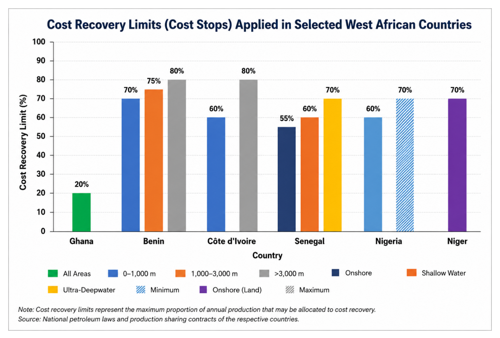
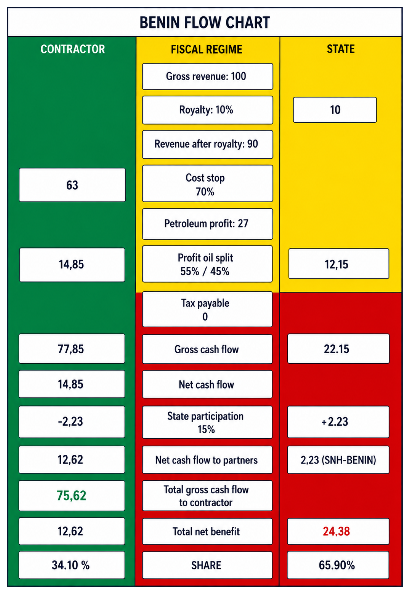
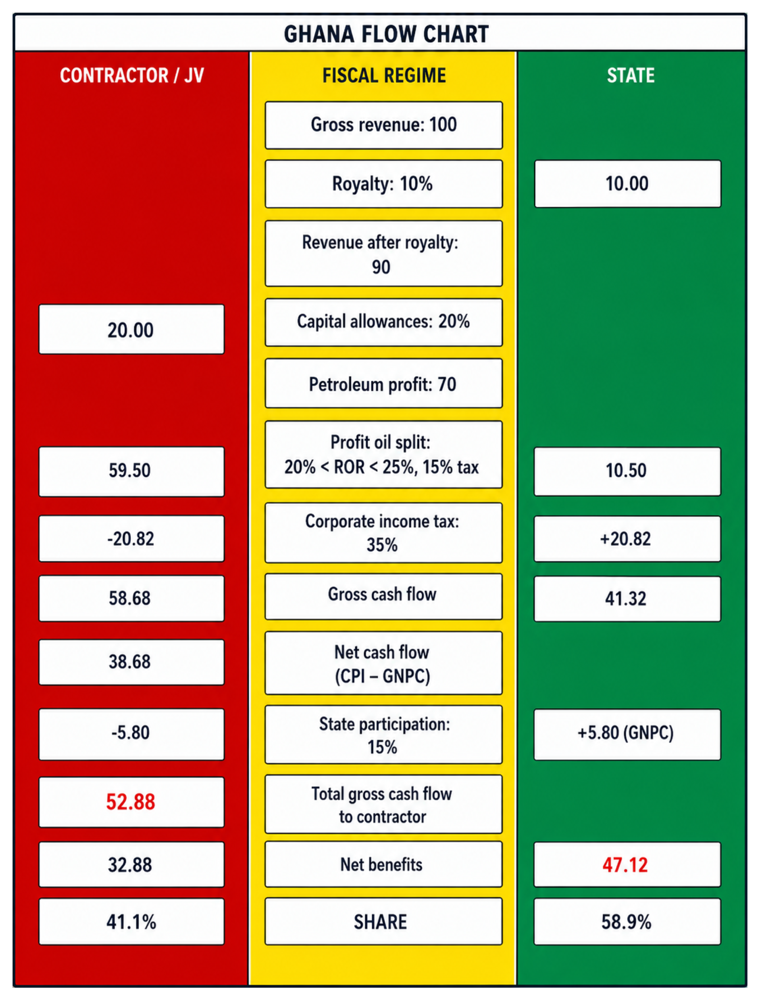
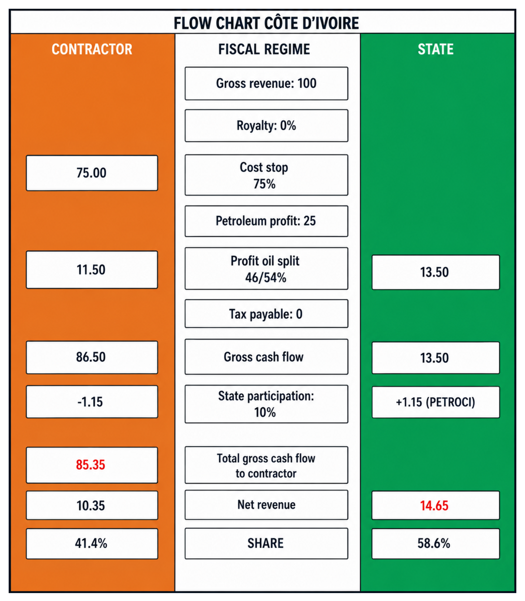
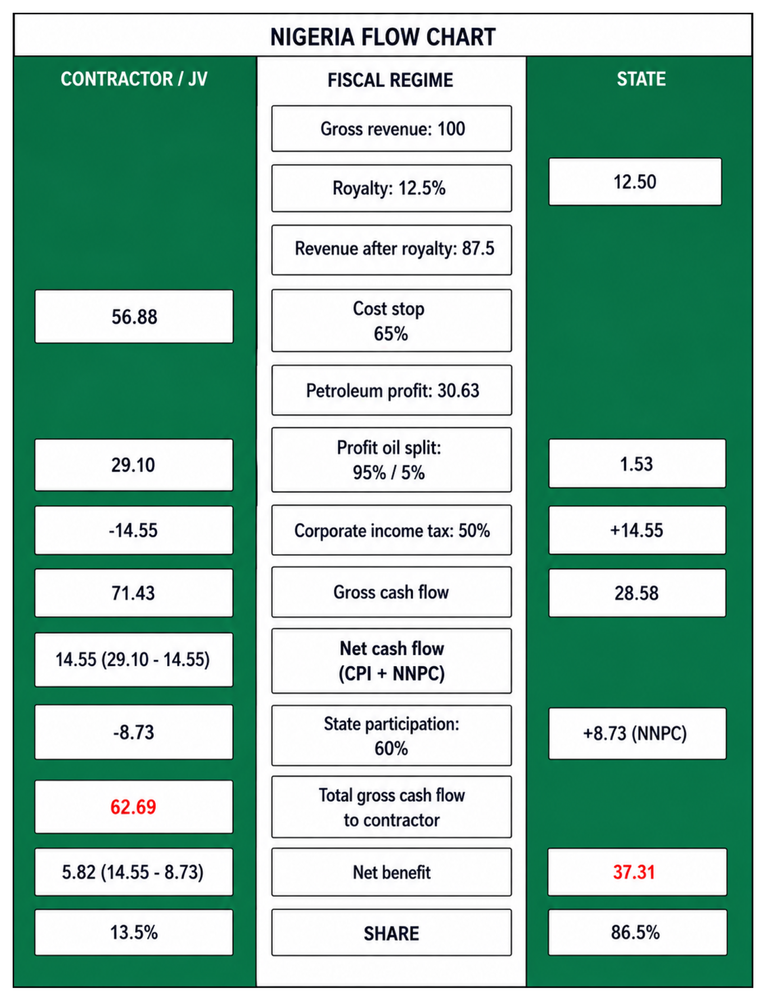
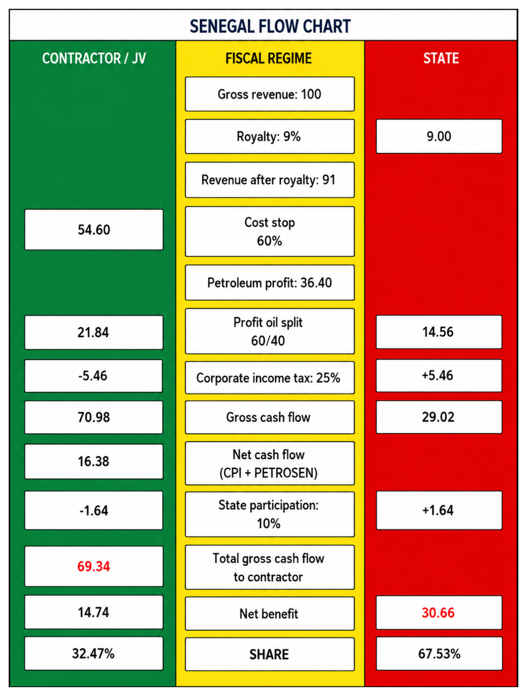
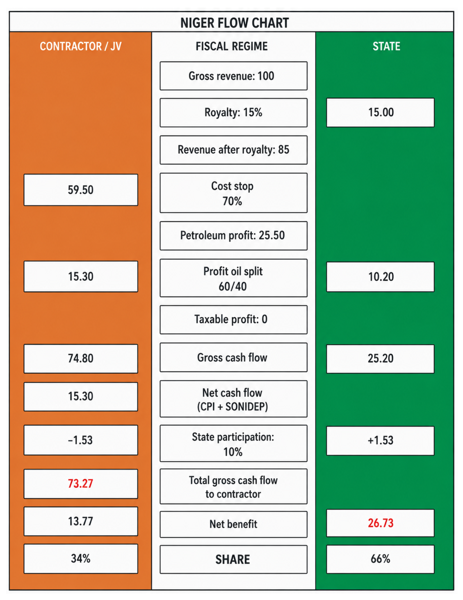
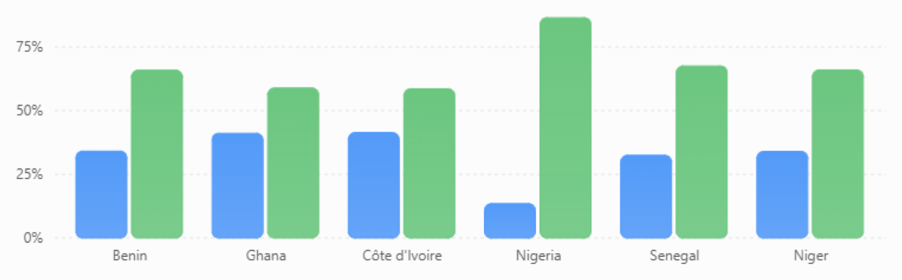
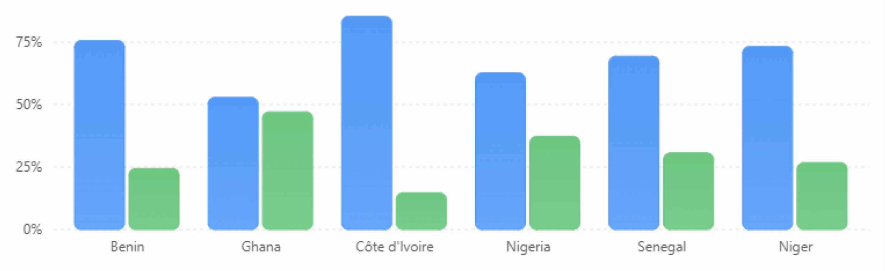

# Chapter 9: West African Fiscal Regimes

Case studies: Benin, Niger, Ghana, Côte d’Ivoire, Nigeria and Senegal

## 9.1- Petroleum Financial Flow Modelling

Before the commencement of petroleum negotiations, the State, as resource owner, must develop a simplified financial or economic flow diagram (flow chart) showing the distribution of revenues between the contractor and the State.

This diagram serves as a simplified economic model that enables the State to understand the petroleum rent it will receive after development. It is a decision-support tool that allows resource-owning States to better evaluate their fiscal regime and identify the negotiable parameters that should be optimised during contract negotiations in order to maximise resource value.

The legal and regulatory instruments underpinning the design of this decision-support tool are the petroleum code and, in particular, the fiscal regime.

### 9.1.1- Petroleum Code

The petroleum code is the legal instrument governing petroleum operations. It includes provisions designed to encourage oil companies or consortia to undertake petroleum operations, given the high cost of exploration activities, while also regulating the distribution of revenues between the State and its partners.

### 9.1.2- Fiscal Regime

The fiscal regime is generally established under petroleum legislation. For example, in Benin, Law No. 2019-06 of 15 November 2019 establishing the Petroleum Code provides exclusively for the Production Sharing Contract (PSC) as the applicable fiscal regime for upstream exploration and production activities.

A model PSC was subsequently adopted by decree in 2020.

Other countries provide, in addition to PSCs, alternative fiscal systems such as concession contracts and service contracts. In Nigeria and Côte d’Ivoire, for example, legislation allows both PSCs and concession contracts.

The key fiscal elements used to construct simplified revenue flow diagrams include:

- Ad valorem royalties
- Cost oil
- Profit oil
- Corporate income tax
- State participation in petroleum operations

Bonuses and ad valorem royalties are upfront payments to the State and are not based on project profitability. They are designed to reduce State risk exposure. However, when excessively high, they make the fiscal regime regressive and less attractive to investors.

Conversely, a regressive system discourages investors, who generally prefer progressive fiscal regimes in which State revenue is more strongly linked to project profitability (income tax, supplementary taxes, etc.).

## 9.2- Key Fiscal Elements in Selected West African Countries

### 9.2.1- Ad Valorem Royalty

At the first production of oil or gas, a portion is directly allocated to the resource-owning State before any cost deduction or profit sharing. This is known as a royalty.

It is mainly applied under concession contracts but is also included in PSCs as a risk-mitigation mechanism for reservoir uncertainty.

If set too high in PSCs, it may lead to premature field abandonment by contractors.

Royalties may be paid in kind or in cash.

Post-royalty revenue is defined as:

  Post-Royalty Revenue = Gross Revenue &minus; Royalty

Gross revenue depends on production volume, crude quality, and international oil price fluctuations.

<table>
<caption>
Table 11 Summary of Ad Valorem Royalty Rates Applied in Selected West African Countries.
</caption>
<thead>
<tr>
  <th>
<strong>Country</strong>
</th>
  <th>
<strong>Offshore (Shallow Water)</strong>
</th>
  <th>
<strong>Offshore (Deepwater)</strong>
</th>
  <th>
<strong>Onshore Oil</strong>
</th>
  <th>
<strong>Natural Gas</strong>
</th>
  <th>
<strong>Comments</strong>
</th>
</tr>
</thead>
<tbody>
<tr>
  <td>
Ghana
</td>
  <td>
5–12%
</td>
  <td>
5–12%
</td>
  <td>
—
</td>
  <td>
4–10%
</td>
  <td></td>
</tr>
<tr>
  <td>
Benin
</td>
  <td>
10–15%
</td>
  <td>
10–15%
</td>
  <td>
—
</td>
  <td>
2.5–5%
</td>
  <td></td>
</tr>
<tr>
  <td>
Côte d'Ivoire
</td>
  <td>
—
</td>
  <td>
—
</td>
  <td>
—
</td>
  <td>
—
</td>
  <td>
No royalty
</td>
</tr>
<tr>
  <td>
Senegal
</td>
  <td>
9%
</td>
  <td>
8%
</td>
  <td>
10%
</td>
  <td>
6%
</td>
  <td></td>
</tr>
<tr>
  <td>
Nigeria
</td>
  <td>
12.5%
</td>
  <td>
7.5%
</td>
  <td>
15%
</td>
  <td>
2.5–5%
</td>
  <td></td>
</tr>
<tr>
  <td>
Niger
</td>
  <td>
—
</td>
  <td>
—
</td>
  <td>
15%
</td>
  <td>
2.5–5%
</td>
  <td>
No offshore basin
</td>
</tr>
</tbody>
</table>

- Ghana: Oil 5-12% (offshore), 4-10% (onshore); Gas 8-10% / 6%
- Benin: Oil 10-15% (offshore), 2.5-5% (onshore)
- Côte d’Ivoire: No royalty (PSA framework)
- Senegal: Oil 9%, Gas 8-10%, offshore variations
- Nigeria: Oil 12.5% (shallow), 7.5% (deep); Gas 15%, 2.5-5%
- Niger: No offshore basin; gas 15%, 2.5-5%

Royalty rates generally do not exceed 15% in West Africa and vary depending on:

- Fluid type - oil royalties are higher than gas royalties
- Geological setting - lower in deepwater due to higher investment risk
- Price and production-based mechanisms - Nigeria applies additional royalties linked to price and production levels

Côte d’Ivoire’s absence of royalty improves investment attractiveness.

Benin’s offshore royalty structure is less competitive than Ghana, Senegal, Côte d’Ivoire and Nigeria.

### 9.2.2- Recoverable Petroleum Costs

Recoverable costs include exploration, development and operating expenditures incurred by contractors, including depreciation and amortisation.

Before profit oil is shared, a portion of production is allocated to cost recovery.

A ceiling is typically imposed, known as Cost Stop.

Higher cost recovery rates improve investor attractiveness but reduce early State revenues.

**Cost Stop analysis**

Cost stop levels vary between approximately 55% and 80%, depending on water depth:

- Onshore: lower cost stop
- Shallow offshore: moderate
- Deep and ultra-deep offshore: higher levels to attract investment

Ghana applies a linear recovery model of 20% per year over five years, independent of production levels.

Figure 71 Comparison of cost recovery limits under selected West African petroleum fiscal regimes, illustrating variations by country and development environment.

### 9.2.3- Profit Oil

Profit oil is the portion remaining after deduction of royalty and recoverable costs, shared between the State and contractor.

<!-- parity-ignore:start -->
<section class="formula-group formula-group--split formula-group--oil-profit" data-equation-label="9.2" aria-label="Profit oil formulas">
  

    

      Profit Oil = Post-Royalty Revenue &minus; Recoverable Costs
    

  

  

    or
  

  

    

      Profit Oil = Gross Revenue &minus; Royalty &minus; Recoverable Costs
    

  

</section>
<!-- parity-ignore:end -->

Profit Oil = Post-Royalty Revenue - Recoverable Costs

Profit Oil = Gross Revenue - Royalty - Recoverable Costs

It is analogous to taxable income under concession systems.

In Benin and Niger PSCs, contractor profit oil may not be subject to additional taxation.

**Profit oil allocation mechanisms**

Two main approaches exist:

- Production-based allocation (daily or cumulative production thresholds)
- Economic-based allocation using the R-factor

**R-factor definition**

Common formulations include:

<!-- parity-ignore:start -->
<section class="formula-panel formula-panel--r-factor" data-equation-label="9.3" aria-label="R-factor calculation formulas">
  

    R = cumulative revenue / cumulative cost
  

  

    R = (revenues &minus; OPEX) / CAPEX
  

  

    R = net revenue / total cost
  

</section>
<!-- parity-ignore:end -->

- R = cumulative revenue / cumulative cost
- R = (revenues - OPEX) / CAPEX
- R = net revenue / total cost

As R increases, project profitability increases, and the State share typically rises.

<table>
<caption>
Table 12 Summary of Profit Oil Sharing Mechanisms and Government Profit Oil Entitlements in Selected West African Countries.
</caption>
<thead>
<tr>
  <th>
<strong>Country</strong>
</th>
  <th>
<strong>Profit Oil Sharing Mechanism</strong>
</th>
  <th>
<strong>Indicator Used</strong>
</th>
  <th>
<strong>Government Profit Oil Entitlement</strong>
</th>
</tr>
</thead>
<tbody>
<tr>
  <td>
<strong>Benin</strong>
</td>
  <td>
Sliding scale based on project profitability
</td>
  <td>
R-Factor (R)
</td>
  <td>
<strong>40–65%</strong>
</td>
</tr>
<tr>
  <td></td>
  <td>
Water depth 0–1,000 m
</td>
  <td>
R &lt; 1
</td>
  <td>
45%
</td>
</tr>
<tr>
  <td></td>
  <td></td>
  <td>
1 ≤ R &lt; 1.5
</td>
  <td>
50%
</td>
</tr>
<tr>
  <td></td>
  <td></td>
  <td>
1.5 ≤ R &lt; 2
</td>
  <td>
55%
</td>
</tr>
<tr>
  <td></td>
  <td></td>
  <td>
2 ≤ R &lt; 2.5
</td>
  <td>
60%
</td>
</tr>
<tr>
  <td></td>
  <td></td>
  <td>
R ≥ 2.5
</td>
  <td>
65%
</td>
</tr>
<tr>
  <td></td>
  <td>
Water depth &gt; 1,000 m
</td>
  <td>
R &lt; 1
</td>
  <td>
40%
</td>
</tr>
<tr>
  <td></td>
  <td></td>
  <td>
1 ≤ R &lt; 1.5
</td>
  <td>
45%
</td>
</tr>
<tr>
  <td></td>
  <td></td>
  <td>
1.5 ≤ R &lt; 2
</td>
  <td>
50%
</td>
</tr>
<tr>
  <td></td>
  <td></td>
  <td>
2 ≤ R &lt; 2.5
</td>
  <td>
55%
</td>
</tr>
<tr>
  <td></td>
  <td></td>
  <td>
R ≥ 2.5
</td>
  <td>
60%
</td>
</tr>
<tr>
  <td>
<strong>Ghana</strong>
</td>
  <td>
Additional Oil Entitlement (AOE) based on project profitability
</td>
  <td>
Rate of Return (RoR)
</td>
  <td>
<strong>0–25%</strong>
</td>
</tr>
<tr>
  <td></td>
  <td></td>
  <td>
RoR &lt; 15%
</td>
  <td>
0%
</td>
</tr>
<tr>
  <td></td>
  <td></td>
  <td>
15% ≤ RoR &lt; 20%
</td>
  <td>
10%
</td>
</tr>
<tr>
  <td></td>
  <td></td>
  <td>
20% ≤ RoR &lt; 25%
</td>
  <td>
15%
</td>
</tr>
<tr>
  <td></td>
  <td></td>
  <td>
25% ≤ RoR &lt; 30%
</td>
  <td>
20%
</td>
</tr>
<tr>
  <td></td>
  <td></td>
  <td>
RoR ≥ 30%
</td>
  <td>
25%
</td>
</tr>
<tr>
  <td>
<strong>Côte d'Ivoire</strong>
</td>
  <td>
Production sharing linked to production and oil price
</td>
  <td>
H-Factor
</td>
  <td>
Negotiable
</td>
</tr>
<tr>
  <td></td>
  <td>
Example (Total PSC, 2019)
</td>
  <td class="table-12-h-factor-cell">
    

      H = 1.626 &minus; 0.141 ln (oil price indexed to December 2011)
    

  </td>
  <td>
State share varies according to contract terms and H-factor
</td>
</tr>
<tr>
  <td>
<strong>Nigeria</strong>
</td>
  <td>
Sliding scale based on cumulative production
</td>
  <td>
Cumulative Production (Pc)
</td>
  <td>
<strong>5–45%</strong>
</td>
</tr>
<tr>
  <td></td>
  <td></td>
  <td>
Pc &lt; 50 million bbl
</td>
  <td>
5%
</td>
</tr>
<tr>
  <td></td>
  <td></td>
  <td>
50 ≤ Pc &lt; 100 million bbl
</td>
  <td>
10%
</td>
</tr>
<tr>
  <td></td>
  <td></td>
  <td>
100 ≤ Pc &lt; 350 million bbl
</td>
  <td>
15%
</td>
</tr>
<tr>
  <td></td>
  <td></td>
  <td>
350 ≤ Pc &lt; 750 million bbl
</td>
  <td>
25%
</td>
</tr>
<tr>
  <td></td>
  <td></td>
  <td>
750 ≤ Pc &lt; 1,500 million bbl
</td>
  <td>
35%
</td>
</tr>
<tr>
  <td></td>
  <td></td>
  <td>
Pc ≥ 1,500 million bbl
</td>
  <td>
45%
</td>
</tr>
<tr>
  <td>
<strong>Senegal</strong>
</td>
  <td>
Sliding scale based on project profitability
</td>
  <td>
R-Factor (R)
</td>
  <td>
<strong>40–60%</strong>
</td>
</tr>
<tr>
  <td></td>
  <td></td>
  <td>
R &lt; 1
</td>
  <td>
40%
</td>
</tr>
<tr>
  <td></td>
  <td></td>
  <td>
1 ≤ R &lt; 2
</td>
  <td>
45%
</td>
</tr>
<tr>
  <td></td>
  <td></td>
  <td>
2 ≤ R &lt; 3
</td>
  <td>
55%
</td>
</tr>
<tr>
  <td></td>
  <td></td>
  <td>
R ≥ 3
</td>
  <td>
60%
</td>
</tr>
<tr>
  <td>
<strong>Niger</strong>
</td>
  <td>
Sliding scale based on project profitability
</td>
  <td>
R-Factor (R)
</td>
  <td>
<strong>40–60%</strong>
</td>
</tr>
<tr>
  <td></td>
  <td></td>
  <td>
R &lt; 1
</td>
  <td>
40%
</td>
</tr>
<tr>
  <td></td>
  <td></td>
  <td>
1 ≤ R &lt; 2
</td>
  <td>
45%
</td>
</tr>
<tr>
  <td></td>
  <td></td>
  <td>
2 ≤ R &lt; 3
</td>
  <td>
55%
</td>
</tr>
<tr>
  <td></td>
  <td></td>
  <td>
R ≥ 3
</td>
  <td>
60%
</td>
</tr>
</tbody>
</table>

- Côte d’Ivoire: production + price-linked factor H
- Nigeria: production-based (5-45%)
- Senegal: R-factor (40-60%)
- Niger: R-factor (40-60%)

### 9.2.4- Corporate Income Tax

- Benin & Niger: tax embedded in State profit oil
- Nigeria, Ghana, Senegal: direct corporate taxation applies
- Côte d’Ivoire: generally included within State share in PSCs

Nigeria applies the highest corporate tax rates in the region.

<table>
<caption>
Table 13 Corporate Income Tax Rates for Petroleum Operations in some West African Countries.
</caption>
<thead>
<tr>
  <th>
<strong>Country</strong>
</th>
  <th>
<strong>Corporate Income Tax Rate (%)</strong>
</th>
  <th>
<strong>Remarks</strong>
</th>
</tr>
</thead>
<tbody>
<tr>
  <td>
<strong>Benin</strong>
</td>
  <td>
Included within the State's profit oil share
</td>
  <td>
Corporate income tax is generally paid from the State's share of profit oil.
</td>
</tr>
<tr>
  <td>
<strong>Ghana</strong>
</td>
  <td>
35%
</td>
  <td>
Standard petroleum income tax rate.
</td>
</tr>
<tr>
  <td>
<strong>Côte d'Ivoire</strong>
</td>
  <td>
Included within the State's profit oil share
</td>
  <td>
Generally paid from the State's profit oil share under petroleum contracts (e.g. ENI PSC, 2019).
</td>
</tr>
<tr>
  <td>
<strong>Nigeria</strong>
</td>
  <td>
50%
</td>
  <td>
Petroleum profit tax applicable under the fiscal regime.
</td>
</tr>
<tr>
  <td>
<strong>Senegal</strong>
</td>
  <td>
30%
</td>
  <td>
Standard corporate income tax rate applicable to petroleum operations.
</td>
</tr>
<tr>
  <td>
<strong>Niger</strong>
</td>
  <td>
Included within the State's profit oil share
</td>
  <td>
Corporate income tax is generally paid from the State's share of profit oil.
</td>
</tr>
</tbody>
</table>

- Benin: included in State share
- Ghana: 35%
- Côte d’Ivoire: included in PSC
- Nigeria: 50%
- Senegal: 30%
- Niger: included in State share

### 9.2.5- State Participation

State participation is a key mechanism for increasing national capture of petroleum rent.

It is generally implemented through National Oil Companies.

Benefits include:

- Increased fiscal revenue via dividends
- Greater operational control
- Local capacity development

<table>
<caption>
Table 14 State Participation in Petroleum Projects in Selected West African Countries.
</caption>
<thead>
<tr>
  <th>
<strong>Country</strong>
</th>
  <th>
<strong>Initial State Participation (%)</strong>
</th>
  <th>
<strong>Additional State Participation (%)</strong>
</th>
  <th>
<strong>Total Potential Participation (%)</strong>
</th>
</tr>
</thead>
<tbody>
<tr>
  <td>
<strong>Benin</strong>
</td>
  <td>
10–15
</td>
  <td>
Possible
</td>
  <td>
Up to 15
</td>
</tr>
<tr>
  <td>
<strong>Ghana</strong>
</td>
  <td>
15
</td>
  <td>
5
</td>
  <td>
20
</td>
</tr>
<tr>
  <td>
<strong>Côte d'Ivoire</strong>
</td>
  <td>
10
</td>
  <td>
12
</td>
  <td>
22
</td>
</tr>
<tr>
  <td>
<strong>Nigeria</strong>
</td>
  <td>
60
</td>
  <td>
–
</td>
  <td>
60
</td>
</tr>
<tr>
  <td>
<strong>Senegal</strong>
</td>
  <td>
10
</td>
  <td>
20
</td>
  <td>
30
</td>
</tr>
<tr>
  <td>
<strong>Niger</strong>
</td>
  <td>
10–20
</td>
  <td>
–
</td>
  <td>
20
</td>
</tr>
</tbody>
</table>

## 9.3- Comparative Analysis of Fiscal Regimes

To align with the country coverage you've developed in Section 9.5, I would expand 9.3 Comparative Analysis of Fiscal Regimes to include all major West African jurisdictions using a consistent format.

- 9.3. Comparative Analysis of Fiscal Regimes

**9.3.1. Nigeria**

Nigeria's fiscal system is one of the most complex in the region, reflecting decades of progressive evolution. The Petroleum Industry Act (PIA) of 2021 consolidated many of these elements, introducing a dual fiscal structure comprising a Hydrocarbon Tax and Companies Income Tax, while also revising the royalty framework.

Royalties now vary according to terrain and production levels. Deepwater projects benefit from relatively low royalty rates, whereas onshore and shallow-water operations are subject to higher rates, including price-linked components that increase fiscal progressivity. Historically, Production Sharing Contracts (PSCs) allowed cost recovery limits of up to 80%, which encouraged investment but delayed the State's initial revenue stream. The PIA sought to correct this imbalance by reducing the cost recovery limit to 70%, although implementation challenges remain, particularly regarding cost verification and regulatory coordination.

Nigeria offers significant resource potential and substantial growth opportunities; however, these advantages are offset by fiscal complexity and operational risks.

**9.3.2. Ghana**

Ghana's fiscal regime combines royalties, petroleum income tax, State participation, and negotiated contractual provisions. The framework is widely regarded as one of the most transparent and balanced in Africa, providing investors with fiscal stability while ensuring meaningful government participation in petroleum revenues.

The State participates through the Ghana National Petroleum Corporation (GNPC), which typically holds a carried interest and may acquire additional participating interests. Ghana's relatively stable political environment and predictable regulatory framework have contributed significantly to the success of major offshore developments such as Jubilee, TEN, and Sankofa.

**9.3.3. Côte d'Ivoire**

Côte d'Ivoire utilises a PSC-based fiscal system designed to encourage exploration while maintaining a competitive government take. The country has successfully attracted international investment through a combination of attractive fiscal terms, regulatory stability, and significant offshore prospectivity.

Recent deepwater discoveries have strengthened investor confidence and demonstrated the effectiveness of the country's fiscal framework in promoting exploration and development activities.

**9.3.4. Senegal**

Senegal's fiscal framework is centred on Production Sharing Contracts supported by taxation and State participation. The regime has gained international attention following major offshore oil and gas discoveries within the MSGBC Basin.

The fiscal system seeks to balance investor returns with long-term national benefits. Ongoing developments such as Sangomar and Greater Tortue Ahmeyim have tested the practical implementation of the country's fiscal framework and regulatory institutions.

**9.3.5. Mauritania**

Mauritania employs a PSC-based fiscal regime that has evolved to support large-scale offshore gas developments. The country's emergence as a major gas producer through the Greater Tortue Ahmeyim project has increased the importance of fiscal stability and investor confidence.

The regime remains relatively competitive, particularly for offshore frontier exploration, reflecting the technical and commercial risks associated with deepwater developments.

**9.3.6. Niger**

Niger's fiscal framework combines PSC arrangements, royalties, taxation, and State participation. Unlike many West African producers, Niger's petroleum sector is dominated by onshore developments within the Agadem Basin.

The fiscal regime has supported the transition from domestic-focused production to export-oriented operations following the construction of the Niger-Benin Export Pipeline. Nevertheless, logistical constraints and security considerations continue to influence project economics.

**9.3.7. Benin**

Benin operates a PSC-based fiscal system designed to attract investment into both offshore and onshore frontier acreage. Fiscal terms are generally considered competitive, reflecting the country's limited production history and relatively high exploration risk.

Future fiscal competitiveness will depend largely on the ability to attract sustained exploration activity and demonstrate commercial hydrocarbon potential.

**9.3.8. Liberia**

Liberia's PSC framework is designed to encourage investment in frontier offshore exploration along the West African Transform Margin. Fiscal terms are generally attractive compared with more mature producing jurisdictions, reflecting the absence of commercial production and the higher risks associated with deepwater exploration.

The government seeks to balance investor incentives with future revenue generation should commercial discoveries be developed.

**9.3.9. Sierra Leone**

Sierra Leone employs a PSC-based fiscal regime aimed at promoting offshore exploration and development. Although several hydrocarbon discoveries have been made, commercial production has yet to commence.

The fiscal framework remains competitive by regional standards and is intended to offset the technical and financial challenges associated with deepwater exploration projects.

**9.3.10. Guinea**

Guinea maintains a PSC-based fiscal framework focused on attracting investment into underexplored offshore areas. The country has adopted relatively investor-friendly terms to compensate for geological uncertainty and limited exploration activity.

As exploration progresses, the fiscal regime may evolve to reflect changes in resource potential and industry interest.

**9.3.11. Guinea-Bissau**

Guinea-Bissau operates a PSC-based system designed to attract exploration investment within the MSGBC Basin. Given the country's frontier status and absence of commercial production, fiscal terms are generally favourable to investors.

The principal challenge remains converting geological potential into sustained exploration activity.

**9.3.12. The Gambia**

The Gambia's fiscal framework follows the PSC model commonly used throughout West Africa. The regime is intended to encourage offshore exploration within the highly prospective MSGBC Basin.

Competitive fiscal terms have been adopted to attract international operators despite the country's limited petroleum sector infrastructure and exploration history.

**9.3.13. Togo**

Togo utilises a PSC-based fiscal system designed to promote exploration within the Dahomey Basin. The country's fiscal terms are generally structured to compensate for frontier exploration risk while ensuring future government participation in petroleum revenues.

Limited exploration activity means that the effectiveness of the regime remains largely untested.

**9.3.14. Burkina Faso**

Burkina Faso has established a fiscal framework based on PSC principles despite not yet achieving commercial hydrocarbon production. Fiscal terms are designed to attract investment into frontier inland basins where geological uncertainty remains high.

The country's competitiveness is influenced by both exploration risk and broader security considerations.

**9.3.15. Mali**

Mali's fiscal regime similarly focuses on encouraging frontier exploration through investor-friendly PSC arrangements. Large underexplored basins such as the Taoudeni Basin offer potential long-term opportunities, although significant geological, infrastructure, and security challenges remain.

The fiscal framework reflects the need to attract high-risk exploration capital.

**9.3.16. Cabo Verde**

Cabo Verde employs a PSC-based fiscal system designed to encourage offshore frontier exploration. Given the absence of commercial discoveries and the technical challenges associated with deepwater exploration, fiscal terms are generally structured to maximise investor attractiveness.

The country's future competitiveness will depend on successful exploration outcomes and improved understanding of its offshore petroleum systems.

**9.3.17. Regional Fiscal Comparison**

Across West Africa, fiscal regimes generally converge around Production Sharing Contract structures supplemented by taxation, royalties, and varying levels of State participation. Established producers such as Nigeria, Ghana, Côte d'Ivoire, Senegal, and Mauritania typically impose higher government participation while benefiting from proven petroleum systems and established infrastructure.

In contrast, frontier jurisdictions such as Guinea-Bissau, The Gambia, Guinea, Liberia, Sierra Leone, Togo, Mali, Burkina Faso, and Cabo Verde generally offer more attractive fiscal terms to compensate for higher geological, technical, and commercial risks. The overall trend across the region is towards balancing government revenue objectives with the need to remain competitive in attracting international petroleum investment.

<table>
<caption>
Table 15 Summary of Key Fiscal Terms in Selected West African Petroleum Regimes.
</caption>
<thead>
<tr>
  <th>
<strong>Country</strong>
</th>
  <th>
<strong>Royalty (%)</strong>
</th>
  <th>
<strong>Cost Recovery Limit (%)</strong>
</th>
  <th>
<strong>Government Profit Oil Share (%)</strong>
</th>
  <th>
<strong>Corporate Income Tax (%)</strong>
</th>
  <th>
<strong>State Participation (%)</strong>
</th>
</tr>
</thead>
<tbody>
<tr>
  <td>
Nigeria
</td>
  <td>
5–15
</td>
  <td>
60–70
</td>
  <td>
5–45
</td>
  <td>
50
</td>
  <td>
High / NNPC participation
</td>
</tr>
<tr>
  <td>
Ghana
</td>
  <td>
5–12.5
</td>
  <td>
Usually not PSC-style; effectively limited by contract
</td>
  <td>
AOE 0–25
</td>
  <td>
35
</td>
  <td>
15–20, including carried interest
</td>
</tr>
<tr>
  <td>
Côte d'Ivoire
</td>
  <td>
None / included in PSC economics
</td>
  <td>
60–80
</td>
  <td>
Negotiable; production / H-factor linked
</td>
  <td>
25
</td>
  <td>
10–22, including carried interest
</td>
</tr>
<tr>
  <td>
Senegal
</td>
  <td>
7–10
</td>
  <td>
55–70
</td>
  <td>
40–60
</td>
  <td>
30
</td>
  <td>
10–30, including PETROSEN interest
</td>
</tr>
<tr>
  <td>
Mauritania
</td>
  <td>
Negotiable / PSC-based
</td>
  <td>
60 oil / 65 gas
</td>
  <td>
Profitability-linked
</td>
  <td>
≥25
</td>
  <td>
Minimum 10 through SMHPM
</td>
</tr>
<tr>
  <td>
Niger
</td>
  <td>
15
</td>
  <td>
70
</td>
  <td>
40–60
</td>
  <td>
25
</td>
  <td>
10–20, including carried interest
</td>
</tr>
<tr>
  <td>
Benin
</td>
  <td>
10–15
</td>
  <td>
70–80
</td>
  <td>
Minimum 40–45 tax oil / profit oil share
</td>
  <td>
Paid from State share of profit oil
</td>
  <td>
Up to 20, including up to 10 carried
</td>
</tr>
<tr>
  <td>
Liberia
</td>
  <td>
5–10
</td>
  <td>
Negotiable
</td>
  <td>
Negotiable / rate-of-return linked
</td>
  <td>
25–30
</td>
  <td>
Negotiable through NOCAL
</td>
</tr>
<tr>
  <td>
Sierra Leone
</td>
  <td>
10 oil / 5 gas
</td>
  <td>
Negotiable
</td>
  <td>
Progressive revenue-sharing mechanism
</td>
  <td>
25–30
</td>
  <td>
Negotiable
</td>
</tr>
<tr>
  <td>
Guinea
</td>
  <td>
Negotiable
</td>
  <td>
Negotiable
</td>
  <td>
Negotiable
</td>
  <td>
General corporate tax / petroleum contract terms
</td>
  <td>
Negotiable
</td>
</tr>
<tr>
  <td>
Guinea-Bissau
</td>
  <td>
Negotiable
</td>
  <td>
Negotiable
</td>
  <td>
Negotiable
</td>
  <td>
General corporate tax / PSC terms
</td>
  <td>
Negotiable
</td>
</tr>
<tr>
  <td>
The Gambia
</td>
  <td>
Negotiable
</td>
  <td>
Negotiable
</td>
  <td>
Negotiable
</td>
  <td>
General corporate tax / PSC terms
</td>
  <td>
Negotiable
</td>
</tr>
<tr>
  <td>
Togo
</td>
  <td>
2–10 oil; gas royalty may also apply
</td>
  <td>
Negotiable
</td>
  <td>
Negotiable
</td>
  <td>
General corporate tax / PSC terms
</td>
  <td>
Negotiable
</td>
</tr>
<tr>
  <td>
Burkina Faso
</td>
  <td>
Negotiable / not well tested
</td>
  <td>
Negotiable
</td>
  <td>
Negotiable
</td>
  <td>
General corporate tax / petroleum contract terms
</td>
  <td>
Negotiable
</td>
</tr>
<tr>
  <td>
Mali
</td>
  <td>
Negotiable / not well tested
</td>
  <td>
Negotiable
</td>
  <td>
Negotiable
</td>
  <td>
General corporate tax / petroleum contract terms
</td>
  <td>
Negotiable
</td>
</tr>
<tr>
  <td>
Cabo Verde
</td>
  <td>
Negotiable / PSC-based
</td>
  <td>
Negotiable
</td>
  <td>
Negotiable
</td>
  <td>
General corporate tax / PSC terms
</td>
  <td>
Negotiable
</td>
</tr>
</tbody>
</table>

Benin’s Petroleum Code provides clearer published guidance: cost recovery is capped at 70-80%, minimum tax oil/profit oil rates are 40-45%, and the State may acquire up to 20%, including up to 10% carried.

Ghana’s petroleum regime commonly includes royalty, 35% petroleum income tax, GNPC carried interest, and possible additional participating interest.

Mauritania’s published framework identifies cost petroleum ceilings of 60% for oil and 65% for gas, plus minimum SMHPM participation of 10%.

Nigeria’s PIA royalty framework varies by terrain and production, with lower deepwater rates and higher onshore / shallow-water rates.

Sierra Leone’s recent licensing terms have included 10% oil royalty, 5% gas royalty, and 25% corporate income tax, although broader fiscal terms remain contract-dependent.

## 9.4- State-Contractor Cash Flow Analysis

A simplified 100-barrel reference model is used to illustrate how petroleum revenues may be distributed between the State and the contractor under different West African fiscal regimes. The model is not intended to reproduce the full economics of any specific petroleum contract. Instead, it provides a practical comparative framework for understanding how royalties, cost recovery limits, profit oil sharing, corporate income tax, and State participation affect the division of petroleum value.

Under this model, total gross production is assumed to be 100 barrels. From this production, royalties are first deducted where applicable. The contractor then recovers eligible petroleum costs up to the permitted cost recovery ceiling. The remaining production is treated as profit oil and divided between the State and the contractor according to the applicable profit oil sharing mechanism. Corporate income tax is then applied to the contractor's taxable share, where applicable. State participation may further increase the State's overall economic take.

The result is a simplified comparison of State take and contractor take across selected petroleum regimes. Mature producers such as Nigeria generally show higher State participation and a larger government share, while frontier jurisdictions may offer more attractive contractor terms to compensate for geological, technical, and commercial risk.

Table 16 Simplified State-Contractor Cash Flow Distribution Using 100 Barrels of Gross Production

This reference model shows that fiscal competitiveness generally increases as geological and commercial risk increases. Established producers can sustain a higher State take because they offer proven resources, infrastructure, and production history. Frontier countries usually need to provide a larger contractor share because investors must absorb higher exploration risk, longer payback periods, and greater uncertainty over commercial discoveries.

Figure 72, Figure 73, Figure 74, Figure 75, Figure 76, and Figure 77 present simplified illustrations of State-Contractor revenue sharing under the petroleum fiscal regimes of Benin, Ghana, Côte d'Ivoire, Nigeria, Senegal, and Niger using a standardised 100-barrel reference model. The diagrams demonstrate how gross petroleum revenues are allocated through successive fiscal mechanisms, including royalties, cost recovery, profit oil sharing, taxation, and State participation. Although the specific fiscal parameters differ between countries, the figures clearly illustrate the fundamental objective of petroleum fiscal systems: balancing investor returns with government revenue generation. Countries such as Nigeria generally exhibit higher overall State take due to stronger government participation and taxation, while frontier or emerging producers may offer more favourable contractor terms to encourage exploration and development investment. The comparative analysis highlights the significant impact that fiscal design can have on project economics, investment attractiveness, and the distribution of petroleum wealth between the State and investors. These simplified examples are intended for illustrative purposes only and do not represent the full complexity of individual petroleum contracts or project-specific fiscal outcomes.

Figure 72 Simplified Illustration of State and Contractor Revenue Sharing under Fiscal Regime in Benin.

Figure 73 Simplified Illustration of State and Contractor Revenue Sharing under Fiscal Regime in Ghana.

Figure 74 Simplified Illustration of State and Contractor Revenue Sharing under Fiscal Regime in Côte d’Ivoire.

Figure 75 Simplified Illustration of State and Contractor Revenue Sharing under Fiscal Regime in Nigeria.

Figure 76 Simplified Illustration of State and Contractor Revenue Sharing under Fiscal Regime in Senegal.

Figure 77 Simplified Illustration of State and Contractor Revenue Sharing under Fiscal Regime in Niger.

- Nigeria: State 86.5% / Contractor 13.5%
- Ghana: State 58.9% / Contractor 41.1%
- Côte d’Ivoire: State 58.6% / Contractor 41.4%
- Benin: State 65.9% / Contractor 34.1%
- Senegal: State 67.53% / Contractor 32.47%
- Niger: State 66% / Contractor 34%

Figure 78 Distribution of Net Profit Between the Contractor and the State Under Selected West African Petroleum Fiscal Regimes.

Figure 79 Distribution of Cash Flow Between the Contractor and the State for Every 100 Barrels of Oil Produced.

<table>
<caption>
Table 17 Net Cash Flow Distribution Derived from the Production of 100 Barrels of Oil.
</caption>
<thead>
<tr>
  <th>
<strong>Country</strong>
</th>
  <th>
<strong>Contractor Net Cash Flow (%)</strong>
</th>
  <th>
<strong>State Net Cash Flow (%)</strong>
</th>
</tr>
</thead>
<tbody>
<tr>
  <td>
<strong>Benin</strong>
</td>
  <td>
75.62
</td>
  <td>
24.38
</td>
</tr>
<tr>
  <td>
<strong>Ghana</strong>
</td>
  <td>
52.88
</td>
  <td>
47.12
</td>
</tr>
<tr>
  <td>
<strong>Côte d'Ivoire</strong>
</td>
  <td>
85.35
</td>
  <td>
14.65
</td>
</tr>
<tr>
  <td>
<strong>Nigeria</strong>
</td>
  <td>
62.69
</td>
  <td>
37.31
</td>
</tr>
<tr>
  <td>
<strong>Senegal</strong>
</td>
  <td>
69.34
</td>
  <td>
30.66
</td>
</tr>
<tr>
  <td>
<strong>Niger</strong>
</td>
  <td>
73.27
</td>
  <td>
26.73
</td>
</tr>
</tbody>
</table>

- Benin: Contractor 75.62 / State 24.38
- Ghana: Contractor 52.88 / State 47.12
- Côte d’Ivoire: Contractor 85.35 / State 14.65
- Nigeria: Contractor 62.69 / State 37.31
- Senegal: Contractor 69.34 / State 30.66
- Niger: Contractor 73.27 / State 26.73

## 9.5- Country Fiscal Regime Summaries in West Africa

The fiscal regime is one of the most important determinants of petroleum investment attractiveness. It defines how economic value generated from petroleum resources is shared between the resource-owning State and the investor.

An effective fiscal regime must achieve a balance between maximising government revenue and providing sufficient incentives for investors to undertake exploration, appraisal, development and production activities.

If government take is excessively high, investment may be discouraged and potentially prospective resources may remain undeveloped. Conversely, if government take is too low, the State may fail to capture an equitable share of the economic benefits derived from its petroleum resources.

Fiscal systems in West Africa vary considerably due to differences in petroleum legislation, resource maturity, geological risk, production profiles, political objectives and economic development priorities.

While individual petroleum contracts may differ, the principal fiscal elements commonly encountered in West Africa include:

- Royalties
- Cost recovery mechanisms
- Profit oil sharing
- Corporate income tax
- State participation
- Signature bonuses
- Surface rentals
- Training contributions
- Local content obligations
- Additional profit taxes
- Windfall profit provisions
- Decommissioning obligations

The following country summaries provide an overview of the principal fiscal features commonly applied across West Africa.

### 9.5.1- Nigeria

**Fiscal System**

Nigeria operates one of the most comprehensive and mature petroleum fiscal systems in Africa. The fiscal framework combines royalties, taxation, Production Sharing Contracts (PSCs), Joint Venture (JV) arrangements, and State participation through the national oil company. The enactment of the Petroleum Industry Act (PIA) significantly restructured the regulatory, fiscal, and governance framework of the Nigerian petroleum sector.

Nigeria's fiscal regime seeks to balance government revenue generation with investment competitiveness, particularly in deepwater, offshore, gas, and frontier exploration areas.

Table 18 Principal Fiscal Elements & Application - Nigeria

**Key Features**

Nigeria is Africa's largest petroleum producer and possesses some of the continent's largest oil and natural gas reserves. The country's petroleum industry is centred on the Niger Delta Basin, the Dahomey Basin, the Benue Trough, the Chad Basin, and offshore areas extending into deepwater and ultra-deepwater environments.

Nigeria has a highly developed upstream sector encompassing exploration, drilling, field development, production, transportation, refining, petrochemicals, and LNG exports. The country hosts numerous major international oil companies, indigenous operators, and service companies.

The fiscal framework has evolved over several decades and remains one of the most sophisticated petroleum systems in Africa, reflecting the scale and maturity of the industry.

**Investment Attractiveness**

**Strengths:**

- Africa's largest oil and gas reserves
- Extensive existing petroleum infrastructure
- Large domestic and export markets
- Mature regulatory and operational environment
- Significant deepwater and gas development opportunities
- Highly developed petroleum service sector
- Established LNG export industry

**Challenges:**

- Security concerns in some producing regions
- Pipeline vandalism and crude oil theft
- Regulatory complexity
- Community and environmental management challenges
- Competition for investment from other global petroleum provinces

**West African Perspective**

Nigeria serves as the benchmark petroleum jurisdiction for West Africa and remains the region's dominant oil and gas producer. The country pioneered many of the fiscal, regulatory, operational, and local content frameworks subsequently adopted elsewhere in the region. Major developments such as the Niger Delta, the deepwater fields of the Gulf of Guinea, and the Nigeria LNG project demonstrate how large-scale hydrocarbon resources can drive economic development, industrialisation, and export growth.

Nigeria also provides important lessons regarding governance, fiscal stability, host-community relations, environmental management, and resource revenue administration. For many emerging petroleum-producing countries in West Africa, Nigeria represents both a model of petroleum sector development and a source of valuable operational and policy experience.

### 9.5.2- Ghana

**Fiscal System**

Ghana operates a hybrid petroleum fiscal regime combining elements of Production Sharing, royalty-tax systems, and State participation. Petroleum agreements are negotiated individually under the national petroleum legislation, although they generally follow a common contractual structure designed to balance investor returns with government revenue generation.

The State participates directly in petroleum developments through the national oil company, while fiscal terms include royalties, petroleum income taxation, and various contractual obligations relating to local content and capacity development.

Table 32. Principal Fiscal Elements & Application - Ghana

**Key Features**

Ghana has emerged as one of West Africa's most successful recent petroleum producers following major offshore discoveries in the Deepwater Tano, West Cape Three Points, and adjacent offshore basins. The development of the Jubilee, TEN, and Sankofa fields transformed Ghana into a significant oil and gas producer and established the country as an attractive destination for offshore investment.

The petroleum sector is governed by a relatively modern legal and regulatory framework and is widely regarded as one of the more transparent petroleum jurisdictions in Africa. The government seeks to maximise long-term national benefits while maintaining a competitive investment environment.

**Investment Attractiveness**

**Strengths:**

- Stable political environment
- Transparent petroleum governance
- Established petroleum legislation
- Successful offshore development track record
- Attractive deepwater exploration potential
- Strong regulatory institutions

**Challenges:**

- Smaller resource base compared with Nigeria and Angola
- Infrastructure limitations relative to larger producing countries
- Dependence on offshore developments
- Exposure to fluctuations in global commodity prices
- Need for continued investment to sustain production growth

**West African Perspective**

Ghana is frequently regarded as one of West Africa's petroleum success stories. The discovery and rapid development of the Jubilee Field demonstrated how effective governance, regulatory certainty, and investor confidence can accelerate the transition from exploration success to commercial production. Ghana's experience has become an important case study for emerging petroleum-producing countries across Africa.

The country's approach to petroleum governance, revenue management, local content development, and regulatory oversight is often cited as a model for balancing resource development with economic sustainability. Ghana also highlights the growing importance of deepwater exploration within the Gulf of Guinea, where advanced offshore technologies continue to unlock significant hydrocarbon resources.

### 9.5.3- Côte d'Ivoire

**Fiscal System**

Côte d'Ivoire operates a petroleum fiscal regime based primarily on Production Sharing Contracts (PSCs), supported by taxation, royalties, and State participation. The country has developed one of the most established and investor-friendly petroleum sectors in francophone West Africa, with fiscal terms designed to attract both exploration and development investment.

The State participates in petroleum projects through the national oil company while maintaining a regulatory framework that seeks to balance investor returns with long-term government revenue generation.

Table 19 Principal Fiscal Elements & Application - Côte d'Ivoire

**Key Features**

Côte d'Ivoire has a long history of petroleum exploration and production and is one of West Africa's most active emerging hydrocarbon provinces. The country produces both crude oil and natural gas from offshore fields located within the Ivorian Basin along the Gulf of Guinea.

Recent offshore discoveries, particularly in deepwater acreage, have significantly enhanced the country's petroleum outlook. Major discoveries have attracted international investment and positioned Côte d'Ivoire as one of the region's fastest-growing upstream sectors.

The petroleum industry benefits from an established regulatory framework, experienced institutions, and a strategic location within the Gulf of Guinea petroleum province.

**Investment Attractiveness**

**Strengths:**

- Established petroleum-producing country
- Significant recent offshore discoveries
- Attractive PSC framework
- Stable investment environment
- Existing petroleum infrastructure
- Strong exploration and development momentum
- Strategic location within the Gulf of Guinea

**Challenges:**

- Increasing competition for acreage
- Dependence on offshore developments
- Exposure to commodity price volatility
- Requirement for continued infrastructure expansion
- Deepwater developments involve significant capital investment

**West African Perspective**

Côte d'Ivoire has emerged as one of the most important petroleum growth stories in West Africa. The country's recent offshore discoveries demonstrate the continuing exploration potential of the Gulf of Guinea and highlight the benefits of maintaining a stable fiscal and regulatory framework over the long term.

The success of deepwater exploration programmes has strengthened Côte d'Ivoire's position alongside Ghana and Nigeria as a major offshore petroleum province. The country's experience illustrates how sustained exploration investment, effective regulation, and attractive PSC terms can transform a mature petroleum sector into a rapidly expanding hydrocarbon province. For many emerging West African producers, Côte d'Ivoire provides an important example of how regulatory stability and geological opportunity can combine to attract significant international investment and drive petroleum sector growth.

### 9.5.4- Senegal

**Fiscal System**

Senegal operates a petroleum fiscal regime based primarily on Production Sharing Contracts (PSCs), supplemented by taxation, State participation, and other fiscal obligations. The country's petroleum legislation has been progressively strengthened to support the development of major offshore oil and gas discoveries while ensuring that the State receives a significant share of petroleum revenues.

The State participates directly in petroleum projects through the national oil company and maintains an active role in the management and oversight of the sector.

Table 20 Principal Fiscal Elements & Application - Senegal

**Key Features**

Senegal has emerged as one of Africa's most important new petroleum producers following major offshore oil and gas discoveries within the Mauritania-Senegal-Guinea-Bissau-Guinea (MSGBC) Basin. Discoveries such as the Sangomar Oil Field and the Greater Tortue Ahmeyim (GTA) gas development have transformed the country's petroleum outlook and attracted substantial international investment.

The sector is characterised by large offshore developments involving advanced subsea systems, floating production facilities, and LNG infrastructure. Senegal is rapidly transitioning from an exploration-focused jurisdiction to a significant hydrocarbon-producing nation.

The government's petroleum strategy seeks to maximise national benefits while maintaining a stable and attractive investment environment.

**Investment Attractiveness**

**Strengths:**

- Major recent oil and gas discoveries
- World-class offshore petroleum resources
- Participation in the highly prospective MSGBC Basin
- Strong government support for sector development
- Growing petroleum infrastructure
- Significant LNG export potential
- Attractive long-term exploration upside

**Challenges:**

- Developing institutional and regulatory capacity
- High capital requirements for offshore projects
- Dependence on offshore infrastructure
- Need to balance investor interests with public expectations
- Exposure to global energy market fluctuations

**West African Perspective**

Senegal represents one of the most significant petroleum success stories in modern West African history. The discovery and development of major offshore oil and gas resources have demonstrated the enormous remaining potential of the MSGBC Basin, which has become one of the world's leading emerging hydrocarbon provinces.

The country's experience highlights the importance of high-quality seismic imaging, deepwater exploration technologies, stable fiscal frameworks, and international investment partnerships. Alongside Mauritania, Senegal has helped establish the MSGBC Basin as a major new centre of offshore petroleum activity comparable in significance to the deepwater provinces of the Gulf of Guinea.

For emerging petroleum-producing countries across Africa, Senegal provides an important example of how frontier exploration success can rapidly evolve into large-scale oil production, LNG exports, infrastructure development, and long-term economic opportunity.

### 9.5.5- Mauritania

**Fiscal System**

Mauritania operates a petroleum fiscal regime based primarily on Production Sharing Contracts (PSCs), supplemented by taxation, State participation, royalties, and other contractual obligations. The fiscal framework is designed to attract investment into offshore and frontier exploration areas while ensuring that the State receives an equitable share of petroleum revenues from commercial developments.

The State participates in petroleum activities through the national oil company and maintains oversight of the sector through the relevant petroleum authorities.

Table 21 Principal Fiscal Elements & Application - Mauritania

**Key Features**

Mauritania has emerged as one of Africa's most important new petroleum provinces following major offshore natural gas discoveries within the Mauritania-Senegal-Guinea-Bissau-Guinea (MSGBC) Basin. The country has transitioned from a frontier exploration area to a significant gas-producing nation through the development of large offshore projects.

The Greater Tortue Ahmeyim (GTA) gas development, located on the maritime border between Mauritania and Senegal, represents one of the largest offshore gas projects in Africa and has established Mauritania as an important participant in the global LNG market.

In addition to its gas potential, Mauritania continues to offer significant offshore exploration opportunities for both oil and gas accumulations across deepwater and ultra-deepwater acreage.

**Investment Attractiveness**

**Strengths:**

- World-class offshore gas resources
- Participation in the highly prospective MSGBC Basin
- Growing LNG export industry
- Significant remaining exploration potential
- Large offshore acreage position
- Strong government support for sector development
- Attractive frontier exploration opportunities

**Challenges:**

- Limited domestic petroleum infrastructure
- Dependence on offshore developments
- High capital requirements for deepwater projects
- Developing local technical capacity
- Exposure to international gas market conditions

**West African Perspective**

Mauritania has become a leading example of how frontier exploration success can transform a country's position within the global energy industry. Together with Senegal, Mauritania has played a central role in establishing the MSGBC Basin as one of the world's most important emerging hydrocarbon provinces.

The development of the GTA project demonstrates the value of cross-border cooperation, large-scale offshore investment, and LNG export infrastructure in monetising offshore gas resources. Mauritania's experience highlights the growing importance of natural gas within West Africa's petroleum sector and illustrates how modern offshore technologies can unlock resources located in deepwater and ultra-deepwater environments.

For the wider West African region, Mauritania provides an important case study in frontier basin development, international partnership, and the transition from exploration success to large-scale commercial production and LNG exports.

### 9.5.6- Niger

**Fiscal System**

Niger operates a petroleum fiscal regime based primarily on Production Sharing Contracts (PSCs), complemented by royalties, taxation, State participation, and other contractual obligations. The fiscal framework is designed to attract investment into exploration and production activities while ensuring that the State receives a substantial share of petroleum revenues.

Petroleum operations are governed by national petroleum legislation, with fiscal terms negotiated between the government and investors according to the nature and scale of individual projects.

Table 22 Principal Fiscal Elements & Application - Niger

**Key Features**

Niger is one of the most significant onshore petroleum producers in West Africa. Commercial production is concentrated primarily within the Agadem Rift Basin in eastern Niger, where multiple oil discoveries have been developed into producing fields.

The country's petroleum sector has evolved significantly over the past two decades, progressing from exploration success to integrated production, refining, and export operations. The development of the Niger-Benin Export Pipeline has transformed Niger into an export-oriented crude oil producer, providing direct access to international markets.

In addition to the producing Agadem Basin, substantial exploration potential remains in other frontier basins, including portions of the Chad Basin and adjacent sedimentary provinces.

**Investment Attractiveness**

**Strengths:**

- Established commercial oil production
- Significant remaining onshore exploration potential
- Existing export pipeline infrastructure
- Relatively low-cost onshore developments
- Large underexplored acreage position
- Government support for petroleum sector growth

**Challenges:**

- Landlocked geographical position
- Security concerns in certain regions
- Limited domestic petroleum infrastructure outside producing areas
- Dependence on export routes and regional cooperation
- Limited local service-sector capacity

**West African Perspective**

Niger provides an important example of successful onshore petroleum development in West Africa. Unlike many regional producers that rely heavily on offshore resources, Niger has demonstrated how inland sedimentary basins can support commercially viable petroleum industries when supported by appropriate infrastructure and long-term investment.

The development of the Agadem Basin and the construction of the export pipeline to Benin illustrate the importance of regional cooperation in overcoming geographical constraints. Niger's experience also highlights the continuing potential of the broader Chad Basin petroleum system, which extends across several African countries and remains one of the continent's most prospective onshore hydrocarbon provinces.

For emerging petroleum-producing nations, Niger demonstrates how phased exploration, infrastructure development, and export market access can transform a frontier basin into a significant contributor to national economic development and energy exports.

### 9.5.7- Benin

**Fiscal System**

Benin operates a petroleum fiscal regime based primarily on Production Sharing Contracts (PSCs), supplemented by taxation, royalties, and provisions for State participation. The fiscal framework is designed to encourage investment in both onshore and offshore exploration while ensuring that the State benefits from any future petroleum developments.

Petroleum agreements are negotiated under the national petroleum legislation, with fiscal terms generally tailored to the geological risk and commercial potential of each project.

Table 23 Principal Fiscal Elements & Application - Benin

**Key Features**

Benin's petroleum potential is concentrated primarily within the Dahomey Basin, which extends across Benin, Togo, Ghana, and Nigeria along the Gulf of Guinea margin. The country has a history of petroleum exploration and was previously an oil-producing nation through offshore developments, although production levels have remained modest compared with major regional producers.

Exploration activity has focused on both offshore and onshore acreage, with several studies indicating the presence of prospective petroleum systems. The government continues to promote exploration opportunities as part of broader efforts to attract foreign investment and expand the country's natural resource sector.

**Investment Attractiveness**

**Strengths:**

- Located within the prospective Dahomey Basin
- Existing petroleum exploration history
- Offshore and onshore exploration opportunities
- Strategic location within the Gulf of Guinea
- Potential for favourable fiscal terms in frontier acreage
- Proximity to major petroleum-producing countries

**Challenges:**

- Limited proven hydrocarbon reserves
- Modest historical production levels
- Limited petroleum infrastructure
- Relatively low exploration activity
- Competition from more established regional producers
- Frontier exploration risk

**West African Perspective**

Benin illustrates the significant untapped petroleum potential that remains within several underexplored basins of West Africa. Although overshadowed by neighbouring Nigeria and Ghana, the country's location within the Dahomey Basin provides access to a petroleum system that has already demonstrated commercial success elsewhere in the region.

Benin's experience highlights the importance of sustained exploration investment, modern seismic acquisition, and regulatory stability in attracting industry interest to frontier areas. As operators continue to seek opportunities beyond mature producing provinces, Benin remains a potentially attractive exploration destination within the Gulf of Guinea and an important component of West Africa's broader petroleum landscape.

### 9.5.8- Liberia

**Fiscal System**

Liberia operates a petroleum fiscal regime based primarily on Production Sharing Contracts (PSCs), supplemented by taxation, fees, and provisions for State participation. The fiscal framework is designed to encourage investment in frontier offshore exploration while ensuring that the State benefits from any future petroleum developments through production sharing, taxation, and other fiscal mechanisms.

Petroleum rights are awarded under national petroleum legislation, with contractual terms negotiated between the government and investors.

Table 24 Principal Fiscal Elements & Application - Liberia

**Key Features**

Liberia's petroleum potential is concentrated predominantly within its offshore sector along the West African Transform Margin. The country's offshore basins share geological characteristics with neighbouring Sierra Leone, Côte d'Ivoire, and Ghana, where significant hydrocarbon discoveries have been made.

Exploration activity has included extensive seismic acquisition programmes and exploratory drilling, resulting in several hydrocarbon discoveries and confirmation of active petroleum systems. However, no commercial petroleum production has yet been established, and additional appraisal and exploration work is required to determine the full commercial potential of discovered resources.

Large areas of Liberia's offshore acreage remain underexplored, providing opportunities for future exploration and development.

**Investment Attractiveness**

**Strengths:**

- Proven offshore hydrocarbon discoveries
- Large underexplored offshore acreage position
- Location within the prospective West African Transform Margin
- Significant remaining exploration potential
- Investor-friendly PSC framework
- Potential for large deepwater discoveries

**Challenges:**

- No commercial petroleum production to date
- High-cost deepwater exploration environment
- Limited petroleum infrastructure
- Frontier development risk
- Dependence on international investment and offshore technology
- Long development timelines associated with offshore projects

**West African Perspective**

Liberia demonstrates the continuing exploration potential of the West African Transform Margin, one of the region's most important petroleum provinces. Advances in seismic imaging, basin modelling, and geological understanding have helped identify multiple offshore prospects and discoveries, increasing industry interest in the country's offshore sector.

The Liberian experience highlights a common challenge across many frontier offshore provinces: the presence of hydrocarbons alone does not guarantee commercial development. Successful project execution requires sufficient reserves, favourable economics, access to infrastructure, stable fiscal terms, and long-term investor commitment.

For West Africa, Liberia represents an important frontier exploration province with substantial untapped potential. As exploration technologies continue to improve and understanding of transform margin petroleum systems advances, Liberia remains well positioned to contribute to the future growth of the region's offshore petroleum industry.

### 9.5.9- Sierra Leone

**Fiscal System**

Sierra Leone operates a petroleum fiscal regime based primarily on Production Sharing Contracts (PSCs), supported by taxation, fees, and provisions for State participation. The fiscal framework is designed to attract investment into frontier offshore exploration while ensuring that the State receives an equitable share of revenues from any future petroleum developments.

Petroleum activities are governed by national petroleum legislation, with contractual terms negotiated between the government and investors under PSC arrangements commonly used throughout West Africa.

Table 25 Principal Fiscal Elements & Application - Sierra Leone

**Key Features**

Sierra Leone's petroleum potential is concentrated primarily within its offshore sector along the West African Transform Margin. The country's offshore basins share geological characteristics with petroleum provinces in neighbouring Liberia and Côte d'Ivoire and have attracted significant exploration interest over the past two decades.

Several offshore exploration wells have encountered hydrocarbons, confirming the existence of working petroleum systems. Exploration programmes have identified prospective reservoirs, source rocks, and trapping mechanisms in deepwater and ultra-deepwater settings. Despite these encouraging results, commercial petroleum production has not yet been established.

The government continues to promote offshore exploration opportunities to attract investment and advance the development of the country's petroleum sector.

**Investment Attractiveness**

**Strengths:**

- Proven working petroleum systems
- Significant offshore exploration potential
- Large deepwater and ultra-deepwater acreage position
- Underexplored basin with substantial upside potential
- Geological similarities to successful neighbouring petroleum provinces
- Opportunity for large offshore discoveries

**Challenges:**

- No commercial petroleum production to date
- High-cost deepwater exploration environment
- Limited petroleum infrastructure
- Frontier exploration and development risk
- Dependence on international investment and offshore technology
- Long development timelines for offshore projects

**West African Perspective**

Sierra Leone represents one of the most promising frontier offshore petroleum provinces in West Africa. Exploration results have confirmed the presence of hydrocarbons and reduced many of the geological uncertainties typically associated with frontier basins. However, the country also illustrates the challenge of converting exploration success into commercially viable developments, particularly in deepwater environments where substantial reserves are required to justify investment.

The country's offshore sector forms part of the broader West African Transform Margin petroleum system, which extends from Ghana through Côte d'Ivoire, Liberia, and Sierra Leone. This geological trend has been responsible for several significant discoveries across the region and continues to attract exploration interest.

For West Africa, Sierra Leone highlights both the opportunities and challenges associated with frontier deepwater exploration. The country remains an important exploration destination with significant long-term potential to contribute to the region's future hydrocarbon production and reserves growth.

### 9.5.10- Guinea

**Fiscal System**

Guinea operates a petroleum fiscal regime based primarily on Production Sharing Contracts (PSCs), supported by taxation, fees, and provisions for State participation. The fiscal framework is intended to encourage investment in frontier exploration areas while ensuring that the State benefits from any future petroleum developments.

Petroleum rights are awarded under national petroleum legislation, with fiscal terms negotiated between the government and investors according to the location, risk profile, and commercial potential of each project.

Table 26 Principal Fiscal Elements & Application - Guinea

**Key Features**

Guinea remains a frontier petroleum jurisdiction with relatively limited exploration activity compared with several neighbouring West African countries. Petroleum prospectivity is concentrated primarily within the offshore sector, which forms part of the southern extension of the Mauritania-Senegal-Guinea-Bissau-Guinea (MSGBC) Basin and adjacent Atlantic Margin petroleum systems.

Exploration programmes have included geological studies, seismic acquisition, and exploratory drilling, which have identified several prospective offshore structures. However, no commercial petroleum production has yet been established, and much of the country's offshore acreage remains underexplored.

The government continues to promote petroleum exploration as part of broader efforts to diversify the economy and attract international investment.

**Investment Attractiveness**

**Strengths:**

- Significant underexplored offshore acreage
- Location within a prospective Atlantic Margin petroleum province
- Potential geological continuity with neighbouring petroleum discoveries
- Opportunity for early entry into frontier exploration areas
- Attractive fiscal terms designed to encourage exploration
- Large unexplored resource potential

**Challenges:**

- No commercial petroleum production to date
- Limited petroleum infrastructure
- Frontier exploration risk
- Limited exploration and drilling history
- Dependence on foreign investment and technical expertise
- High geological uncertainty

**West African Perspective**

Guinea illustrates the substantial frontier exploration potential that remains along the West African Atlantic Margin. While neighbouring countries such as Senegal, Mauritania, Ghana, and Côte d'Ivoire have achieved significant offshore discoveries, large portions of Guinea's offshore acreage remain comparatively unexplored.

The country's experience demonstrates that geological prospectivity alone is insufficient to generate petroleum sector development. Continued investment in seismic acquisition, exploratory drilling, regulatory stability, and infrastructure development is required to convert potential resources into commercial discoveries.

For West Africa as a whole, Guinea represents an important frontier exploration province that could play a future role in expanding the region's hydrocarbon resource base. As exploration activity continues to spread across the Atlantic Margin and the MSGBC Basin, Guinea remains a potentially attractive long-term destination for offshore exploration investment.

### 9.5.11- Guinea-Bissau

**Fiscal System**

Guinea-Bissau operates a petroleum fiscal regime based primarily on Production Sharing Contracts (PSCs), supported by taxation, fees, and provisions for State participation. As a frontier exploration jurisdiction with no commercial hydrocarbon production, the fiscal framework is designed to attract investment into offshore exploration while ensuring that the State receives a fair share of revenues from any future discoveries.

Petroleum rights are awarded under national petroleum legislation, with contractual terms negotiated between the government and investors.

Table 27 Principal Fiscal Elements & Application - Guinea-Bissau

**Key Features**

Guinea-Bissau occupies a strategic position within the Mauritania-Senegal-Guinea-Bissau-Guinea (MSGBC) Basin, one of the most significant emerging petroleum provinces in West Africa. Although no commercial hydrocarbon production has been established, the country's offshore acreage shares geological characteristics with neighbouring areas where major gas discoveries have transformed regional petroleum prospects.

Exploration activity has been intermittent and has included regional geological studies, seismic acquisition programmes, and limited exploratory drilling. Large areas of the offshore sector remain underexplored, providing opportunities for future exploration campaigns.

The government continues to promote offshore acreage to attract international investment and improve understanding of the country's hydrocarbon potential.

**Investment Attractiveness**

**Strengths:**

- Located within the highly prospective MSGBC Basin
- Significant offshore frontier exploration potential
- Large underexplored acreage position
- Potential geological continuity with major neighbouring discoveries
- Opportunity for favourable entry terms
- Strategic location within an emerging petroleum province

**Challenges:**

- No commercial petroleum production to date
- Limited petroleum infrastructure
- Small domestic market
- High exploration risk associated with frontier acreage
- Limited technical and institutional capacity
- Dependence on foreign investment and expertise

**West African Perspective**

Guinea-Bissau demonstrates the importance of regional geological trends in frontier petroleum exploration. The country's offshore sector forms part of the broader MSGBC Basin, which has become one of the world's most closely watched emerging hydrocarbon provinces following major discoveries in Senegal and Mauritania.

The country's experience highlights how frontier exploration opportunities often exist in areas adjacent to proven petroleum systems. As exploration technologies improve and regional geological understanding advances, Guinea-Bissau may benefit from the continuing expansion of exploration activities throughout the MSGBC Basin.

For West Africa, Guinea-Bissau represents an important frontier jurisdiction where future discoveries could further expand the resource base of the MSGBC Basin and reinforce the region's growing importance within the global oil and gas industry. The country remains a classic frontier exploration opportunity with substantial geological potential but limited exploration maturity.

### 9.5.12- The Gambia

**Fiscal System**

The Gambia operates a petroleum fiscal regime based primarily on Production Sharing Contracts (PSCs), supplemented by taxation, fees, and provisions for State participation. The fiscal framework is designed to attract foreign investment into frontier offshore exploration while ensuring that the State receives an equitable share of revenues from any future commercial discoveries.

Petroleum agreements are negotiated under national petroleum legislation and generally follow PSC principles commonly used throughout West Africa.

Table 28 Principal Fiscal Elements & Application - The Gambia

**Key Features**

The Gambia's petroleum potential is concentrated primarily within its offshore sector, which forms part of the Mauritania-Senegal-Guinea-Bissau-Guinea (MSGBC) Basin. The basin has become one of the world's most significant emerging hydrocarbon provinces following major offshore gas discoveries in neighbouring Senegal and Mauritania.

Several offshore exploration campaigns have been conducted, including seismic acquisition programmes and exploratory drilling. Although commercial petroleum production has not yet been established, exploration results have confirmed the presence of working petroleum systems and geological conditions similar to those found elsewhere within the MSGBC Basin.

The government continues to promote offshore exploration opportunities in an effort to attract investment and improve understanding of the country's hydrocarbon potential.

**Investment Attractiveness**

**Strengths:**

- Located within the highly prospective MSGBC Basin
- Significant offshore exploration potential
- Proximity to major gas discoveries in Senegal and Mauritania
- Underexplored frontier acreage
- Potential for large offshore discoveries
- Investor-friendly PSC framework

**Challenges:**

- No commercial petroleum production to date
- Limited petroleum infrastructure
- Small domestic energy market
- High exploration and development risk
- Limited local petroleum service capacity
- Dependence on foreign investment and offshore technology

**West African Perspective**

The Gambia represents one of several frontier jurisdictions benefiting from the growing success of the MSGBC Basin. The country's offshore acreage shares many geological characteristics with neighbouring areas where world-class gas discoveries have transformed regional petroleum prospects and attracted substantial international investment.

The Gambian experience highlights how major discoveries in one part of a basin can significantly increase exploration interest across adjacent countries. As geological understanding of the MSGBC Basin continues to improve, The Gambia remains well positioned to benefit from regional exploration activity and technological advances in offshore exploration.

For West Africa, The Gambia demonstrates the importance of regional petroleum systems that extend across national boundaries and the role that frontier exploration can play in unlocking new hydrocarbon provinces capable of reshaping the region's energy landscape.

### 9.5.13- Togo

**Fiscal System**

Togo operates a petroleum fiscal regime based primarily on Production Sharing Contracts (PSCs), supplemented by taxation, fees, and provisions for State participation. The fiscal framework is intended to attract investment into frontier exploration areas while ensuring that the State receives an equitable share of revenues from any future petroleum developments.

Petroleum rights are granted under national petroleum legislation, with contractual terms negotiated between the government and investors according to the characteristics and risk profile of individual projects.

Table 29 Principal Fiscal Elements & Application - Togo

**Key Features**

Togo remains a frontier petroleum jurisdiction with exploration activities concentrated primarily within its offshore sector along the Gulf of Guinea. The country's offshore acreage forms part of the Dahomey Basin petroleum province, which extends across Benin, Togo, Ghana, and Nigeria and contains proven petroleum systems elsewhere within the basin.

Exploration activities have included geological studies, seismic acquisition programmes, and limited exploratory drilling. Although no commercial petroleum production has yet been established, offshore areas remain prospective for both oil and natural gas accumulations.

The government continues to promote petroleum exploration as part of broader efforts to diversify the economy, attract foreign investment, and develop the country's natural resource sector.

**Investment Attractiveness**

**Strengths:**

- Located within the prospective Dahomey Basin
- Underexplored offshore acreage
- Strategic location within the Gulf of Guinea
- Frontier exploration opportunities
- Potential for favourable entry terms
- Proximity to established petroleum-producing countries

**Challenges:**

- No commercial petroleum production to date
- Limited petroleum infrastructure
- Sparse exploration and drilling history
- High geological uncertainty
- Limited local petroleum service capacity
- Dependence on foreign investment and technical expertise

**West African Perspective**

Togo illustrates the significant exploration potential that remains within several underexplored coastal basins of West Africa. While neighbouring countries such as Nigeria and Ghana have developed substantial petroleum industries, large portions of the Dahomey Basin remain relatively lightly explored, particularly in offshore frontier areas.

The country's experience demonstrates how geological prospectivity alone does not guarantee petroleum sector development. Continued investment in seismic acquisition, exploratory drilling, regulatory stability, and investor confidence remains essential to converting geological potential into commercial discoveries.

For the wider West African region, Togo represents an important frontier exploration province where future discoveries could contribute to expanding the petroleum resource base of the Gulf of Guinea and further strengthen the region's position as a major hydrocarbon-producing area.

### 9.5.14- Burkina Faso

**Fiscal System**

Burkina Faso has established a legal and fiscal framework for petroleum exploration and production based primarily on Production Sharing Contracts (PSCs), taxation, and provisions for State participation. Although the country is not currently a commercial oil or gas producer, the fiscal regime has been designed to attract investment into frontier exploration areas while safeguarding the State's long-term interests in potential hydrocarbon discoveries.

Petroleum activities are governed by national legislation, with contractual terms negotiated between the government and investors.

Table 30 Principal Fiscal Elements & Application - Burkina Faso

**Key Features**

Burkina Faso remains a frontier petroleum jurisdiction with no commercial hydrocarbon production to date. Exploration efforts have focused primarily on several inland sedimentary basins that form part of larger regional geological systems extending into neighbouring countries.

Geological studies, gravity and magnetic surveys, seismic acquisition programmes, and limited exploratory drilling have identified several areas of potential interest. However, exploration activity has remained relatively modest compared with neighbouring petroleum-producing countries.

The government continues to promote exploration opportunities as part of broader efforts to diversify the economy and encourage natural resource development.

**Investment Attractiveness**

**Strengths:**

- Large underexplored frontier acreage
- Potential geological continuity with regional sedimentary basins
- Opportunity for early entry into unexplored areas
- Potentially attractive fiscal terms for frontier exploration
- Government interest in developing the petroleum sector

**Challenges:**

- No commercial petroleum discoveries to date
- Limited exploration history
- High geological uncertainty
- Landlocked location
- Limited petroleum infrastructure
- Security challenges in certain regions

**West African Perspective**

Burkina Faso represents the type of frontier exploration province that still exists across parts of West Africa. While the country has not yet achieved commercial petroleum production, its sedimentary basins remain comparatively underexplored, leaving significant geological uncertainty as well as potential upside.

The country's experience demonstrates that many West African nations continue to possess unexplored petroleum potential beyond the well-established offshore provinces of the Gulf of Guinea and the MSGBC Basin. Future success will depend on continued geological studies, improved regional security, acquisition of modern seismic data, and the willingness of investors to undertake higher-risk frontier exploration programmes.

For the broader region, Burkina Faso highlights both the opportunities and challenges associated with developing petroleum resources in landlocked frontier environments where geological knowledge, infrastructure, and investment remain limited.

### 9.5.15- Mali

**Fiscal System**

Mali has established a petroleum fiscal regime based primarily on Production Sharing Contracts (PSCs), taxation, and provisions for State participation. Although the country is not currently a petroleum producer, the fiscal framework is intended to encourage investment in frontier exploration areas while ensuring that the State benefits from any future commercial discoveries.

Petroleum activities are governed by national petroleum legislation, with contractual terms negotiated between the government and investors according to the geological and commercial characteristics of each project.

Table 31 Principal Fiscal Elements & Application - Mali

**Key Features**

Mali remains a frontier petroleum jurisdiction with no commercial hydrocarbon production. Exploration efforts have focused primarily on several inland sedimentary basins, including the Taoudeni Basin, the Gao Graben, and adjacent geological provinces that extend across multiple countries in North and West Africa.

The Taoudeni Basin, in particular, is one of Africa's largest underexplored sedimentary basins and has attracted periodic industry interest due to its size and geological potential. Exploration activities have included geological mapping, geochemical studies, seismic acquisition, and limited exploratory drilling. However, exploration remains at an early stage compared with more mature petroleum provinces elsewhere in West Africa.

The government continues to promote petroleum exploration as part of broader efforts to diversify the national economy and attract foreign investment.

**Investment Attractiveness**

**Strengths:**

- Presence of large underexplored sedimentary basins
- Significant frontier exploration potential
- Opportunity for early entry into prospective acreage
- Potential geological continuity with neighbouring petroleum provinces
- Attractive fiscal terms for frontier exploration

**Challenges:**

- No commercial petroleum discoveries to date
- Limited exploration and drilling history
- High geological uncertainty
- Landlocked location
- Limited petroleum infrastructure
- Security and political challenges in certain regions
- Dependence on foreign investment and technical expertise

**West African Perspective**

Mali illustrates both the opportunities and challenges associated with frontier petroleum exploration in inland West Africa. The country's large sedimentary basins, particularly the Taoudeni Basin, represent some of the least explored petroleum provinces on the continent and therefore retain significant exploration upside.

Mali's experience highlights the importance of regional geological understanding, as many of its basins extend across national boundaries into neighbouring countries. The country also demonstrates how exploration activity in frontier provinces is often influenced not only by geological prospectivity but also by infrastructure availability, security conditions, and investor confidence.

For West Africa as a whole, Mali remains an important frontier exploration territory where future discoveries could significantly expand the region's petroleum resource base beyond the established offshore provinces of the Gulf of Guinea and the MSGBC Basin.

### 9.5.16- Cabo Verde

**Fiscal System**

Cabo Verde operates a petroleum fiscal regime based primarily on Production Sharing Contracts (PSCs), supplemented by taxation, fees, and provisions for State participation. As a frontier exploration jurisdiction with no commercial hydrocarbon production, the fiscal framework is designed to encourage investment in high-risk offshore exploration while ensuring that the State benefits from any future discoveries.

Petroleum rights are granted under national petroleum legislation, with fiscal terms negotiated between the government and investors based on the characteristics of individual exploration areas.

Table 32 Principal Fiscal Elements & Application - Cabo Verde

**Key Features**

Cabo Verde's petroleum potential is concentrated entirely within its offshore territory along the Atlantic Margin. The country occupies a strategic location west of the African mainland and is situated within a geological setting that has attracted periodic industry interest due to its proximity to several petroleum-producing Atlantic Margin basins.

Exploration activity has been limited compared with other West African jurisdictions and has consisted primarily of regional geological studies, gravity and magnetic surveys, and seismic acquisition programmes. Although no commercial discoveries have yet been made, portions of the offshore area remain underexplored and continue to offer frontier exploration potential.

The government's long-term objective is to attract international investment to improve understanding of the country's offshore petroleum systems and resource potential.

**Investment Attractiveness**

**Strengths:**

- Large offshore frontier acreage position
- Strategic Atlantic Margin location
- Significant underexplored petroleum potential
- Opportunity for early entry into frontier exploration areas
- Potentially attractive fiscal terms for high-risk exploration

**Challenges:**

- No commercial petroleum discoveries to date
- Limited exploration and drilling history
- High geological uncertainty
- Absence of petroleum infrastructure
- Deepwater and ultra-deepwater exploration requirements
- Dependence on foreign investment and technical expertise

**West African Perspective**

Cabo Verde represents one of the least explored petroleum provinces along the West African Atlantic Margin. Unlike the mature petroleum provinces of the Gulf of Guinea or the rapidly developing MSGBC Basin, Cabo Verde remains at an early stage of petroleum exploration, with significant geological uncertainty but potentially substantial upside.

The country's offshore sector illustrates the continuing frontier opportunities that exist along Africa's Atlantic Margin, where advances in seismic imaging, basin modelling, and deepwater exploration technologies may unlock previously overlooked petroleum systems. Cabo Verde therefore represents a classic frontier exploration play, where future success will depend on improved subsurface understanding, sustained exploration investment, and the confirmation of working petroleum systems through exploratory drilling.

For West Africa as a whole, Cabo Verde highlights the substantial unexplored potential that remains beyond the region's established producing provinces and demonstrates the importance of long-term exploration investment in identifying the next generation of petroleum opportunities.

## 9.6- Comparative Overview of Fiscal Systems

<table>
<caption>
Table 33 Overview of Fiscal Systems
</caption>
<thead>
<tr>
  <th>
<strong>Country</strong>
</th>
  <th>
<strong>Contract Type</strong>
</th>
  <th>
<strong>State Participation</strong>
</th>
  <th>
<strong>Relative Fiscal Competitiveness</strong>
</th>
</tr>
</thead>
<tbody>
<tr>
  <td>
Nigeria
</td>
  <td>
PSC / JV / Licence
</td>
  <td>
High
</td>
  <td>
Moderate
</td>
</tr>
<tr>
  <td>
Ghana
</td>
  <td>
Hybrid PSC / Tax-Royalty
</td>
  <td>
Moderate
</td>
  <td>
High
</td>
</tr>
<tr>
  <td>
Côte d'Ivoire
</td>
  <td>
PSC
</td>
  <td>
Moderate
</td>
  <td>
High
</td>
</tr>
<tr>
  <td>
Senegal
</td>
  <td>
PSC
</td>
  <td>
Moderate
</td>
  <td>
High
</td>
</tr>
<tr>
  <td>
Mauritania
</td>
  <td>
PSC
</td>
  <td>
Moderate
</td>
  <td>
High
</td>
</tr>
<tr>
  <td>
Niger
</td>
  <td>
PSC
</td>
  <td>
Moderate
</td>
  <td>
Moderate
</td>
</tr>
<tr>
  <td>
Benin
</td>
  <td>
PSC
</td>
  <td>
Low
</td>
  <td>
Moderate
</td>
</tr>
<tr>
  <td>
Liberia
</td>
  <td>
PSC
</td>
  <td>
Low
</td>
  <td>
High
</td>
</tr>
<tr>
  <td>
Sierra Leone
</td>
  <td>
PSC
</td>
  <td>
Low
</td>
  <td>
High
</td>
</tr>
<tr>
  <td>
Guinea
</td>
  <td>
PSC
</td>
  <td>
Low
</td>
  <td>
High
</td>
</tr>
<tr>
  <td>
Guinea-Bissau
</td>
  <td>
PSC
</td>
  <td>
Low
</td>
  <td>
High
</td>
</tr>
<tr>
  <td>
The Gambia
</td>
  <td>
PSC
</td>
  <td>
Low
</td>
  <td>
High
</td>
</tr>
<tr>
  <td>
Togo
</td>
  <td>
PSC
</td>
  <td>
Low
</td>
  <td>
High
</td>
</tr>
<tr>
  <td>
Burkina Faso
</td>
  <td>
PSC
</td>
  <td>
Low
</td>
  <td>
Moderate
</td>
</tr>
<tr>
  <td>
Mali
</td>
  <td>
PSC
</td>
  <td>
Low
</td>
  <td>
Moderate
</td>
</tr>
<tr>
  <td>
Cabo Verde
</td>
  <td>
PSC
</td>
  <td>
Low
</td>
  <td>
High
</td>
</tr>
</tbody>
</table>

**Source**

- Adapted from national petroleum legislation, production sharing frameworks, fiscal codes, and regulatory regimes across West African petroleum jurisdictions.

**Notes**

- Nigeria remains less fiscally competitive than many frontier jurisdictions due to its higher government take, local content requirements, and regulatory complexity, despite the reforms introduced by the Petroleum Industry Act.
- Angola similarly maintains a relatively high State take and strong State participation, although recent reforms have improved competitiveness.
- Ghana, Côte d'Ivoire, Senegal, and Mauritania are generally regarded as among the most attractive investment destinations in West Africa due to their combination of geological prospectivity, regulatory stability, and balanced fiscal terms.
- Niger, Benin, Burkina Faso, and Mali offer frontier opportunities but face challenges related to infrastructure, market access, security, or geological uncertainty.
- Cabo Verde, Guinea-Bissau, The Gambia, Guinea, Sierra Leone, Liberia, and Togo are frontier exploration jurisdictions where fiscal terms are generally designed to be attractive in order to offset higher geological and commercial risk.

## 9.7- Interpretation and Analysis

### 9.7.1- Net Cash Flows and Investment Attractiveness

Nigeria's fiscal regime provides the highest petroleum rent (net cash flow) to the State, exceeding 86%. This is primarily attributable to the State's 60% participation through its National Oil Company, NNPC, and the 50% corporate income tax applicable to petroleum operations. Despite this apparently high State take, Nigeria remains attractive to foreign investors because of the exceptional prospectivity of its sedimentary basins. Nigeria's policy of participating financially in petroleum operations is supported by its substantial proven resource base and its strategy of capturing a larger share of project profits through State participation.

Based on the economic models used in this study, Côte d'Ivoire and Ghana offer fiscal regimes that are more attractive to investors than those of Benin, Senegal and Niger. The cash flow analysis indicates that Côte d'Ivoire and Ghana retain approximately 59% of the net benefits generated from their petroleum resources, while foreign contractors receive approximately 41%.

In Côte d'Ivoire, the comparatively lower State share of petroleum rent (58.6%) can largely be attributed to two factors:

- the adoption of a zero-royalty policy; and
- the absence of direct corporate income tax payments by International Petroleum Contractors (IPCs) under certain Production Sharing Contracts (for example, the 2019 ENI contract for Block CI-501), similar to the systems applied in Benin and Niger, where corporate income tax is paid from the State's share of profit oil.

An examination of Côte d'Ivoire's fiscal regime therefore indicates that it captures a smaller share of petroleum revenues than the other countries analysed. Through the adoption of such fiscal policies within its Production Sharing Contracts, Côte d'Ivoire has clearly sought to enhance the competitiveness of its sedimentary basin within the West African region, particularly in relation to Ghana, Benin and Nigeria, which share a broadly similar geological setting within the Gulf of Guinea. This strategy appears to have been successful, as demonstrated by the significant number of petroleum contracts signed during the past decade.

A similar observation can be made regarding Ghana's fiscal regime, which was described by the Ghana Petroleum Commission in 2016 as a hybrid system combining elements of both concessionary arrangements and Production Sharing Contracts. This framework has achieved a level of competitiveness comparable to that of Côte d'Ivoire and has facilitated the signing of numerous petroleum agreements in recent years.

Given that both Côte d'Ivoire and Ghana have demonstrated significant petroleum prospectivity through a succession of discoveries in recent years, it would be appropriate for both countries to review their fiscal policies and regulations in order to maximise petroleum rent and create conditions for more sustained economic development. The benefits of petroleum and gas exploitation are not yet fully reflected in the quality of energy services or in current and future industrial development, despite rapidly increasing energy demand in these countries and across the wider region.

The cash flow analysis based on the fiscal provisions of Benin's 2019 Petroleum Code indicates that the contractor's net revenue amounts to 34.1%, which is broadly comparable to Niger (34.0%) and slightly higher than Senegal (32.47%). These contractor returns are considerably lower than those achieved in Ghana and Côte d'Ivoire, where they are approximately 41%. This suggests that, from a fiscal perspective, Senegal, Benin and Niger are less attractive to foreign investors than Ghana and Côte d'Ivoire. In Nigeria's case, fiscal attractiveness is largely linked to its substantial proven petroleum potential, which significantly reduces the exploration risk associated with unsuccessful discoveries.

Consequently, the absence of new petroleum contracts signed in Benin during the past decade, despite its proximity to Nigeria, Ghana and Côte d'Ivoire, may partly be explained by the relatively less attractive fiscal framework adopted in 2019, combined with the country's still poorly understood petroleum potential, which creates both geological and financial risks for investors.

Given the limited understanding of Benin's petroleum potential, it would be advisable to address those fiscal elements that reduce the attractiveness of the regime, including various non-profit-based charges such as bonuses, legal and financial assistance fees, fixed approval fees for subcontractors, and other upfront payments. Reforming these provisions could make Benin's Petroleum Code more competitive and investment-friendly.

### 9.7.2- Overall State-Contractor Cash Flows

The petroleum rent generated under the fiscal regimes analysed represents an apparent value that is highly dependent upon the State's ability to monitor and control petroleum costs incurred by contractors. These benefits are only realised if governments effectively verify and manage the costs claimed by contractors. In many African countries, weaknesses in institutional capacity often limit effective oversight of petroleum expenditures.

Control of petroleum costs is therefore a fundamental factor in determining the reliability of the petroleum rent accruing to the State. Such costs are frequently subject to manipulation and inflation, as higher declared investment costs reduce the profit available for sharing between the parties. Consequently, a substantial portion of production during the first years of operation is typically allocated to the recovery of petroleum costs.

Table 17 and Figure 79 illustrate the practical implications of these fiscal regimes for petroleum-producing countries in West Africa. The results clearly demonstrate that, out of every 100 barrels of oil produced, more than 50% generally accrues to the international oil companies during the initial years of production, while they recover their investments.

A detailed examination of the results indicates that Ghana's fiscal regime offers the most favourable outcome for the State, with 47.12 barrels out of every 100 barrels produced accruing to the government. This improved outcome results from the adoption of a 20% straight-line depreciation mechanism for cost recovery rather than the production-linked cost recovery limits ranging from 60% to 80% used in the other countries. Nigeria follows, with approximately 37.31 barrels per 100 barrels produced accruing to the State, largely due to its significant State participation, which maximises its share of profit oil.

Côte d'Ivoire has the least advantageous fiscal regime for the State among the countries examined. During the initial years of production, the State receives less than 15 barrels out of every 100 barrels produced (14.65 barrels). Benin, Niger and Senegal follow, receiving approximately 24.38, 26.73 and 30.66 barrels respectively per 100 barrels produced.

## 9.8- Suggestions for Maximising State Petroleum Rent

Based on the analysis presented above, two key fiscal parameters can serve as effective levers for increasing petroleum rent in West African countries when properly managed and negotiated within petroleum contracts:

- Recoverable petroleum costs; and
- State participation.

Governments must seek an appropriate balance between maintaining investment attractiveness, taking into account the financial risks inherent in petroleum operations, and maximising the value derived from their petroleum resources.

### 9.8.1- Recoverable Petroleum Costs

The mechanism used to recover petroleum costs, generally based on a cost recovery limit (cost stop), has traditionally been viewed as an important incentive for international petroleum companies, particularly when the limit is set at a high level. However, inadequate control of this mechanism can significantly reduce the petroleum rent available to governments by limiting their ability to benefit from production during the early years of a project. Cost recovery provisions also directly influence the profit oil sharing mechanism.

Accordingly, governments should consider:

- Adopting cost recovery mechanisms based on cost depreciation models rather than production-linked cost recovery ceilings, thereby preserving a larger volume of profit oil for sharing.
- Reviewing excessively high cost recovery limits contained within existing fiscal regimes, as these limits are difficult to monitor effectively and often reduce the State's share of petroleum revenues.
- Developing specialist expertise in petroleum cost control, auditing and cost management, while ensuring rigorous oversight of exploration, development and production expenditures.

### 9.8.2- State Participation

State participation in petroleum development and production projects represents an important mechanism for increasing the government's share of project benefits. It also promotes investor confidence and demonstrates long-term commitment to the sector, in a manner comparable to the role played by political stability.

Governments should therefore seek greater participation in petroleum projects, particularly during the production phase. Financing such participation remains a significant challenge. To address this issue, the following measures are proposed:

- Greater cooperation among African States to mobilise capital for participation as shareholders in petroleum projects.
- The establishment of an African or regional petroleum development bank, with African governments, National Oil Companies and domestic private-sector participants as the principal shareholders.
- Increased participation through locally owned private companies.

## 9.9- West African Perspective: Fiscal Regimes Across West Africa

Fiscal regimes play a central role in determining the attractiveness, competitiveness, and long-term sustainability of petroleum investments in West Africa. Governments seek to maximise revenues from their hydrocarbon resources while ensuring that projects remain economically viable and attractive to investors. The region exhibits a wide range of fiscal systems, reflecting differing levels of resource maturity, exploration risk, political priorities, and economic development objectives.

Over time, many West African countries have modified their petroleum fiscal frameworks to balance government revenue objectives with the need to attract exploration and development capital in an increasingly competitive global investment environment.

### 9.9.1- Regional Examples

West Africa contains examples of nearly every major petroleum fiscal model used globally, including:

- Production Sharing Contracts (PSCs)
- Concession and Royalty-Tax systems
- Risk Service Contracts
- Hybrid fiscal systems
- State participation models

Most modern petroleum agreements in the region combine several fiscal instruments, including royalties, taxes, production sharing mechanisms, bonuses, surface rentals, and national oil company participation.

The diversity of fiscal approaches reflects the differing geological risks, levels of basin maturity, and national development objectives across the region.

### 9.9.2- Key Petroleum-Producing Countries and Fiscal Approaches

**Nigeria**

Nigeria operates one of the region's most complex fiscal systems, incorporating:

- Petroleum royalties
- Corporate taxation
- Hydrocarbon taxes
- Production sharing arrangements
- National oil company participation

The implementation of the Petroleum Industry Act introduced significant reforms aimed at improving fiscal competitiveness while maintaining government revenue generation.

**Ghana**

Ghana utilises a hybrid fiscal framework based primarily on:

- Royalties
- Corporate income tax
- Additional oil entitlement mechanisms
- State participation through the national oil company
- Production sharing elements in selected contracts

The system seeks to balance investor attractiveness with appropriate government participation in project revenues.

**Côte d'Ivoire**

Côte d'Ivoire has historically maintained one of the more investor-friendly fiscal frameworks in West Africa. The regime generally includes:

- Moderate royalty rates
- Corporate taxation
- State participation
- Production sharing arrangements

This approach has contributed to renewed exploration interest and significant recent discoveries.

**Senegal**

Senegal's fiscal regime combines:

- Royalties
- Corporate taxation
- Production sharing mechanisms
- National participation provisions

The framework was designed to attract investment into frontier and emerging petroleum provinces while ensuring long-term national benefits.

**Mauritania**

Mauritania has adopted fiscal terms aimed at encouraging investment in offshore gas developments, particularly within deepwater frontier areas where development costs are substantial and project economics are highly sensitive to fiscal conditions.

### 9.9.3- Basin-Specific Fiscal Considerations

**Mature Producing Basins**

Examples include the Niger Delta Basin and established producing areas offshore Nigeria.

Typical characteristics include:

- Higher government take
- Reduced geological risk
- Established infrastructure
- Lower exploration uncertainty
- Greater State bargaining power

Governments often capture a larger share of petroleum revenues due to the lower risk profile of investments.

**Emerging Petroleum Provinces**

Examples include:

- MSGBC Basin
- Offshore Senegal
- Offshore Mauritania
- Frontier offshore Guinea and Guinea-Bissau

Typical characteristics include:

- Lower government take during initial development phases
- Investment incentives
- Flexible fiscal structures
- Enhanced cost recovery mechanisms
- Reduced fiscal burdens during exploration

These measures help attract capital into higher-risk frontier areas.

**Deepwater Developments**

Deepwater projects throughout the Gulf of Guinea generally require:

- Significant capital investment
- Long development periods
- High operating costs
- Advanced technology

Fiscal regimes applicable to these projects often include mechanisms designed to improve project economics while preserving long-term government revenues.

### 9.9.4- Country Case Studies

**Nigeria: Maximising State Revenue from Mature Resources**

Nigeria's fiscal framework has evolved over several decades to address changing industry conditions. The Petroleum Industry Act sought to modernise fiscal terms, improve transparency, increase competitiveness, and provide greater certainty to investors while maintaining substantial government revenue streams.

The Nigerian experience demonstrates the challenges associated with balancing fiscal competitiveness against national revenue expectations in a mature petroleum province.

**Ghana: Stable Fiscal Framework Supporting Investment**

Since the discovery of the Jubilee Field, Ghana has maintained a relatively stable fiscal framework that has contributed to continued investor confidence. The country's approach illustrates the value of regulatory predictability and contract stability in attracting long-term petroleum investment.

**Côte d'Ivoire: Fiscal Competitiveness Driving Exploration Success**

Côte d'Ivoire's recent exploration success has been supported by a fiscal framework widely regarded as competitive within the region. The country's ability to attract exploration capital demonstrates how fiscal attractiveness can influence investment decisions, particularly in frontier and underexplored areas.

**Senegal and Mauritania: Supporting Frontier Development**

The fiscal frameworks adopted by Senegal and Mauritania have been designed to support large-scale offshore developments while maintaining acceptable returns for both investors and governments. The development of the Greater Tortue Ahmeyim project highlights the importance of aligning fiscal terms with project economics in high-cost offshore environments.

### 9.9.5- Operational Lessons from West Africa

**Fiscal Stability Is Often More Important Than Fiscal Generosity**

Investors generally prefer predictable fiscal systems over regimes that offer generous terms but are subject to frequent changes. Stability reduces investment risk and improves long-term project planning.

**Frontier Areas Require Competitive Fiscal Terms**

Countries seeking to attract exploration investment into frontier basins often need to offer more favourable fiscal conditions than mature producing regions.

**Government Take Must Reflect Geological Risk**

Higher-risk exploration areas typically justify lower government take during the early stages of basin development. As geological uncertainty decreases, governments may be able to capture a greater share of petroleum revenues.

**National Oil Company Participation Must Be Sustainable**

State participation can enhance government revenues and strengthen local involvement. However, excessive participation obligations may create financing challenges and delay project development.

**Fiscal Complexity Can Discourage Investment**

Overly complex fiscal systems may increase administrative burdens, reduce transparency, and create uncertainty regarding project economics. Simplicity and clarity are often important competitive advantages.

**Economic Cycles Influence Fiscal Reform**

Periods of low commodity prices frequently encourage governments to improve fiscal competitiveness, whereas periods of high prices may increase pressure for higher government take. Successful fiscal systems remain resilient throughout commodity price cycles.

### 9.9.6- Key Takeaways

West African petroleum fiscal regimes reflect a balance between attracting investment and maximising national benefits from hydrocarbon resources. Countries such as Nigeria, Ghana, Côte d'Ivoire, Senegal, and Mauritania have adopted different approaches based on their geological maturity, economic objectives, and investment priorities. The regional experience demonstrates that fiscal stability, transparency, competitiveness, and alignment with project economics are essential for sustaining exploration activity and long-term petroleum sector growth. Effective fiscal regimes must generate fair returns for both investors and host governments while supporting the continued development of the region's petroleum resources.

## 9.10- Conclusion

Fiscal regimes across West Africa reflect varying stages of petroleum sector maturity, geological prospectivity, political priorities and economic development objectives. Mature producing countries such as Nigeria and Angola generally operate more complex fiscal systems designed to maximise government revenue from established resources, whereas frontier jurisdictions such as Guinea-Bissau, Liberia, Sierra Leone and The Gambia often offer more attractive fiscal terms to compensate investors for higher geological risk and encourage exploration activity.

The comparative analysis of fiscal regimes demonstrates a clear relationship between fiscal terms, geological maturity and perceived investment risk. Established producers typically secure a larger share of petroleum revenues through a combination of royalties, taxation, State participation and profit-sharing mechanisms, while emerging producers seek to improve competitiveness by offering more favourable fiscal conditions. Fiscal competitiveness, however, is not static. It evolves continually in response to fluctuations in oil and gas prices, technological advances, exploration success, changing investment priorities and global capital flows. Consequently, governments must regularly review and adapt their fiscal frameworks to remain attractive to investors while safeguarding national interests.

The global energy transition is also influencing the evolution of petroleum fiscal policies. Increasing emphasis is being placed on natural gas development, emissions reduction, carbon management and decommissioning obligations. At the same time, digital technologies are improving fiscal administration through enhanced production monitoring, cost verification, revenue collection and regulatory oversight, thereby reducing the risk of revenue leakage and strengthening governance.

Overall, fiscal regimes and contractual frameworks remain at the core of petroleum sector governance. They determine how petroleum wealth is shared between the State and investors and play a critical role in attracting capital, supporting exploration and ensuring long-term economic benefits. While West African fiscal systems have evolved considerably over recent decades, significant challenges remain, particularly with respect to institutional capacity, transparency, regulatory stability and long-term competitiveness.

As competition for global exploration and development capital continues to intensify, West African governments must ensure that their fiscal frameworks remain stable, transparent, predictable and internationally competitive. Achieving an appropriate balance between investor returns and government revenue will be essential to sustaining investment, promoting resource development and ensuring that petroleum resources contribute effectively to economic growth and national development for present and future generations.

**Summary**

The analysis of West African petroleum fiscal regimes highlights the complex balance that governments must achieve between maximising national revenue and maintaining an attractive investment environment. Significant differences exist across the region in both fiscal competitiveness and the distribution of petroleum revenues between the State and investors. Mature petroleum producers such as Nigeria have developed fiscal systems that secure a substantial government share through taxation, royalties, profit-sharing mechanisms and State participation, while continuing to attract investment due to their established resource base, existing infrastructure and lower geological risk. In contrast, countries such as Côte d’Ivoire and Ghana have adopted comparatively more investor-friendly fiscal frameworks that provide stronger contractor returns and support continued exploration and development activity.

The analysis further demonstrates that, during the early years of production, a significant proportion of petroleum revenues typically accrues to contractors through cost recovery mechanisms before substantial profit-sharing occurs. Ghana's fiscal framework provides one of the most balanced approaches to revenue distribution through its relatively straightforward cost recovery structure, whereas Côte d’Ivoire records a lower initial State take under certain Production Sharing Contracts due to the absence or limited application of royalties and some direct taxation provisions. These findings illustrate the critical influence of fiscal design on the timing and distribution of petroleum revenues.

The study also confirms that fiscal competitiveness is closely linked to geological prospectivity, resource maturity and perceived investment risk. Frontier and emerging producers generally offer more favourable fiscal terms to attract capital and compensate investors for higher exploration risk, while established producers are often able to secure a greater share of petroleum rent. However, fiscal terms alone do not determine investment attractiveness; political stability, regulatory certainty, contractual sanctity, infrastructure availability, data accessibility and institutional capacity are equally important factors influencing investor decision-making.

To maximise long-term petroleum rent and ensure sustainable resource development, governments should strengthen the management and auditing of recoverable costs, review cost recovery limits where appropriate, enhance petroleum revenue administration, improve transparency and regulatory oversight, and increase the technical and financial capacity of National Oil Companies to participate effectively in petroleum projects. Well-designed fiscal regimes should seek not only to maximise government revenues but also to encourage continued exploration, support field development, and maintain competitiveness in an increasingly challenging global investment environment.

Ultimately, the effectiveness of a petroleum fiscal regime should be measured not solely by the level of government take, but by its ability to generate sustainable investment, efficiently develop national resources, equitably distribute economic benefits, and contribute to long-term economic growth and national development. As the global energy landscape evolves and competition for capital intensifies, West African countries will need to continuously adapt their fiscal frameworks to balance investor expectations with the strategic objective of maximising value from their petroleum resources for present and future generations.
