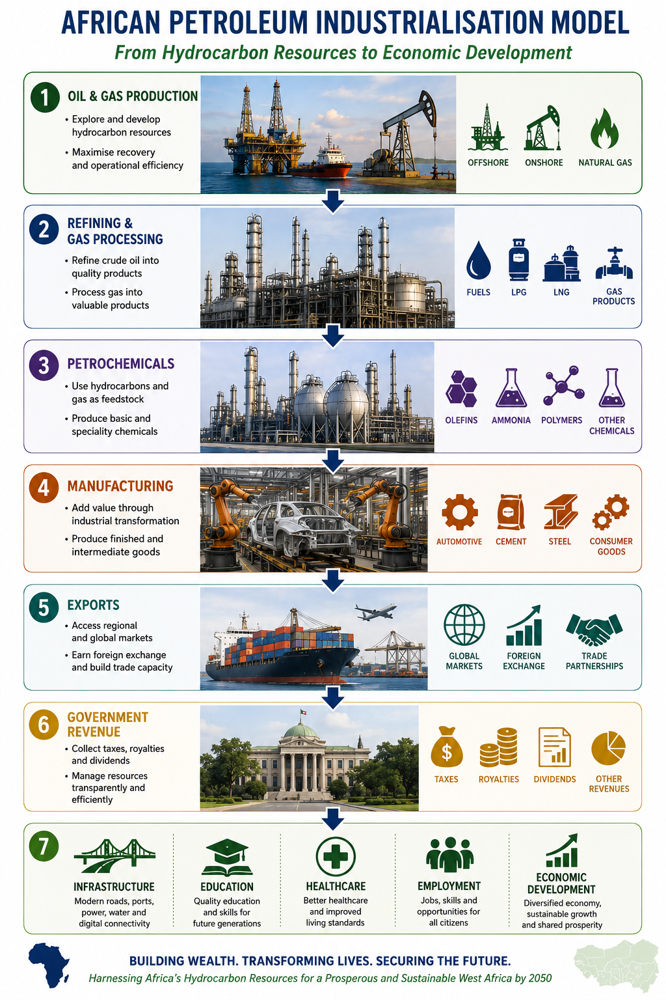

# Chapter 12: Vision for West Africa 2050

Figure 80 African Petroleum Industrialisation Model: From Hydrocarbon Resources to Economic Development

West Africa stands at a pivotal moment in its history. Over the past several decades, the region has established itself as one of the world's most important petroleum provinces, with significant discoveries of oil and natural gas contributing to economic growth, government revenues, and energy development. Yet the true measure of success will not be determined solely by the volume of hydrocarbons produced or exported, but by the extent to which these resources contribute to sustainable and inclusive development for future generations.

By 2050, West Africa should aspire to become more than a producer of crude oil and natural gas. The region should seek to build a fully integrated petroleum and energy industry capable of creating value across the entire hydrocarbon chain, from exploration and production through refining, petrochemicals, power generation, manufacturing, transportation, and advanced energy technologies.

In this vision, petroleum resources serve as a catalyst for broader economic transformation rather than an end in themselves. Hydrocarbon revenues should support the development of modern infrastructure, reliable electricity networks, quality healthcare systems, educational institutions, scientific research, and industrial capabilities that strengthen national economies long after individual oil and gas fields have reached the end of their productive lives.

The region's natural gas resources, in particular, have the potential to play a transformative role in addressing one of Africa's most pressing challenges: access to affordable and reliable energy. By 2050, natural gas should support regional power generation, industrial development, fertiliser production, petrochemical industries, and improved energy access for millions of people across West Africa. The reduction of routine gas flaring and the productive utilisation of gas resources should become a central component of regional energy policy.

The future petroleum industry of West Africa should also be increasingly driven by African expertise, African institutions, and African companies. National oil companies, regulators, universities, research centres, and indigenous private sector enterprises should possess the technical capabilities necessary to manage resources effectively, negotiate equitable agreements, supervise operations, and compete successfully within the global energy industry.

Achieving this vision will require sustained investment in education, technical training, research, innovation, and petroleum data management. Strong national institutions, modern petroleum data centres, and highly skilled workforces will be essential to ensuring that future generations can continue to benefit from the knowledge and experience gained through decades of petroleum development.

Regional cooperation will also play a critical role. Greater collaboration between governments, national oil companies, regulators, and private sector participants can support the development of regional infrastructure, integrated energy markets, cross-border gas networks, refining capacity, and shared research initiatives. Through cooperation, West African countries can achieve economies of scale and strengthen their collective position within the global energy sector.

The global energy transition presents both challenges and opportunities. While the world moves towards lower-carbon energy systems, the development priorities of West Africa remain clear: poverty reduction, economic diversification, industrialisation, employment creation, and universal access to modern energy. The region's petroleum resources must therefore be managed responsibly, efficiently, and sustainably, ensuring that economic development and environmental stewardship advance together.

The ultimate objective should be the transformation of natural resource wealth into human development. Success will not be measured by barrels produced, cubic feet exported, or revenues collected alone. Rather, it will be reflected in stronger institutions, diversified economies, modern infrastructure, improved education, better healthcare, skilled employment opportunities, enhanced energy security, and improved quality of life for the people of West Africa.

If managed wisely, the petroleum resources of West Africa can provide the foundation for a more prosperous, resilient, and industrialised region. By 2050, the ambition should not simply be to export hydrocarbons to the world, but to build a world-class energy industry that supports sustainable economic development and creates lasting value for generations to come.
