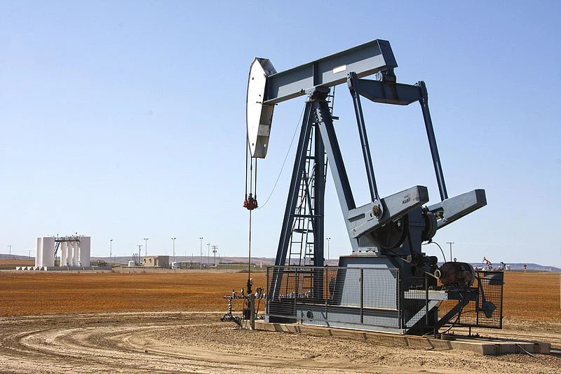

  

    
Upstream Atlas Reference Edition

    

      <h1 class="book-cover-title">Exploration and Production of Petroleum Resources in West Africa</h1>
      
Roles and Responsibilities of Governments and Analysis of Fiscal Regimes

    

    <figure class="book-cover-figure">
      
    </figure>
    

      <a class="book-cover-entry-link" href="../chapters/disclaimer.html">Start reading</a>
    

    

      
Upstream Atlas

      
Digital Reading Edition

    

  

