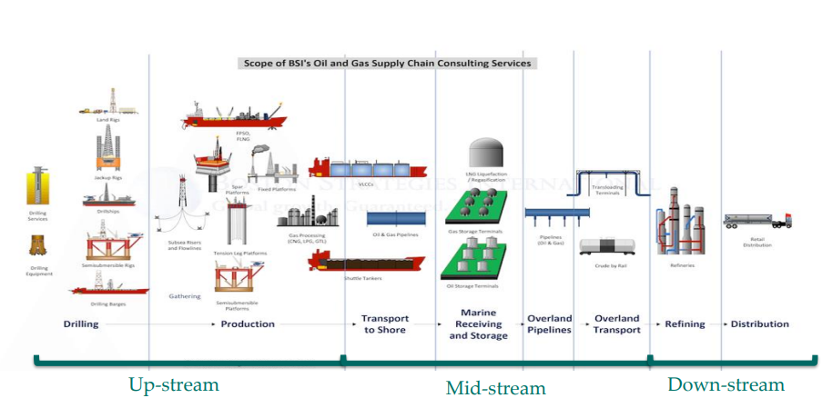
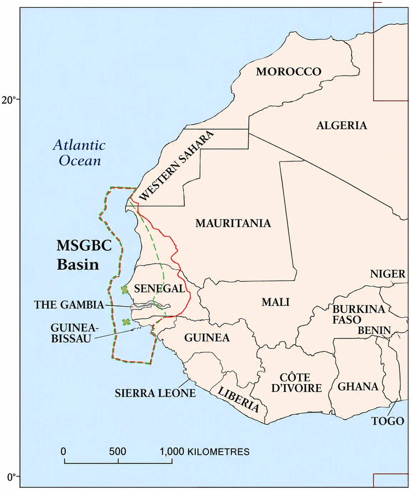
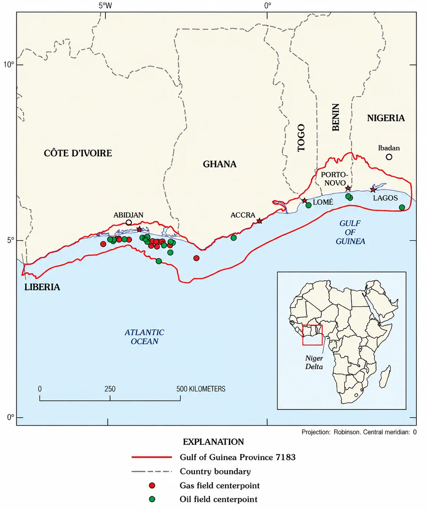
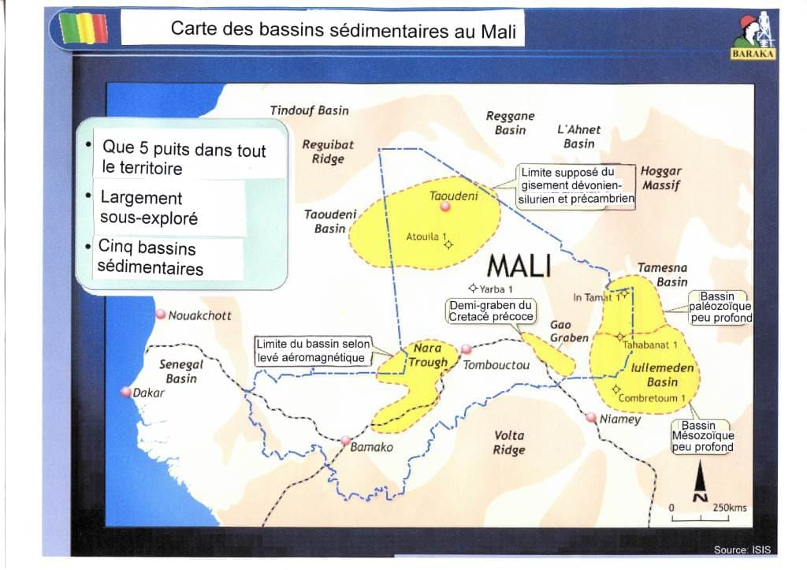
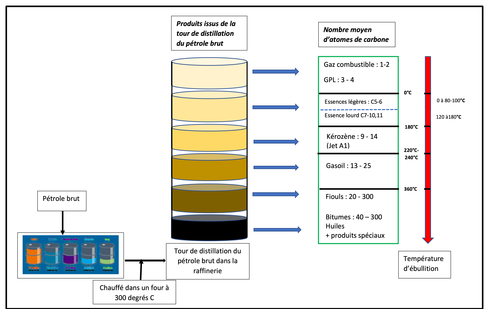

# Chapitre 1 : Chaîne des valeurs du secteur des hydrocarbures

La chaine des valeurs du secteur pétrolier ou de l’industrie pétrolière comprend comme l’indique la figure 1, trois segments à savoir : l’upstream (segment amont), le midstream (segment intermédiaire) et le downstream (segment aval).

Figure 1: Chaine des valeurs du secteur pétrolier

## 1.1- Le segment Amont (upstream)

### 1.1.1- Caractéristiques

L’amont pétrolier est le fondement ou les premières étapes de développement de l’industrie pétrolière. Il est caractérisé par un ensemble d’opérations complexes qui concourent à la découverte et à l’exploitation du pétrole et du gaz naturel formés il y des millions d’années dans le sous-sol. Le segment amont regroupe essentiellement les activités depuis la recherche jusqu’à la production des hydrocarbures. Il s’occupe de la localisation des sites d'extraction du pétrole et du gaz, des forages d’exploration et de la production du pétrole brut et du gaz naturel. Trois principales étapes composent ainsi ce segment :

- La recherche ou l’exploration : l’identification des accumulations d’hydrocarbures par diverses méthodes géologique et géophysique de surface et de profondeur à la suite de l’attribution de licence ou d’autorisation pétrolière ;
- L’extraction ou l’exploitation qui est composé de deux sous-phases :
- Le développement : la détermination et la mise en place des conditions techniques et infrastructurelles d’extraction en fonction des paramètres géologiques, de réservoirs et économiques
- La production du gisement au cours de laquelle les différentes techniques d’extraction et de récupération de pétrole et du gaz naturel sont mise œuvre ;
- L’abandon qui intervient généralement lorsque les réserves pétrolières viennent à épuisement et qu’il est nécessaire de procéder à la sécurisation et/ou démantèlement des installations et infrastructures de production pour éviter et/ou minimiser divers problèmes environnementaux inhérents à l’exploitation.

Les caractéristiques fondamentales des opérations du segment amont sont :

- le Risque géologique élevé qui se traduit par une grande incertitude ou une absence de garantie de découverte de réserves commercialement exploitables.
- les Investissements colossaux : les activités d’exploration et de développement impliquent de lourds investissements en capital en raison des technologies pointues utilisées, des équipements et infrastructures nécessaires pour mener ces opérations ;
- la Gestion des risques et impacts environnementaux et sécuritaires inhérents par les opérations de recherche (sismique, forage…) et de production (pollution des milieux terrestres, des milieux marins et de l’atmosphère par la marée noire, le torchage, les fuites et émissions de gaz, les incendies et autres accidents de chantier).

### 1.1.2- Etats des lieux en Afrique de l’Ouest

La sous-région ouest-africaine détient le tiers des réserves de pétrole et de gaz naturel du continent. Environ 30% des réserves mondiales de pétrole sont dans le golfe de Guinée (CEDEAO, 2019). Une évaluation des ressources en hydrocarbures après les récentes découvertes dans certains pays de l’Afrique de l’Ouest permet d’estimer les réserves à environ 39 milliards de barils de pétrole et à 372 000 milliards de pieds cube (372 TCF) de gaz naturel (Tableau 1).

<table>
<caption>
Tableau 1: Estimation des ressources en hydrocarbures en Afrique de l’Ouest
</caption>
<thead>
<tr>
  <th>
<strong>Pays</strong>
</th>
  <th>
<strong>Réserves de pétrole brut (MMBLS)</strong>
</th>
  <th>
<strong>Réserves de gaz (BCF)</strong>
</th>
</tr>
</thead>
<tbody>
<tr>
  <td>
<strong>Nigeria</strong>
</td>
  <td>
30.0311
</td>
  <td>
202.0001
</td>
</tr>
<tr>
  <td>
<strong>Ghana</strong>
</td>
  <td>
1813 (732 prouvés)
</td>
  <td>
4 100 (1 771 prouvés)
</td>
</tr>
<tr>
  <td>
<strong>Sénégal</strong>
</td>
  <td>
2 0301
</td>
  <td>
42 0241
</td>
</tr>
<tr>
  <td>
<strong>Mauritanie</strong>
</td>
  <td>
20 (prouvées)1
</td>
  <td>
110 000 (estimation)1
</td>
</tr>
<tr>
  <td>
<strong>Côte d’Ivoire</strong>
</td>
  <td>
3.100 (estimation)1
</td>
  <td>
4.600 (estimation)1
</td>
</tr>
<tr>
  <td>
<strong>Niger</strong>
</td>
  <td>
150 
</td>
  <td></td>
</tr>
<tr>
  <td>
<strong>Bénin</strong>
</td>
  <td>
331 (estimation)
</td>
  <td>
477
</td>
</tr>
<tr>
  <td>
<strong>Guinée-Biseau</strong>
</td>
  <td>
840
</td>
  <td></td>
</tr>
<tr>
  <td>
<strong>Mali</strong>
</td>
  <td>
645 (estimation)2 
</td>
  <td>
9 000 (estimation)2
</td>
</tr>
<tr>
  <td>
<strong>Total</strong>
</td>
  <td>
<strong>38 960</strong>
</td>
  <td>
<strong>371 724</strong>
</td>
</tr>
</tbody>
</table>

<!-- parity-ignore:start -->
1 Données des ministères
<!-- parity-ignore:end -->

2 Rapport 
<!-- parity-ignore:start -->
de 
<!-- parity-ignore:end -->
RPS Energy, 2006

Selon Trading Economics (2025), les quatre (04) plus grands producteurs en 2024 (Tableau 2) sont le Nigeria (bassin du Bénin, Delta du Niger et bassins intracartoniques) qui vient largement en tête avec 1.539.000 baril/jour suivi respectivement du Ghana (bassins de Saltpond et de Tano), 188 000 barils/jour, du Niger (trois bassins sédimentaires intracratoniques à savoir Tchad, Illumenden, Djado), 53 000 barils/jour et de la Côte d’Ivoire (bassin sédimentaire côtier offshore), 47 000 barils/jour.

<table>
<caption>
Tableau 2: Production journalière des pays (Trading Economics, 2025)
</caption>
<thead>
<tr>
  <th>
Pays
</th>
  <th>
Dernier
</th>
  <th>
Précédent
</th>
  <th>
Référence
</th>
  <th>
Unité
</th>
</tr>
</thead>
<tbody>
<tr>
  <td>
<strong>Nigeria</strong>
</td>
  <td>
1539
</td>
  <td>
1485
</td>
  <td>
2025-01
</td>
  <td>
BBL/D/1K
</td>
</tr>
<tr>
  <td>
<strong>Ghana</strong>
</td>
  <td>
188
</td>
  <td>
188
</td>
  <td>
2024-10
</td>
  <td>
BBL/D/1K
</td>
</tr>
<tr>
  <td>
<strong>Niger</strong>
</td>
  <td>
53
</td>
  <td>
43
</td>
  <td>
2024-10
</td>
  <td>
BBL/D/1K
</td>
</tr>
<tr>
  <td>
<strong>Côte d'Ivoire</strong>
</td>
  <td>
47
</td>
  <td>
42
</td>
  <td>
2024-10
</td>
  <td>
BBL/D/1K
</td>
</tr>
</tbody>
</table>

Des découvertes significatives de pétrole et surtout de gaz ont été faites en onshore et offshore au Sénégal et en Mauritanie dans les bassins sédimentaires sénégalais et mauritaniens qui font partie d’un vaste Bassin Ouest Africain appelé « Bassin MSGBC (Mauritanie - Sénégal - Gambie - Bissau - Conakry) », Fig. 2a. Ces deux Etats, déjà producteurs de pétrole, ont démarré la production d’un important gisement de gaz transfrontalier grâce au projet gazier offshore ‘’Greater Tortue Ahmeyim’’ dont la ressource découverte en 2015 par l’Américain Kosmos Energy est estimée à plus de 15 000 milliards de pieds cubes. Le gisement est développé et produit par l’appui de la compagnie pétrolière internationale BP, avec l'entrée de la première cargaison de GNL sur le marché mondial en avril 2025.

Le Bénin situé dans le golfe de Guinée, une province pétrolière prouvé (fig. 2b), a été aussi producteur de 1982 à 1998 d’un champ marginal situé sur le bloc 1 de son Bassin Sédimentaire Côtier, découvert en 1968 par la société américaine Union Oil of California. Il vient de redémarrer la production de ce gisement de Sèmè avec la société Akrake Petroleum, filiale de la société norvégienne Rex et a relancé l’exploration pétrolière.

D’autres pays sont encore en phase d’exploration et pourront faire de découvertes commerciales en ce sens qu’ils sont situés dans des zones géologiquement prometteuses. On peut citer :

- La Gambie, la Guinée Bissau et la Guinée Conakry qui partagent le même grand bassin MSGBC que le Sénégal, présente de belles perspectives de découvertes commerciales étant donné que les travaux réalisés ont prouvés la présence d’hydrocarbures dans leurs bassins côtiers. Il en est de même pour la Sierra Leone et le Libéria qui sont situé dans le même environnement géologique et dont les bassins côtiers sont encadrés par le grand bassin MSGBC et le bassin de Côte d’Ivoire dans le Golfe de Guinée où plusieurs découvertes ont été faites.
- le Mali avec le bassin de Taoudéni, le Rift de Nara, le Gao Graben et le bassin de Tamesna qui est le prolongement du bassin des Ilullemedens au Niger (Fig.3). Déjà en 2006, RPS Energy, a montré que les cinq blocs détenus par la société Baraka Petroleum dans le bassin de Taoudéni pourraient abriter jusqu'à 645 millions de barils d’huile et 9 Tcf de gaz naturel.
- le Burkina Faso au regard de sa proximité avec le Mali et en raison de la présence d’indices d’hydrocarbures identifiés dans son bassin ouest qui fait frontière avec le bassin de Nara au Mali
- le Togo dont le bassin sédimentaire côtier qui fait partie intégrante du golfe de Guinée, une province pétrolière prouvée par des découvertes au Nigeria et au Bénin, au Ghana et en Côte d’Ivoire.

Figure 2: a et b Carte montrant le bassin MSGBC et Carte montrant les bassins de la partie nord du Golfe de Guinée dans l’Afrique de l’Ouest

Figure 3: Carte montrant les bassins sédimentaires du Mali et du Niger

Les bruts découverts et produits dans certains pays de l’Afrique de l’Ouest sont légers à lourds avec une faible teneur en soufre (sweet) comme mentionné dans le tableau 3 ci-dessous.

<table>
<caption>
Tableau 3: Type de brut dans certains pays de l’Afrique de l’Ouest
</caption>
<thead>
<tr>
  <th>
<strong>Pays</strong>
</th>
  <th>
<strong>Densité °API</strong>
</th>
  <th>
<strong>Teneur en soufre (%)</strong>
</th>
  <th>
<strong>Qualité</strong>
</th>
</tr>
</thead>
<tbody>
<tr>
  <td>
<strong>Bénin</strong>
</td>
  <td>
22 (Champ de Sèmè)
</td>
  <td>
0.32 
</td>
  <td>
Moyen et Sweet
</td>
</tr>
<tr>
  <td></td>
  <td>
42 (Bloc offshore profonde) 
</td>
  <td>
0,1
</td>
  <td>
Léger et Sweet
</td>
</tr>
<tr>
  <td>
<strong>Niger</strong>
</td>
  <td>
30 
</td>
  <td>
Très faible
</td>
  <td>
Moyen et Sweet
</td>
</tr>
<tr>
  <td>
<strong>Nigeria </strong>(Brut du Delta du Niger)
</td>
  <td>
20 à 25 
</td>
  <td>
0,17 % Egina

0,6 % (Qua Iboe et Forcados) 
</td>
  <td>
Lourd, Moyen et Sweet
</td>
</tr>
<tr>
  <td></td>
  <td>
36
</td>
  <td></td>
  <td>
Léger et Sweet
</td>
</tr>
<tr>
  <td>
<strong>Côte d’Ivoire</strong>
</td>
  <td>
28, 31, 48
</td>
  <td></td>
  <td>
Moyen, Léger et Sweet
</td>
</tr>
<tr>
  <td>
<strong>Ghana</strong>
</td>
  <td>
35,1 (Saltpont) 
</td>
  <td>
0.16  
</td>
  <td>
Léger et Sweet
</td>
</tr>
<tr>
  <td></td>
  <td>
35 (Jubelee)
</td>
  <td>
0.23
</td>
  <td>
Leger et Sweet
</td>
</tr>
</tbody>
</table>

Quelques exemples de sociétés spécialisées dans la réalisation des opérations amont internationalement connues sont ExxonMobil, Chevron, BP, Shell, ConocoPhillips, ENI, Total Energies, SINOPEC... Ces majors sont rejoints par d’autres sociétés pétrolières indépendant challengeurs qui investissent Afrique de l’Ouest comme Tullow au Ghana, Cairn au Sénégal, Kosmos en Mauritanie, CONOIL au Nigeria, CNPC au Niger… En Afrique, on note une émergence des Sociétés Nationales des Hydrocarbures comme la SONATRACH en Algérie, PETROCI en Côte d’Ivoire, la NNPC au Nigeria, la SONAGOL d’Angola, PETROSEN du Sénégal, SONIDEP au Niger, la GNPC au Ghana… mais aussi quelques petites sociétés privées comme SAPETRO, ORANTO au Nigeria….

### 1.1.3- Principaux défis

Face à la question du changement climatique, les défis liés au financement des activités amont, au développement ou à l’appropriation de la technologie restent un os dans la gorge des Etats Africains et auxquels les Etats doivent coopérer et mutualiser leurs efforts afin de mettre en place les stratégies adaptées pour l’exploitation responsable et durables de leurs ressources en hydrocarbures.

## 1.2- Le segment intermédiaire (midstream)

### 1.2.1- Caractéristiques

Le segment intermédiaire de l'industrie pétrolière et gazière relie les activités de l’amont et de l’aval pétrolier et comprend les opérations de liquéfaction et de regazéification du gaz naturel, de stockage et de transport du gaz naturel et de transport du pétrole brut vers les raffineries au moyen des navires, oléoducs, des camions citernes etc.

De façon détaillée, le segment intermédiaire regroupe les activités relatives :

- à la construction d’oléoducs et gazoducs, de réservoirs de stockage de pétrole brut et de gaz naturel, de terminaux de chargement pétroliers et gaziers et d’installations de liquéfaction et regazéification du gaz naturel dont :
- les unités de Gaz Naturel Liquéfié Flottant (Flootload Liquefied Natural Gas : FLNG)
- les Unités flottantes de stockage et de regazéification (FSRU)
- aux transports des hydrocarbures par canalisations (oléoduc et gazoduc etc.)
- aux traitement du gaz naturel en le séparant des différents hydrocarbures et fluides pour produire un gaz de "qualité pipeline". Dans certains cas, cette activité peut être considérée comme étant une activité de l’amont pétrolier

Le transport du pétrole brut et du gaz naturel se fait soit par voie terrestre, soit par voie maritime. Les moyens de transport généralement utilisés sont les pétroliers et les pipelines qui amènent le pétrole brut vers les raffineries où il sera transformé en en produits pétroliers.

Le terme midstream est beaucoup plus utilisé dans l’industrie pétrolière aux USA et au Canada qui ont développé de grands oléoducs, gazoducs et des installations de stockage dirigés par des sociétés privées de ces pays. Par exemple, le réseau d’oléoducs Keystone est un réseau d’oléoducs au Canada et aux États-Unis, détenu par TransCanada Corporation.

Dans les pays européens, le transport et le stockage du brut ont tendance à être intégrés à l’activité de production en amont. De nombreux oléoducs européens sont contrôlés par les gouvernements des pays dont ils traversent le territoire ou par des sociétés publiques de transport de pétrole brut dans ces pays. Cette propriété de l’État a tendance à se traduire par l’absence du secteur intermédiaire en tant que partie désignée séparément de la chaîne de valeur de la production pétrolière.

Quelques exemples de sociétés d’exploitation purement intermédiaires sont Oasis Midstream Partners, Sanchez Midstream Partners, Hess Midstream, Magellan Midstream Partners et EQT Midstream Partners. TransCanada Corporation.

### 1.2.2- Etat des lieux en Afrique de l’Ouest

En Afrique de l’Ouest, le réseau de transport par gazoduc et oléoduc reste encore très faible. Toutefois, il faut souligner une certaine prise conscience des Etats de la situation et une volonté de développer des projets structurants pour sécuriser l’approvisionnement de l’espace Ouest-africaine en hydrocarbures.

Le Gazoduc de l’Afrique de l’Ouest (GAO) et le pipeline Export Niger-Bénin sont de bels exemples de projets de développement de midstream dans cette région Ouest africaine.

Le Gazoduc d’Afrique de l’Ouest (GAO) est un système de transport de gaz naturel par pipeline (onshore et offshore), sur environ 688,6 km du Nigeria (Alagbado) au Ghana (Takoradi) en passant par le Bénin (Cotonou) et le Togo (Lomé). Son objectif est d’acheminer du gaz naturel produit en grande quantité des gisements pétroliers du Nigéria vers le Benin, le Togo et le Ghana, essentiellement pour la production d’énergie électrique et les besoins du secteur industriel. Ce gazoduc géré par la société West African gaz Pipeline Company (WAPCo) est opérationnel depuis 2011 et vise à accroitre l’accès des populations à l’énergie électrique à un coût raisonnable et par voie de conséquence donnera un coup de pouce au développement économique des Etats.

Le Pipeline Export Niger-Bénin est système de transport par canalisation pour exporter le pétrole brut issu des gisements d’AGADEM situés dans la région de DIFFA au Niger via le Bénin à travers un terminal de chargement situé en mer. Cet oléoduc a été construit et est géré par la société chinoise WAPCO. Il est le plus long de la sous-région, a une longueur de 1.950 km dont 675 km sur le territoire béninois et une capacité de transport de 90.000 barils/jour extensible jusqu’à 140.000 barils en fonction des découvertes au Niger.

A ces infrastructures transfrontalières, s’ajoutent les réseaux nationaux de transports oléoduc et gazoduc et infrastructures de stockage du brut qui sont plus ou moins développés dans certains pays comme le Nigeria, la Côte d’Ivoire…

### 1.2.3- Principaux défis

Les défis à relever dans le secteur intermédiaire comprennent, entre autres, le maintien de l'intégrité des infrastructures de stockage et de transport (navires, les camion wagon, pipeline…), la protection des travailleurs qui participent aux activités de nettoyage, de purge et de remplissage et l’insuffisance d’infrastructures pétrolières permettant de garantir la sécurité énergétique des Etats.

En Afrique occidentale, la question de la sécurisation des infrastructures est préoccupante et d’actualité. Les défis sécuritaires se manifestent par :

- le vandalisme des infrastructures dû à la non prise en compte des réalités socio-politique et la misère des populations des localités dans lesquelles ces infrastructures sensibles et dangereux sont construites ;
- les actes de sabotage des installations enregistrés par la montée croissante du terrorisme

A cet effet, la surveillance de ces infrastructures et la prise en compte réelle des préoccupations des populations autochtones sont à considérer de manière plus sérieuse dans le cadre des projets de développement des activités pétrolières et gazières. La prise en compte de ces aspects permettra de garantir la sécurité des travailleurs et des machines et éviter les risques de vandalisme et de sabotage des infrastructures qui sont à l’origine des déversements d’hydrocarbures, des incendies et explosions et par conséquent de pollutions marines et terrestres.

L’insuffisance et la mauvaise gestion des infrastructures pétrolières nationales et régionales de transport et de stockage d’hydrocarbures, de liquéfaction, de regazéification et de traitement du gaz constituent aussi une grande faiblesse du secteur pétrolier en Afrique de l’Ouest.

Le renforcement ou la construction des infrastructures énergétiques telles que les centrales électriques à gaz et la création d’un marché africain du pétrole permettront d’impulser le développement du midstream et par ricochet de renforcer l’accès des populations à l’énergie propre.

## 1.3- Le segment Aval (downstream)

### 1.3.1- Caractéristiques

Ce segment s’occupe des activités de raffinage du pétrole brut, de transport, de stockage et de la distribution des produits pétroliers ainsi que des activités de pétrochimie. Il s'agit de l'étape où les le pétrole brut est transformé en différents produits pétroliers à savoir le fioul, le gasoil, l’essence (naphta), kérosène (jet A1) et le Gaz de Pétrole Liquéfié (GPL) qui sont utilisés à des fins diverses, telles que l'alimentation des véhicules, le chauffage des habitations, la production d’électricité etc. et en asphaltes ou bitumes pour la construction des routes (Figure 4). Le processus de raffinage du pétrole brut est généralement divisé en trois étapes de base : séparation, conversion et traitement. Les techniques de raffinage dépendent du type de brut à traiter et les besoins du marché. Il existe plusieurs types de brut classé principalement selon trois critères : la densité, la teneur en soufre et l’origine géographique. Les bruts de faible densité API et contenant peu de souffre présentent les meilleurs avantages car ils sont légers et moins complexe à raffiner et ne nécessitent peu ou pas de désulfuration.

Dans l’industrie pétrochimiques, les hydrocarbures à longues chaînes présents dans le pétrole et le gaz naturel ainsi que le naphta sont utilisés pour fabriquer des produits comme les matières plastiques, caoutchoucs et fibres synthétiques, les engrais, les conservateurs et les détergents. Ainsi, les produits du pétrole et du gaz naturel sont utilisés pour fabriquer des membres artificiels, des prothèses auditives et des vêtements ignifuges pour protéger les pompiers. De même, les peintures, les colorants, les fibres, etc. sont fabriqués à partir du pétrole et du gaz naturel.

### 1.3.2- Etat des lieux en Afrique de l’Ouest

En Afrique de l’Ouest, la performance et la quantité des unités de raffinage et des infrastructures de stockage et de transport des produits pétroliers restent problématiques en ce sens qu’elles sont insuffisantes pour couvrir les besoins en carburant et assurer la sécurité de l’approvisionnement en produits pétroliers. Ainsi, Malgré son grand potentiel pétrolier et la quantité non négligeable de la production pétrolière, la plupart des pays de l’Afrique de l’Ouest producteurs restent dépendants l’Europe et du Moyen Orient pour leur approvisionnement en produits pétroliers, ce qui constituent une facture exorbitante pour les finances publiques.

Cette analyse est d’ailleurs confirmée par une étude réalisée en 2019 par la CEDEAO sur « l’élaboration d’un programme régional sur la facilitation de l’approvisionnement en produits pétroliers ». Il ressort de cette étude que : « l’approvisionnement en produits pétroliers est fortement dépendant de l’extérieur, se traduisant par un ratio importation/production local de 70/30 qui ne garantit pas la sécurité. La capacité de raffinage disponible permet théoriquement de couvrir la demande en produits raffinés… Malheureusement, les raffineries sont sous utilisées. Elles sont seulement à 30% de leur capacité de production pour des raisons d’obsolescence des équipements mal entretenus ».

Par ailleurs, l’utilisation des produits pétroliers de mauvaise qualité est responsable de l’émission de polluants atmosphériques tels que les monoxydes de carbone, les benzènes, les hydrocarbures imbrulés, les particules, les oxydes d’azote etc qui compromettent dangereusement la santé humaine, l’efficacité des moteurs et l’environnement. Malheureusement, il existe un grand écart par rapport aux spécifications des produits pétroliers en Europe et en Afriques de l’Ouest. Les normes européennes présentent une teneur en soufre de 10 ppm pour l’essence et le gasoil alors que presque tous les pays de l’Afrique de l’Ouest importent ou produisent par leurs raffineries ces produits avec une teneur en soufre compris 50 et 10 000 ppm pour le gasoil et 50 et 3500 ppm pour l’essence, à l’exception du Ghana et du Bénin qui ont adopté dans leur législation des spécifications meilleures en application de la Directive C/DIR.1/9/2020 relative aux spécifications harmonisées des carburants automobiles (essence et gasoil) dans l’espace CEDEAO. La mise aux normes des raffineries en Afrique de l’Ouest devient un impératif mais nécessite d’énormes investissement auxquels les Etats et leurs partenaires doivent faire face.

Les acteurs de l’approvisionnement et la distribution des produits en Afrique de l’Ouest sont constitués de sociétés ou institutions d’Etat, de sociétés mixtes, privées et internationales. On peut citer outres les sociétés d’Etat comme PETROCI et GESTOCI de la Côte d’Ivoire, NNPC du Nigeria, PETROSEN au Sénégal, GNPC au Ghana, la DPB au Bénin, la SONIDEP au Niger, les traders internationaux comme Oryx, PUMA/ Trafigura, Vitol et les traders africains tels que La Chorale en Côte d’Ivoire, Sahara Group au Nigeria, ITOC au Sénégal et des sociétés privées nationales de stockage et de distribution comme Octogone, JNP, Bénin Petro au Bénin, BOST et GOCIL au Ghana…

En ce qui concerne l’industrie du raffinage, il existe très peu de sociétés privées en Afrique de l’Ouest (la nouvelle société de raffinage de DANGOTE à Lekki au Nigeria d’une capacité optimale de 650 000 barils par jour et de quelques raffineries d’Etat ou mixte comme la SIR/SMB en Côte d’Ivoire, la SAR au Sénégal, les raffineries de la NNPC (Kaduna, Port Harcourt et Warri) au Nigeria, la SORAZ au Niger, la TOR à Tema au Ghana.

### 1.3.3- Principaux défis

En somme, l’Afrique de façon générale est confrontée à deux défis majeurs dans l’aval pétroliers à savoir :

- la faiblesse de la sécurisation d’approvisionnement en produits pétroliers qui limite l’accès à l’énergie et par ricochet constitue un frein le développement économique notamment dans la plupart des pays de l’Afrique subsaharienne. Cette situation est liée à une insuffisance d’infrastructures de stockage et distribution et aussi et à la faiblesse de la capacité opérationnelle de raffinage du pétrole.
- la mauvaise qualité des produits pétroliers importés et ceux provenant des raffineries africaines qui ne répondent pas aux normes internationales, à l’exception de la nouvelle raffinerie de DANGOTE au Nigeria.

## 1.4- Faiblesses de la chaine des valeurs de l’industrie pétrolière Ouest africaine

La chaine des valeurs de l’industrie pétrolière n’est pas structurée en Afrique en général et en Afrique de l’Ouest en particulier. Le secteur pétrolier est confronté à des difficultés dues à une absence de politique organisationnelle régionale et opérationnelle cohérente liée un manque de synergie entre les différents segments de l’industrie pétrolière et à l’inexistence d’un véritable marché africain de pétrole au service des Africains. L’amont pétrolier est donc caractérisé par une exportation massive des ressources pétrolières et gazières brutes produites vers en Europe et Asie sous forme brut et une importation des produits raffinés et finis. En conséquence, le secteur pétrolier en Afrique subit toujours le dictat des puissances étrangères et est caractérisé par :

- Une exportation massive du pétrole brut à un prix du marché dont l’Afrique n’a aucun contrôle ;
- Une facture salée et amère d’importation des produits raffinés et dérivées issus de leur pétrole brut à un prix dont le mécanisme de fixation échappe au contrôle des africains.

Par ailleurs, la mauvaise gestion des revenus issus de l’exploitation des ressources est aussi un obstacle pour le financement endogène des projets de développement structurants en Afrique. Il est important d’attirer l’attention des Etats sur une gestion responsable des revenus issus de l’exploitation des ressources pétrolières et gazières étant donné que la plupart des Etats producteurs de l’Afrique sont confrontés au « syndrome hollandais », caractérisé surtout par la désindustrialisation et leur dépendance économique aux rentes pétrolières.

En effet, les revenus tirés de l’exploitation du pétrole et du gaz naturel, ressources extractives non renouvelables, devraient être orientés et investis pour la diversification de l’économie en vue de l’émergence d’autres secteurs économiques et industrielles viables qui permettent de soutenir de façon durables le développement des Etats.

Malheureusement, nombreux sont les pays africains dont l’économie demeure très fragile car elle se repose essentiellement sur la production du pétrole et du gaz naturel. En 2024, la Libye est en tête, avec une impressionnante part de 56% de son PIB qui provient des rentes pétrolières, suivie du le Congo avec 34% et l’Angola à 28%. La contribution des hydrocarbures au PIB du Nigeria d’environ 6% selon le magazine « petrole africa 2025 », alors que plus de 90% du total de ses revenus d’exportation provenait du pétrole montre une disparité entre la contribution directe au PIB et la prépondérance dans les recettes d’exportation et les finances publiques. Cette situation révèle que, le Nigéria reste intrinsèquement tributaire du pétrole et du gaz pour ses entrées de devises étrangères essentielles et son budget national.

La diversification de l’économie constitue une approche majeure pour éviter aux Etats les risques de fragilité économique liés à une dépendance totale aux ressources pétrolières qui subissent de plein fouet les menaces des contre chocs pétroliers, des tensions géopolitiques endogènes et exogènes etc. mais aussi de leur épuisement certain.

Les institutions régionales africaines comme la CEDEAO à travers organes spécifiques et ses commissions sectorielles, l’AFREC et l’APPO ont un rôle essentiel à jouer dans la mise en place d’un lien entre les différents segments de l’industrie aux fins de développer une chaine de valeur intégrée en vue de l’optimisation et de la génération des économies d’échelle pour contribuer à l’industrialisation et à la diversification des sources d’énergie dans la région.

### 1.4.1- Au niveau de la CEDEAO

En Afrique de l’Ouest, la question de la mutualisation des efforts et de coopération véritable pour le développement d’une industrie pétrolières, demeure un défi malgré quelques actions en cours. La CEDEAO devrait être un tremplin pour la réalisation de ces actions. Les résultats obtenus par cette organisation ouest-africaine n’est pas encore à la hauteur des attentes. L’un des projets phares réalisés par la CEDEAO est la construction du Gazoduc de l’Afrique de l’Ouest (GAO). Malheureusement, malgré le potentiel en gaz naturel du Nigeria, appuyé par les récentes découvertes du Ghana, ce projet peine à fournir du gaz au autres pays ayant signé le traité de la GAO à savoir le Nigeria, le Bénin, le Togo et le Ghana et la question d’approvisionnement en gaz naturel pour la production de l’énergie électrique se pose avec acuité dans ces pays.

Ce projet est en phase d’être fondu dans le cadre du Projet de Gazoduc Africain Atlantique (AAGP) qui sera la fusion du Projet d'Extension du Gazoduc de l'Afrique de l'Ouest (WAGPEP) et du Projet de Gazoduc Nigéria-Maroc (NMGP) en un Projet Unique de Gazoduc sous régional qui traversera treize (12) pays de l’Afrique de l’Ouest et la Maroc pour enfin desservir le marché européen.

C’est dire donc que cette initiative du gazoduc Nigeria-Maroc, bien que louable, mérite d’être réexaminée à travers l’évaluation des engagements des différentes parties et la définition d’une politique et d’un organe de gouvernance des projets plus fédérateurs qui garantiront la production, la vente et l’achat du gaz naturel d’abord pour nos besoins en Afrique de l’Ouest, et par la suite en Afrique en général, avant d’envisager fournir le gaz vers les marchés hors africains. Il est important de bien mûrir ce Projet de Gazoduc Africain Atlantique (AAGP) afin d’éviter qu’il ne serve simplement pas, à faire du Maroc un hub pour le transit et la fourniture du gaz naturel à l’Europe au détriment des besoins sans cesse croissant de l’Afrique en général et de l’Afrique sub saharienne en particulier.

### 1.4.2- Au niveau de l’APPO

Au plan continental, l’Organisation des Producteurs de Pétrole Africains (APPO) qui est une institution spécialisée créée depuis 1987, peine a trouvé ses marques et demeure aujourd’hui une organisation n’ayant pas d’impact significatif sur le développement des activités pétrolières en Afrique. Cette noble initiative des pères fondateurs (Algérie, Angola, Bénin, Cameroun, Congo, Gabon, Libye, Nigeria), est née du constat que, malgré l’abondance des ressources en hydrocarbures sur le continent, les pays africains restent largement dépendants des multinationales étrangères pour l’exploration, l’exploitation et la commercialisation de leur pétrole. L’objectif fondamental de l’APPO était donc de favoriser la coopération technique entre les États membres afin de renforcer leur contrôle sur leurs ressources pétrolières et maximiser les bénéfices tirés de leur exploitation pour le développement socio-économique de leurs populations. Depuis plus de 30 ans d’existence, aucun projet structurant viable n’a été réalisé sous l’égide de l’APPO à travers ses organes.

Cette organisation mérite aussi d’être repensée à travers la redéfinition de ses objectifs et de ses organes afin d’être plus opérationnelle pour résoudre les problèmes ci-dessus énumérés auxquels sont confrontés les différents segments de la chaine de valeur du secteur des hydrocarbures en Afrique.

## 1.5- Pistes de solutions pour une industrie pétrolière au service de la région

La nécessité d’une réorganisation de l’ensemble de la chaine des valeurs est une solution pour impulser le développement en Afrique. Cette réorganisation passe par :

- la construction des infrastructures régionales de transformation et des traitements des hydrocarbures (raffineries conformes aux normes environnementales dans le contexte actuel de changement climatique et des infrastructures connexes comme les complexes pétrochimiques, les installations de liquéfaction et regazéification, etc.) ;
- le développement des infrastructures pétroliers régionaux et transafricains pour le stockage et de transport des hydrocarbures. La mise en place d’un tel réseau d’infrastructures permettra de faciliter l’approvisionnement en hydrocarbures dans les différentes régions de l’Afrique ;
- la réalisation des projets structurant énergétique commun permettant la production d’énergie au profit des populations africaines dont plus de la moitié n’ont pas encore à l’énergie. Ces projets permettront le développement de toute la chaine de valeur du secteur des hydrocarbures
- la mise en place de structure et d’une stratégie de financement endogène des projets de recherche et de production pétrolière ;
- la création de centres de formation spécialisés aux métiers du pétrole ;
- le développement d’une coopération saine entre les Etats en matière de partage d’expérience.

Figure 4: Schéma synthétique montrant les différentes coupes pétrolières
