# Chapitre 2 : Différentes phases de l’amont pétrolier et rôles des États

L’Amont pétrolier regroupe cinq (05) catégories d’activités ou phases qui se succèdent (figure 5) : Pré-licence, Exploration, Développement, Production et Abandon.

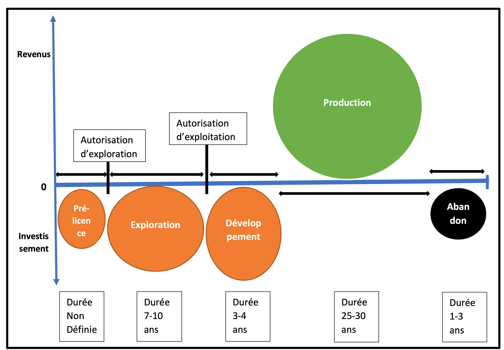

Figure 5: Différentes phases de l'amont pétrolier

## 2.1- Phase de Pré-licence

### 2.1.1- Définition du concept

Au cours de cette phase, l’Etat met en place la politique ainsi que les outils réglementaires et techniques nécessaires à la recherche pétrolière, à la promotion, à l’attribution des blocs pétroliers, à la gestion et au suivi des contrats/autorisations ou licences ainsi qu’à la gestion environnementale liée à la réalisation des activités d’exploration et d’exploitation pétrolières.

Le stade de pré-licence aborde entre autres les aspects relatifs :

- aux études préliminaires de reconnaissance géologique et géophysique ou de prospection (gravimétrie, magnétométrie, sismique spéculative…) dont l’objectif est de définir les zones propices à l’exploration et d’en évaluer les potentialités pétrolières ;
- à la mise place des législations et réglementations qui devraient clarifier les principaux domaines de préoccupation à la fois pour l' (es) investisseur (s) et le gouvernement hôte. Cela permettra au gouvernement hôte d’assurer un meilleur suivi et une bonne gestion des contrats et de contrôler efficacement les prévisions de recettes par la mise place d'un régime fiscal et juridique approprié et mutuellement bénéfique pour les parties.
- à la délimitation des frontières maritime et terrestre ainsi que le mécanisme de gestion des conflits frontaliers dans les zones pétrolières communes à deux ou plusieurs Etats ;
- à la gestion de l’implication des communautés locales et des attentes des populations.

Une fois les zones potentiellement favorables à la recherche pétrolière connues et le potentiel pétrolier évalué, les lois et règlementations techniques et environnementales et les outils d’attribution et de gestion des contrats pétroliers élaborés, les Etats peuvent procéder à l’attribution de périmètres pour l’exploration.

L’attribution d’une licence ou d’une autorisation pétrolière se déroule suivant le processus indiqué dans la figure 4 ci-dessous. Elle démarre par les activités de promotion jusqu’à la signature d’un contrat et/ou la délivrance d’une autorisation qui donne aux CPI le droit d’explorer et d’exploiter les hydrocarbures sur un domaine bien défini communément appelé bloc pétrolier.

### 2.1.2- Stratégie d’attribution de licences ou autorisations pétrolières

La promotion est l’opération qui consiste à attirer les investisseurs dans l’exploration et l’exploitation pétrolières. Les pays disposant d’un potentiel pétrolier et désireux de se lancer dans la valorisation de leurs ressources pétrolières doivent élaborer et/ou mettre régulièrement à jour les documents de promotion pétrolière. Un dossier de la promotion doit contenir les documents suivants :

- La législation pétrolière
- Le modèle de contrat
- La liste et le prix des données pétrolières disponibles si nécessaire. Certains pays mettent gratuitement les données à la disposition des compagnies pétrolières pour être plus attractifs
- Les informations sur le potentiel pétrolier et/ou un rapport d’évaluation technique du potentiel pétrolier
- Les périmètres ou blocs en promotion
- Les informations sur les infrastructures pétrolières disponibles
- Le cadre institutionnel du secteur des hydrocarbures et contacts des structures en charge de ce secteur
- Le calendrier des appels d’offres
- Les critères de pré qualification
- Les critères d’évaluation

Les différentes étapes de l’attribution des blocs pétroliers sont (Figure 6) :

- Annonce de la zone d’exploration ou des blocs en promotion
- Lancement de l’appel d’offre : le lancement d’un appel à concurrence permet de disposer de plusieurs offres sur un même domaine ou bloc ; ceci permet de faire des comparaisons afin de choisir les offres les plus intéressantes pour l’Etat. Cependant, il n’est pas exclu que l’Etat décident d’examiner sur la base de ses attentes, les offres spontanées des sociétés qui manifestent leur un intérêt sur un bloc donné.
- Définition des critères de Pré qualification : la pré qualification constitue un premier filtre des compagnies pétrolières sur la base de critères préalablement définis par les Etats en vue d’identifier les compagnies pétrolières ou consortium capables de jouer un rôle pertinent dans le domaine où les blocs sont mis aux enchères ; ces critères sont généralement relatifs aux capacités financières, techniques ainsi que de gestion sécuritaire et environnementale des compagnies pétrolières
- Soumission des offres : cela consiste au dépôt des dossiers par les sociétés pétrolières qui sont intéressées par la recherche pétrolière dans les domaines ouverts à l’appel d’offres
- Dépouillement/évaluation des offres : il se fait sur la base des critères d’attribution élaborés par le Gouvernement.
- Attribution du bloc : elle se fait après négociation des termes techniques et économiques avec les CPI qui présentent les meilleures offres sur la base des attentes de l’Etat. Les termes techniques et fiscaux qui pourront faire objet de négociation et qui conditionnent l’attribution définitives sont :
- Obligations de travail
- Rétrocession ou rendu de surface
- Contenu local et Formation
- Développement socio-communautaire
- Les bonus de signature et d’exploitation
- Les redevances
- La participation de l’Etat,
- Le taux de récupération des coûts pétroliers (cost stop)
- La clé de partage du pétrole profit, etc.

Les négociations pétrolières nécessitent de la part du Gouvernement une bonne préparation et du professionnalisme. Elle est menée par une équipe pluridisciplinaire qui doit comporter sans que cela ne soit pas limitatif des acteurs ayant une bonne connaissance des contrats pétroliers et des techniques de négociation ainsi que de techniciens avertis du secteur. Cette équipe peut être composé de juristes, économistes pétroliers, géoscientistes ...

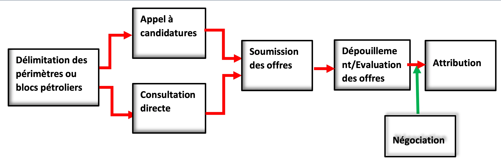

Figure 6: Processus d'attribution de bloc pétrolier au CPI pour l'exploration et l'exploitation pétrolières

Au total, les activités de pré-licence sont nécessaires car elles conditionnent la décision des gouvernants de s’engager ou non dans les activités d’exploration pétrolières.

C’est le début des investissements dans le secteur des hydrocarbures.

### 2.1.3- Financement des investissements de la phase de pré-licence

En règle générale, les activités de pré-licence relèvent de la souveraineté de l’Etat hôte. La mise en place des documents de politique, les législations et règlementations ainsi que l’évaluation des potentialités pétrolières et la mise en place des outils et stratégie permettant de passer à l’exploration via les compagnies pétrolières internationales incombent aux Etats et nécessitent des investissements relativement moins coûteux que ceux relatifs aux activités d’exploration. Les Etats qui disposent des ressources financières et de compétences financent directement toutes ces activités (la Norvège par exemple). Cependant, ceux ayant des ressources financières limitées et sans compétences requises, se font accompagner pour certaines activités de pré licence par des sociétés de services pour réaliser notamment les premières études de reconnaissance et d’évaluation du potentiel pétrolier afin de disposer des informations de premières mains avant de s’engager dans les activités de promotion qui débouchent sur la signature de contrats d’exploration et d’exploitation avec les sociétés pétrolières. Ces sociétés de service acquièrent généralement à leur frais les données sur la base d’un contrat de prestation de service et en font le marketing et la commercialisation auprès des sociétés pétrolières internationales.

### 2.1.4- Importance de phase de pré licence et responsabilités de l’Etat

La phase de pré-licence est très primordiale en ce sens que la méconnaissance de son potentiel pétrolier et l’inexistence dès le départ de toutes les règlementations, procédures et outils claires de gestion des activités de l’amont pétrolier sont préjudiciables à la signature des contrats justes et bénéfiques pour le Etats.

« On ne peut jamais vendre à sa juste valeur un bien emballé c’est-à-dire très peu ou mal connu ».

La non ou mauvaise préparation de la phase de pré-licence entraine ainsi des conséquences dommageables aux Etats lors de l’exécution des opérations pétrolières, où ils sont confrontés à des difficultés juridiques et de gestion des contrats.

Malheureusement, la plupart des pays africains négligent cette phase et s’engagent sans garde-fou nécessaire dans l’exploration et l’exploitation des ressources pétrolières en signant des contrats dont le partage des revenus leur est souvent défavorable ou très peu profitable suite aux découvertes. Le défaut ou l’insuffisance d’une bonne préparation de la phase de pré-licence indispensable à la mise en place des outils de gestion et de suivi des contrats avant de s’engager dans les activités pétrolières (qui concourt à la mise en valeurs des ressources), est souvent l’une des causes fondamentales de la signature des « contrats léonnins » avec les partenaires étrangers dans le secteur géo-extractive en général et dans l’industrie pétrolière en particulier en Afrique.

## 2.2- Phase d’Exploration

### 2.2.1- Méthodes et stratégies d’exploration

L’exploration est cette phase des activités pétrolières de l’amont qui consiste à la recherche des hydrocarbures dans le sous-sol par des méthodes géologiques et géophysiques notamment sismique et de forage de puits exploratoires. Au départ, la recherche consistait à forer à proximité des indices naturels de surface ; ce qui ne permettait que de découvrir des gisements de petites tailles, proches de la surface.

Aujourd’hui, elle est entreprise par les Compagnies Pétrolières Internationales (CPI) qui ont développé plusieurs méthodes et technologies d’exploration partant des plus simples au plus sophistiquées pour la découverte d’hydrocarbures à de grandes profondeurs aussi bien sur terre ferme qu’en mer très profonde (au-delà de 3 km de bathymétrie).

Les activités concernées par l’exploration sont entre autres :

- Les travaux de recherche géologique de surface
- La gravimétrie,
- La magnétométrie
- La photographie aérienne
- La sismique
- L’électromagnétisme (EM) ou Control Source Electro-Magnetic (CSEM)
- Le forage d’exploration

La gravimétrie et la magnétométrie contribuent à déterminer des zones d'anomalies géophysiques où l'on peut appliquer d'autres méthodes plus précises pour localiser les hydrocarbures. Elles permettent de déterminer la nature et la profondeur des couches sédimentaires et donne ainsi une idée sur la répartition et l’épaisseur des formations sédimentaires (Figure 7 a et b).

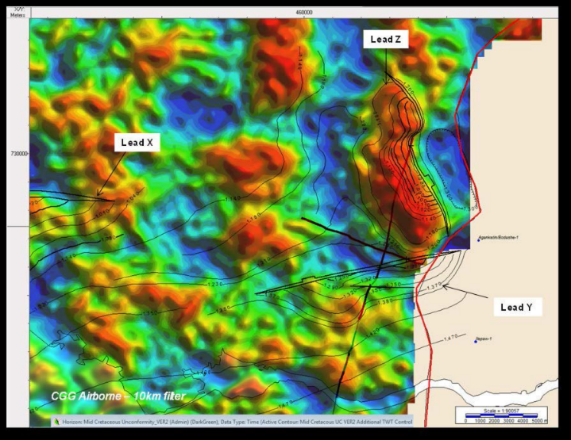

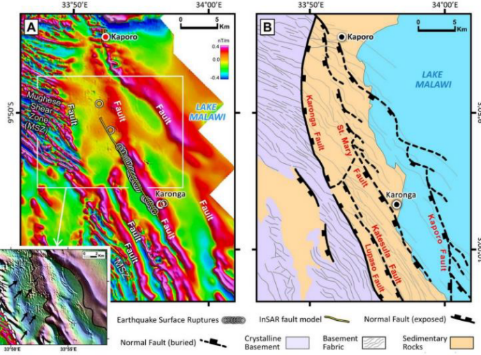

Figure 7 : Acquisition gravimétrique (a) montrant les anomalies dans le bassin sédimentaire Côtier du Bénin (CGG 2013) et aéromagnétique (b) permettant de caractériser le socle et les formations sédimentaires

La sismique réflexion, méthode la plus couramment utilisée avant le forage exploratoire. Le principe d’acquisition de la sismique consiste à envoyer des ondes sonores dans le sol qui sont réfléchies par les différentes surfaces rocheuses. Le temps mis par les ondes pour venir en surface et pour être enregistrées par des géophones (lorsque l’opération se déroule sur la terre ferme) ou hydrophones (lorsque l’opération se déroule en mer) indique la profondeur des roches traversées (figure 8a, b). La sismique peut être réalisée en deux dimension 2D et depuis plus d’un demi-siècle en trois dimension 3D et même et quatre dimension 4D. La sismique renseigne aussi sur la nature la nature des roches à par partir de l’analyse des différentes vitesses de transmission notées au niveau des différentes types de roches. L’analyse et interprétation des données sismiques permettent aussi l’identification de pièges d’hydrocarbures et des Indicateurs Directs d’Hydrocarbures (DHI) tels que les Bright Spots, Flat Spots et Gas chimneys etc. qui conditionnent le positionnement des puits d’exploration (Figure 9).

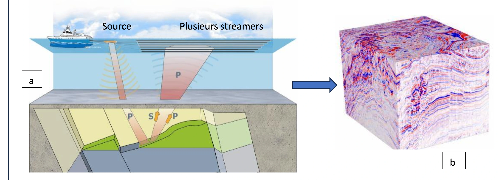

Figure 8: Principe d'acquisition 3D (a) et cube sismique (b)

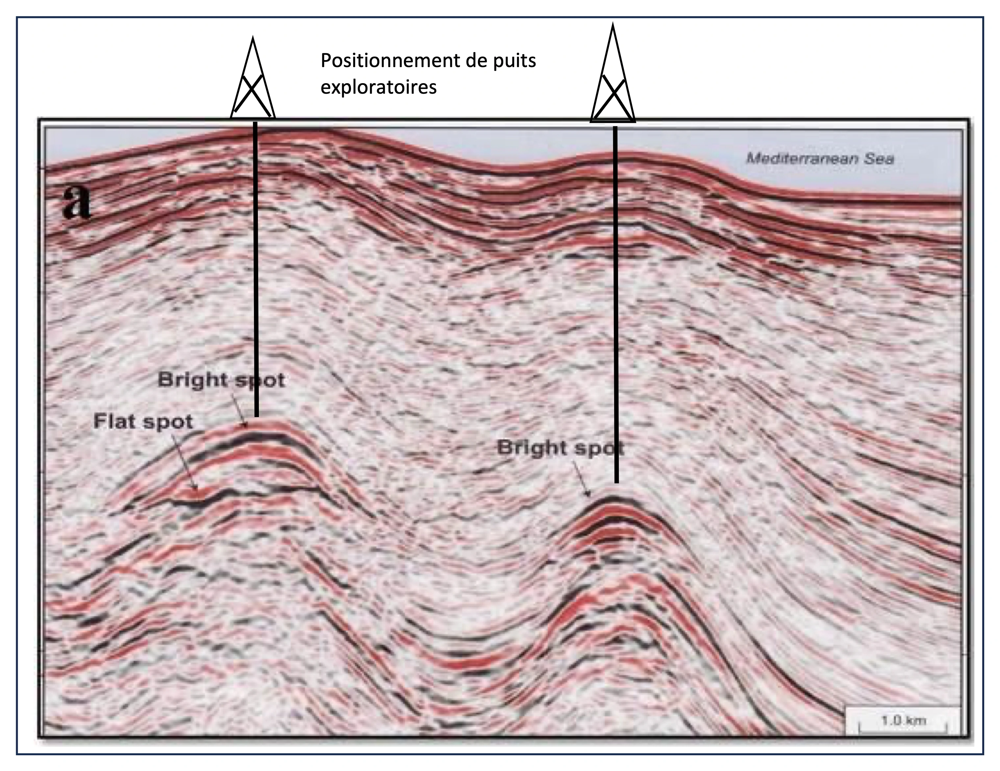

Figure 9: Anomalies d'amplitude sismique montrant des Brightspots et Flatspots

Le CSEM est une technologie développée qui permet de mesurer le contraste de résistivité dans le sous-sol marin. L’acquisition de EM se fait généralement sur les prospects/pièges déjà identifiés par la sismique afin d’avoir une précision sur la nature du fluide contenu dans les pièges. En effet, les zones de pièges à hydrocarbures présentent une forte résistivité alors que les roches qui sont autour des pièges sont conductives parce que contenant généralement de l’eau salée (Figure 10). Cette technologie permet ainsi de déterminer l’existence ou non d’un contraste de résistivité dans les régions où des pièges ont été cartographiés afin de maximiser les chances de succès des puits exploratoires.

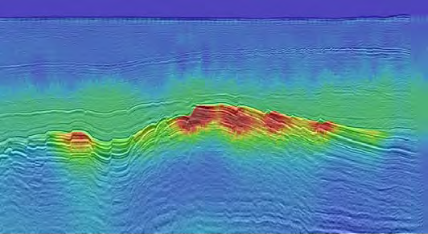

Figure 10: Electromagnétisme couplé avec la sismique réflexion montrant le contraste de résistivité au niveau des pièges mis en évidence par la sismique

Le forage exploratoire est l’étape ultime et très coûteux de l’exploration qui permet de confirmer ou d’infirmer les prévisions et hypothèses découlant de l’analyse des travaux des géologues et géophysiciens d’exploration.

La durée d’une licence d’exploration varie de 7 à 9 ans dans les pays de l’Afrique de l’Ouest.

### 2.2.2- Techniques d’évaluation d’un prospect

L’exploration pétrolière repose sur quatre principes fondamentaux à savoir : la recherche de l’existence d’un système pétrolier dans la zone sous licence par les différentes méthodes de recherche supra citées, l’identification et la cartographie des structures géologiques susceptibles de contenir des hydrocarbures (Plays, leads et prospects), l’évaluation des risques géologiques associés aux structures cartographiées et enfin l’estimation volumétrique du potentiel en ressources pétrolières.

- Système pétrolier

Le système pétrolier est l’ensemble constitué de roches mères, roches réservoirs, roches couvertures et de surcharge ainsi que tout le processus relatif à la formation des pièges, à la génération, la migration, l’accumulation et la préservation des hydrocarbures (figures 11 et 12). Ces facteurs géologiques essentiels et le processus doivent avoir lieu dans le temps et l’espace de sorte que la matière organique contenue dans la roche mère peut se transformer en une accumulation de pétrole (Magoon & Dow, 1994).

Il faut noter que cette matière organique à partir de laquelle le pétrole a été formé, il y a plusieurs millions d’années, est issue de la décomposition, sous l’effet de la pression de subsidence sédimentaire et de la température géothermique, d’animaux et de végétaux microscopiques (phytoplanctons et zooplanctons) qui vivaient dans la mer.

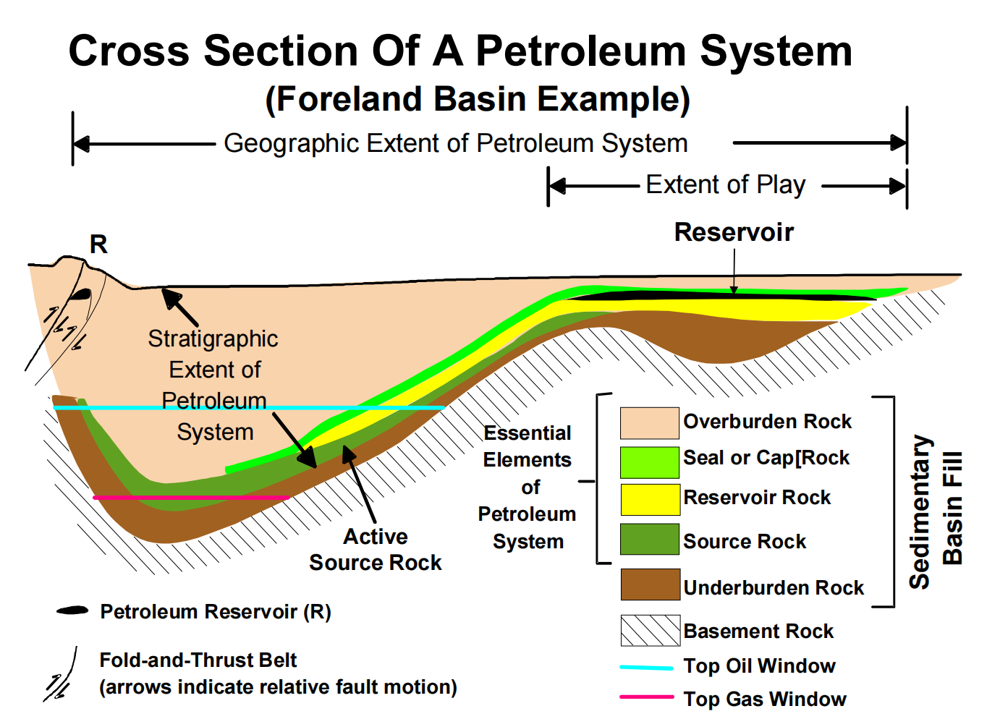

Figure 11: Coupe géologique montrant l'étendue stratigraphique d’un système pétrolier fictif (Magoon et Dow, 1994, modifié par Schlumberger)

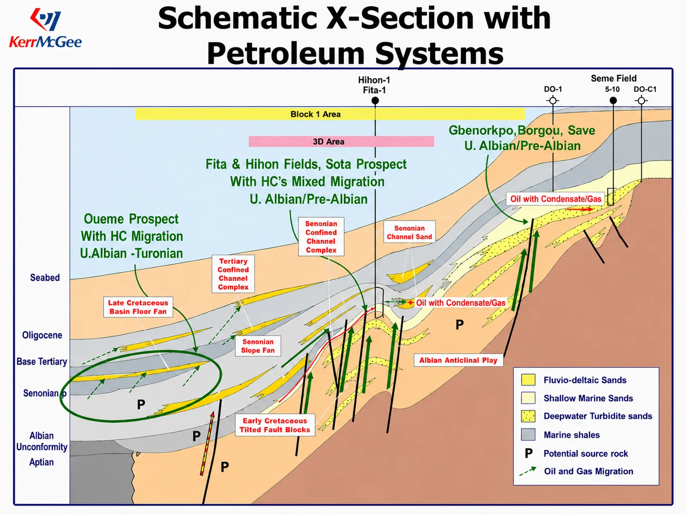

Figure 12: Coupe géosismique montrant les systèmes pétroliers dans le Bassin sédimentaire côtier du Bénin, Kerr McGee, 2003

- Identification et la cartographie des pièges géologiques susceptibles de contenir des hydrocarbures

Les géophysiciens et géologues, procèdent au traitement et à l’interprétation des données acquises par les différentes méthodes de recherche dans le but d’identifier des pièges d’hydrocarbures (Figure 13), des DHI ou toutes autres anomalies géologiques permettant de soupçonner la présence d’hydrocarbures et qui permettent d’orienter le positionnement des puits exploratoires.

Les pièges d’hydrocarbures peuvent être de type structural, stratigraphique ou mixte selon leur mécanisme de formation.

Les pièges structuraux peuvent se former par des mécanismes tectoniques régionaux (faille, anticlinal etc.) ou par la tectonique du sel (halokinèse). Les pièges stratigraphiques résultent des conditions de dépôt c’est-à-dire se forment par des processus sédimentaires (discordance, changement latéral de faciès, biseau etc.) (figure 14).

Les pièges répertoriés sont ensuite cartographiés à partir des logiciels en vue d’apprécier leur géométrie et d’évaluer leur taille (Figure 15).

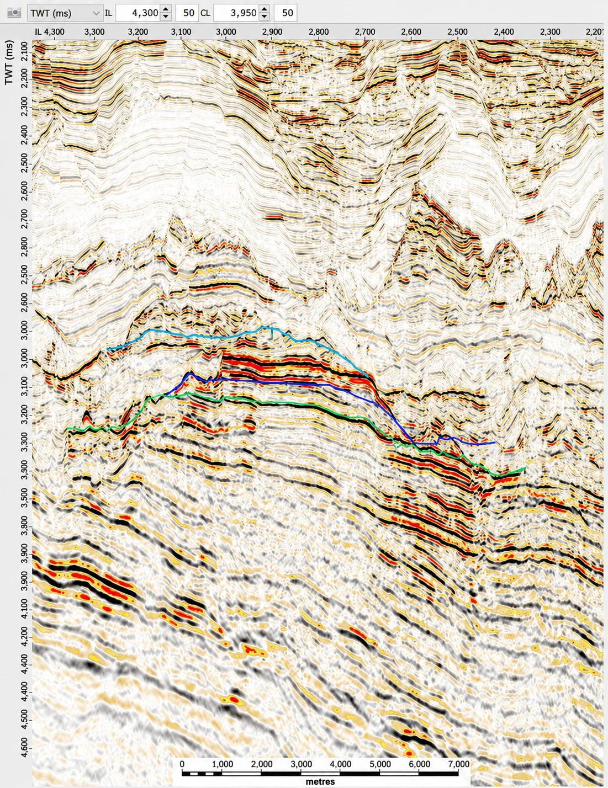

Figure 13: Interprétation sismique montrant un piège structural (anticlinal)

Figure 14: Quelques types de pièges

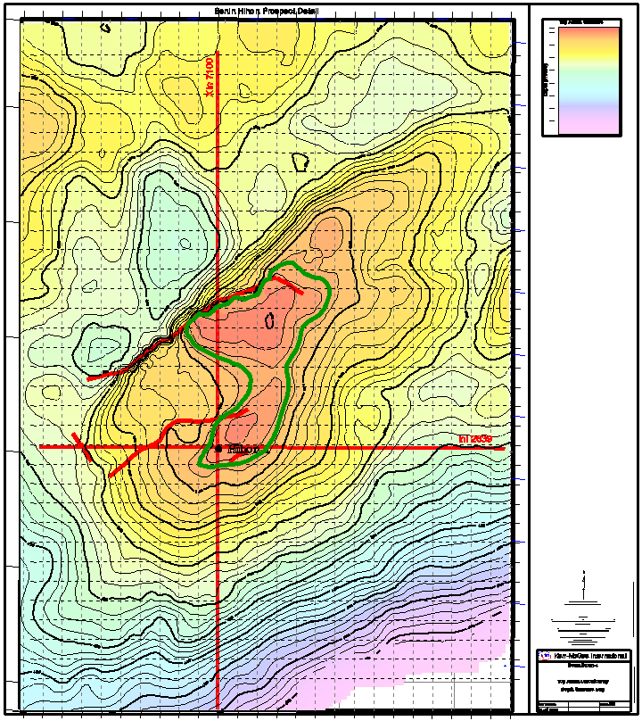

Figure 15: Carte de profondeur montrant le toit d'un réservoir

- Evaluation des risques géologiques

L’évaluation des risques géologiques permet de déterminer la probabilité de succès d’un forage exploratoire sur un prospect cartographié. L’évaluation des chances de succès géologiques associés à un prospect se fait en attribuant des probabilités aux facteurs géologiques clés indispensables à la formation et à la préservation d’une accumulation de pétrole ou de gaz naturel.

Ainsi, la détermination du risque géologique d’un prospect permet de calculer la chance de succès de ce prospect. Elle est déterminée par la formule :

<section class="formula-group formula-group--prospect" data-equation-label="2.1" aria-label="Formule du prospect">
  

    P(prospect) = P(roche mère) x P(réservoir) x P(piège)
  

  

    

      <article class="formula-spec-item">
        

          <!-- parity-ignore:start -->
          P(piège):
          <!-- parity-ignore:end -->
          Piège étanche + couverture imperméable
        

      </article>
      <article class="formula-spec-item">
        

          <!-- parity-ignore:start -->
          P(réservoir):
          <!-- parity-ignore:end -->
          Porosité et perméabilité de la Roche réservoir
        

      </article>
      <article class="formula-spec-item">
        

          <!-- parity-ignore:start -->
          P(prospect):
          <!-- parity-ignore:end -->
          Risques géologiques
        

      </article>
      <article class="formula-spec-item">
        

          <!-- parity-ignore:start -->
          P(roche mère):
          <!-- parity-ignore:end -->
          Maturité de la roche-mère et par conséquent son degré de migration vers le réservoir
        

      </article>
    

  

</section>

iv) Evaluation volumétrique des ressources en hydrocarbures

L’évaluation des ressources en hydrocarbures contenues dans le prospect consiste à l’estimation du volume de pétrole ou gaz naturel qui pourrait se trouver dans le prospect. Elle est réalisée en utilisant les paramètres géologiques et pétrophysiques de la roche réservoir. Cette évaluation est plus précise lorsque l’on utilise les résultats issus des travaux réalisés notamment les résultats issus des forages exploratoires. A défaut, on utilise les paramètres issus de l’interprétation sismique ou provenant des puits voisins de la zone de recherche.

Ainsi la quantité d’hydrocarbures (VHcP) en place c’est-à-dire de pétrole (STOIIP) ou de gaz (GIIP) en place est déterminée comme suit :

<section class="formula-group formula-group--volumetric" data-equation-label="2.2" aria-label="Formules d’évaluation volumétrique">
  

    VHcP = GRV x N/G x Ø x Shc x 1/FVF
  

  

    
Avec

    

      <article class="formula-spec-item">
        
GRV= Gross Rock Volume (Volume Brut de la Roche réservoir) : il est déterminé en tenant compte de la forme géométrique du réservoir et de son épaisseur

        

          GRV = ∑Surface du gisement x Epaisseur du gisement
        

      </article>
      <article class="formula-spec-item">
        
N/G : C’est le rapport entre l’épaisseur net du réservoir et l’épaisseur brut du réservoir. Il faut noter que l’épaisseur du gisement n’a pas souvent une lithologie uniforme. Il est souvent intercalé par des couches d’argile imperméable.

      </article>
      <article class="formula-spec-item">
        
Ø (Phi) = Porosité du réservoir qui est estimée à partir des diagraphies électriques, des mesures sur les carottes et des connaissances provenant des formations similaires. Elle se détermine comme suit :

        

          Porosité (Ø) = Volume des pores (Vv)/ Volume du Réservoir (V)
        

      </article>
      <article class="formula-spec-item">
        
Shc = Saturation en hydrocarbures déterminé en connaissant la saturation en eau Sw. Il est généralement calculé à partir des digraphies de puits dans la zone de porosité effective.

        

          Shc = 1-Sw
        

      </article>
      <article class="formula-spec-item">
        
FVF : C’est le Facteur Volumétrique de Formation. Elle exprime le changement de volume de l’huile du réservoir à la surface dans les conditions standard de pression et de température (pression : 1 atm et température : 15° Celsius). FVF de l’huile est Bo et pour le gaz est Bg.

        

          FVF = Volume réservoir/Volume à la surface
        

      </article>
      <article class="formula-spec-item formula-spec-item--empty" aria-hidden="true"></article>
    

  

  

    

      <section class="formula-case" aria-label="Cas du pétrole">
        
Pour l’huile

        

          

            FVF = Bo et Shc = So (saturation en huile)
          

          
Ainsi,

          <!-- parity-ignore:start -->
          

            STIIOP = GRV x N/G x Ø x So x 1/Bo
          

          

            Gaz associé en place = STOIIP x GOR
          

          <!-- parity-ignore:end -->
          
STIIOP = GRV x N/G x Ø x So x 1/BoGaz associé en place = STOIIP x GOR

        

      </section>
      <section class="formula-case" aria-label="Cas du gaz">
        
Pour le gaz

        

          

            FVF = Bg et Shc = Sg (Saturation en gaz)
          

          
Ainsi,

          

            GIIP = GRV x N/G x Ø x Sg x 1/Bg
          

          

            Condensat en place = GIIP x CGR
          

        

      </section>
    

    

      
avec:

      
GOR : appelé Gaz-Oil Ratio est le rapport volume de gaz sur volume d’huile produite

      
CGR : appelé Condensate-Gaz Ratio est le rapport volume de condensat sur le volume de gaz produit

    

  

</section>

Un classement des prospects est réalisé lorsque plusieurs prospects sont cartographiés sur un bloc sous contrat. Ce classement est fonction des risques géologiques (probabilité de succès), du volume et du type d’hydrocarbures potentiellement en place et des autres paramètres pétrophysiques. Le choix du/des prospects à forer tient compte de ce classement aux fins de maximiser les chances de succès.

Une fois une découverte est faite, la CPI réalise les travaux d’évaluation du gisement. Ces travaux regroupent un ensemble d’activités à savoir notamment le forage de puits d’appréciation ou de délinéation, des études géologiques et géophysiques de réservoir ainsi d’une évaluation des réserves permettant de décider du développement du gisement lorsque ce dernier est commercialement exploitable.

### 2.2.3- Financement des activités d’exploration

Les activités d’exploration sont presque totalement financées par les CPI étant donné que les Etats ne disposent pas les ressources financières, les technologiques, les compétences humaines et capacités opérationnelles nécessaires pour s’engager dans ce projet à haut risque.

L’exploration pétrolière est la phase la plus délicate à haut risque en ce sens qu’elle engage de lourds investissements en capital (CAPEX) pour des résultats dont la probabilité de succès est globalement en dessous de la moyenne au plan mondial. Malgré les avancées technologiques dans l’exploration pétrolières, le taux d’échec est élevé. Environ 2/3 des puits d’exploration sont secs. En l’absence de découverte commerciale durant la période d’exploration, les CPI perdent tous leurs investissements.

### 2.2.4- Responsabilités des Etats en phase d’exploration

Au cours de cette phase, le pays hôte, bien qu’il ne prenne pas souvent de risque financier, a cependant une grande responsabilité vis-à-vis des CPI contractantes qui prennent pratiquement en charge tous les risques liés au capital d’investissement.

Les deux rôles les plus essentiels de l’Etat, propriétaire des ressources potentielles sont : la mise en place d’une base de données pétrolières et le suivi et le contrôle technique et financier de toutes les activités réalisées par le contractant.

- Gestion des données pétrolières

Le pays hôte doit veiller à la collecte de toutes les données pétrolières acquises lors de cette phase et en assurer leur conservation. Ces données pétrolières constituent une base déterminante pour des investigations futures. Elles ont une valeur scientifique et une valeur économique importantes en ce sens qu’elles renseignent sur la géologie et le potentiel en ressources dans le sous-sol des Etats.

Ces données concernent celles produites en phase exploration mais aussi celles générées au cours de la phase de développement, de production et d’abandon. Certains pays, faute de moyen de conservation c’est à dire de capacité technique et infrastructurelle, confient la conservation et la gestion de leur données à des partenaires ou sociétés étrangères spécialisées hors de leur territoire. Ce faisant, ils se comportent comme des propriétaires qui confie la clé de leur coffre-fort à leurs locataires.

« En confiant, la gestion des données pétrolières à des sociétés spécialisées étrangères, les Etats n’ont plus assez de contrôle sur les diverses manipulations et business dont elles font l’objet. Ne disposant donc pas d’outils de contrôle et de gestion et d’analyses, ils méconnaissent la quantité et la qualité de leurs données, et par conséquent la valeur économique de leur patrimoine ».

Ils sont donc tenus de croire aux bilans et évaluations ainsi qu’aux décisions et choix des compagnies pétrolières dans le cadre de la mise en œuvre des opérations pétrolières.

C’est pourquoi, il est nécessaire que les Etats créent des centres de stockage et de conservation adéquats ainsi que des laboratoires de contrôle de qualité et d’analyse des données pétrolières acquises qui au même titre que les ressources pétrolières constituent des patrimoines de l’Etat. A cet effet, il est indispensable pour les Etats de se doter d’une véritable politique de contrôle et de gestion de leurs données pétrolières. Certains pays de l’Afrique de l’Ouest en sont conscients et développent une bonne stratégie de conservation, d’analyse et de gestion des données. La Côte d’Ivoire et le Nigeria constituent un bel exemple de la mise en place d’un centre de stockage et de conservation adéquate et d’analyse des données (figure 16).

Figure 16: Photos montrant la carothèque de la Côte d’Ivoire à la Direction du Centre d’Analyses et de Recherche de la PETROCI

- Suivi et contrôle des activités

La régulation des activités d’exploration englobe non seulement le suivi de la mise œuvre des obligations contractuelles mais aussi le contrôle des coûts de réalisation des activités ainsi que le respect des normes et procédures d’exécution des activités conformément aux réglementaires nationales ou de l’industrie pétrolière internationale. Le suivi et le contrôle technique des activités sont des fonctions régaliennes fondamentales de l’Etat qui nécessitent l’existence de ressources humaines qualifiées et la mise en place des outils de contrôle efficaces des opérations pétrolières d’exploration y compris la gestion des risques et impacts environnementaux liés à la mise en œuvre de ces activités. Ce suivi doit être régulier et bien planifié dans la mesure où c’est à ce niveau que le contractant animé par la recherche du profit maximum pourrait profiter de la défaillance du mécanisme du contrôle et d’audit de l’Etat pour surévaluer des coûts d’exploration ou même se déroger des meilleures pratiques de protection de l’environnement lors de la réalisation des activités.

En somme, il est de la responsabilité des Etats de suivre l’effectivité de la réalisation des activités rapportées, les délais optimaux de réalisation, la qualité des travaux réalisés au plan technique et en respect des normes environnementales admises ou prescrites par la réglementation et de faire l’audit des coûts effectifs de leur réalisation à travers l’élaboration d’un répertoire des coûts des activités. Ce répertoire devra être actualisé pour servir de référence pour des confrontations et audits.

## 2.3- Phase de Développement

### 2.3.1- Définition et stratégies

Le développement d’un champ pétrolier consiste à la réalisation des opérations qui concourent à la mise en place des infrastructures de production du (ou des) gisement(s) découvert(s). Il s’agit généralement des plateformes de production, des forages de production et des infrastructures de stockage et de transport du brut ou du gaz naturel de la tête de puits jusqu’au point de livraison et les installations de collecte et de traitement des effluents à terre ou en mer. Au cours de cette phase, les études d’évaluation géologique, d’évaluation du réservoir, les études de faisabilité et les études FEED (Front and End Engineering Design) sont réalisées afin de choisir la meilleure option de développement au plan technique, économique et social. Toutes ces études concourent à l’élaboration d’un Plan de Développement et d’Opération (PDO) qui est un document clair qui décrit la faisabilité du projet de développement dans ses différents aspects bien planifiés.

Le PDO comprend :

- Evaluation géologique
- Evaluation du réservoir et Technologie adaptée au réservoir y compris l’étude sur les récupérations secondaire et tertiaire
- Technologie de production et de forage
- Installations
- Maintenance des équipements
- Evaluation économique
- Sécurité et Environnement
- Organisation du projet et son exécution
- Plan d’abandon

De la découverte à la production, il faut en moyenne trois à quatre ans pour le développement d’un champ pétrolier. C’est dire donc que cette phase est très délicate en ce sens que l’exploitation optimale d’un gisement dépend du modèle de développement choisi.

Le choix d’un modèle de développement dépend de plusieurs paramètres techniques et économiques dont entre autres, les facilités existantes ou à mettre en place, la nature ou type de gisement (simple ou multicouche) et l’épaisseur du gisement, la situation du gisement (onshore, en offshore profond ou peu profond), la qualité du réservoir, la qualité du brut et son prix sur le marché etc.

### 2.3.2- Méthodologie d’évaluation d’un réservoir

L’évaluation du réservoir est réalisée suivant la méthodologie indiquée dans la figure 17 ci-dessous. Cette méthodologie part de la collecte des données jusqu’à l’évaluation économique du gisement. Elle permet, après traitement, interprétation des données, i) de réaliser la modélisation/simulation du réservoir sur la base des données disponibles sur le réservoir, à savoir les données sismiques, de diagraphies de puits, des carottes, de tests de puits, ii) de déterminer la performance du réservoir et iii) de projeter le profil de production le plus optimum et responsable ainsi que la rentabilité économique du projet de développement en vue de la prise de décision de production du gisement.

Les études géologiques et de simulation du réservoir fournit des modèles détaillés des réservoirs souterrains pour prédire leur comportement au fil du temps à travers le calcul des flux d’écoulement de fluide qui est fonction des propriétés du réservoir et des conditions des puits (figure 17). La simulation est donc un outil de prise de décision essentiel qui permet :

- d’optimiser de la production à travers i) une meilleure compréhension des moyens les plus efficaces de récupération d’hydrocarbures c’est-à-dire les différentes méthodes de récupération adaptées aux caractéristiques du réservoir (réservoir à aquifère actif, réservoir avec gaz cap, la nature lithologique et épaisseur du réservoir…), ii) le nombre et les types de puits (vertical, incliné ou horizontal) adaptés au réservoir dans le but de maintenir sa performance ;
- de gérer des risques par l’évaluation et l’atténuation des risques associés au forage et à la production
- de faire une planification ou une prévision économique aidant à une prise de décision d’investissement.

Déblais, carottes, données sismiques, de diagraphies, de tests de puits etc.

COLLECTE DES DONNEES BRUTES

Eléments descriptifs du réservoir (porosité, perméabilité, Saturation en eau, pression, viscosité de l’huile, etc.)

TRAITEMENT ET INTERPRETATION DES DONNEES COLLECTEES

INTEGRATION ETMODELISATION

CAPEX, OPEX, Risques

EVALUATION ECONOMIQUE ET DECISIONS

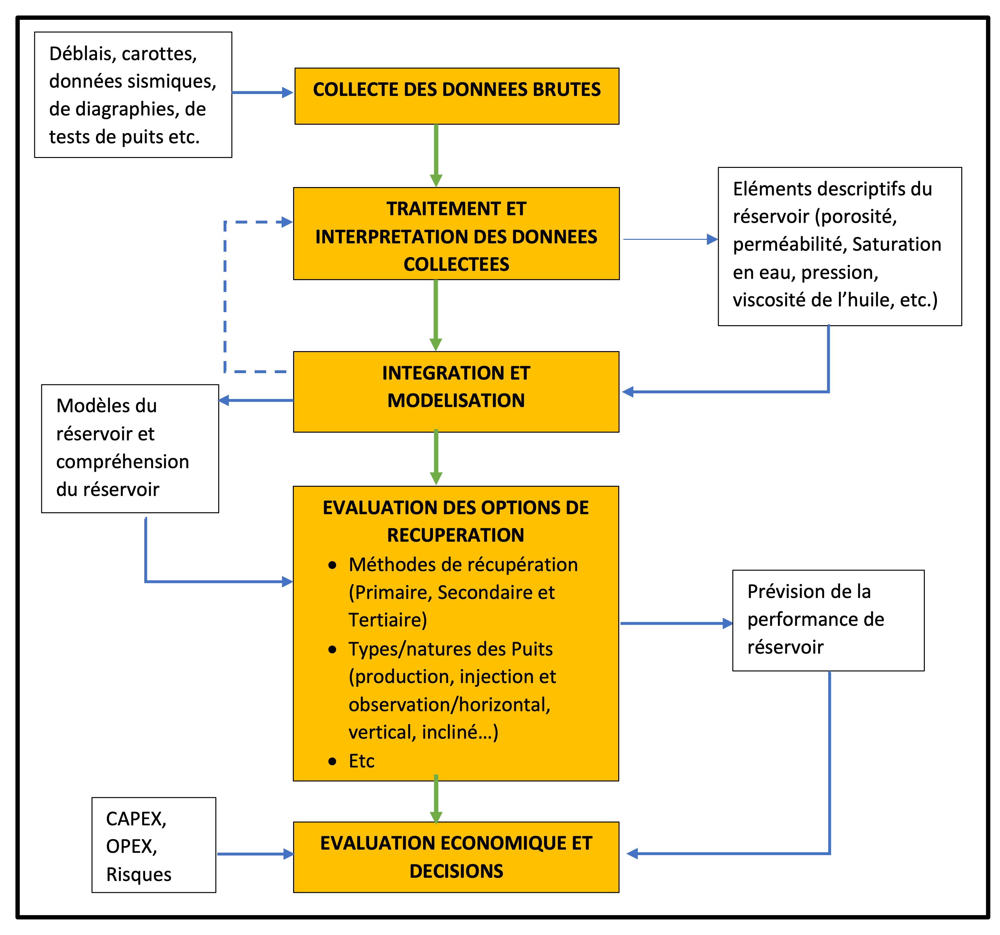

Figure 17: Méthodologie d’évaluation du réservoir

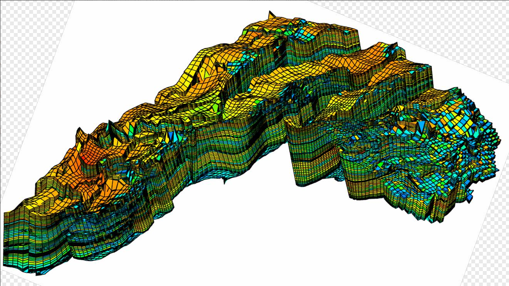

Figure 18: Schéma montrant une modélisation d'un réservoir (Vilgeir Dalen, StatoilHydro, 2007)

### 2.3.3- Financement des activités de développement

Le développement implique de grosses dépenses en capital (CAPEX) dans le sous-secteur amont pétrolier. D’énormes ressources financières sont investies pour la production des gisements d’hydrocarbures. Il faut néanmoins noter que le risque est moindre au cours de cette phase par rapport à la phase d’exploration ; la question qui se pose n’est plus le doute sur l’existence du gisement mais c’est surtout celle liée au rapport bénéfice/coûts des investissements qui est fonction des paramètres et conditions techniques et économiques liés à son exploitation. C’est pourquoi, avant de s’engager dans les opérations de développement, plusieurs études préalables de rentabilités sont réalisées et consignées dans le PDO soumis à l’approbation de l’Etat.

### 2.3.4- Rôles et responsabilités des Etats en phase de développement et Intérêt d’un PDO

Le développement d’un champ pétrolier est sujet à l’approbation par le Gouvernement d’un Plan de Développement et d’Opération (PDO) ou d’une étude faisabilité élaboré (e) par le contractant et soumis (e) à l’Etat. Le processus de préparation et d’approbation du PDO offre des opportunités de dialogue entre la société contractante et l’Etat hôte sur la manière dont le champ doit être développé et produit de façon durable pour que les deux parties puissent tirer meilleur profit. Ainsi, avant l’approbation du PDO, l’Etat doit procéder à :

- L’évaluation géoscientifique du PDO qui vise à :
- S’assurer que la qualité de l’interprétation du réservoir est suffisamment convaincante pour une décision de développement
- S’accorder avec la CPI sur les conclusions du PDO avant son approbation

Pour ce faire, il est recommandé aux Etats de :

- mener des études et interprétations in-house en se basant sur les données de puits, de sismiques notamment 3D et VSP, des cartes etc.
- certifier l’évaluation des réserves récupérables et l’étude de faisabilité par ses spécialistes ou une tiers partie
- d’organiser des rencontres et dialogues avec la société opératrice sur la base des résultats des travaux de contre-expertise réalisé par l’Etat pour des échanges techniques fructueux
- L’évaluation du réservoir qui a pour objectif de :
- s’assurer d’une sélection de stratégie de production optimale
- définir l’utilisation du gaz dans un champ de pétrole
- garantir les possibilités de récupération du pétrole dans un champ de gaz
- définir et garantir la mise œuvre d’un profil de production sérieux et responsables
- s’assurer d’une bonne gestion du réservoir
- s’assurer de la cohérence (corrélation) entre la géologie, le réservoir et la stratégie de production.

En somme, l’Etat, propriétaire des ressources doit :

- éviter le démarrage précipité des opérations de développement d’un gisement d’hydrocarbures. Tout démarrage du plan de développement doit requérir l’approbation de l’Etat après examen de toutes les études et documents préalables exigés dans la législation pétrolière, y compris les simulations du réservoir.
- apprécier le modèle économique de développement qui tient compte des risques et incertitudes économiques (prix du baril sur le marché international), de la durée et du taux d’amortissement ou du modèle de récupération des coûts pétroliers, le profil de production et par ricochet la durée de la production. Le modèle économique proposé dans le PDO ou dans l’étude de faisabilité doit aussi présenter un retour sur investissement favorable positif.
- veiller à ce que le PDO intègre les exigences liées à l’abandon du champ à la fin de la production. Ces exigences sont relatives au bouchage des puits et au déclassement des installations afin d’éviter des dommages au plan sécuritaire et environnemental.

C’est pourquoi, les Etats doivent examiner les résultats provenant des travaux de d’évaluation et simulation du réservoir et du modèle économique élaborés ou réalisés par les opérateurs (CPI) pour de mieux échanger sur les incertitudes afin d’ajuster ou bâtir au besoin un nouveau modèle de production consensuel.

Eu égard à tout ce qui précède, il est nécessaire pour les Etats de disposer d’un centre d’interprétation des données sismiques, de modélisation, d’évaluation et de simulation du réservoir avec un personnel qualifié permettant de faire une contre-expertise des résultats des études d’évaluation des réserves, du plan de développement ou de l’étude de faisabilité proposé par les CPI ou à défaut de faire certifier ces études par une tierce partie.

Le suivi rigoureux des activités lors du développement est aussi important que lors de la phase d’exploration et requiert la vigilance, le professionnalisme et la probité de la part des acteurs en charge du suivi des activités pour éviter d’être dupés ou d’être corrompus par le CPI qui peuvent manipuler à leur profit les coûts des opérations ; ce qui va faire baisser la marge du pétrole profit à partager.

- « Le démarrage précipité des opérations de développement pour des raisons de propagande politique est souvent à l’origine des choix d’option de développement immatures parfois inadaptés du point de vue technique et opérationnel. Ce qui est à l’origine des difficultés techniques lors de la mise en œuvre opérationnelle du PDO. Ces difficultés engendrent très souvent des pertes de temps inutiles causant une augmentation des investissements et un faible contrôle et gestion des réservoirs mettant ainsi en péril leur performance à court et moyens terme ».
- « Le développement d’un champ pétrolier ne doit donc pas être motivé par la satisfaction des libidos politiques ou par le règlement d’un problème financier conjoncturel ».

[« Le développement et la production de champ pétrolifère de Sèmè (République du Bénin), découvert en 1968, est un bel exemple d’une aventure pétrolière mal préparée. La production a démarré en 1982 par la société norvégienne SAGA Petroleum, avec une étude de faisabilité immature (faiblesse de l’étude du réservoir, plan de développement non optimal, étude de rentabilité économique inconséquente qui ne prend pas en compte tous les paramètres supra-cités, non pris en compte d’un plan d’abandon). Après seulement quelques années de production, précisément en 1985, avec sept puits en production, le champ enregistrait déjà une montée fulgurante d’eau au détriment du pétrole. Plus tard en 1997, la situation était plus alarmante avec environ 90 % d’eau dans la plupart des puits en production. Les réservoirs ont été abimés. Ceci est probablement dû à la faiblesse de l’étude de faisabilité notamment au niveau des études d’évaluation et de simulation du réservoir (nombre de puits mis en production et à la distance entre les puits car ce champ présente un aquifère très actif), du manque de professionnalisme des sociétés opératrices et des considérations d’ordre politique. Le champ a été fermé en 1998 après changement de main avec plusieurs opérateurs pour la production (Saga Petroleum, PANOCO, PPS, ASHLAND, Atlantic Petroleum Inc,), dans des conditions économiques, financières, sociales et environnementales déplorables et inappropriées (dettes élevées, licenciement du personnel avec des mesures d’accompagnement non satisfaisantes, non bouchage des puits ni sécurisation des infrastructures en mer, qui constituent aujourd’hui un risque environnemental et sécuritaire majeur).

Les opérations de redéveloppement du champ de Sèmè entamées en 2014 par la société Nigériane SAPETRO qui a signé en 2004 un contrat de partage de production sur le bloc 1, s’est soldé également par un échec en raison entre autres de l’inadéquation et de l’immaturité du modèle de développement proposé qui induits de lourds investissements en capital (construction de plateforme pétrolière, des unités de traitement et de stockage à terre avec les flowlines ainsi que de nouveau bouées d’amarrage pour l’exportation), et des études de sensibilité économique du projet. La mise en place de ces équipements et unités de production constitue un lourd investissement pour réserves résiduelles à produire.

Le modèle économique élaboré par SAPETRO était basé sur un prix de baril du brut estimé à 80 dollars au moins. Malheureusement, en 2015, le contre choc pétrolier de 2014-2016 qui a provoqué une chute des cours du barils de brent de 110 dollars à 36 dollars, entre le début du mois de juillet 2014 et janvier 2016, associé aux échecs de deux puits sur les trois entamés en raison des difficultés techniques rencontrées lors des forages, a conduit à l’abandon du projet de redéveloppement de SAPETRO qui n’a pas pu produire une seule goutte de pétrole et par ricochet a mis fin au rêve du Bénin de redevenir pays producteur en 2015 »].

## 2.4- Phase de Production

### 2.4.1- Définition et caractéristiques

C’est la phase la plus attendue par les parties à savoir l’Etat et le contractant. Une bonne gestion du réservoir est systématiquement en relation avec la technologie utilisée. Elle permet d’optimiser la production en l’occurrence les réserves récupérables. C’est un exercice très sérieux qui exige un suivi rigoureux de la production et une évaluation périodique du réservoir.

La durée de vie minimum des installations de production est de 30 ans. La maintenance des installations est indispensable afin de prévenir les accidents, la pollution et l’interruption de production.

Le cycle de vie d’un gisement d’hydrocarbures mis en production présente les différentes phases telles indiquées par la figure 19 ci-dessous.

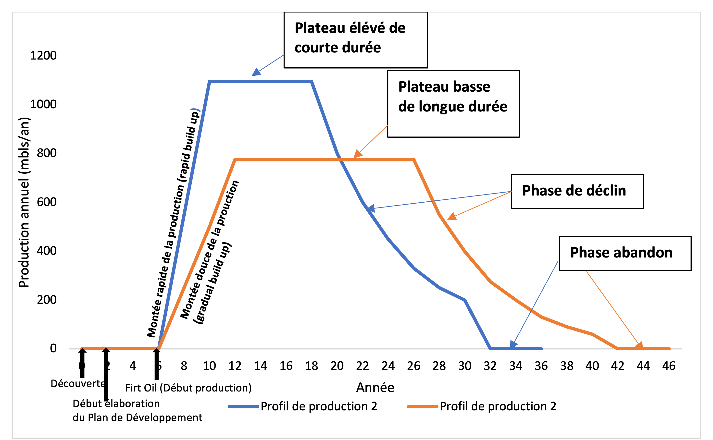

Figure 19 : Profil de production d’un gisement pétrolier montrant le cycle de vie d’un champ pétrolier

Le profil de production adopté est indicateur de la durée de la production ou de la durée de vie du champ. Ce profil est généralement subdivisé en trois périodes :

- La période de build up ou période préparatoire au cours de laquelle les puits de production sont progressivement mis en production. On note pendant cette phase une montée progressive de la production en fonction du temps jusqu’à une limite maximale
- La période du plateau durant laquelle un taux de production constant est maintenu
- La période de déclin où le débit de production baisse progressivement jusqu’à une limite de production non économique ou limite d’abandon.

Ainsi, la durée de production dépend de la phase du build-up, du plateau qui peut présenter un taux de production élevé, modéré ou faible, mais aussi de la phase de déclin qui peut être douce ou brutal.

Au cours de la phase de déclin, il arrive souvent d’amorcer de nouvelles phases de pic de production (build up secondaire ou tertiaire) par l’utilisation des méthodes de récupération secondaire et tertiaire en fonction des caractéristiques géologiques et géométriques du réservoir, des propriétés du fluide et des paramètres pétrophysiques du réservoir.

### 2.4.2- Méthodes et stratégies de récupération

En production pétrolière, il est impossible de récupérer totalement du réservoir la quantité d’hydrocarbures initialement en place. Le facteur de récupération représente la quantité de pétrole pouvant être extraite d’un réservoir par rapport à la quantité totale de pétrole présente dans le sous-sol. Pour une production optimale les réserves en place, il est nécessaire d’appliquer et de faire le choix des meilleures techniques et méthode de récupération au regard des propriétés du réservoir et des objectifs du développement. Ainsi, on distingue :

- La récupération primaire du pétrole décrit la production d'hydrocarbures sous l'effet des mécanismes d'entraînement naturels présents dans le réservoir sans l'aide supplémentaire de fluides injectés tels que le gaz ou l'eau. Cette récupération induit la perte de pression du réservoir dus à la production naturelle ou activée à l’aide d’une pompe. Le facteur de récupération primaire pour le pétrole est généralement compris entre 15 et 20 % des réserves en place.
- La récupération secondaire intervient lorsque la pression du réservoir devient insuffisante pour drainer le pétrole du réservoir à la surface ou pour provoquer une récupération naturelle des hydrocarbures. Elle consiste à soutenir la pression du réservoir par l’injection d’eau ou du gaz non miscible dans le réservoir pour déplacer le pétrole et le conduire vers un puits de production. Lorsque le gisement de pétrole ne dispose pas de gaz cap, il est recommandé de procéder à l’injection d’eau pour améliorer la performance du réservoir. La récupération peut être améliorée à hauteur de 15 à 45 % en addition. La récupération secondaire du pétrole est une opération mécanique ou physique qui n'inclut pas de composés ou de réactions chimiques (Jianjie Niu, Qi Liu, Jing Lv, Bo Peng, 2020).
- En ce qui concerne la récupération tertiaire, elle utilise l’injection de gaz miscible tel que ainsi que les méthodes thermales, chimiques et biologiques. L’objectif de la récupération tertiaire est de modifier les caractéristiques physico-chimiques du pétrole pour favoriser son écoulement. Cette méthode permet de récupérer encore 5 à 10% supplémentaire de pétrole. Les techniques de récupération tertiaire coûtent extrêmement chers et ne sont entreprises que le lorsque le prix du baril de brut est suffisamment élevé pour justifier les investissements y relatives.

Au total, le taux de récupération de pétrole varie de 35 à 75% en fonction des paramètres influençant la récupération. Celui du gaz est meilleur et est généralement supérieur à 75%, le gaz étant moins dense, plus mobile et donc plus facile à parvenir en surface que le pétrole.

Les facteurs influençant les récupérations sont de plusieurs ordres :

- Propriétés du réservoir : La porosité, la perméabilité et la saturation du réservoir déterminent la quantité de pétrole pouvant être récupérée. Une porosité et une perméabilité élevées aident à extraire davantage de pétrole du réservoir, tandis qu'une porosité et une perméabilité faibles rendent le processus d'extraction difficile.
- Propriétés de l’huile : La viscosité, la densité et la densité API de l'huile déterminent l'efficacité du processus d'extraction. L’huile à haute viscosité est difficile à extraire, tandis que l’huile à faible viscosité est plus facile à extraire. De même, la densité du pétrole affecte le processus de récupération. Le pétrole lourd est plus difficile à extraire que le pétrole léger.
- Techniques de récupération : Les techniques de levage artificiel telles que les pompes à faisceau, les vérins à gaz et les pompes électriques submersibles peuvent augmenter la quantité de pétrole récupéré du réservoir. Le choix de la technique de récupération dépend des propriétés du réservoir et des propriétés du pétrole.
- Taux de production : l’application d’un taux de production très élevé peut entraîner une diminution de la pression du réservoir, et abimé le plus vite possible le réservoir ; ce qui peut réduire la quantité de pétrole récupérée.
- Pression du réservoir : La pression dans le réservoir diminue à mesure que le pétrole est extrait, ce qui peut réduire la quantité de pétrole récupérée. L’utilisation de techniques de levage artificiel lors de la récupération primaire peut aider à maintenir la pression du réservoir, ce qui entraîne une récupération accrue du pétrole.

### 2.4.3- Financement des opérations de production

Les investissements au cours de cette phase sont moindres par rapport à la phase précédentes et sont dénommés « coûts opératoires (OPEX) ». Ces coûts sont facilement financés par les parties prenantes en raison des revenus qui se dégagent de la production. Ils sont relatifs aux coûts de maintenance des installations et de reconditionnement des puits (travaux de workover) et parfois aux dépenses liées à l’amélioration de la performance du réservoir à travers des études géologiques et réservoirs.

### 2.4.4- Responsabilités des Etats hôtes en phase de production

Tout comme la phase de développement, la vigilance des Etats propriétaires des ressources est requise afin d’éviter les fausses déclarations de production. Cette vigilance requiert une formation adéquate en matière de monitoring et d’inspection des activités de production et de transport ainsi le contrôle des équipements et les paramètres de mesure convenus ou admis dans l’industrie pétrolière.

En effet, de la tête puits au point de livraison, les hydrocarbures produits peuvent subir des manipulations malsaines de la part des CPI dont l’objectif est de maximiser leurs gains. Elles peuvent tronquer les quantités d’hydrocarbures produites de sorte à mettre en place un mécanisme de fausse déclaration si la méthode de suivi et d’inspection des opérations pétrolières n’est pas efficace au niveau des Etats. C’est pourquoi, des contrôles et inspections des équipements et installations construits sur place ou importés pour stockage et le transport des hydrocarbures, sont recommandés pour d’une part déterminer la conformité de l’état des installations avec les exigences internationales requises et d’autre part pour s’assurer que des mesures des paramètres physico-chmiques des hydrocarbures ou les comptages sont faites un certain nombre de fois le long du trajet de produits depuis la tête de puits jusqu’au point de livraison afin de garantir la fiabilité des résultats. Ces mesures/comptages ont pour objectif de déterminer entre autres la quantité et la qualité au niveau de la chaine de production, transport et vente.

Le comptage fiscal est la mesure effectuée dans le cadre de l’achat-vente du brut ou gaz naturel et du calcul des taxes (par exemple CO2 taxe, NOx taxe) et redevances.

Par ailleurs, il est important de souligner que le volume du brut dépend de la température. Une variation de la température provoque un changement de volume de pétrole brut. En effet, le pétrole brut se contracte au froid et se dilatent à l’augmentation de la température. Autrement dit, pour une quantité de pétrole brut produit dont le volume est mesuré à 120° C à la tête de puits, ce même volume mesuré à 15°C au point de livraison est inférieur à celui mesuré à 120°C.

A titre illustratif, une manipulation ou erreur de mesure de 0,4% par exemple au point de mesurage en défaveur des Etats producteurs, engendrerait des pertes financières importantes telles que consignés dans le tableau 4 ci-dessous pour ces pays et un gain équivalent pour la société contractante :

<table>
<caption>
Tableau 4: Calcul des pertes financières qu’engendreraient une erreur de mesure de 0,4 %
</caption>
<colgroup>
<col style="width: 13%" />
<col style="width: 18%" />
<col style="width: 18%" />
<col style="width: 12%" />
<col style="width: 16%" />
<col style="width: 21%" />
</colgroup>
<thead>
<tr>
  <th rowspan="2" style="text-align: left;">
Pays
</th>
  <th rowspan="2" style="text-align: left;">
Production journalière (bl/j)
</th>
  <th rowspan="2" style="text-align: left;">
Erreur de mesure/comptage (%)
</th>
  <th rowspan="2" style="text-align: left;">
Prix du baril ($US)
</th>
  <th colspan="2" style="text-align: left;">
Perte financière ($US)
</th>
</tr>
<tr>
  <th style="text-align: left;">
journalière
</th>
  <th style="text-align: left;">
annuelle
</th>
</tr>
</thead>
<tbody>
<tr>
  <td>
Niger
</td>
  <td>
53 000
</td>
  <td>
0,4
</td>
  <td>
90
</td>
  <td>
19 080
</td>
  <td>
6 964 200
</td>
</tr>
<tr>
  <td>
Côte d’Ivoire
</td>
  <td>
74 000
</td>
  <td>
0,4
</td>
  <td>
90
</td>
  <td>
26 640
</td>
  <td>
9 723 600
</td>
</tr>
<tr>
  <td>
Ghana
</td>
  <td>
188 000
</td>
  <td>
0,4
</td>
  <td>
90
</td>
  <td>
67 680
</td>
  <td>
24 703 200
</td>
</tr>
<tr>
  <td>
Nigeria
</td>
  <td>
1 539 000
</td>
  <td>
0,4
</td>
  <td>
90
</td>
  <td>
554 040
</td>
  <td>
202 224 600
</td>
</tr>
</tbody>
</table>

C’est dire donc qu’une marge d’erreur supérieure au seuil de tolérance admise dans l’industrie pétrolière engendre des pertes pour l’une ou l’autre des parties. Les marges d’erreur sont généralement dues à un mauvais calibrage ou étalonnage du système de mesure et de comptage lors du transfert des hydrocarbures, à une défaillance ou une manipulation consciente ou inconsciente des instruments et conditions de mesure.

Malheureusement, les Etats africains accordent très peu d’attention sur ces aspects et peuvent être victimes de fausses déclarations de la part des CPI en raison de l’absence ou d’insuffisance de suivi des activités et/ou de la faible compétence technique des agents inspecteurs en charge du contrôle et suivi des activités.

« Il est malheureux de constater que certains hauts responsables et dirigeants et leaders de certains pays de l’Afrique subsaharienne producteurs, félicitent des CPI pour la réalisation de quelques œuvres socio-communautaires flatteuses (construction de boulevards, écoles, marchés…) dans leur pays en oubliant les rôles de régulation et d’inspection qui sont de leurs prérogatives et dont le plein exerce permettra de réduire considérablement les manques à gagner pour leur Etat et par conséquent impactera positivement et mieux le développement de leur nation.

A maints égards, la Responsabilité Sociétale des Entreprises (RSE) prônée et introduite dans certains contrats et projets des industries extractives et qui devraient être un tremplin pour le développement socio-communautaire et pour une meilleure gestion environnementale dans les industries géo extractive, s’apparente à une forme de néocolonialisme contemporaine où les CPI, représentant des puissances occidentales, cherchent à se faire plaire pour mieux asseoir leur domination et hégémonie et dans le cas d’espèce pour le pillage des ressources ».

« N’oublions pas que les CPI ne sont pas des philanthropes ; leur objectif principal est de se faire le maximum de profit en un temps record ».

C’est pourquoi, il est indispensable que les pays africains notamment celles de l’Afrique sub-saharienne, prennent leur responsabilité et jouent efficacement leur rôle de régulation. A ce titre, ils doivent davantage œuvrer pour :

- la maitrise des principes de fonctionnement des appareils et l’approbation des procédures de mesures,
- les contrôles périodiques ou réguliers des équipements, appareils, paramètres et procédures conjointement admises et conformes à l’usage dans l’industrie pétrolière internationale et enfin
- la formation des compétences adéquates dans le domaine du contrôle et d’inspection dans l’amont pétrolier aux fins de s’assurer que la réalisation des opérations se font dans les règles de l’art et dans la transparence.

## 2.5- Abandon

### 2.5.1- Définition du concept

L’abandon ou la fermeture d’un champ intervient lorsque les réserves récupérables viennent à épuisement ou lorsque les installations ont atteint leur durée de vie. Ceci signifie que le projet a atteint sa limite de rentabilité économique.

Tout PDO doit contenir un plan d’abandon et de déclassement des installations pétrolières ayant servies au développement et à la production des hydrocarbures.

Ainsi donc, le déclassement est un processus qui sanctionne la fin du cycle de vie d’un champ pétrolier ou gazier et qui permet de décider ou d’opérer le choix de la meilleure option permettant de mettre hors d’état de nuire les installations pétrolières au plan sécuritaire et environnemental. Il consiste à cet effet :

- au bouchage des puits (puits de production, d’injection et/ou d’observation) ;
- au nettoyage de toutes les conduites (flowlines, pipelines), réservoirs ou bacs de stockage et de traitement d’hydrocarbures ;
- à la sécurisation des installations ;
- à l’enlèvement total ou partiel des équipements ou facilités installés pour l’exploitation ;
- à la réutilisation des installations ou à leur élimination dans des conditions et dispositions convenables.

La mise en œuvre du plan d’abandon doit tenir compte de la réglementation internationale et de la législation en la matière dans les pays concernés. Ces législations tiennent généralement compte des besoins de protection de l’environnement, de la sécurité de la navigation, des activités de la pêche et autres usages de l’environnement marin.

### 2.5.2- Financement des travaux de déclassement/abandon

La responsabilité liée au financement des travaux d’abandon incombe au propriétaire des équipements et installations défini selon le type de contrat signé. Lorsqu’il s’agit par exemple d’un Contrat de Partage de Production, les coûts des travaux d’abandon (ABEX) sont généralement financés à partir des provisions mises en place au cours de la phase de production, conformément aux dispositions contractuelles. Dans la plupart des législations et Contrat de Partage de Production, l’Etat hôte autorise les CPI à utiliser cette provision pour réaliser les travaux d’abandon ou de déclassement à la fermeture du champ pétrolier et gazier.

### 2.5.3- Responsabilités des Etats en phase d’abandon

L’Etat a pour rôle de veiller et de s’assurer qu’un plan de déclassement/abandon a été élaboré et intégré dans le PDO ou dans l’étude de faisabilité du développement soumis par le contractant. Ce plan élaboré peut être actualisé ou ajusté en fonction des modifications relatives à la technologie utilisée lors du développement et de la production. La décision d’approbation par l’Etat du plan de déclassement qui définit la meilleure solution technique doit tenir compte des critères de sécurité, de l’environnement, économique notamment le coût de déclassement etc. L’Etat dans sa décision doit fixer la durée maximale de la réalisation du déclassement en se basant sur les recommandations du contractant.

## 2.6- Synthèse des dépenses et revenus au cours du cycle de vie d’un projet pétrolier

La synthèse des flux de trésorerie depuis la phase de pré-licence jusqu’à l’abandon indique les dépenses (investissements) engagées dans le cadre des activités de recherche et d’exploitation pétrolières et les revenus qui découlent de la production (Figure 20).

Le financement des activités de pré-licence relève généralement de la souveraineté de l’Etat et certaines activités peuvent être exécutées dans le cadre d’un contrat de prestation de service. Ces activités s’inscrivent donc dans le cadre des dépenses souveraines des Etats.

Dès lors qu’un contrat est signé, le contractant s’engage à ses risques à faire des dépenses d’investissement énormes (CAPEX) au cours des phases d’exploration et de développement.

Au cours de la phase de production, il se dégage des revenus pour les parties au contrats (Etat et contractant) issue de la vente des hydrocarbures produits. Les investissements (OPEX) sont relatifs aux coûts de maintenance des équipements et installations de production et sont plus faciles à mobiliser par les partenaires au contrat qui utilisent une partie de leurs revenus de production. Le flux de trésorerie est positif. Les bénéfices issus de la production sont partagés entre les parties conformément aux dispositions contractuelles.

En phase d’abandon, Les dépenses liées aux travaux (ABEX) sont financées par une partie des revenus issus de la production conformément aux dispositions contractuelles qui prévoient généralement des provisions pour la réalisation des travaux d’abandon.

Figure 20: Flux de trésorerie au cours des différentes phases des activités de l’amont pétroliers (Dr. Alfred Kjemperud, 2007)
