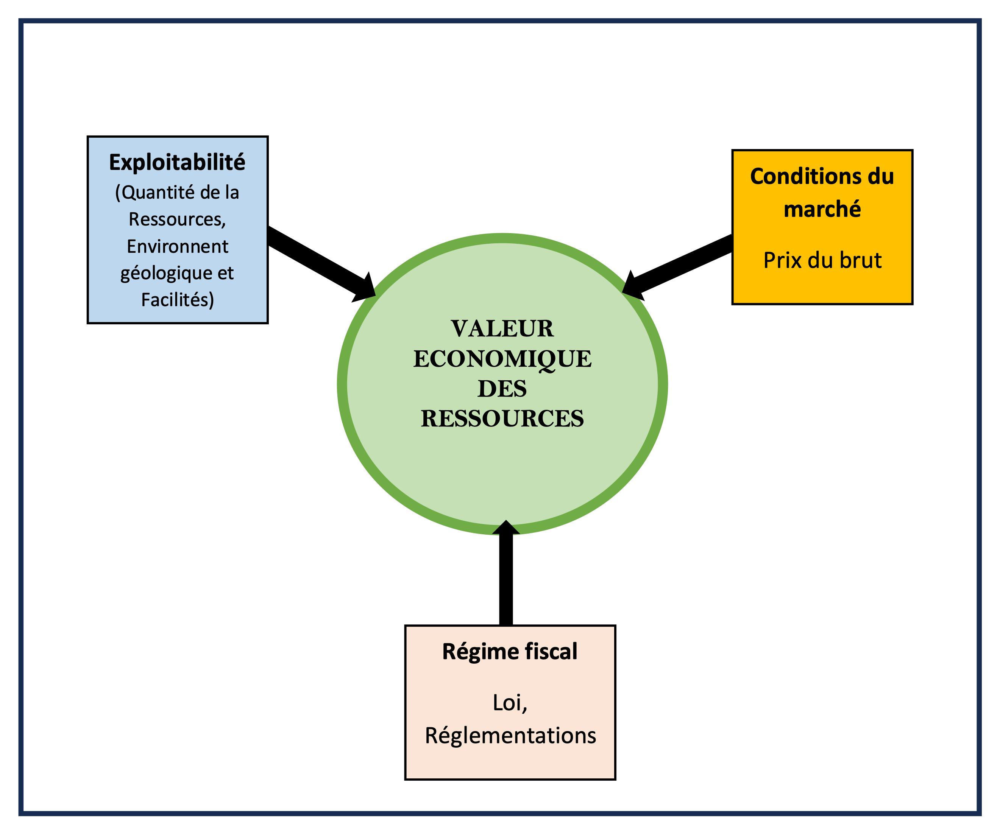
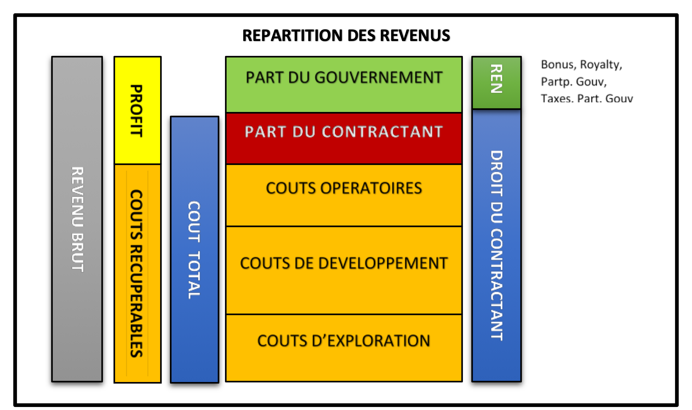
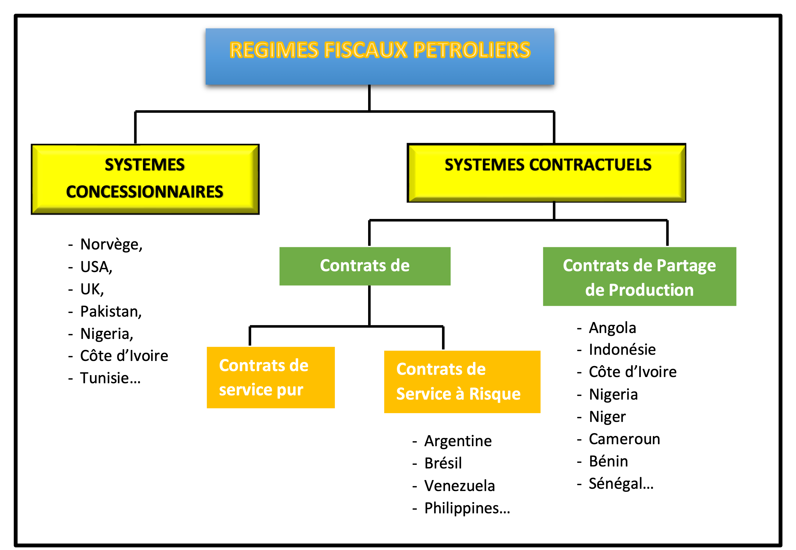

# Chapitre 3 : Régimes fiscaux dans le secteur pétrolier

Trois facteurs principaux permettent de définir la valeur économique des ressources pétrolières d’un Etat (Figure 21). Il s’agit de :

- l’exploitabilité qui est liée à la quantité de ressources pétrolières découvertes et aux conditions géologiques et techniques nécessaires à leur mise en valeur ;
- les conditions du marché qui sont définies par le prix du pétrole brut sur le marché international ; et
- le régime fiscal qui est le cadre réglementaire élaboré par l’Etat et qui définit les outils de gestion des ressources pétrolières.

Figure 21: Valeur économique des ressources en hydrocarbures

La rente économique pétrolière d’un Etat producteur de pétrole est le bénéfice que tire cet Etat de la mise en valeur de ses ressources pétrolières (Figure 22). Elle se calcule en soustrayant de la valeur monétaire totale que représentent les hydrocarbures dans le sous-sol, les différents investissements pour sa mise en valeur depuis l’exploration jusqu’à l’abandon en passant par l’exploitation et la part des bénéfices revenant à l’investisseur. Elle équivaut pour l’Etat, propriétaire des ressources, à la part ou à la fraction qui lui revient, et qui est perçue à travers un certain nombre de mécanismes à savoir, les bonus, les redevances, les dividendes issues de la participation directe de l’Etat, sa part du pétrole profit et les taxes.

Le reliquat de pétrole après déduction des investissement (bénéfice) appelé pétrole profit est partagé entre le gouvernement (Etat) et le contractant conformément au régime fiscal sur la base de laquelle les deux parties se sont engagées à travers le contrat pétrolier.

Les intérêts manifestes et parfois contradictoires de l’Etat et du Contractant (CPI) notés lors des négociations des contrats sont liés au degré de prise de risque des parties.

En effet, les CPI qui prennent d’énormes visent : i) la rentabilité du projet, ii) de meilleurs profits aux actionnaires et par conséquent iii) une grande production (à plateau élevé) en une période relativement courte aux fins de récupérer le plus vite possible leurs investissements c’est-à-dire avoir un rapide retour sur investissement. Il s’agit des risques financiers liées aux lourds investissements nécessaires à la recherche pétrolières, des risques politiques qui peuvent subvenir en cas d’instabilité politique (guerres, changement de régime politique…), des risques économiques liés au changement du régime fiscal et/ou à la baisse drastique des cours du barils de pétrole sur le marché international et des risques géologiques et techniques.

Par contre, l’Etat a pour objectif d’assurer à partir de ses ressources pétrolières : i) des bénéfices à long terme pour sa population, ii) l’emploi, le bien-être, le transfert de compétence et par ricochet iii) une exploitation des ressources pendant la durée la plus longue avec le taux de récupération le plus élevé possible.

Figure 22: Répartition des revenus issus de la production (After Johnson,1995)

## 3.1- Système ou régime fiscal : Fondements conceptuels

Le régime fiscal est le plus important outil de gestion des ressources pour les Etats. C’est pourquoi, il est obligatoire pour tous les managers et décideurs des Etats du secteur pétrolier de comprendre les principes de base, les types, les avantages et inconvénients liés à chaque régime fiscal.

L'objectif principal de la fiscalité pétrolière est de capter la rente économique, c'est-à-dire l'excédent restant après déduction des coûts et d'un rendement raisonnable du capital investi. Des institutions comme la Banque mondiale et le FMI insistent généralement sur le fait que les gouvernements doivent s'assurer une part équitable de cette rente, tout en laissant aux investisseurs un potentiel de gain suffisant pour justifier les risques encourus.

Les projets pétroliers nécessitent d'importants investissements et s'étendent sur le long terme, souvent plusieurs décennies. De ce fait, les systèmes fiscaux doivent tenir compte de l'incertitude. Un des principes clés est la progressivité : la part de l'État doit augmenter avec la rentabilité. Cela permet de garantir la viabilité des projets en période de prix bas, tout en permettant à l'État d'en tirer davantage profit lorsque la conjoncture s'améliore.

Dans le même temps, les investisseurs ont besoin de stabilité. Des changements budgétaires soudains ou imprévisibles peuvent miner la confiance et retarder les décisions d'investissement.

Les gouvernements, quant à eux, ont besoin d'une certaine flexibilité pour s'adapter à l'évolution de la conjoncture économique. Trouver le juste équilibre entre stabilité et adaptabilité demeure l'un des principaux défis de la conception et de l’adoption de systèmes fiscaux pétroliers efficaces.

Il existe en effet, deux familles de systèmes fiscaux dans l’industrie pétrolière à savoir les systèmes concessionnaires et les systèmes contractuels (Figure 23). Les législations ou réglementations appliquées à l’exploration et à l’exploitation pétrolières dans un pays dépend du régime fiscal adopté par ce pays.

Figure 23: Classification des régimes fiscaux

## 3.2- Le système concessionnaire

La concession connue sous le nom licence ou bail est le plus ancien et le plus largement utilisé des régimes fiscaux pour les accords pétroliers. Ce système est le plus souvent caractérisé par accords basés sur les Redevances (royalties) et Taxes. Ce système présente les traits caractéristiques suivants :

- La compagnie pétrolière a le droit exclusif d'explorer et de produire à ses propres risques et frais ;
- La compagnie pétrolière détient la production ;
- La compagnie pétrolière paie la redevance ad valorem et la redevance superficiaire à l’Etat ;
- La compagnie pétrolière paie des impôts sur les bénéfices ;
- La compagnie pétrolière a le droit d'exporter des hydrocarbures ;
- La compagnie pétrolière détient le titre de propriété des équipements.

## 3.3- Le système contractuel :

Dans ce système, il existe deux catégories ou types de contrats à savoir le Contrat de Partage de Production (CPP) et les Contrats de Service.

### 3.3.1- Le Contrat de Partage de Production (CPP)

Le Contrat de Partage de Production (CPP) désigné en anglais par « Production Sharing Contrat » ou « Production Sharing Agreement » (PSC ou PSA) est le type de contrat pétrolier le plus couramment signé en Afrique et qui est basé fondamentalement sur trois éléments cardinaux à savoir : les coûts récupérables, le partage du pétrole profit entre le Gouvernement et la CPI et les impôts sur bénéfice.

Il a été expérimenté plus la première fois en Indonésie. D’une manière générale ou classique, un CPP contient des dispositions sur les éléments suivants :

- Les bonus : il s’agit des bonus de signature, de découverte ou de production. C’est un montant forfaitaire payé dans les conditions et délai prévu par la réglementation par le contractant, titulaire d’une autorisation d’exploration ou d’exploitation mais qui est généralement non remboursable c’est-à-dire que cette somme payée n’est pas comptabilisée dans les coûts pétroliers récupérables.
- Les obligations de travail : cette disposition définit le volume de travail qui sera réalisé par le contractant pendant la durée contractuelle. Il s’agit généralement de quantifier le volume de sismique 2D et/ou 3D et autres études Géologiques et Géophysiques (G&G) à réaliser, le nombre et type de puits à forer avec les dépenses prévisionnelles y relatives
- Les redevances : ce sont notamment :
- la royalty encore appelé redevance ad valorem qui permet aux Etats propriétaires des ressources de disposer d’une partie de leur ressource avant tout partage de pétrole profit ; et
- les redevances superficiaires qui sont des droits de location du bloc ou du périmètre sous contrat ;
- Les coûts pétroliers récupérables (cost oil) : cette rubrique définit et clarifie les opérations, activités ou droits payés ou dépensés par le contactant et qui lui seront remboursés en cas de découverte pendant la phase de production suivant les modalités prévues au CPP ;
- Le partage du pétrole profit (profit oil) : dans un CPP, les modalités de partage du pétrole profit entre les parties (contractant et Etat) doivent être connues avec des clés de répartition préalablement définis ;
- La participation de l’Etat : C’est une part d’action accordée à l’Etat et qui est définit dans les CPP. Les modalités de participation de l’Etat ainsi que le taux de cette participation aux opérations d’exploration et d’exploitation pétrolières sont précisées dans le contrat. Généralement pour bon nombre de pays, la participation de l’Etat est portée en phase d’exploration et de développement ;
- Les obligations du marché intérieur : les règles permettant de vendre à un prix préférentielle les hydrocarbures à l’Etat uniquement pour la satisfaction des besoins du pays doivent être définies dans le CPP. Elle permet aux Etats d’assurer leur sécurité énergétique à partir de l’exploitation de leurs ressources. Cette obligation encadre l’exportation des ressources pétrolières par les CPI surtout lorsque les besoins intérieurs du pays ne sont encore satisfaits.
- L’emploi et la formation du personnel local : cette disposition est très importante au point où aujourd’hui elle a été élargie pour favoriser de la prise en main d’un certain nombre d’activités par le personnel et les entreprises locales. Il s’agit de développer le Contenu Local, concept actuellement utilisé pour favoriser la mise en place des services locaux et le développement des entreprises nationales dans le secteur pétrolier en vue d’un transfert de technologie et de connaissance efficace et opérationnel. Au regard de l’importance du Contenu Local, certains Etats l’ont érigé en loi ou règlementation particulière.

Les caractéristiques essentielles d’un CPP sont :

- le contractant partage les risques avec l’Etat ;
- le contractant obtient une part de la production généralement en nature ;
- l’Etat détient le titre de propriété des équipements ;
- l’Etat conserve son titre de propriété du pétrole. Autrement dit, le contractant ne détient jamais de titre de propriété sur le pétrole

### 3.3.2- Les Contrats de service

Les contrats de service peuvent être divisés en contrats de services purs et en contrats de services à risques.

- Contras de Service pur

Dans cette catégorie de contrats, l’Etat prend tous les risques et engage une société pétrolière pour explorer et produire des découvertes pétrolières moyennant des rémunérations indépendamment ou qui ne tiennent pas compte du bénéfice du projet. De tels contrats existent au Moyen-Orient mais sont rares dans d’autres régions du monde. C’est ce type de contrat que le Bénin avait signé en 1979 avec la société norvégienne SAGA Petroleum pour le développement du champ de Sèmè. Des arrangements similaires sont utilisés par les compagnies pétrolières envers des sociétés de services comme PGS, Schlumberger et d'autres.

- Contrat de Service à Risque

Les contrats de services à risque impliquent une prise de risque par la compagnie pétrolière et constituent les contrats de service les plus couramment utilisés.

Dans le cas de ce type de contrat :

- le contractant partage le risque avec l’Etat ;
- le contractant reçoit une part des bénéfices généralement en espèces ;
- L’Etat détient le titre de propriété des équipements et conserve son titre de propriété du pétrole ;
- le contractant ne détient jamais de titre de propriété sur le pétrole.

Les contrats de service à risque sont à bien des égards similaires aux contrats de partage de production, à l’exception du mode de paiement (en espèce ou en nature) et les mêmes éléments et mécanismes sont utilisés pour réguler la relation entre les deux parties dans ces deux types de contrat.

## 3.4- Structure des systèmes fiscaux pétroliers en Afrique de l’Ouest

La plupart des systèmes fiscaux d'Afrique de l'Ouest reposent sur une combinaison d'instruments, chacun remplissant une fonction spécifique. Les redevances génèrent des recettes rapides, mais peuvent être régressives, notamment pour les gisements marginaux. Les mécanismes de recouvrement des coûts, en particulier dans le cadre des contrats de partage de production, permettent aux investisseurs de récupérer leurs dépenses, bien que ces mécanismes soient généralement plafonnés afin de garantir que l'État commence à percevoir les bénéfices pétroliers dans un délai raisonnable.

Les impôts sur les bénéfices, tels que l'impôt sur les sociétés ou l'impôt sur les plus-values, sont les principaux instruments de captation de la rente économique et d'introduction de la progressivité. Les primes constituent des versements initiaux, mais contribuent généralement moins significativement aux recettes globales. La participation de l'État, le plus souvent par le biais des compagnies pétrolières nationales, peut renforcer le contrôle et les rendements publics, mais expose également l'État à des risques financiers et opérationnels.

C’est l’interaction entre ces éléments, plutôt qu’un seul composant, qui détermine la part globale du gouvernement et influence la manière dont les investisseurs évaluent les risques et les récompenses.

## 3.5- Cadres contractuels en Afrique de l'Ouest

Les contrats de partage de production (CPP) constituent le modèle dominant en Afrique de l'Ouest. Ils permettent aux gouvernements de conserver la propriété des ressources tout en s'appuyant sur des entreprises privées pour fournir les capitaux et l'expertise technique. Dans le cadre d'un CPP, les contractants assument les risques liés à l'exploration et au développement, recouvrent leurs coûts grâce à la production, puis partagent les bénéfices pétroliers restants avec l'État.

Les systèmes de concession sont encore utilisés dans certaines Etats, notamment ceux influencées par les traditions juridiques anglo-saxonnes ou ceux dont le secteur pétrolier est plus mature. Les contrats de service sont moins fréquents, mais existent dans certains cas particuliers. En pratique, de nombreux pays ont recours à des approches hybrides, combinant des éléments de différents systèmes pour répondre aux besoins spécifiques de leurs projets ou objectifs politiques.
