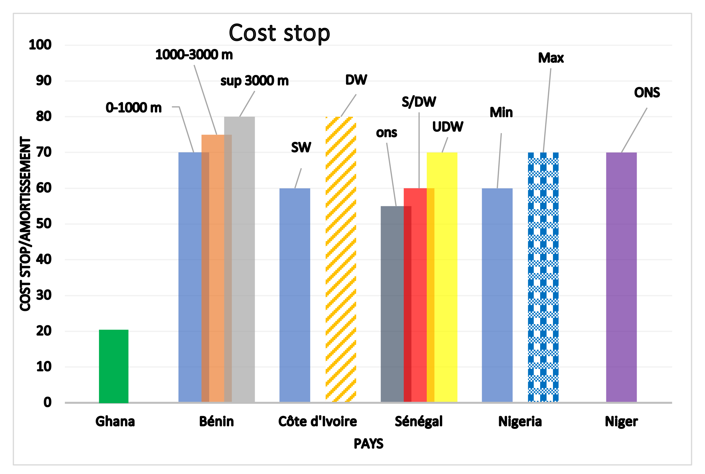
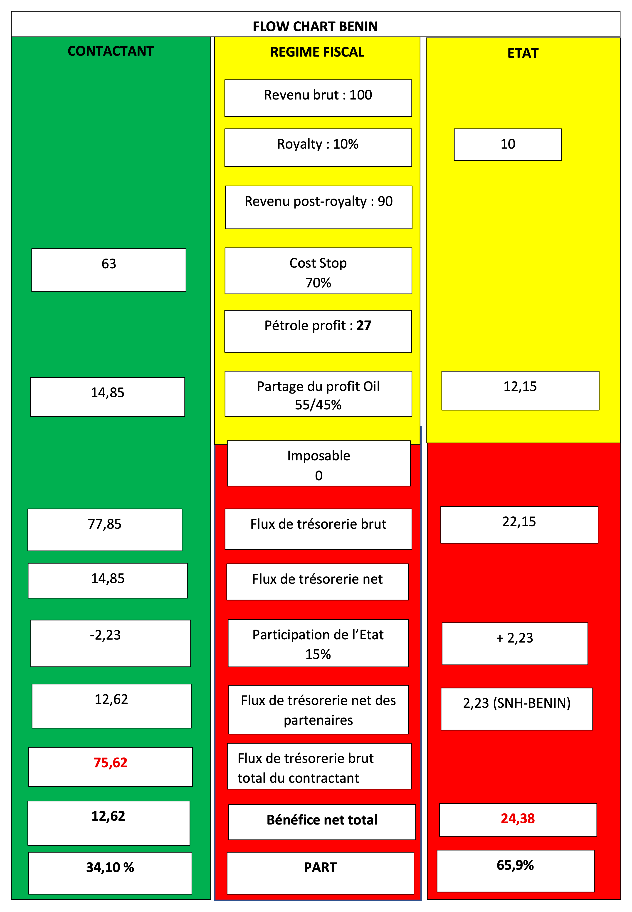
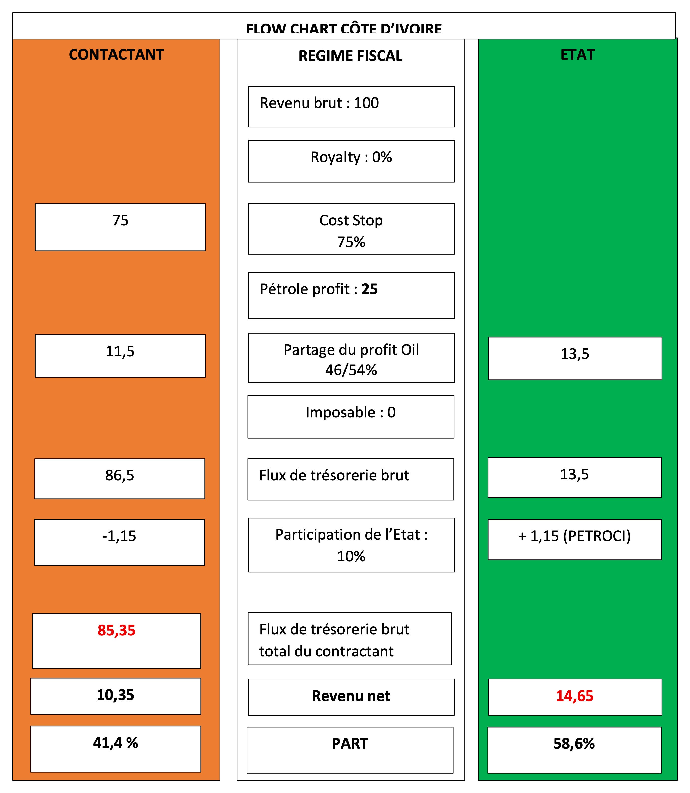
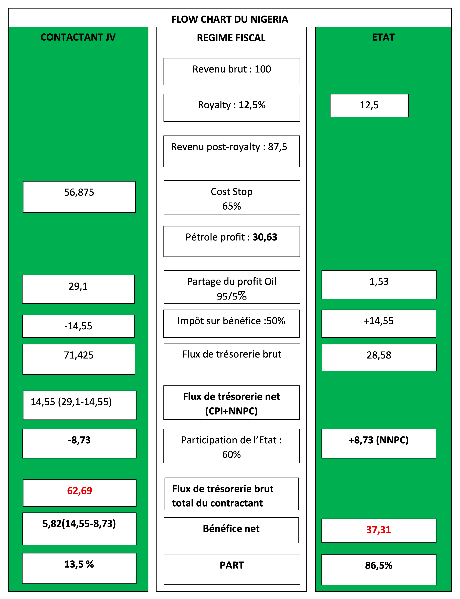
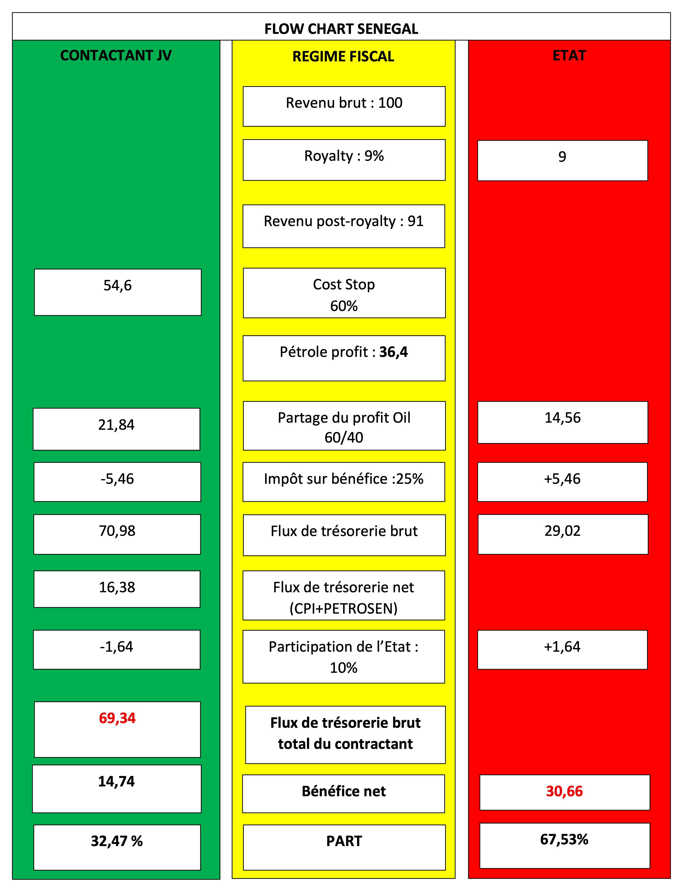
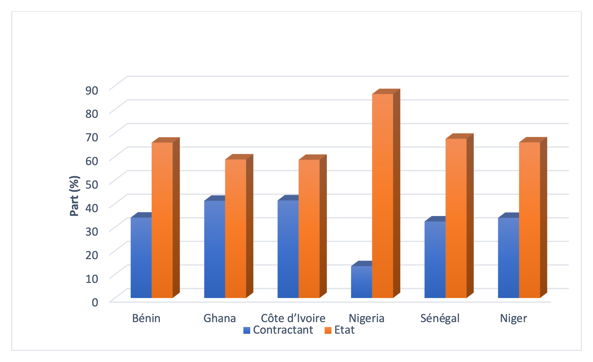
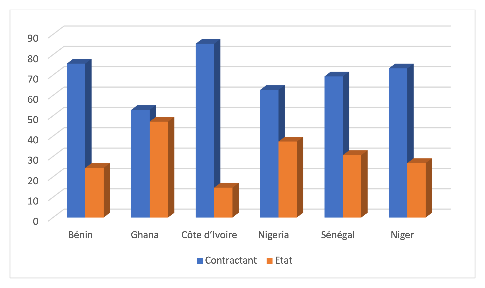

# Chapitre 4 : Étude comparée des régimes fiscaux dans certains pays de l’Afrique de l’Ouest

Etude de cas du Bénin, Niger, Ghana, Côte d’Ivoire, Nigeria et Sénégal

## 4.1- Principes de conception du diagramme du flux financier associé au contrat pétrolier

Avant le démarrage des négociations pétrolières, l’Etat, propriétaire des ressources, doit élaborer diagramme de flux financier ou économique (flow chart) simplifié montrant la répartition des revenus entre le contractant et lui. Ce diagramme constitue un modèle économique sommaire qui permet à l’Etat de savoir la rente pétrolière qui lui reviendra après exploitation. Ce flow chart est un outil d’aide à la prise de décision qui permet aux Etats propriétaires des ressources de mieux apprécier leur régime fiscal et les paramètres négociables sur lesquels ils doivent agir lors des négociations des contrats pour tirer le meilleur profit de leurs ressources.

Les instruments juridiques et réglementaires sur la base desquels les Etats doivent se fonder pour la conception de cet outil d’aide à la décision sont le code pétrolier et surtout le régime fiscal.

### 4.1.1- Code pétrolier

C’est l’instrument juridique qui encadre l’exercice des opérations pétrolières. Il prévoit entre autres, des dispositions qui sont de nature à encourager les sociétés ou consortium de sociétés pétrolières pour la réalisation des opérations pétrolières, compte tenu des coûts particulièrement élevés des travaux de recherche mais aussi prévoit des dispositions qui règlementent la répartition des revenus entres l’Etat et les partenaires.

### 4.1.2- Régime fiscal

Le régime fiscal est généralement consacré par la loi pétrolière des Etats. Au Bénin par esemple, la loi n°2019-06 du 15 novembre 2019 portant Code pétrolier consacre uniquement le contrat de partage de production comme régime fiscal applicable pour la réalisation des travaux d’exploration et d’exploitation pétrolières par les CPI. A cet effet, un modèle de contrat type de partage de production a été adopté par décret en 2020. D’autres pays disposent dans leur législation outre le Contrat de Partage de Production (CPP), les autres systèmes fiscaux à savoir le contrat de concession et les contrats de services. Au Nigeria et en Côte d’Ivoire par exemple, leur législation autorise aussi bien la signature d’un CPP ou d’un contrat de concession.

Les éléments cardinaux des régimes fiscaux permettant la réalisation de ce diagramme simplifié qui répartit les revenus de l’Etat et du contractant sont la redevance ad valorem, le cost oil, le profit Oil, l’impôt sur les sociétés. A cela s’ajoute la participation de l’Etat dans les opérations pétrolières.

Les éléments fiscaux comme les bonus et redevances ad valorem (royalties) qui induisent des payements en amont au profit de l’Etat ne sont pas basés sur le bénéfice du projet. Ils sont instaurés pour amoindrir les risques des Etats. A contrario, ces paiements en amont à l’Etat rendent le régime fiscal régressif lorsqu’ils sont trop élevés, donc peu attractif pour les investisseurs. Le système régressif n’encourage pas les CPI qui préfèrent un régime fiscal progressif où la rente de l’Etat est beaucoup plus basée sur les impôts sur revenu, les taxes supplémentaires etc. résultant des bénéfices du projet.

## 4.2- Principaux éléments fiscaux appliqués dans certains pays de l’Afrique de l’Ouest

### 4.2.1- Redevance ad valorem (royalty)

A la sortie de la première goutte de pétrole ou gaz, une part est directement affecté à l’Etat propriétaire des ressources avant toute déduction des coûts ou tout partage de production. Cette part est appelée royalty. Elle est surtout appliquée dans les contrats de concession. Cette redevance est instituée dans les PSA en prévision des risques de réservoir imprévisibles au niveau de certains gisements d’hydrocarbures. Cette redevance lorsqu’elle est trop élevée dans les PSA peut être à l’origine d’arrêt ou d’abandon précoce ou prématuré des champs par les CPI. Elle peut être perçue en nature ou en espèce.

Le reliquat obtenu de la valeur monétaire de pétrole extrait du gisement (revenu brut) après déduction de la royalty, est le revenu net de la royalty. Le revenu brut dépend ainsi de la quantité du pétrole brut extrait du gisement, de la qualité du brut et de la variation du prix du brut sur le marché international. Ainsi, on a :

  Revenu Post Royalty = Revenu brut &minus; Royalty

Le tableau 5 ci-dessous montre les proportions des royalties adoptées dans la réglementation pétrolière de certains pays de l’Afrique de l’Ouest.

<table style="width:100%;">
<caption>
Tableau 5: Synthèse des taux de Redevances ad valorem appliqués dans de certains pays de l’Afrique de l’Ouest
</caption>
<colgroup>
<col style="width: 20%" />
<col style="width: 14%" />
<col style="width: 16%" />
<col style="width: 12%" />
<col style="width: 16%" />
<col style="width: 18%" />
</colgroup>
<thead>
<tr>
<th><strong> </strong></th>
<th colspan="4" style="text-align: center;"><strong>ROYALTY (%)</strong></th>
<th rowspan="3" style="text-align: center;"><strong>Observations</strong></th>
</tr>
<tr>
<th></th>
<th colspan="3" style="text-align: center;"><strong>Pétrole</strong></th>
<th style="text-align: center;"><strong>Gaz naturel</strong></th>
</tr>
<tr>
<th style="text-align: center;"><strong>PAYS</strong></th>
<th colspan="2" style="text-align: center;"><strong>Offshore</strong></th>
<th style="text-align: center;"><strong>Onshore</strong></th>
<th><strong> </strong></th>
</tr>
</thead>
<tbody>
<tr>
<td><strong> </strong></td>
<td style="text-align: center;"><strong>Shallow</strong></td>
<td style="text-align: center;"><strong>Deep</strong></td>
<td><strong> </strong></td>
<td><strong> </strong></td>
<td></td>
</tr>
<tr>
<td><strong>Ghana</strong></td>
<td colspan="3" style="text-align: center;">5 à 12</td>
<td style="text-align: center;">4 à 10</td>
<td style="text-align: center;"></td>
</tr>
<tr>
<td><strong>Bénin</strong></td>
<td colspan="3" style="text-align: center;">10 à 15</td>
<td style="text-align: center;">2,5 à 5</td>
<td style="text-align: center;"></td>
</tr>
<tr>
<td><strong>Côte d'Ivoire</strong></td>
<td colspan="4" style="text-align: center;">-</td>
<td style="text-align: center;">Pas de royalty</td>
</tr>
<tr>
<td><strong>Sénégal</strong></td>
<td style="text-align: center;">9</td>
<td style="text-align: center;">8</td>
<td style="text-align: center;">10</td>
<td style="text-align: center;">6</td>
<td style="text-align: center;"></td>
</tr>
<tr>
<td><strong>Nigeria</strong></td>
<td style="text-align: center;">12,5</td>
<td style="text-align: center;">7,5</td>
<td style="text-align: center;">15</td>
<td style="text-align: center;">2,5 à 5</td>
<td style="text-align: center;"></td>
</tr>
<tr>
<td><strong>Niger</strong></td>
<td style="text-align: center;">-</td>
<td style="text-align: center;">-</td>
<td style="text-align: center;">15</td>
<td style="text-align: center;">2,5 à 5</td>
<td style="text-align: center;">Pas de bassin offshore</td>
</tr>
</tbody>
</table>

L’analyse de ce tableau montre que la royalty ne dépasse pas 15% dans la plupart des pays de l’Afrique de l’Ouest et varie en fonction de :

- la nature du fluide : le taux de royalty du pétrole est largement plus élevés que celui du gaz. Le maximum dans les pays étudiés est de 15% pour le pétrole et 6% pour le gaz. Cette différence peut être liée au taux de récupération du gaz qui est plus élevé que celui du pétrole ;
- la zone géologique de découverte : selon qu’il s’agit de l’onshore ou de l’offshore peu profond, profond ou très profond. Les royalties sont plus faibles dans les zones géologiques offshore qui nécessitent plus d’investissement pour l’exploitation des hydrocarbures que dans l’onshore ;
- la variation du prix du baril et sur le volume de pétrole produit : en plus des deux groupes de paramètre ci-dessous cités, d’autres pays comme le Nigeria par exemple, ont instauré une royalty additionnelle qui est basée sur la variation du prix du baril et sur le volume de pétrole produit. Cette royalty pourrait être interprétée comme un droit pétrolier supplémentaire permettant la capture par les Etats des plus-values lorsque le prix du baril sur le marché international augmente et atteint un seuil donné, afin d’augmenter leur rente pétrolière.

La Côte d’Ivoire ne prévoit pas de royalty dans son PSA. Cela est de nature à attirer les investisseurs. Ce faisant, son PSA peut paraitre plus attractif que ceux des autres pays de la sous-région Ouest africaine sur ce volet.

Quant au Bénin, la tranche de royalty dans la zone offshore est moins attractive que ceux du Ghana, du Sénégal, de la Côte d’Ivoire et le Nigeria pour le pétrole mais pratiquement les mêmes pour le gaz naturel.

### 4.2.2- Coûts pétroliers récupérables

Ils concernent les coûts exploratoires, de développement et les coûts opératoires investis ou mise en place par les contractants pour la conduite des opérations pétrolières y compris les dépréciation/amortissement. Avant le partage du pétrole profit, une part de la production est affectée à la récupération des coûts investis par les contractants. Dans les contrats pétroliers, un plafond est fixé dans les réglementations du régime fiscal. Ce plafond de récupération des coûts est appelé Cost Stop. Les compagnies pétrolières internationales souhaitent une récupération rapide de leurs investissements afin de minimiser les risques politiques inattendus pouvant provoquer un blocus de la production dans certains pays et les risques techniques et de réservoir imprévisibles pouvant engendrer de faible rendement de production plus tôt que prévu. Un Cost stop et un taux de production journalier élevé permet au CPI d’obtenir une durée de rentabilité la plus courte possible. Cette durée est définie par le temps nécessaire pour que l’investissement de départ de départ lié aux coûts d’exploration et de développement (CAPEX) puisse être récupéré.

Le graphe ci-dessous (Figure 24) montre le Cost stop dans les pays ouest-africains objet de notre étude.

Figure 24: Graphe montrant les Cost stop appliqués dans certains pays de l’Afrique de l’Ouest

L’analyse de ce graphe révèle que la fixation du cost stop varie d’un pays à un autre. Le taux globalement appliqué dans ces pays est compris entre 55 % et 80 % et dépend de la situation de la zone contractuel (onshore, offshore peu profond, très profond ou ultra profond). Les cost stop relativement plus élevés sont appliqués dans des zones de bathymétrie élevée c’est à dire en offshore profond à ultra profond qui présentent des défis énormes en matière de technologie d’exploration, et d’investissement, afin d’encourager les compagnies à entreprendre des opérations dans ces zones à grands risques financiers et techniques. A l’opposé, pour les zones onshore et offshore peu profond, les Etats optent pour un cost stop moins élevé.

L’étude comparée du Cost Stop montre que le Bénin et la côte d’Ivoire ont un cost stop relativement plus attrayants. Pour le Bénin, il est plafonné comme dans le cas de la majorité des pays et varie de 70 % en onshore jusqu’à 80 % en offshore très profond. La Côte d’Ivoire quant à elle a adopté dans sa réglementation un cost Oil de 60% en offshore peu profond et 80 % en mer très profonde. Le Ghana quant à lui a opté dans sa législation pour une amortissement des dépenses d’investissement (coûts d’exploration et de développement) à hauteur de 20% chaque année à partir de la date de la production commerciale pour une durée de 5 ans c’est-à-dire un recouvrement linéaire des coûts d’investissement pendant 5 ans. L’option du Ghana, permet au contractant et à l’Etat de d’opérer un mode de production efficace et efficient, en ce sens que le montant annuel à rembourser n’est pas une fonction de de la production, de sorte que les ressources puissent être exploitées de façon responsable et durable jusqu’au remboursement des dépenses en capital reconnues dans la législation.

### 4.2.3- Pétrole profit

Le pétrole profit est la part du pétrole qui reste après la déduction des coûts pétroliers et de la Royalty (redevance ad valorem) et qui est partagé entre le Gouvernement et Contractant. Le profit oil est analogue au revenu imposable dans un système concessionnel. Le pétrole profit est généralement, mais pas toujours, taxé.

Il est calculé par le formule suivante :

<!-- parity-ignore:start -->
<section class="formula-group formula-group--split formula-group--oil-profit" data-equation-label="4.2" aria-label="Formules du pétrole profit">
  

    

      Pétrole profit = Revenue post Royalty &minus; Coûts récupérables
    

  

  

    ou
  

  

    

      Pétrole Profit = Revenu brut &minus; Royalty &minus; Coûts récupérables
    

  

</section>
<!-- parity-ignore:end -->

Pétrole profit = Revenue post Royalty - Coûts récupérables ouPétrole Profit = Revenu brut - Royalty - Coûts récupérables

Dans les Contrat de Partage de Production du Bénin et du Niger, la part du profit oil revenant au contractant n’est plus taxé.

Les modalités de répartition du pétrole profit varie d’un pays à un autre. Certains pays adoptent un mécanisme de partage basé sur la production journalière ou cumulée suivant une échelle progressive alors que d’autres pays opte pour un partage basé sur la rentabilité (facteur R ou taux de rendement) qui est une fonction des revenus et des couts pétroliers. Autrement dit, le profit oil maximum et minimum fait référence aux contrats où il existe une échelle dynamique dépendant d'un déclencheur qui peut être le volume de production, des facteurs économiques comme le taux de rendement interne ou d'autres critères. Si le partage des bénéfices est élevé en faveur de la Compagnie pétrolière, les Etats doivent sécuriser leur part par d'autres mesures, le plus souvent par la fiscalité.

Le facteur R peut être utilisé comme déclencheur à la fois pour la redevance que pour le partage des bénéfices. Il se détermine de différentes manières :

<section class="formula-panel formula-panel--r-factor" data-equation-label="4.3" aria-label="Formules de calcul du facteur R">
  

    Facteur-R=Revenus cumulés/Coût cumulé
  

  

    Facteur-R= (Revenus cumulés - Opex cumulés) /Capex cumulés
  

  

    Facteur-R= (Revenus cumulés - bénéfices cumulés) / (investissements cumulés + Opex cumulées)
  

  

    Facteur-R=Revenu net cumulé/Coûts cumulés
  

</section>

Quand le facteur - R devient de plus en plus grand, cela signifie que la rentabilité du projet devient plus élevée avec une baisse drastique des coûts récupérables. Il appartient aux Etats de définir dans leur réglementation le mode de calcul le plus aisé et qui leur permet de capter plus rapidement les meilleures parts du profit Oil. Ainsi lorsque la totalité des dépenses en capital (CAPEX) sont récupérés par le contractant, la clé de partage doit être inversé de sorte que la part de l’Etat deviennent de plus en élevé.

Par ailleurs, afin d’éviter toutes manipulation et gonflement des coûts pétroliers récupérables, il est indispensable que les Etats fassent un suivi rigoureux des coûts investis, des audits annuels et forment leur personnel en matière de contrôle des coûts étant donné que le calcul du Facteur-R est intimement liés aux coûts investis et par conséquent le mécanisme de rétribution des bénéfices en dépend.

Le mécanisme lié au volume de production parait plus simple et facile pour des Etats mais semble être moins objectif et équitable que le modèle basé sur la rentabilité. Toutefois, dans les deux cas, le suivi et le contrôle des déclarations de production et de coûts sont très importantes pour minimiser les fausses déclarations et les trafics de produits afin d’optimiser les rentes pétrolières des Etats.

Le tableau 6 ci-dessous présente le mécanisme utilisé dans certains pays.

<table>
<caption>
Tableau 6: Mécanismes de partage du pétrole profit dans certains pays de l’Afrique de l’Ouest
</caption>
<colgroup>
<col style="width: 11%" />
<col style="width: 28%" />
<col style="width: 14%" />
<col style="width: 45%" />
</colgroup>
<thead>
<tr>
  <th rowspan="2" style="text-align: left;">
<strong>PAYS</strong>
</th>
  <th colspan="2" style="text-align: center;">
<strong>MÉCANISMES DE PARTAGE DU PÉTROLE PROFIT</strong>
</th>
  <th rowspan="2" style="text-align: center;">
<strong>PROFIT OIL DE L’ETAT (%)</strong>
</th>
</tr>
<tr>
  <th style="text-align: left;">
<em>Production jounalière ou cumulée </em>
</th>
  <th style="text-align: left;">
<em>Facteur R ou RoR</em>
</th>
</tr>
</thead>
<tbody>
<tr>
  <td>
<strong>BÉNIN</strong>
</td>
  <td>
-
</td>
  <td>
R
</td>
  <td>
<strong>40 à 65%</strong>

Zone contractuelle située entre 0 et 1000 m de profondeur d’eau

<ul>
<li>R&lt; 1……………….45%</li>
<li>1&lt;R&lt;1,5…………..50%</li>
<li>1,5&lt;R&lt;2…………..55%</li>
<li>2&lt;R&lt;2,5…………..60%</li>
<li>R<strong>&gt;2,5……………..65%</strong></li>
</ul>

Zone contractuelle située au-delà de 1000 m de profondeur d’eau

<ul>
<li>R&lt; 1……………….40%</li>
<li>1&lt;R&lt;1,5…………..45%</li>
<li>1,5&lt;R&lt;2…………..50%</li>
<li>2&lt;R&lt;2,5…………..55%</li>
<li>R<strong>&gt;2,5……………..60%</strong></li>
</ul></td>
</tr>
<tr>
  <td>
<strong>GHANA</strong>
</td>
  <td>
-
</td>
  <td>
RoR
</td>
  <td>
<strong>0 à 25%</strong>

<ul>
<li>ROR &lt; 15%, 0% tax</li>
<li>15%&lt;ROR&lt;20%, 10% tax</li>
<li>20%&lt;ROR&lt;25%, 15% tax</li>
<li>25%&lt;ROR&lt;30%, 20% tax</li>
<li>ROR&gt; 30%, 25% tax</li>
</ul></td>
</tr>
<tr>
  <td>
<strong>COTE D’IVOIRE</strong>
</td>
  <td>
Production journalière modulée par un facteur H)
</td>
  <td>
-
</td>
  <td>
Négociable

<strong>32.5% à 47,5</strong>% modulé par un facteur H pour le contractant (Contrat Total -2019) soit

  100-(32,5xH) à 100-(47,5xH) pour l’Etat

  H=1,626 &minus; 0,141Ln (prix du pétrole brut déflaté à décembre 2011)

</td>
</tr>
<tr>
  <td>
<strong>NIGERIA</strong>
</td>
  <td>
Production cumulée en millions de barils (Pc)
</td>
  <td>
-
</td>
  <td>
<strong>5 à 45%</strong>

<ul>
<li>Pc&lt; 50 millions………………………….5%</li>
<li>50 millions&lt;Pc&lt;100 millions…………..10%</li>
<li>100 millions&lt;Pc&lt;350 millions..................15%</li>
<li>350 millions&lt;Pc&lt;750 millions…………25%</li>
<li>750 millions&lt;Pc&lt;1500 millions………...35%</li>
<li><strong>Pc&gt;1500 millions………………………45%</strong></li>
</ul></td>
</tr>
<tr>
  <td>
<strong>SÉNÉGAL</strong>
</td>
  <td>
-
</td>
  <td>
R
</td>
  <td>
<strong>40 à 60%</strong>

<ul>
<li>R&lt; 1……………….40%</li>
<li>1&lt;R&lt;2…………….45%</li>
<li>2&lt;R&lt;3…………….55%</li>
<li>R<strong>&gt;3………………..60%</strong></li>
</ul></td>
</tr>
<tr>
  <td>
<strong>NIGER</strong>
</td>
  <td>
-
</td>
  <td>
R
</td>
  <td>
<strong>40 à 60%</strong>

<ul>
<li>R&lt; 1……………….40%</li>
<li>1&lt;R&lt;2…………….45%</li>
<li>2&lt;R&lt;3…………….55%</li>
<li>R<strong>&gt;3………………..60%</strong></li>
</ul></td>
</tr>
</tbody>
</table>

### 4.2.4- Impôt sur bénéfice/société

Normalement, les compagnies pétrolières sont assujetties au paiement d’impôt sur les bénéfices. Cependant dans les législations fiscales des pays objet de notre étude, la politique de paiement des impôts sur les sociétés varie et ce en fonction de leur stratégie pour attirer les investisseurs. Au Bénin et au Niger par exemple, la société ne paie pas directement l’impôt sur ses bénéfices. L’impôt sur bénéfice est payé dans la part du pétrole profit de l’Etat. Par contre, au Nigeria, au Ghana et au Sénégal, ils sont assujettis au paiement d’impôt sur bénéfice. Pour ce dernier lot de pays, certains le paient conformément aux dispositions du Code général des impôts de leur pays (le Sénégal par exemple) et d’autre appliquent des taux spécifiques comme le Ghana par exemple.

Le tableau ci-dessus montre la synthèse de l’impôt sur revenu des pays objet de ce travail.

<table>
<caption>
Tableau 7: Taux d’impôt sur bénéfice appliqués dans certains pays de l’Afrique de l’Ouest dans le secteur pétrolier
</caption>
<thead>
<tr>
  <th>
Pays
</th>
  <th>
Impôts sur benefice (%)
</th>
</tr>
</thead>
<tbody>
<tr>
  <td>
Bénin
</td>
  <td>
(payé dans la part du pétrole profit de l’Etat)
</td>
</tr>
<tr>
  <td>
Ghana
</td>
  <td>
35
</td>
</tr>
<tr>
  <td>
Côte d’Ivoire
</td>
  <td>
(généralement payé dans la part du pétrole profit de l’Etat, confère contrat ENI-2019)
</td>
</tr>
<tr>
  <td>
Nigeria
</td>
  <td>
50
</td>
</tr>
<tr>
  <td>
Sénégal
</td>
  <td>
30
</td>
</tr>
<tr>
  <td>
Niger
</td>
  <td>
(payé dans la part du pétrole profit de l’Etat)
</td>
</tr>
</tbody>
</table>

L’examen de ces données montre que le Nigeria a le taux le plus élevé dans les pays de l’Afrique de l’Ouest suivi du Ghana. On peut donc en déduire que les pays qui dispose d’énormes ressources pétrolières prouvées appliquent dans leur régime fiscal un taux plus confortable afin de maximiser leur bénéfice dans l’exploitation de leurs ressources. Pour les pays comme le Bénin et le Niger et même la Cote d’Ivoire (dans certains de ses contrats), le profit oil et l’impôt sur bénéfice ne sont donc pas séparés et constitue une fiscalité unique au bénéfice du contractant c’est à dire de la compagnie pétrolière internationale. Il est souhaitable de séparer ces deux notions.

### 4.2.5- Participation de l’Etat

L’Etat propriétaire des ressources pétrolières a le droit de participer aux opérations pétrolières suivant les modalités définies par la loi pétrolière. Cette participation consiste à la prise d’une part d’action qui peut être portée par le contractant ou directement onéreuse. Cette participation de l’Etat est généralement gérée par l’intermédiaire des sociétés nationale des hydrocarbures. La prise des parts d’action dans opérations pétrolières permet aux Etats de :

- maximiser les revenus issus de l’exploitation de leurs ressources à travers les dividendes que sa participation va générer en tant qu’actionnaire et partie prenante ou co-contractant ;
- mieux contrôler les opérations et les intérêts de l’Etat
- acquérir et de développer une expertise nationale dans la conduite des opérations pétrolières.

Le tableau dessous résume le niveau de participation des Etats dans les pays objet de la présente étude.

<table>
<caption>
Tableau 8: Taux de participation de l’Etat dans certains pays de l’Afrique de l’Ouest
</caption>
<thead>
<tr>
  <th>
Pays
</th>
  <th>
Participation initiale (%)
</th>
  <th>
Participation additionnelle (%)
</th>
  <th>
Total (%)
</th>
</tr>
</thead>
<tbody>
<tr>
  <td>
Bénin
</td>
  <td>
10 à 15
</td>
  <td>
possible
</td>
  <td>
15
</td>
</tr>
<tr>
  <td>
Ghana
</td>
  <td>
15
</td>
  <td>
5
</td>
  <td>
20
</td>
</tr>
<tr>
  <td>
Côte d’Ivoire
</td>
  <td>
10
</td>
  <td>
12
</td>
  <td>
22
</td>
</tr>
<tr>
  <td>
Nigeria
</td>
  <td>
60
</td>
  <td>
-
</td>
  <td>
60
</td>
</tr>
<tr>
  <td>
Sénégal
</td>
  <td>
10
</td>
  <td>
20
</td>
  <td>
30
</td>
</tr>
<tr>
  <td>
Niger
</td>
  <td>
10 à 20
</td>
  <td>
-
</td>
  <td>
20
</td>
</tr>
</tbody>
</table>

Il ressort de l’analyse de ce tableau que seul le Nigeria possède un taux de participation initiale élevé qui est au-dessus de la moyenne c’est dire qui dépasse celle de la société pétrolière internationale. De ce fait, il augmentera très considérablement ses revenus pétroliers. On pourrait expliquer cette prise de risque par le Nigeria par le fait que le risque géologique est moins élevé au Nigeria qui détient un potentiel énorme prouvé en ressources pétrolières. Les autres pays ont une participation initiale (comprise entre 10 et 20%) encore très faible pour avoir le réel contrôle de leurs ressources et augmenter substantiellement leur rente pétrolière.

Mais, le paradoxe à l’analyse de ce tableau, est que ces pays à potentiel relativement faible, restent encore hésitants à augmenter leur participation après une découverte. Ainsi, la participation additionnelle tourne entre 5 et 20 % dans ces pays.

La participation de l’Etat est un élément essentiel et déterminant du régime fiscal permettant à l’Etat d’augmenter sa rente pétrolière à travers des dividendes proportionnellement générées aux Etats en fonction de leur niveau de participation.

C’est pourquoi, il est souhaitable que ces pays osent améliorer leur législation en matière de participation additionnelle qui peut leur permettre en phase d’exploitation de détenir une participation totale d’au moins 50 %.

D’autre part, les efforts de participation des Etat constitue un acte de partage de risque géologique, technique, économique et politique qui rassure les investisseurs étrangers pour la mise en œuvre des projets.

Le tableau 9 ci-dessous fait la synthèse des éléments essentiels du régime fiscal des six pays objet de la présente étude. Ces éléments permettent de déterminer la part de la rente pétrolière revenant à l’Etat et au contractant.

## 4.3- Analyse approfondie des régimes fiscaux par pays

### 4.3.1- Nigeria

Le système fiscal nigérian est l'un des plus complexes de la région, fruit de décennies d'évolutions progressives. La loi sur l'industrie pétrolière (PIA) de 2021 a consolidé nombre de ces éléments, instaurant une double structure fiscale : une taxe sur les hydrocarbures et un impôt sur les sociétés, et révisant le cadre des redevances.

Les redevances varient désormais en fonction du terrain et des niveaux de production. Les projets en eaux profondes bénéficient de taux relativement bas, tandis que les opérations terrestres et en eaux peu profondes sont soumises à des taux plus élevés, incluant des composantes liées au prix qui accentuent la progressivité. Historiquement, les contrats de partage de production (CPP) autorisaient des plafonds de recouvrement des coûts allant jusqu'à 80 %, ce qui favorisait l'investissement mais retardait les premières rentrées fiscales pour l'État. La loi sur l'investissement public (PIA) à corriger ce déséquilibre en le plafonnant à 70 %, bien que des difficultés de mise en œuvre subsistent, notamment en matière de vérification des coûts et de coordination réglementaire.

Le Nigeria offre un fort potentiel en ressources et un potentiel de croissance élevé, mais celui-ci est contrebalancé par la complexité fiscale et les risques opérationnels.

### 4.3.2- Ghana

Le Ghana est souvent considéré comme l'un des régimes les plus équilibrés et transparents de la région. Son système combine des éléments de contrats de partage de production (CPP) avec l'imposition des sociétés, créant ainsi une structure à la fois progressive et relativement simple. Les redevances se situent généralement entre 5 % et 12,5 %, avec des plafonds de recouvrement des coûts 20 %. La part des bénéfices pétroliers augmente avec la rentabilité, et l'impôt sur les sociétés avoisine les 35 %.

La force du système ghanéen réside dans ses institutions. La loi sur la gestion des revenus pétroliers offre un cadre clair pour leur répartition, tandis que la participation à l'Initiative pour la transparence des industries extractives renforce la responsabilisation. Le principal défi à relever est de maintenir la compétitivité face à une demande mondiale d'investissements de plus en plus sélective.

### 4.3.3- Sénégal

Le cadre fiscal du Sénégal reflète son statut de producteur émergent. Les contrats de partage de production (CPP) offrent des redevances relativement faibles et des plafonds de recouvrement des coûts élevés, reconnaissant ainsi l'importance des investissements nécessaires dans l'exploitation pétrolière et gazière offshore. La répartition des bénéfices pétroliers est progressive et la participation de l'État est gérée par Petrosen, généralement avec des participations reportées durant l'exploration.

Ce cadre intègre également des dispositions relatives à l'usage domestique du gaz, conformément aux objectifs plus larges de la politique énergétique. À mesure que le Sénégal entre dans la phase de production, le maintien de la transparence et de la discipline institutionnelle sera essentiel.

### 4.3.4- Côte d'Ivoire

La Côte d'Ivoire a développé un système compétitif basé sur des contrats de partage de production (PSC) avec des redevances modérées et des limites de recouvrement des coûts entre 60 à 80 %. Les conditions de partage des bénéfices pétroliers sont flexibles et souvent adaptées aux risques spécifiques de chaque projet, ce qui a contribué à attirer les investissements, notamment dans l'exploration en eaux profondes.

Les récentes découvertes en mer démontrent l’efficacité de cette approche. Cependant, à mesure que la production augmente, le gouvernement devra trouver un équilibre entre compétitivité et optimisation des recettes, tout en continuant de renforcer les institutions et de maintenir la transparence.

### 4.3.5- Bénin et Niger

Ces deux pays appliquent des systèmes fiscaux relativement simples, fondés sur des redevances modérées et avec une imposition sur les sociétés non séparée de la part de leur pétrole profit. Leurs cadres réglementaires sont fonctionnels mais nécessite d’être renforcés, ce qui reflète la taille réduite de leurs secteurs pétroliers notamment pour ce qui concerne le Bénin. La répartition des bénéfices dans ces deux pays est progressive et la participation de l'État est gérée comme au Sénégal par leur Société National des Hydrocarbures (SNH-Bénin et SONIDEP).

A l’image de Côte d’Ivoire, le Bénin a adopté une limite de recouvrement des coûts pétroliers très incitative allant jusqu’à 80 % pour tenir compte des difficultés et risques d’investissements énormes en mer profonde et très profonde.

### 4.3.6- Autres pays de l’Afrique de l’Ouest

- Mauritanie

Le régime fiscal de la Mauritanie reflète son rôle croissant en tant que producteur de gaz. Les contrats de partage de production (CPP) prévoient des redevances modérées et des dispositions de recouvrement des coûts adaptées aux grands projets gaziers offshore. La coordination avec le Sénégal sur le projet du Grand Tortue Ahmeyim complexifie le dispositif, mais permet également de réaliser des gains d'efficacité grâce à la mutualisation des infrastructures.

Les capacités institutionnelles demeurent une contrainte, et la gestion efficace des futurs revenus gaziers sera essentielle au développement économique à long terme.

- Sierra Leone et Libéria

Les deux pays proposent des conditions fiscales relativement avantageuses - faibles redevances et plafonds de récupération des coûts élevés - afin de compenser les risques géologiques et politiques importants. Malgré cela, le succès de l'exploration reste limité, ce qui souligne l'insuffisance des incitations fiscales. La faiblesse des institutions et le manque d'infrastructures continuent de freiner les investissements.

- Guinée et Guinée-Bissau

Ces territoires frontaliers misent également sur des conditions fiscales avantageuses pour attirer les activités d'exploration. Toutefois, l'instabilité politique et les difficultés de gouvernance demeurent des obstacles importants. Sans améliorations institutionnelles plus larges, il est peu probable que les incitations fiscales génèrent des investissements durables.

- La Gambie

La Gambie n'en est qu'à ses débuts en matière de développement sectoriel. Son cadre fiscal vise à réduire les barrières à l'entrée, grâce à des redevances faibles et des conditions de contrat de partage de production (PSC) flexibles. À mesure que l'exploration progressera, le système devra évoluer afin de concilier compétitivité et juste valorisation de l'exploitation.

<table>
<caption>
Tableau 9: Synthèse des termes fiscaux essentiels permettant de déterminer la part des cash-flow global des parties pour le pétrole
</caption>
<thead>
<tr>
  <th>
Pays
</th>
  <th>
Royalty (%)
</th>
  <th>
Cost Stop /Amortissement(%)
</th>
  <th>
Pétrole profit de l’Etat (%)
</th>
  <th>
Impôt sur bénéfice (%)
</th>
  <th>
Participation de l’Etat (%)
</th>
</tr>
</thead>
<tbody>
<tr>
  <td>
Bénin
</td>
  <td>
10 à 15
</td>
  <td>
70 à 80
</td>
  <td>
40 à 65
</td>
  <td>
25 (payé sur la part revenant à l’Etat dans le pétrole profit)
</td>
  <td>
10 à15 (dont 10 % portée)
</td>
</tr>
<tr>
  <td>
Ghana
</td>
  <td>
5 à 12,5
</td>
  <td>
20
</td>
  <td>
Confère Prélèvement pétrolier additionnel (0 à 25)
</td>
  <td>
35
</td>
  <td>
15 à 20 (dont 15 % gratuite)
</td>
</tr>
<tr>
  <td>
Côte d’Ivoire
</td>
  <td>
-
</td>
  <td>
60 à 80
</td>
  <td>
Clé de partage négociable en fonction de la production journalière. Ex: contrat TOTAL E&amp;P Bloc 705: 32,5 à 47.5 modulé par un facteur H
</td>
  <td>
25 (Contrat TOTAL E&amp;P : payé sur la part revenant à l’Etat dans le pétrole profit)
</td>
  <td>
10 à 22 (dont 10 % seulement portée gratuite)
</td>
</tr>
<tr>
  <td>
Nigeria
</td>
  <td>
7,5 à 15
</td>
  <td>
60 à 70
</td>
  <td>
<strong>5 à 45</strong>
</td>
  <td>
50
</td>
  <td>
60
</td>
</tr>
<tr>
  <td>
Sénégal
</td>
  <td>
7 à10
</td>
  <td>
55 à 70
</td>
  <td>
40 à 60
</td>
  <td>
30
</td>
  <td>
10 à 30 (seulement 10% gratuite portée)
</td>
</tr>
<tr>
  <td>
Niger
</td>
  <td>
15
</td>
  <td>
70
</td>
  <td>
40 à 60
</td>
  <td>
25 (payé sur la part revenant à l’Etat dans le pétrole profit)
</td>
  <td>
10 à 20 (dont 10 % portée)
</td>
</tr>
</tbody>
</table>

## 4.4- Revenus Etat/Contractant associés au régime fiscal dans certains pays de l’Afrique de l’Ouest

Le calcul des revenus (cash-flow) des parties sur la base des termes fiscaux négociés et convenus dans les contrats des pays objet de la présente étude entre l’Etat et le contractant est réalisé dans un digramme de flux de trésorerie appelé flow chart.

Le flow chart va illustrer comment dans chaque pays objet de notre étude, 100 barils de pétrole brut sont distribués entre le contractant et l’Etat.

Ainsi, en considérant les données consignées dans le tableau 9 ci-dessus, la répartition du cash-flow des différentes parties au contrat issu des régimes fiscaux respectifs du Bénin, du Ghana, de la Cote d’Ivoire, du Nigeria, du Sénégal et du Niger pendant les premières années de production, se présente comme suit (figure 25 à 30) :

Figure 25: Organigramme simplifié montrant la part de l’Etat et du Contractant dans la fiscalité associée au CPP du Bénin

Figure 26: Organigramme simplifié montrant la part de l’Etat et du Contractant dans la fiscalité utilisée dans modèle de contrat du Ghana

Figure 27: Organigramme simplifié montrant la part de l’Etat et du contractant issue de la fiscalité associée au CPP de la Côte d’Ivoire

Figure 28: Organigramme simplifié montrant la part de l’Etat et du Contractant dans la fiscalité associée au CPP du Nigeria

Figure 29: Organigramme simplifié montrant la part de l’Etat et du Contractant issue de la fiscalité associée au CPP du Sénégal

Figure 30: Diagramme simplifié montrant la part de l’Etat et du Contractant issue de la fiscalité associée au CPP du Niger

Sur la base des paramètres fiscaux ci-dessus synthétisés en se fondant sur les textes législatifs et réglementaires des six pays ayant fait l’objet de cette étude, les proportions de la rente pétrolières des Etats par rapport au gain des CPI (contractants) se présentent dans les tableaux 9 et 10 et les graphes ci-dessous (Figures 31 et 32).

Le tableau 10 présente la proportion en pourcentage de la rente pétrolière qui revient à l’Etat et au contractant après déduction des dépenses effectuées pour l’extraction du pétrole. Cette répartition est donc faite sur la base de la valeur économique réelle du pétrole c’est-à-dire la valeur nette des dépenses pour son extraction.

<table style="width:100%;">
<caption>
Tableau 10: Répartition des revenus net (part) de l’Etat et du Contractant issue des régimes fiscaux des lois et réglementations pétrolières des pays étudiés
</caption>
<colgroup>
<col style="width: 18%" />
<col style="width: 23%" />
<col style="width: 20%" />
<col style="width: 18%" />
<col style="width: 18%" />
</colgroup>
<thead>
<tr>
<th rowspan="2" style="text-align: center;">Pays</th>
<th rowspan="2" style="text-align: center;"><strong>Part du contractant (%)</strong></th>
<th colspan="3" style="text-align: center;"><strong>Part de l’Etat (%)</strong></th>
</tr>
<tr>
<th style="text-align: center;">Gouvernement</th>
<th style="text-align: center;">Part SNH</th>
<th style="text-align: center;"><strong>Total Etat</strong></th>
</tr>
</thead>
<tbody>
<tr>
  <td>
Bénin
</td>
  <td>
<strong>34,1</strong>
</td>
  <td>
59,88
</td>
  <td>
6,02
</td>
  <td>
<strong>65,9</strong>
</td>
</tr>
<tr>
  <td>
Ghana
</td>
  <td>
<strong>41,1</strong>
</td>
  <td>
51,65
</td>
  <td>
7,25
</td>
  <td>
<strong>58,9</strong>
</td>
</tr>
<tr>
  <td>
Côte d’Ivoire
</td>
  <td>
<strong>41,4</strong>
</td>
  <td>
54
</td>
  <td>
4,6
</td>
  <td>
<strong>58,6</strong>
</td>
</tr>
<tr>
  <td>
Nigeria
</td>
  <td>
<strong>13,5</strong>
</td>
  <td>
66,26
</td>
  <td>
20,24
</td>
  <td>
<strong>86,5</strong>
</td>
</tr>
<tr>
  <td>
Sénégal
</td>
  <td>
<strong>32,47</strong>
</td>
  <td>
63,92
</td>
  <td>
3,61
</td>
  <td>
<strong>67,53</strong>
</td>
</tr>
<tr>
  <td>
Niger
</td>
  <td>
<strong>34</strong>
</td>
  <td>
62,22
</td>
  <td>
3,78
</td>
  <td>
<strong>66</strong>
</td>
</tr>
</tbody>
</table>

Le tableau 11 présente le schéma de répartition du flux de trésorerie global entre les parties en considérant 100 barils de pétrole extraits. La part du pétrole pour le remboursement des investissements est ajoutée aux revenus du contractant.

<table>
<caption>
Tableau 11: Cash-flow représentant la part de chaque partie sur 100 barils de pétrole produits
</caption>
<colgroup>
<col style="width: 33%" />
<col style="width: 33%" />
<col style="width: 33%" />
</colgroup>
<thead>
<tr>
<th rowspan="2" style="text-align: center;"><strong>Pays</strong></th>
<th colspan="2" style="text-align: center;"><strong>Flux de trésorerie</strong></th>
</tr>
<tr>
<th style="text-align: center;"><strong>Contractant</strong></th>
<th style="text-align: center;"><strong>Etat</strong></th>
</tr>
</thead>
<tbody>
<tr>
  <td>
<strong>Bénin</strong>
</td>
  <td>
<strong>75,62</strong>
</td>
  <td>
<strong>24,38</strong>
</td>
</tr>
<tr>
  <td>
<strong>Ghana</strong>
</td>
  <td>
<strong>52,88</strong>
</td>
  <td>
<strong>47,12</strong>
</td>
</tr>
<tr>
  <td>
<strong>Côte d’Ivoire</strong>
</td>
  <td>
<strong>85,35</strong>
</td>
  <td>
<strong>14,65</strong>
</td>
</tr>
<tr>
  <td>
<strong>Nigeria</strong>
</td>
  <td>
<strong>62,69</strong>
</td>
  <td>
<strong>37,31</strong>
</td>
</tr>
<tr>
  <td>
<strong>Sénégal</strong>
</td>
  <td>
<strong>69,34 </strong>
</td>
  <td>
<strong>30,66</strong>
</td>
</tr>
<tr>
  <td>
<strong>Niger</strong>
</td>
  <td>
<strong>73,27 </strong>
</td>
  <td>
<strong>26,73</strong>
</td>
</tr>
</tbody>
</table>

Figure 31: Graphe montrant la part du bénéfice net revenant au CPI et aux Etats selon le régime fiscal applicable dans ces Etats

Figure 32: Graphe montrant la répartition du flux de trésorerie entre l’Etat et le contractant en considérant 100 barils de pétrole extraits

## 4.5- Analyses et interprétations

### 4.5.1- Sur les flux de trésorerie nets des coûts pétroliers Etat/contractant et attractivité aux investissements étrangers

Il ressort de l’analyse du graphe de la figure 31 et du tableau 10 que le régime fiscal du Nigeria offre une rente pétrolière (cash-flow net) meilleure pour l’Etat (plus de 86 %) en raison de la participation de l’Etat qui est de 60% à travers sa société Nationale NNPC et de l’impôt sur bénéfice (tax oil) qui est de 50%. Malgré cette marge bénéficiaire apparemment très élevé pour l’Etat, le Nigeria reste attractif pour les investisseurs étrangers en raison de la prospectivité très élevé de ses bassins sédimentaires. L’option du Nigeria de participer financièrement aux opérations pétrolières est soutenue par sa très grande prospectivité et sa politique de capter plus de dividende dans les bénéfices revenant aux différents partenaires du contrat à travers sa société nationale.

La Côte d’Ivoire et le Ghana offrent selon leur modèle économique de contrat, un régime fiscal plus attractif à l’investisseur que celui du Bénin, du Sénégal et du Niger. Les résultats issus de la détermination des cash-flows revenant à leurs pays respectifs (Côte d’Ivoire et Ghana) montrent qu’ils engrangent un bénéfice net d’environ 59% de leurs ressources pétrolières alors que le contractant étranger gagne un bénéfice d’environ 41%.

Pour la Côte d’Ivoire, la faible proportion de sa rente pétrolière (58,6%) s’explique par deux raisons fondamentales :

- Primo, zéro royalty adopté dans sa législation et
- secondo, l’absence de prélèvement direct d’impôt sur bénéfice pour les CPI (confère contrat ENI de 2019 sur le bloc CI-501), à l’instar la législation du Bénin et du Niger qui prévoit le payement de l’impôt sur bénéfice dans la part du pétrole profit revenant à l’Etat.

Ainsi donc, l’examen du régime fiscal appliquée au code pétrolier de la Côte d’Ivoire montre qu’elle tire moins de profit de ses ressources pétrolières comparativement aux cinq autres pays. La stratégie ivoirienne à travers l’adoption d’une telle politique fiscale dans son contrat de partage de production vise assurément à promouvoir la compétitivité de son bassin sédimentaire dans la sous-région ouest africaine notamment face au Ghana, au Bénin, et au Nigeria qui sont des pays situés dans un même environnement géologique du Golfe de Guinée. Cette stratégie a d’ailleurs porté ses fruits au regard du nombre important de contrats pétroliers signés au cours des dix dernières années.

Il en est de même pour le régime fiscal du Ghana qualifié d’hybride c’est à dire une combinaison entre le système concessionnaire et le CPP par la « Commission pétrolière du Ghana en 2016 », qui offre presque la même compétitivité que celui de la Côte d’Ivoire avec la signature des contrats avec plusieurs sociétés pétrolières ces dernières années.

Etant donnée que la Côte d’Ivoire et le Ghana ont prouvé une prospectivité non négligeable de leurs bassins sédimentaires par plusieurs découvertes qui se sont succédées ces dernières années, il est indispensable qu’ils révisent leur politique et réglementation fiscale afin de maximiser leur rente pétrolière et créer les conditions d’un développement plus soutenu car l’impact de l’exploitation du pétrole et du gaz ne semble pas encore très perceptible en matière de la qualité des services énergétiques et du développement industriel actuels et futurs. Les besoins en énergie étant en nette progression dans ces pays et dans la plupart des pays de la sous-région.

La détermination du cash-flow sur la base des éléments fiscaux du code pétrolier de 2019 au Bénin montre que le revenu net pour le contractant (CPI) est de 34,1%, pratiquement dans la même grandeur de valeur que celui du Niger (34 %) et légèrement supérieur à celui du Sénégal (32.47%). Les revenus du partenaire étranger (CPI) dans ces pays sont très inférieurs à ceux du Ghana et de la Côte d’Ivoire qui tournent autour de 41 %. Il apparait clairement que le Sénégal, le Bénin et le Niger au regard de leur régime fiscal sont moins attractif du point de vue fiscal pour l’investissement étranger que le Ghana et la Cote d’Ivoire. Le caractère attractif du régime fiscal du Nigeria est surtout lié à son grand potentiel pétrolier prouvé qui réduit considérablement le risque financier lié à l’absence de découverte aux CPI.

En conséquence, l’absence de la signature de contrat pétrolier ces dix dernières années au Bénin, pays très voisin du Nigeria, du Ghana et de la Côte d’Ivoire, pourrait s’expliquer par sa politique fiscale peu incitatif adopté en 2019 ajouté à son potentiel pétrolier peu connu (risque géologique et financier évident pour les CPI).

Le potentiel pétrolier du Bénin étant encore très peu connu, il serait beaucoup plus souhaitable d’agir sur les paramètres qui rendent régressif le régime fiscal du Bénin à savoir le dégraissement des « faux frais » comme les bonus, les frais d’assistance juridique et financier, les droits fixes de demande d’agrément des sous-traitants et autres droits payés en amont qui ne sont pas basés sur la rentabilité. Cette amélioration permettrait de rendre le code pétrolier béninois plus incitatif et plus compétitif.

### 4.5.2- Sur les flux de trésorerie globaux Etat/contractant

La rente pétrolière ainsi dégagée de ces régimes fiscaux pour chaque pays telle que consignée dans le tableau 10, est une valeur apparente car conditionnée par la maitrise par les Etats des coûts investis par le contractant. Ces bénéfices pour les parties ne sont réels que si les Etats contrôlent les coûts pétroliers investis par le contractant. Cette maitrise ou contrôle des coûts n’est pas généralement une réalité dans les pays africains où l’on observe une grande faiblesse et insuffisance dans le suivi des coûts pétroliers réellement investis par les CPI.

Le contrôle des coûts pétroliers est donc un élément fondamental qui caractérise la fiabilité de la rente pétrolière qui revient aux Etats. Ces coûts sont pour la plupart du temps sujets à des manipulations visant à les gonfler excessivement car plus l’investissement déclaré par le contractant est élevé, moins la marge bénéficiaire à partager par les parties est faibles. Ainsi, la grande partie du pétrole produits est généralement destinée à rembourser les coûts pétroliers pendant les cinq premières années de production.

Le tableau 11 et le graphe de la figure 32 illustrent bien la réalité de la rente pétrolière des Etats de la sous-région ouest africaine en fonction de leur régime fiscal. Les résultats démontrent clairement que sur 100 barils de pétrole produits, plus de 50 % revient aux compagnies pétrolières internationales contractantes pendant les premières années de production au cours desquelles les CPI doivent récupérer leurs investissements.

L’analyse minutieux de ce tableau montre que le régime fiscal du Ghana est plus responsable et avantageux avec 47,12 barils sur 100 barils produits pour l’Etat. Cette marge bénéficiaire meilleure aux autres Etats est la conséquence du taux d’amortissement linéaire de 20% adopté pour le remboursement des coûts pétroliers contrairement aux autre Etats qui ont opté pour un cost stop compris entre 60 et 80% indexé sur la production. Il est suivi de celui du Nigéria qui prend environ 37,31 % de la production en raison de sa participation de l’Etat élevé qui permet de maximiser sa part dans le pétrole profit.

La Côte d’Ivoire quant à elle possède le régime fiscal le moins avantageux de la sous-région dans la mesure où sur 100 barils produits, elle prend moins de 15 barils (14,65 barils) pendant les premières années de production. Elle est suivie dans ce « bradage » des ressources en hydrocarbures au profit des investisseurs étrangers par le Bénin, le Niger et le Sénégal avec respectivement une part de 24,38, 26,73 et 30,66 barils sur 100 barils produits.

## 4.6- Quelques suggestions pour maximiser la rente pétrolière des Etats

Eu égard aux analyses et commentaires ci-dessus, deux paramètres des régimes fiscaux peuvent servir de leviers pour de maximiser la rente pétrolière dans les pays de l’Afrique de l’Ouest lorsqu’ils sont bien maîtrisés et bien négocier dans les contrats pétroliers par les autorités ou acteurs gouvernementaux. Il s’agit des coûts pétroliers et de la participation de l’Etat.

Il appartient aux Etats de rechercher un juste équilibre entre attractivité (en tenant compte des risques financiers inhérents aux opérations pétrolières) et maximisation de leur rente pétrolière.

### 4.6.1- Coûts pétroliers récupérables

Le schéma de récupération des coûts pétroliers investis par le contractant généralement basé sur un Cost stop, longtemps considéré comme paramètre incitatif pour les CPI lorsque celui est élevé, est aussi un élément dont la non maîtrise favorise le nivellement de la rente pétrolière des Etats en ce sens qu’elle limite la possibilité pour les Etats de tirer un meilleur profit de leurs ressources pendant les premières années de production. Ce paramètre influence aussi la clé de répartition du pétrole profit. C’est pourquoi, nous suggérons aux Etats de :

- adopter un schéma de récupération des coûts pétrolier qui ne tient pas compte de la production mais plutôt d’un modèle d’amortissement des coûts qui puisse permettre de disposer d’une quantité considérable de pétrole profit à partager.
- revoir le modèle ou les marges de cost stop très élevé proposé dans les régimes fiscaux des Etats. Le cost stop constitue un élément très peu contrôlable pour nos Etats et un plafond très élevé ne favorise pas l’Etat de disposer d’une rente pétrolière appréciable.
- former des spécialistes en matière de contrôle, d’audit et de gestion des coûts pétroliers et faire un suivi rigoureux des coûts d’exploration et de développement et même d’exploitation.

### 4.6.2- Participation de l’Etat

Le taux de participation de l’Etat dans les projets de développement et de production pétrolière est un moyen additionnel très important pour augmenter la marge bénéficiaire des Etats dans les contrats pétroliers. C’est aussi une manière responsable et soutenue qui permet de stimuler la confiance des investisseurs étrangers au même titre que la stabilité politique.

De ce fait, il est souhaité que les Etats commence par mieux investir dans les projets pétroliers notamment dans sa phase d’exploitation. La problématique de financement à travers une participation conséquente reste un sujet de grande préoccupation. A cet effet, nous suggérons :

- une mutualisation des efforts entre Etats africains pour lever des fonds en tant qu’actionnaire dans les projets pétroliers
- la création du Banque africaine ou régionale de financement des projet pétroliers dont les actionnaires seront majoritairement les pays africains à travers leurs sociétés nationales ou des partenaires privées nationaux;
- une participation par le biais des sociétés privées locales.

## 4.7- Conclusion partielle

L’analyse comparative des régimes fiscaux montrent qu’en Afrique de l'Ouest, il existe une corrélation manifeste entre les conditions fiscales, la maturité géologique et le risque perçu. Les pays producteurs établis, comme le Nigéria et l'Angola, bénéficient généralement d'une part plus importante des recettes publiques, tandis que les pays émergents proposent des conditions plus avantageuses pour attirer les investissements. La compétitivité fiscale n'est pas statique : elle évolue au gré des prix du pétrole, des progrès technologiques et des flux de capitaux mondiaux. Les gouvernements doivent constamment adapter leurs systèmes pour rester attractifs tout en protégeant leurs intérêts nationaux.

La transition énergétique mondiale commence à influencer la conception des politiques fiscales. L'accent est de plus en plus mis sur l'exploitation du gaz, la gestion des émissions et les obligations de démantèlement. Parallèlement, les technologies numériques améliorent l'administration fiscale, permettant un meilleur suivi de la production et des coûts, et réduisant les risques de pertes de recettes.

Au total, les régimes fiscaux et les cadres contractuels sont au cœur de la gouvernance du secteur pétrolier. Les systèmes ouest-africains ont considérablement évolué, mais des défis persistent, notamment en matière de capacités institutionnelles, de transparence et de compétitivité à long terme. Face à l'évolution constante du paysage énergétique mondial, les pays devront adapter leurs approches afin de rester attractifs pour les investisseurs tout en garantissant des revenus durables.
