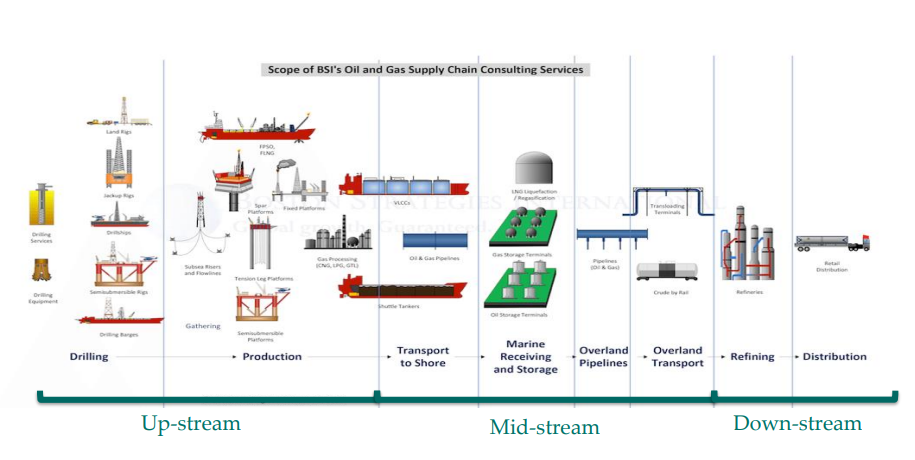
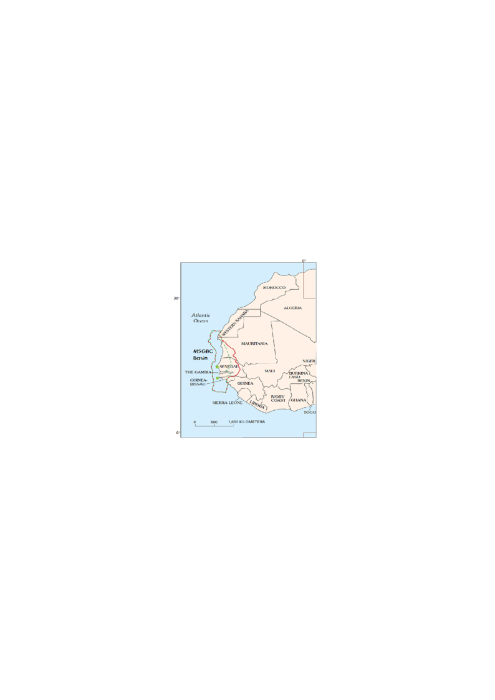
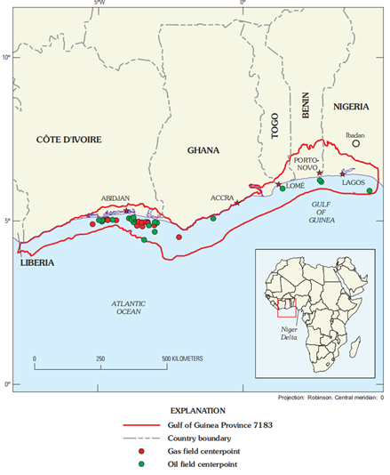
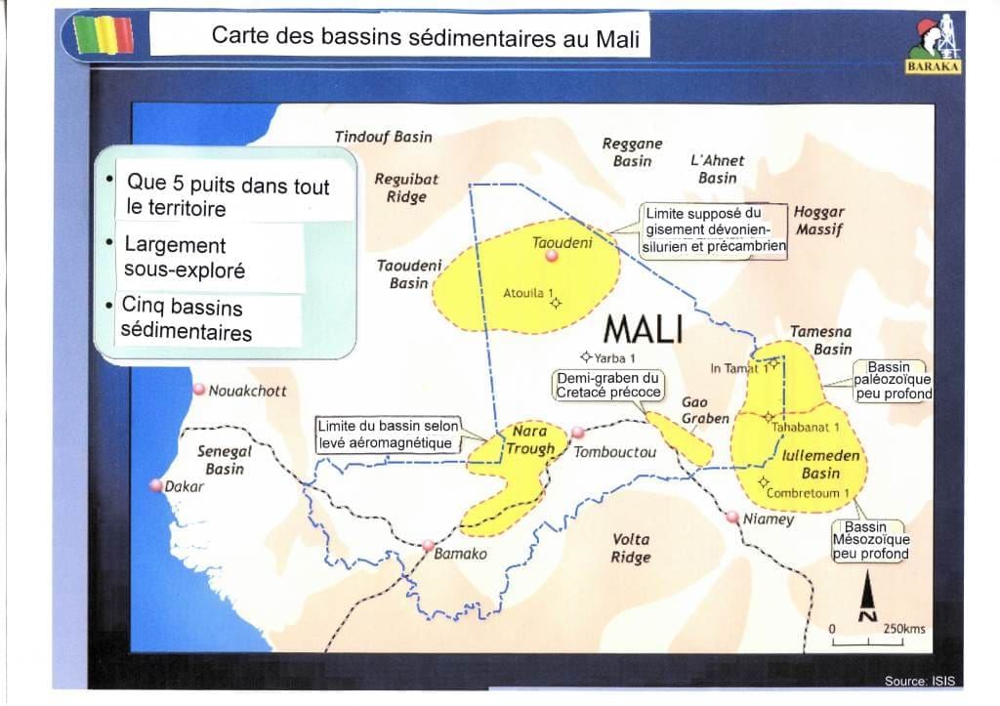

# Chapter 1: Value Chain of the Hydrocarbon Sector

As shown in Figure 1, the value chain of the oil sector or the oil
industry includes three segments, namely: upstream, midstream and
downstream.

Figure 1: Oil Sector
Value Chain

1.  ***The Upstream
    segment***

### 1.1.1 - Features

Upstream oil is the foundation or early stages of development of the oil
industry. It is characterized by a complex set of operations that
contribute to the discovery and exploitation of oil and natural gas
formed millions of years ago in the subsoil. The upstream segment
essentially includes activities from the exploration to the production
of hydrocarbons. It deals with the location of oil and gas extraction
sites, exploration drilling and the production of crude oil and natural
gas. Three main stages make up this segment:

- Research or exploration: the identification of hydrocarbon
  accumulations by various geological and geophysical methods at the
  surface and depth following the granting of a petroleum licence or
  authorization;

- Extraction or exploitation which is composed of two sub-phases:

  - Development: the determination and implementation of technical and
    infrastructural conditions for extraction according to geological,
    reservoir and economic parameters

  - The production of the field during which the various techniques of
    extraction and recovery of oil and natural gas are implemented;

- Abandonment, which generally occurs when oil reserves are depleted and
  it is necessary to secure and/or dismantle production facilities and
  infrastructure to avoid and/or minimize various environmental problems
  inherent in the operation.

The fundamental characteristics of upstream segment operations are:

- High ***geological risk***, which results in high uncertainty or no
  guarantee of discovery of commercially exploitable reserves.

- ***Colossal investments***: exploration and development activities
  involve heavy capital investments due to the advanced technologies
  used, equipment and infrastructure necessary to carry out these
  operations;

- the ***management of environmental and safety risks and impacts***
  inherent in research (seismic, drilling, etc.) and production
  operations (pollution of terrestrial, marine and atmospheric
  environments by oil spills, ***flaring***, gas leaks and emissions,
  fires and other construction site accidents).

### 1.1.2- State of play in West Africa

The West African sub-region holds a third of the continent's **oil** and
**natural gas** reserves . About 30% of the world's oil reserves are in
the Gulf of Guinea (ECOWAS, 2019). An assessment of hydrocarbon
resources after recent discoveries in some West African countries
estimates reserves at about 39 billion barrels of oil and 372,000
billion cubic feet **(**372 TCF**)** of natural gas (Table 1).

| **Country**       | **Crude Oil Reserves (MMBLS)** | **Gas Reserves (BCF)** |
|:------------------|:-------------------------------|:-----------------------|
| **Nigeria**       | 30.031\*                       | 202.000\*              |
| **Ghana**         | 1813 (732 proven)              | 4,100 (1,771 proven)   |
| **Senegal**       | 2 030\*                        | 42 024\*               |
| **Mauritania**    | 20 (proven)\*                  | 110 000 (estimation)\* |
| **Ivory Coast**   | 3.100 (estimation)\*           | 4.600 (estimation)\*   |
| **Niger**         | 150                            |                        |
| **Benin**         | 331 (estimation)               | 477                    |
| **Guinea-Biseau** | 840                            |                        |
| **Mali**          | 645 (estimation)\*\*           | 9 000 (estimation)\*\* |
| **Total**         | **38 960**                     | **371 724**            |

Table 1: Estimation of
hydrocarbon resources in West Africa

\*Data Ministries

\*\*RPS Energy Report, 2006

According to Trading Economics (2025), the four (04) largest producers
in 2024 (Table 2) are Nigeria (Benin Basin, Niger Delta and
intracardboard basins) which is by far the most popular with 1,539,000
barrels/day, followed respectively by Ghana (Saltpond and Tano basins),
188,000 barrels/day, Niger (three intracratonic sedimentary basins,
namely Chad, Illumenden, Djado), 53,000 barrels/day and Côte d'Ivoire
(offshore coastal sedimentary basin), 47,000 barrels/day.

| Country | Last | Previous | Reference | Unit |
|:---|:---|:---|:---|:---|
| [**Nigeria**](https://fr.tradingeconomics.com/nigeria/crude-oil-production) | 1539 | 1485 | 2025-01 | BBL/D/1K |
| [**Ghana**](https://fr.tradingeconomics.com/ghana/crude-oil-production) | 188 | 188 | 2024-10 | BBL/D/1K |
| [**Niger**](https://fr.tradingeconomics.com/niger/crude-oil-production) | 53 | 43 | 2024-10 | BBL/D/1K |
| [**Ivory Coast**](https://fr.tradingeconomics.com/ivory-coast/crude-oil-production) | 47 | 42 | 2024-10 | BBL/D/1K |

Table 2: Daily production
of countries (Trading Economics, 2025)

Significant discoveries of oil and especially gas have been made onshore
and offshore in Senegal and Mauritania in the Senegalese and Mauritanian
sedimentary basins that are part of a vast West African Basin called
"**MSGBC Basin** (Mauritania – Senegal – Gambia – Bissau – Conakry)",
Fig. 2a. These two states, already oil producers, have started
production of a large cross-border gas field thanks to the "**Greater
Tortue Ahmeyim" offshore gas project,** whose resource discovered in
2015 by the American *Kosmos Energy* is estimated at more than 15,000
billion cubic feet. The field is being developed and produced with the
support of the international oil company BP, with the entry of the first
LNG cargo on the world market in April 2025.

Benin, located in the Gulf of Guinea, a proven oil-producing province
(Fig. 2b), was also a producer from 1982 to 1998 of a marginal field
located on Block 1 of its Coastal Sedimentary Basin, discovered in 1968
by the American company Union Oil of California. It has just restarted
production from the Sèmè field with Akrake Petroleum, a subsidiary of
the Norwegian company Rex, and has relaunched oil exploration.

Other countries are still in the exploration phase and will be able to
make commercial discoveries in the sense that they are located in
geologically promising areas. These include:

- The Gambia, Guinea Bissau and Guinea Conakry, which share the same
  large MSGBC basin as Senegal, have good prospects for commercial
  discoveries given that the work carried out has proven the presence of
  hydrocarbons in their coastal basins. The same is true for Sierra
  Leone and Liberia, which are located in the same geological
  environment and whose coastal basins are framed by the large MSGBC
  basin and the Côte d'Ivoire basin in the Gulf of Guinea, where several
  discoveries have been made.

- Mali with the Taoudéni Basin, the Nara Rift, the Gao Graben and the
  Tamesna Basin, which is the extension of the Ilullemedens Basin in
  Niger (Fig.3). Already in 2006, RPS Energy showed that the five blocks
  owned by the company Baraka Petroleum in the Taoudéni basin could
  house up to 645 million barrels of oil and 9 Tcf of natural gas.

- Burkina Faso in view of its proximity to Mali and because of the
  presence of hydrocarbon showings identified in its western basin which
  borders the Nara basin in Mali

- Togo whose coastal sedimentary basin is an integral part of the Gulf
  of Guinea, an oil-rich province proven by discoveries in Nigeria and
  Benin, Ghana and Côte d'Ivoire.

Figure 2: a and b Map
showing the MSGBC Basin and Map showing the basins of the northern part
of the Gulf of Guinea in West Africa

Figure 3: Map showing the sedimentary basins of Mali and Niger

Crudes discovered and produced in some West African countries are light
to heavy with a low sulfur content (sweet) as mentioned in Table 3
below.

*Table 3: Type of crude
oil in selected West African countries*

<table>
<colgroup>
<col style="width: 24%" />
<col style="width: 24%" />
<col style="width: 25%" />
<col style="width: 25%" />
</colgroup>
<thead>
<tr>
<th style="text-align: center;"><strong>Country</strong></th>
<th style="text-align: center;"><strong>Density °API</strong></th>
<th style="text-align: center;"><strong>Sulphur content
(%)</strong></th>
<th style="text-align: center;"><strong>Quality</strong></th>
</tr>
</thead>
<tbody>
<tr>
<td rowspan="2" style="text-align: center;"><strong>Benin</strong></td>
<td>22 (Champ de Sèmè)</td>
<td style="text-align: left;">0.32</td>
<td style="text-align: left;">Medium and Sweet</td>
</tr>
<tr>
<td>42 (Deep Offshore Block)</td>
<td style="text-align: left;">0,1</td>
<td style="text-align: left;">Light and Sweet</td>
</tr>
<tr>
<td style="text-align: center;"><strong>Niger</strong></td>
<td style="text-align: left;">30</td>
<td style="text-align: left;">Very Low</td>
<td style="text-align: left;">Medium and Sweet</td>
</tr>
<tr>
<td style="text-align: center;"><strong>Nigeria</strong> (Niger Delta
Crude)</td>
<td style="text-align: left;">20 to 25</td>
<td rowspan="2" style="text-align: left;">
0.17% Egina

0.6% (Qua Iboe et Forcados)
</td>
<td style="text-align: left;">Heavy, Medium and Sweet</td>
</tr>
<tr>
<td style="text-align: center;"></td>
<td style="text-align: left;">36</td>
<td style="text-align: left;">Light and Sweet</td>
</tr>
<tr>
<td style="text-align: center;"><strong>Ivory Coast</strong></td>
<td style="text-align: left;">28, 31, 48</td>
<td style="text-align: left;"></td>
<td style="text-align: left;">Medium, Light and Sweet</td>
</tr>
<tr>
<td rowspan="2" style="text-align: center;"><strong>Ghana</strong></td>
<td style="text-align: left;">35,1 (Saltpont)</td>
<td style="text-align: left;">0.16</td>
<td style="text-align: left;">Light and Sweet</td>
</tr>
<tr>
<td style="text-align: left;">35 (Jubelee)</td>
<td style="text-align: left;">0.23</td>
<td style="text-align: left;">Light and Sweet</td>
</tr>
</tbody>
</table>

Some examples of internationally known upstream companies are
ExxonMobil, Chevron, BP, Shell, ConocoPhillips, ENI, Total Energies,
SINOPEC... These majors are joined by other independent oil companies
that are challenging and investing in West Africa, such as Tullow in
Ghana, Cairn in Senegal, Kosmos in Mauritania, CONOIL in Nigeria, CNPC
in Niger, etc. In Africa, there is an emergence of National Hydrocarbon
Companies such as SONATRACH in Algeria, PETROCI in Côte d'Ivoire, NNPC
in Nigeria, SONAGOL in Angola, PETROSEN in Senegal, SONIDEP in Niger,
GNPC in Ghana... but also some small private companies such as SAPETRO,
ORANTO in Nigeria....

### 1.1.3- Main challenges

Faced with the issue of **climate change**, the challenges related to
**the financing** of upstream activities, the **development** or **the
appropriation of technology** remain a bone in the throat of African
States and to which States must cooperate and pool their efforts in
order to put in place appropriate strategies for the responsible and
sustainable exploitation of their hydrocarbon resources.

1.  *The **midstream
    segment***

> **1.2.1-
> Characteristics**

The midstream segment of the oil and gas industry connects upstream and
downstream oil activities and includes natural gas liquefaction and
regasification operations, natural gas storage and transportation, and
transportation of crude oil to refineries by means of ships, pipelines,
tanker trucks, etc.

In detail, the intermediate segment includes activities related to:

- the construction of ***oil*** and ***gas pipelines***, crude oil and
  natural gas storage tanks, oil and gas loading terminals, and natural
  gas liquefaction and regasification facilities, including:

  - Flootload Liquefied Natural Gas (FLNG) units

  - Floating Storage and Regasification Units (FSRUs)

- the transport of hydrocarbons by pipelines (oil and gas pipelines,
  etc.)

- to the treatment of natural gas by separating it from the various
  hydrocarbons and fluids to produce a "***pipeline quality***" gas. In
  some cases, this activity may be considered to be an upstream oil
  activity

Crude oil and natural gas are transported either by land or by sea. The
means of transportation typically used are tankers and pipelines that
bring crude oil to refineries where it will be processed into
***petroleum products***.

The term midstream is much more used in the oil industry in the US and
Canada, which have developed large oil and gas pipelines and storage
facilities run by private companies in these countries. For example, the
Keystone Pipeline System is a network of oil pipelines in Canada and the
United States, owned by TransCanada Corporation.

In European countries, the transportation and storage of crude oil tends
to be integrated into upstream production activity. Many European
pipelines are controlled by the governments of the countries they pass
through or by state-owned crude oil transport companies in these
countries. This state ownership tends to result in the absence of the
midstream as a separately designated part of the oil production value
chain.

Some examples of purely mid-market operating companies are Oasis
Midstream Partners, Sanchez Midstream Partners, Hess Midstream, Magellan
Midstream Partners, and EQT Midstream Partners. TransCanada Corporation.

### 1.2.2- State of play in West Africa

In West Africa, the transport network by gas and oil pipelines is still
very weak. However, it should be noted that States are aware of the
situation and that they are willing to develop structuring projects to
secure the supply of hydrocarbons to the West African area.

The West African Gas Pipeline (WAG) and the Niger-Benin Export Pipeline
are good examples of midstream development projects in this West African
region.

The West African Gas Pipeline (WAG) is a natural gas pipeline transport
system (onshore and offshore), over approximately 688.6 km from Nigeria
(Alagbado) to Ghana (Takoradi) via Benin (Cotonou) and Togo (Lomé). Its
objective is to transport natural gas produced in large quantities from
Nigeria's oil fields to Benin, Togo and Ghana, mainly for the production
of electricity and the needs of the industrial sector. This pipeline,
managed by the West African Gas Pipeline Company (WAPCo), has been
operational since 2011 and aims to increase the population's access to
electrical energy at a reasonable cost and consequently give a boost to
the economic development of states.

The Niger-Benin Export Pipeline is a pipeline transport system to export
crude oil from AGADEM's fields located in the DIFFA region of Niger via
Benin through a loading terminal located at sea. This pipeline was built
and is managed by the Chinese company WAPCO. It is the longest in the
sub-region, has a length of **1,950 km,** of which **675 km** is on
Beninese territory, and has a transport capacity of **90,000
barrels/day,** extendable up to 140,000 barrels depending on discoveries
in Niger.

In addition to these cross-border infrastructures, there are national
oil and gas pipeline transport networks and crude oil storage
infrastructures which are more or less developed in some countries such
as Nigeria, Côte d'Ivoire, etc.

### 1.2.3- Main challenges

Challenges in the midstream sector include, among others, maintaining
the integrity of storage and transport infrastructure (ships, trucks,
wagons, pipelines, etc.), protecting workers involved in cleaning,
purging and filling activities, and the lack of oil infrastructure to
ensure the energy security of states.

In West Africa, the issue of **securing infrastructure** is worrying and
topical. Security challenges are manifested by:

- the vandalism of infrastructure due to the failure to take into
  account the socio-political realities and misery of the populations of
  the localities in which these sensitive and dangerous infrastructures
  are built;

- acts of sabotage of facilities recorded by the growing rise of
  terrorism

To this end, the monitoring of these infrastructures and the real
consideration of the concerns of indigenous populations must be
considered more seriously in the context of oil and gas development
projects. Taking these aspects into account will ensure the safety of
workers and machines and avoid the risks of vandalism and sabotage of
infrastructure that are the cause of oil spills, fires and explosions
and consequently marine and terrestrial pollution.

**The inadequacy and poor management of** national and regional oil
infrastructure for the transport and storage of hydrocarbons,
liquefaction, regasification and gas processing is also a major weakness
of the oil sector in West Africa.

The strengthening or construction of energy infrastructure such as
gas-fired power plants and the creation of an African oil market will
boost the development of the midstream and, in turn, strengthen people's
access to clean energy.

1.  ***Le segment Aval
    (downstream)***

> **1.3.1-
> Characteristics**

This segment deals with crude oil refining, transportation, storage and
distribution of ***petroleum products*** as well as ***petrochemical***
activities. This is the stage where crude oil is transformed into
different petroleum products namely ***fuel oil***, ***diesel***,
***gasoline*** (***naphtha***), ***kerosene (jet A1***) and ***Liquefied
Petroleum Gas (LPG)*** which are used for various purposes, such as
powering vehicles, heating homes, electricity production etc. and
asphalt or ***bitumen*** for road construction (Figure 4). The crude oil
***refining*** process is generally divided into three basic stages:
***separation***, ***conversion,*** and ***processing***. Refining
techniques depend on the type of crude oil to be processed and the needs
of the market. There are several types of crude oil classified mainly
according to three criteria: **density**, **sulphur content** and
geographical origin**.** API low-density and low-sulfur crudes have the
best advantages because they are lightweight and less complex to refine
and require little or no desulfurization.

In the petrochemical industry, long-chain hydrocarbons in oil and
natural gas and ***naphtha*** are used to manufacture products such as
plastics, rubbers and synthetic fibres, fertilizers, preservatives and
detergents. For example, petroleum and natural gas products are used to
make artificial limbs, hearing aids, and flame-retardant clothing to
protect firefighters. Similarly, paints, dyes, fibers, etc. are made
from oil and natural gas.

### 1.3.2- State of play in West Africa

In West Africa, the performance and quantity of refining units and
infrastructure for the storage and transport of petroleum products
remain problematic in that they are insufficient to cover fuel needs and
ensure the security of supply of petroleum products. Thus, despite its
great oil potential and the significant amount of oil production, most
West African producing countries remain dependent on Europe and the
Middle East for their supply of petroleum products, which constitutes an
exorbitant bill for public finances.

This analysis is also confirmed by a study carried out in 2019 by ECOWAS
on "*the development of a regional programme on the facilitation of the
supply of petroleum products*". The study found that: ***"The supply of
petroleum products is highly dependent on external sources, resulting in
a 70/30 import/local production ratio that does not guarantee security.
The available refining capacity theoretically makes it possible to cover
the demand for refined products... Unfortunately, the refineries are
underutilized. They are only at 30% of their production capacity due to
the obsolescence of poorly maintained equipment."***

In addition, the use of low-quality petroleum products is responsible
for the emission of air pollutants such as carbon monoxides, benzenes,
unburned hydrocarbons, particulate matter, nitrogen oxides, etc., which
dangerously compromise human health, engine efficiency and the
environment. Unfortunately, there is a large deviation from the
specifications of petroleum products in Europe and West Africa. European
standards have a sulphur content of 10 ppm for petrol and diesel oil,
while almost all West African countries import or produce these products
through their refineries with a sulphur content of 50 and 10,000 ppm for
diesel and 50 and 3500 ppm for petrol, with the exception of Ghana and
Benin, which have adopted better **specifications in their
legislation.pursuant to Directive C/DIR.1/9/2020 on harmonized
specifications for automotive fuels (petrol and diesel) in the ECOWAS
region**. Bringing refineries in West Africa up to standard is becoming
an imperative but requires huge investments that governments and their
partners must face.

The actors in the supply and distribution of products in West Africa are
made up of state companies or institutions, mixed companies, private and
international. In addition to state-owned companies such as PETROCI and
GESTOCI of Côte d'Ivoire, NNPC of Nigeria, PETROSEN in Senegal, GNPC in
Ghana, DPB in Benin, SONIDEP in Niger, international traders such as
Oryx, PUMA/Trafigura, Vitol and African traders such as La Chorale in
Côte d'Ivoire, Sahara Group in Nigeria, ITOC in Senegal and private
national storage and distribution companies such as Octagone, JNP, Benin
Petro in Benin, BOST and GOCIL in Ghana...

As far as the refining industry is concerned, there are very few private
companies in West Africa (the new DANGOTE refining company in Lekki,
Nigeria, with an optimal capacity of 650,000 barrels per day, and a few
state-owned or mixed refineries such as SIR/SMB in Côte d'Ivoire, SAR in
Senegal, the NNPC refineries (Kaduna, Port Harcourt and Warri) in
Nigeria, SORAZ in Niger, TOR in Tema in Ghana.

### 1.3.3- Main Challenges

In short, Africa in general is facing two major challenges in the
downstream oil sector, namely:

- the weakness of the security of supply of petroleum products, which
  limits access to energy and, in turn, is a brake on economic
  development, particularly in most countries of sub-Saharan Africa.
  This situation is linked to a lack of storage and distribution
  infrastructure and also to the weakness of the operational capacity
  for oil refining.

- the poor quality of imported petroleum products and those from African
  refineries that do not meet international standards, with the
  exception of the new DANGOTE refinery in Nigeria.

  1.  ***Weaknesses in
      the West African oil industry value chain***

The value chain of the oil industry is not structured in Africa in
general and in West Africa in particular. The oil sector faces
challenges due to a lack of a coherent and operational regional
organizational policy, a lack of synergy between the different segments
of the oil industry, and the lack of a genuine African oil market
serving Africans. The upstream oil sector is therefore characterized by
a massive export of oil and gas resources produced to Europe and Asia in
raw form and an import of refined and finished products. As a result,
the oil sector is still subject to the dictates of foreign powers marked
by:

- A massive export of crude oil at a market price over which Africa has
  no control;

- A steep and bitter bill for importing refined products and derivatives
  from their crude oil at a price whose setting mechanism escapes
  Africans.

In addition, **the poor management of revenues** from resource
exploitation is also an obstacle to the endogenous financing of
structuring development projects in Africa. It is important to draw the
attention of States to the responsible management of revenues from the
exploitation of oil and gas resources, given that most of Africa's
producing States are confronted with the "**Dutch disease**",
characterized above all by deindustrialization and their economic
dependence on oil rents.

***Indeed, the revenues derived from the exploitation of oil and natural
gas, non-renewable extractive resources, should be directed and invested
in the diversification of the economy with a view to the emergence of
other viable economic and industrial sectors that make it possible to
sustainably support the development of States***.

Unfortunately, many African countries have economies that remain very
fragile because they rely mainly on oil and natural gas production. In
2024, Libya is in the lead, with an impressive 56% of its GDP coming
from oil rents, followed by Congo with 34% and Angola with 28%.
Nigeria's contribution to reported GDP of about 6% while more than 90%
of its total export revenues came from oil shows a disparity between the
direct contribution to GDP and the preponderance in export earnings and
public finances. This situation reveals that Nigeria remains inherently
dependent on oil and gas for its essential foreign exchange inflows and
national budget.

The diversification of the economy is a major approach to avoid the
risks of economic fragility linked to total dependence on oil resources,
which are suffering the full force of the threats of ***oil
counter-shocks***, endogenous and exogenous geopolitical tensions, etc.,
but also of their certain depletion.

African regional institutions such as ECOWAS through its specific bodies
and sectoral commissions, AFREC and APPO have a key role to play in
establishing a link between the different segments of the industry in
order to develop an integrated value chain for the optimization and
generation of economies of scale to contribute to the industrialization
and diversification of energy sources in the region.

### 1.4.1- At the ECOWAS level

In West Africa, the issue of pooling efforts and genuine cooperation for
the development of an oil industry remains a challenge despite some
ongoing actions. ECOWAS should be a springboard for the realization of
these actions. The results obtained by this West African organization
are not yet up to expectations. One of the flagship projects carried out
by ECOWAS is the construction of the West African Gas Pipeline (WAG).
Unfortunately, despite Nigeria's natural gas potential, supported by
Ghana's recent discoveries, this project is struggling to supply gas to
the other countries that have signed the GAO treaty, namely Nigeria,
Benin, Togo and Ghana and the question of natural gas supply for the
production of electricity is acutely important in these countries.

This project is in the process of being merged into the framework of the
Atlantic African Gas Pipeline Project (AAGP) which will be the merger of
the West African Gas Pipeline Extension Project (WAGPEP) and the
Nigeria-Morocco Gas Pipeline Project (NMGP) into a Single Sub-Regional
Gas Pipeline Project that will cross thirteen (12) West African
countries and Morocco to finally serve the European market.

This means that this Nigeria-Morocco gas pipeline initiative, although
commendable, deserves to be re-examined through the evaluation of the
commitments of the various parties and the definition of a more unifying
project policy and governance body that will guarantee the production,
sale and purchase of natural gas first and foremost for our needs in
West Africa. and subsequently in Africa in general, before considering
supplying gas to markets outside Africa. It is important to mature this
African Atlantic Gas Pipeline Project (AAGP) in order to prevent it from
simply not being used to make Morocco a hub for the transit and supply
of natural gas to Europe to the detriment of the ever-growing needs of
Africa in general and sub-Saharan Africa in particular.

### 1.4.2- At the level of the APPO

At the continental level, the African Petroleum Producers Organization
(APPO), which is a specialized institution created in 1987, has
struggled to find its feet and remains today an organization with no
significant impact on the development of oil activities in Africa. This
noble initiative of the founding fathers (Algeria, Angola, Benin,
Cameroon, Congo, Gabon, Libya, Nigeria), was born from the observation
that, despite the abundance of hydrocarbon resources on the continent,
African countries remain largely dependent on foreign multinationals for
the exploration, exploitation and marketing of their oil. The
fundamental objective of the APPO was therefore to promote technical
cooperation between member states in order to strengthen their control
over their oil resources and maximize the benefits derived from their
exploitation for the socio-economic development of their populations. In
more than 30 years of existence, no viable structuring project has been
carried out under the aegis of the APPO through its bodies.

This organization also deserves to be rethought through the redefinition
of its objectives and bodies in order to be more operational to solve
the problems listed above faced by the different segments of the value
chain of the hydrocarbon sector in Africa.

1.  ***Possible solutions
    for an oil industry serving the region***

The need for a reorganization of the entire value chain is a solution to
boost development in Africa. This reorganization involves:

- the establishment of a structure and an endogenous financing strategy
  for oil exploration and production projects;

- the development of petroleum infrastructure for the storage and
  transport of hydrocarbons. The establishment of such an infrastructure
  network will facilitate the supply of hydrocarbons in the different
  regions of Africa;

- the realization of common energy structuring projects allowing the
  production of energy for the benefit of African populations, more than
  half of whom do not yet have energy. These projects will enable the
  development of the entire value chain of the hydrocarbon sector

- the construction of regional refineries in accordance with
  environmental standards in the current context of climate change and
  related infrastructure;

- the creation of specialized training centers for petroleum
  professions;

- the development of healthy cooperation between States in terms of
  sharing experience.

Figure 4: Synthetic diagram showing the different oil cuts

0 to 80-100°C

120 to 180°C
