# Chapter 2: Different Phases of Upstream Oil and the Roles of States

The Upstream Oil sector includes five (05) categories of activities or
phases that follow one another (Figure 5): Pre-licence, Exploration,
Development, Production and Abandonment.

Figure 5: Different
phases of upstream oil

Authorization to operate

Exploration Authorization

1.  ***Pre-licensing
    phase***

> **2.1.1- Definition of
> the concept**

During this phase, the State puts in place the policy as well as the
regulatory and technical tools necessary for oil exploration, promotion,
allocation of oil blocks, management and monitoring of
contracts/authorizations or licenses as well as environmental management
related to the realization of oil exploration and exploitation
activities.

The pre-bachelor's degree stage addresses, among other things, aspects
relating to:

- preliminary geological and geophysical reconnaissance or prospecting
  studies (gravimetry, magnetometry, speculative seismic, etc.), the
  objective of which is to define the areas suitable for exploration and
  to assess their oil potential;

- the establishment of laws and regulations that should clarify the main
  areas of concern for both the investor(s) and the host government.
  This will enable the host Government to ensure better monitoring and
  proper management of contracts and to effectively monitor revenue
  forecasts through the establishment of an appropriate and mutually
  beneficial tax and legal regime.

- the delimitation of maritime and land borders as well as the mechanism
  for managing border conflicts in oil zones common to two or more
  States;

- the management of the involvement of local communities and the
  expectations of the populations.

Once the areas potentially favourable to oil exploration have been known
and the oil potential assessed, the technical and environmental laws and
regulations and the tools for awarding and managing oil contracts have
been developed, States can proceed to allocate perimeters for
exploration.

The issuance of a petroleum licence or authorization follows the process
outlined in Figure 4 below. It starts with promotional activities until
a contract is signed and/or an authorization is issued that gives the
IPCs the right to explore and exploit hydrocarbons in a well-defined
area commonly known as an oil ***block***.

2.  **Strategy for
    awarding petroleum licences or authorizations**

Promotion is the operation of attracting investors in oil exploration
and exploitation. Countries with oil potential and wishing to embark on
the development of their oil resources must prepare and/or regularly
update petroleum promotion documents. A promotion file must contain the
following documents:

- Petroleum legislation

- The contract model

- The list and price of available oil data if required. Some countries
  make data available to oil companies free of charge to be more
  attractive

- Information on the oil potential and/or a technical assessment report
  of the oil potential

- Perimeters or blocks on promotion

- Information on available oil infrastructure

- The institutional framework of the hydrocarbon sector and contacts of
  the structures in charge of this sector

- The Tender Calendar

- Pre-qualification criteria

- Evaluation criteria

The different stages of the allocation of oil blocks are (Figure 6):

- Announcement of the exploration area or blocks on promotion

- Launch of the call for tenders: the launch of a call for tenders makes
  it possible to have several offers on the same domain or block; this
  makes it possible to make comparisons in order to choose the most
  interesting offers for the State. However, it is not excluded that the
  State will decide to examine, on the basis of its expectations, the
  unsolicited offers of companies that show an interest in a given
  block.

- The definition of the pre-qualification criteria: the
  pre-qualification constitutes a first filter of the oil companies on
  the basis of criteria previously defined by the States in order to
  identify the oil companies or consortium capable of playing a relevant
  role in the field where the blocks are auctioned; These criteria
  generally relate to the financial, technical, security and
  environmental management capacities of oil companies

- Submission of tenders: this consists of the submission of applications
  by oil companies that are interested in oil exploration in the fields
  open to tendering

- Analysis/evaluation of tenders: this is done on the basis of the award
  criteria developed by the Government.

- Allocation of the block: this is done after **negotiation** of the
  technical and economic terms with the CPIs who present the best offers
  on the basis of the State's expectations. The technical and fiscal
  terms that may be subject to negotiation and that condition the final
  allocation are:

  - Work obligations

  - Retrocession or surface rendering

  - Local Content and Training

  - Socio-community development

  - Signing and Exploitation Bonuses

  - Royalties

  - State participation,

  - The cost stop rate

  - The key to sharing oil profit, etc.

Oil **negotiations** require good preparation and professionalism on the
part of the Government. It is carried out by a multidisciplinary team
which must include, but is not limited to, players with a good knowledge
of oil contracts and negotiation techniques as well as technicians
experienced in the sector. This team can be made up of lawyers, oil
economists, geoscientists, etc.

Figure 6: Process for
Assigning Oil Block to the IPC for Petroleum Exploration and Development

All in all, pre-licensing activities are necessary because they
condition the decision of governments whether or not to engage in oil
exploration activities.

This was the beginning of investments in the hydrocarbon sector.

2.  **Financing of
    pre-licensing phase investments**

As a general rule, pre-licensing activities are under the sovereignty of
the host state. The implementation of policy documents, legislation and
regulations, as well as the assessment of oil potential and the
implementation of tools and strategies to move to exploration via
international oil companies are the responsibility of States and require
relatively less expensive investments than those relating to exploration
activities. States with financial resources and competences directly
finance all these activities (Norway for example). However, those with
limited financial resources and no required skills are accompanied for
certain pre-licensing activities by service companies to carry out the
first reconnaissance and evaluation studies of the oil potential in
order to have first-hand information before engaging in promotional
activities that lead to the signing of exploration and exploitation
contracts with oil companies. These service companies usually acquire
the data at their own expense on the basis of a service contract and
market and market it to international oil companies.

3.  **Importance of the
    pre-licensing phase and responsibilities of the State**

The pre-licensing phase is very essential in the sense that the lack of
knowledge of its oil potential and the non-existence from the outset of
all the clear regulations, procedures and tools for the management of
upstream oil activities are detrimental to the signing of fair and
beneficial contracts for the State.

*"**You can never sell a packaged good at its fair value, i.e. very
little or poorly known** ."*

The non-or poor preparation of the pre-licensing phase thus leads to
harmful consequences for States during the execution of oil operations,
where they are confronted with legal and contract management
difficulties.

Unfortunately, most African countries neglect this phase and engage in
the exploration and exploitation of oil resources without any necessary
safeguards by signing contracts whose revenue sharing is often
unfavorable or very unprofitable following the discoveries. The lack or
inadequacy of proper preparation for the pre-licensing phase, which is
essential for the implementation of tools for managing and monitoring
contracts before engaging in oil activities (which contributes to the
development of resources), is often one of the fundamental causes of the
signing of "**one-sided contracts"** with foreign partners in the
geo-extractive sector in general and in the oil industry in particular
in Africa.

1.  ***Exploration
    phase***

> **2.2.1- Exploration
> methods and strategies**

Exploration is the phase of upstream oil activities that consists of the
search for hydrocarbons in the subsoil using geological and geophysical
methods, including seismic methods, and the drilling of ***exploratory
wells***. Initially, the research consisted of drilling near natural
surface showings; This only made it possible to discover small deposits,
close to the surface.

Today, it is undertaken by the International Oil Companies (IPC) which
have developed several exploration methods and technologies from the
simplest to the most sophisticated for the discovery of hydrocarbons at
great depths both on land and in very deep seas (beyond 3 km of
bathymetry).

The activities concerned by the exploration are, among others:

- Surface geological research

- Gravimetry,

- Magnetometry

- Aerial photography

- Seismic

- Electromagnetism (EM) or Control Source Electro-Magnetic (CSEM)

- Exploration drilling

***Gravimetry*** and ***magnetometry*** help to identify areas of
geophysical anomalies where other, more precise methods can be applied
to locate hydrocarbons. They make it possible to determine the nature
and depth of the sedimentary layers and thus give an idea of the
distribution and thickness of the sedimentary formations (Figure 7 a and
b).

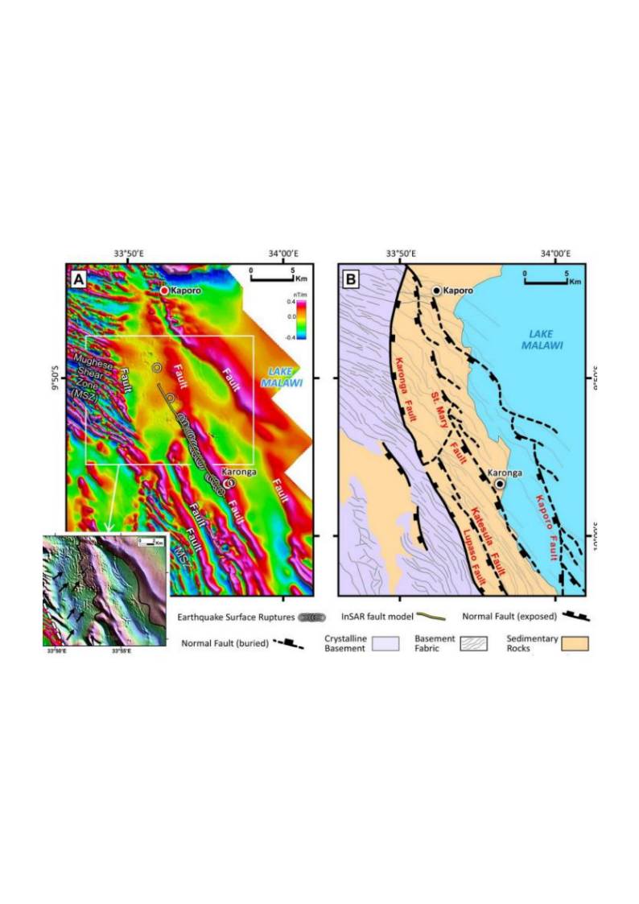

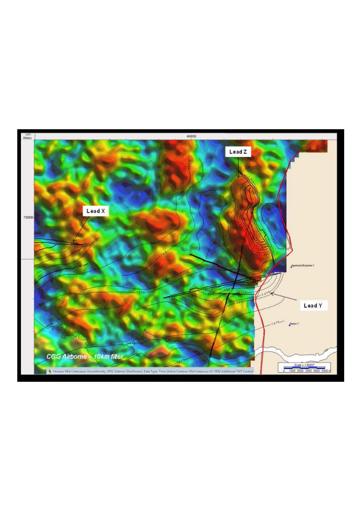

Figure 7: Gravimetric
acquisition (a) showing anomalies in the Coastal Sedimentary Basin of
Benin (CGG 2013) and aeromagnetic (b) to characterize the basement and
sedimentary formations

***Seismic*** reflection, the most commonly used method before
exploratory drilling. The principle of seismic acquisition consists of
sending sound waves into the ground that are reflected by the different
rock surfaces. The time taken by the waves to come to the surface and to
be recorded by geophones (when the operation takes place on land) or
hydrophones (when the operation takes place at sea) indicates the depth
of the rocks crossed (Figure 8a, b). Seismics can be carried out in two
2D dimensions and for more than half a century in three 3D and even four
4D dimensions. Seismic also provides information on the nature of the
rocks from the analysis of the different transmission speeds noted at
the level of the different types of rocks. The analysis and
interpretation of seismic data also allows the identification of
hydrocarbon traps and Direct Hydrocarbon Indicators (HIDs) such as
Bright Spots, Flat Spots and Gas chimneys etc. which condition the
positioning of exploration wells (Figure 9).

b

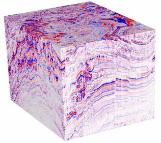

a

Multiple qv streamers

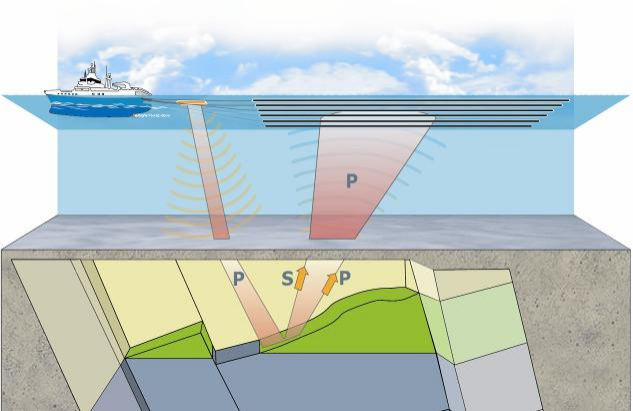

Source

Figure 8: 3D acquisition
principle (a) and seismic cube (b)

Well Positioning

Exploratory

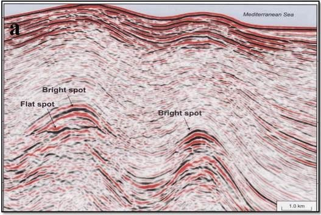

Figure 9: Seismic
amplitude anomalies showing Brightspots and Flatspots

CSEM is a technology developed that measures resistivity contrast in the
seabed. The acquisition of EM is generally done on ***the
prospects/traps*** already identified by the seismic in order to have a
precision on the nature of the fluid contained in the traps. Indeed, the
areas of oil traps have a high resistivity while the rocks around the
traps are conductive because they generally contain salt water (Figure
10). This technology makes it possible to determine whether or not there
is a resistivity contrast in regions where traps have been mapped in
order to maximize the chances of success of exploratory wells.

Positioning an exploratory well

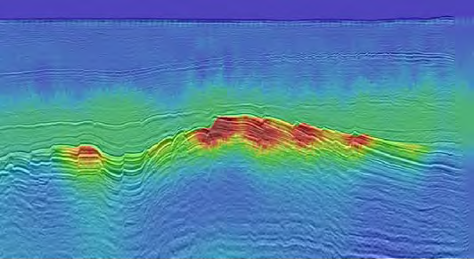

Figure 10: Electromagnetism coupled with seismic reflection showing the contrast of resistivity at the level of the traps highlighted by the seismic

Exploratory ***drilling*** is the ultimate and very expensive step in
exploration that makes it possible to confirm or refute the predictions
of exploration geologists and geophysicists.

The duration of an exploration license varies from 7 to 9 years in West
African countries.

### 2.2.2- Techniques for evaluating a prospect

Oil exploration is based on four fundamental principles, namely: the
search for the existence of a petroleum system in the licensed area by
the various research methods mentioned above, the identification and
mapping of geological structures likely to contain hydrocarbons
(***Plays***, ***leads*** and ***prospects)***, the assessment of the
geological risks associated with the mapped structures and finally the
volumetric estimation of the potential for petroleum resources.

1)  **Petroleum system**

The petroleum system is the whole of ***source rocks***, ***reservoir
rocks***, cover ***rocks and*** overload ***rocks*** as well as the
entire process of trap formation, ***generation***, ***migration***,
***accumulation*** and ***preservation*** hydrocarbons (Figures 11 and
12). These essential geological factors and process must take place in
time and space so that the organic matter contained in the source rock
can turn into an accumulation of oil (*Magoon & Dow, 1994).*

It should be noted that this organic matter from which oil was formed,
several million years ago, is the result of the decomposition, under the
effect of sedimentary subsidence pressure and geothermal temperature, of
microscopic animals and plants (phytoplankton and zooplankton) that
lived in the sea.

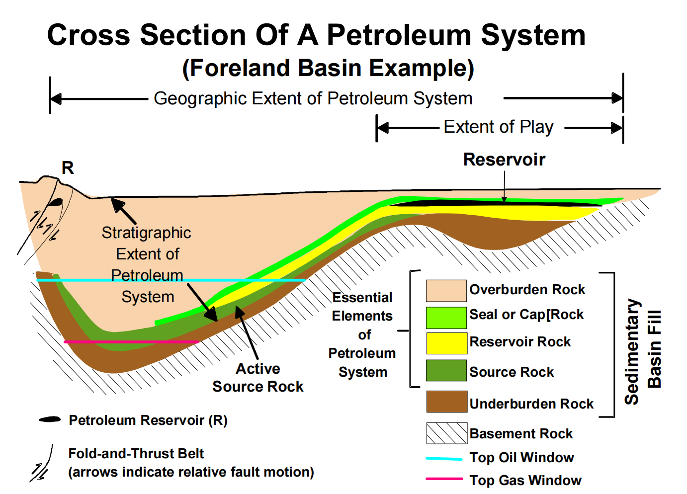

Figure 11: Geological
section showing the stratigraphic extent of a fictitious petroleum
system (Magoon and Dow, 1994, modified by Schlumberger)

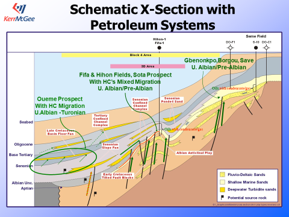

Figure 12: Geoseismic section showing petroleum systems in the Benin Coastal Sedimentary Basin, Kerr McGee, 2003

2)  **Identification and mapping of geological traps likely to contain
    hydrocarbons**

Geophysicists and geologists process and interpret the data acquired by
the various research methods in order to identify hydrocarbon traps
(Figure 13), HIDs or any other geological anomalies that make it
possible to suspect the presence of hydrocarbons and that make it
possible to guide the positioning of exploratory wells.

Hydrocarbon traps can be structural, stratigraphic or mixed depending on
their formation mechanism.

Structural traps can be formed by regional tectonic mechanisms (fault,
anticline, etc.) or by salt tectonics (halokinesis). Stratigraphic traps
result from depositional conditions, i.e. are formed by sedimentary
processes (unconformity, lateral change of facies, bevel, etc.) (Figure
14).

The identified traps are then mapped using software in order to assess
their geometry and assess their size (Figure 15).

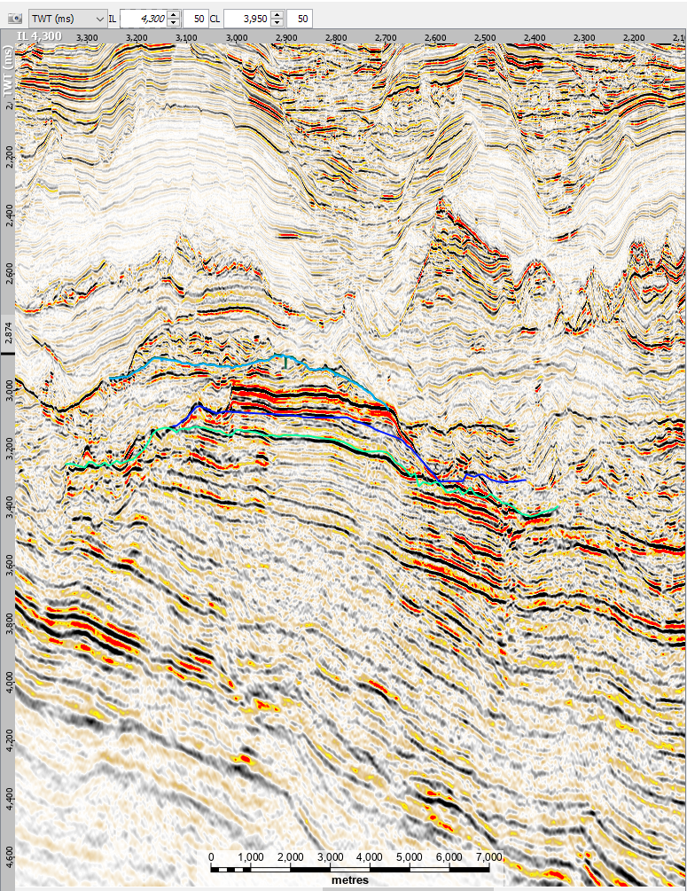

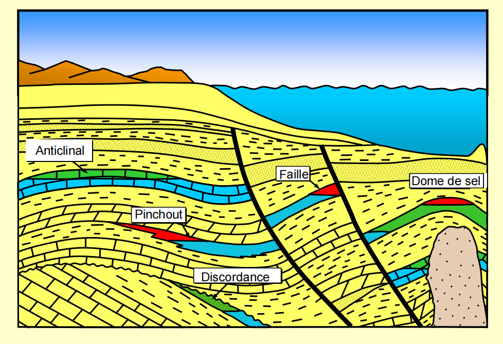

Figure 13: Seismic interpretation showing a structural trap (anticline)

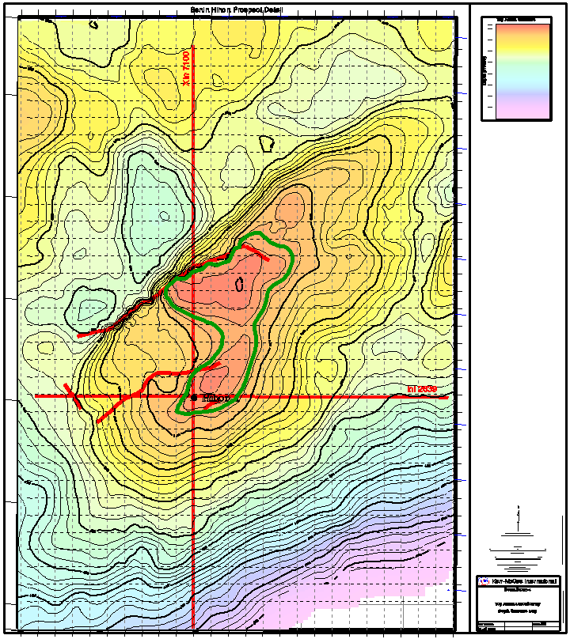

Figure 14: Some types of traps

Figure 15: Depth map
showing the roof of a tank

3)  **Geological risk assessment**

Geological hazard assessment is used to determine the probability of
success of exploratory drilling on a mapped prospect. The assessment of
the geological chances of success associated with a prospect is done by
assigning probabilities to the key geological factors that are essential
to the formation and preservation of an oil or natural gas accumulation.

Thus, the determination of the geological risk of a prospect makes it
possible to calculate the probability of success of this prospect. It is
determined by the formula:

**P(prospect) = P(source rock) x P(reservoir) x P(trap)**

Waterproof trap + waterproof cover

Porosity and permeability of reservoir rock

Geological hazards

Maturity of the bedrock and therefore its degree of migration to the
reservoir

***(iv) Volumetric assessment of hydrocarbon resources***

The evaluation of the hydrocarbon resources contained in the prospect
consists of estimating the volume of oil or natural gas that could be
found in the prospect. It is carried out using the geological and
petrophysical parameters of the reservoir rock. This assessment is more
accurate when using the results of the work carried out, in particular
the results of exploratory drilling. Failing this, the parameters from
the seismic interpretation or from the wells adjacent to the research
area are used.

Thus, the quantity of hydrocarbons (VHcP) in place, i.e. oil (STOIIP) or
gas (GIIP) in place, is determined as follows:

**VHcP = GRV x N/G x Ø x Shc x 1/FVF**

With

**IBC = Gross Rock Volume: it is determined by taking into account the
geometric shape of the reservoir and its thickness**

**IBCs = ∑Deposit Area x Deposit Thickness**

**N/G**: This is the ratio between the net thickness of the tank and the
gross thickness of the tank. It should be noted that the thickness of
the deposit does not often have a uniform lithology. It is often
interspersed with layers of impermeable clay.

**Ø (Phi)** = Reservoir porosity which is estimated from electrical
logs, core measurements and knowledge from similar formations. It is
determined as follows:

**Porosity (Ø) = Pore Volume (Vv)/ Reservoir Volume (V)**

**Shc =** Hydrocarbon saturation determined by knowing the water
saturation Sw. It is usually calculated from the well digraphies in the
effective porosity zone.

**Shc = 1-Sw**

**FVF**: This is the Volumetric Factor of Formation. It expresses the
change in the volume of the oil from the tank to the surface under
standard pressure and temperature conditions (pressure: 1 atm and
temperature: 15° Celsius). FVF of the oil is Bo and for the gas is Bg.

**FVF = Reservoir Volume/Surface Volume**

- **For the oil**

FVF = Bo and Shc = So (oil saturation)

Thus,

**STIIOP = GRV x N/G x Ø x So x 1/Bo**

**Associated gas in place = STOIIP x GOR**

- **For gas**

FVF = Bg and Shc = Sg (Gas Saturation)

Thus,

**GIIP = GRV x N/G x Ø x Sg x 1/Bg**

**Condensate in place = GIIP x CGR**

with:

**GOR**: called Gas-Oil Ratio is the ratio of gas volume to oil produced

**CGR**: called Condensate-Gas Ratio is the ratio of ***condensate
volume*** to the volume of gas produced

A lead ranking is performed when multiple leads are mapped on a
contracted block. This classification is based on geological hazards
(probability of success), the volume and type of hydrocarbons
potentially in place, and other petrophysical parameters. The choice of
the prospect(s) to be drilled takes this ranking into account in order
to maximize the chances of success.

Once a discovery is made, the ICC carries out the work to evaluate the
deposit. This work includes a set of activities, namely the drilling of
appraisal or delineation wells, geological and geophysical studies of
reservoirs as well as an evaluation of reserves to decide on the
development of the deposit when it is commercially exploitable.

3.  **Financing of
    exploration activities**

Exploration activities are almost entirely funded by the IPCs as states
lack the financial resources, technology, human skills and operational
capacity to engage in this high-risk project.

Oil exploration is the most delicate phase with high risk in the sense
that it involves heavy capital investments (CAPEX) for results whose
probability of success is generally below the global average. Despite
technological advances in oil exploration, the failure rate is high.
About 2/3 of the exploration wells are dry. In the absence of commercial
discovery during the exploration period, the CPIs lose all their
investments.

4.  **Responsibilities of
    States in the exploration phase**

During this phase, the host country, although it does not often take
financial risks, has a great responsibility vis-à-vis the contracting
CPIs who assume virtually all the risks associated with the investment
capital.

The two most essential roles of the State, owner of potential resources,
are: the establishment of an oil database and the monitoring and
technical and financial control of all activities carried out by the
contractor.

- ***Oil Data Management***

The host country must ensure the collection and preservation of all oil
data acquired during this phase. These oil data constitute a decisive
basis for future investigations. They have significant scientific and
economic value in the sense that they provide information on the geology
and resource potential in the subsoil of states.

This data concerns those produced during the exploration phase but also
those generated during the development, production and abandonment
phases. Some countries, due to a lack of means of conservation, i.e.
technical and infrastructural capacity, entrust the storage and
management of their data to partners or specialized foreign companies
outside their territory. In doing so, they behave like landlords who
entrust the key to their safe to their tenants.

***"By entrusting the management of oil data to specialized foreign
companies, states no longer have enough control over the various
manipulations and businesses to which they are subjected. As they do not
have control and management tools, they are unaware of the quantity and
quality of their data, and consequently the economic value of their
assets".***

They are therefore required to believe in the balance sheets and
evaluations as well as in the decisions and choices of oil companies in
the context of the implementation of oil operations.

This is why it is necessary for States to create adequate storage and
conservation centers as well as laboratories for quality control and
analysis of acquired oil data, which, in the same way as oil resources,
constitute State assets. To this end, it is essential for States to
adopt a real policy for the control and management of their oil data.
Some West African countries are aware of this and are developing a good
data conservation, analysis and management strategy. Côte d'Ivoire and
Nigeria are a good example of the establishment of a centre for adequate
storage and preservation and data analysis (Figure 16).

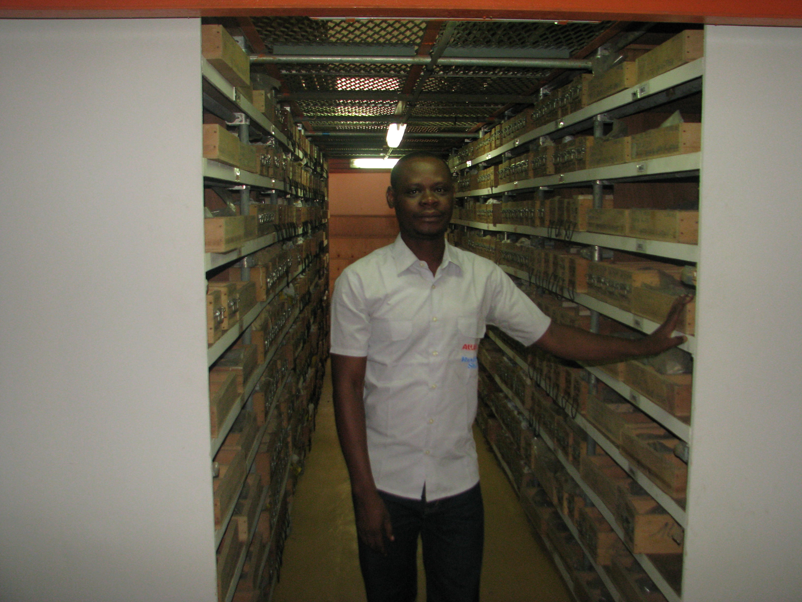

Figure 16: Photos showing the core library of Côte d'Ivoire at the Direction of the PETROCI Analysis and Research Center

- ***Monitoring and control of activities***

The regulation of exploration activities includes not only the
monitoring of the implementation of contractual obligations but also the
control of the costs of carrying out activities as well as compliance
with standards and procedures for the execution of activities in
accordance with national regulations or those of the international oil
industry. The monitoring and technical control of activities are
fundamental sovereign functions of the State that require the existence
of qualified human resources and the implementation of effective control
tools for oil and exploration operations, including the management of
environmental risks and impacts related to the implementation of these
activities. This monitoring must be regular and well planned insofar as
it is at this level that the contractor, driven by the search for
maximum profit, could take advantage of the failure of the State's
control and audit mechanism to overestimate exploration costs or even
deviate from the best practices of environmental protection during the
implementation of activities.

In short, it is the responsibility of the States to monitor the
effectiveness of the implementation of the activities reported, the
optimal deadlines for completion, the quality of the work carried out at
the technical level and in compliance with the environmental standards
accepted or prescribed by the regulations and to audit the actual costs
of their implementation through the development of a directory of the
costs of the activities. This directory will have to be updated to serve
as a reference for confrontations and audits.

1.  ***Development
    Phase***

> **2.3.1- Definition and
> strategies**

The development of an oil field consists of carrying out operations that
contribute to the establishment of the production infrastructure of the
discovered field(s). These typically include production platforms,
production drilling, and infrastructure for storing and transporting
crude oil or natural gas from the wellhead to the point of delivery, and
onshore or offshore effluent collection and treatment facilities. During
this phase, geological assessment studies, reservoir evaluation,
feasibility studies and FEED (Front and End Engineering Design) studies
are carried out in order to choose **the best development option from a
technical, economic and social point of view**. All these studies
contribute to the elaboration of a Development and Operation Plan (PDO)
which is a clear document that describes the feasibility of the
development project in its various well-planned aspects.

The PDP includes:

- Geological assessment

- Reservoir evaluation and reservoir technology including secondary and
  tertiary recovery study

- Production and Drilling Technology

- Facilities

- Equipment maintenance

- Economic evaluation

- Safety and Environment

- Project organization and execution

- Abandonment plan

From discovery to production, it takes an average of three to four years
for the development of an oil field. This means that this phase is very
delicate in the sense that the optimal exploitation of a deposit depends
on the development model chosen.

The choice of a development model depends on several technical and
economic parameters, including the existing facilities or those to be
set up, the nature or type of the reservoir (single or multilayered) and
the thickness of the reservoir, the location of the reservoir (onshore,
deep or shallow offshore), the quality of the reservoir, the quality of
the crude oil and its market price, etc.

### 2.3.2- Reservoir Evaluation Methodology

The reservoir assessment is carried out according to the methodology
shown in Figure 17 below. This methodology starts from data collection
to the economic evaluation of the deposit. It allows, after processing,
interpretation of the data, i) to carry out the modelling/simulation of
the reservoir on the basis of the data available on the reservoir, i.e.
seismic data, well logs, cores, well tests, ii) to determine the
performance of the reservoir and iii) to project the most optimal and
responsible production profile as well as the economic profitability of
the development project with a view to decision-making of the deposit.

Geological and reservoir simulation studies provide detailed models of
underground reservoirs to predict their behavior over time through the
calculation of fluid flow fluxes that are a function of reservoir
properties and well conditions (Figure 17). Simulation is therefore an
essential decision-making tool that allows:

- optimize production through i) a better understanding of the most
  efficient means of hydrocarbon recovery, i.e. the different recovery
  methods adapted to the characteristics of the reservoir (reservoir
  with active aquifer, reservoir with cap gas, the lithological nature
  and thickness of the reservoir, etc.), ii) the number and types of
  wells (vertical, inclined or horizontal) adapted to the reservoir in
  order to maintain its performance **;**

- manage risks by assessing and mitigating risks associated with
  drilling and production

- to make an economic planning or forecast to help in an investment
  decision.

Excavated material, cores, seismic data, logging, well tests, etc.

**RAW DATA COLLECTION**

Descriptive elements of the reservoir (porosity, permeability, water
saturation, pressure, oil viscosity, etc.)

**PROCESSING AND INTERPRETATION OF THE DATA COLLECTED**

**INTEGRATION AND**

**MODELING**

Tank Models and Understanding of the Tank

**EVALUATION DES OPTIONS DE RECUPERATION**

- Recovery Methods (Primary, Secondary, and Tertiary)

- Types/types of wells (production, injection and
  observation/horizontal, vertical, inclined, etc.)

- Etc

Tank Performance Prediction

CAPEX, OPEX, Risk

**ECONOMIC EVALUATION AND DECISIONS**

Figure 17: Methodology
Tank Evaluation

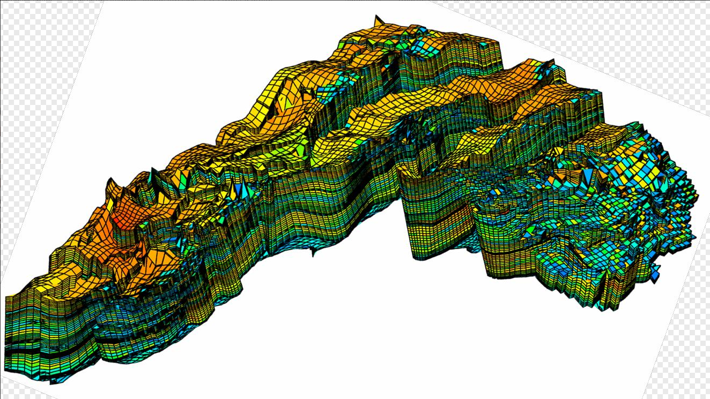

Figure 18: Diagram showing a reservoir model (Vilgeir Dalen, StatoilHydro, 2007)

### 2.3.3- Financing of development activities

**Development** involves large capital expenditures (CAPEX) in the
upstream oil subsector. Enormous financial resources are invested in the
production of hydrocarbon deposits. It should be noted, however, that
the risk is lower during this phase compared to the exploration phase;
The question that arises is no longer the doubt about the existence of
the deposit, but it is above all that linked to the benefit/cost ratio
of investments, which is a function of the technical and economic
parameters and conditions related to its exploitation. This is why,
before embarking on development operations, several preliminary
profitability studies are carried out and recorded in the PDO submitted
to the State for approval.

### 2.3.4- Roles and responsibilities of States in the development phase and Relevance of a PDO

The development of an oil field is subject to the approval by the
Government of a Development and Operation Plan (PDO) or a feasibility
study drawn up by the contractor and submitted to the State. The PDP
preparation and approval process provides opportunities for dialogue
between the contracting company and the host state on how the field
should be developed and produced in a sustainable manner so that both
parties can benefit the most. Thus, before the approval of the PDO, the
State must proceed:

- **The geoscience assessment of the PDP** , which aims to:

<!-- -->

- Ensure that the quality of the reservoir interpretation is convincing
  enough for a development decision

- Agree with the ICC on the PDP's findings before it is approved

To this end, it is recommended that States:

- Conduct in-house studies and interpretations based on well data,
  seismic data including 3D and VSP, maps etc.

- certify the assessment of recoverable reserves and the feasibility
  study by its specialists or a third party

- to organise meetings and dialogues with the operating company on the
  basis of the results of the counter-expertise work carried out by the
  State for fruitful technical exchanges

<!-- -->

- **The evaluation of the reservoir** which aims to**:**

<!-- -->

- Ensure an optimal production strategy selection

- Define the use of gas in an oil field

- Ensuring the possibility of oil recovery in a gas field

- define and guarantee the implementation of a serious and responsible
  production profile

- Ensure proper management of the tank

- Ensure consistency (correlation) between geology, reservoir and
  production strategy.

In short, the State, as the owner of resources, must:

- **avoid the hasty start of hydrocarbon development operations.** Any
  start of the development plan must require the approval of the State
  after examination of all the preliminary studies and documents
  required by the petroleum legislation, including the reservoir
  simulations.

- **assess the economic development model** that takes into account
  economic risks and uncertainties (price of a barrel on the
  international market), the duration and rate of depreciation or the
  oil cost recovery model, the production profile and by extension the
  duration of production. The business model proposed in the PDO or
  feasibility study must also have a positive positive return on
  investment

- **ensure that the PDP incorporates the requirements for abandonment of
  the field at the end of production**. These requirements relate to the
  plugging of wells and the decommissioning of facilities to avoid
  safety and environmental damage.

This is why States must examine the results of the evaluation and
simulation of the reservoir and the economic model developed or carried
out by the operators (CPI) in order to better exchange on the
uncertainties in order to adjust or build a new consensual production
model if necessary.

In view of all the above, it is necessary for States to have a centre
for the interpretation of seismic data, modelling, evaluation and
simulation of the reservoir with qualified personnel to carry out a
second assessment of the results of the reserve assessment studies, the
development plan or the feasibility study proposed by the CPIs or,
failing that, to have these studies certified by a third party.

The rigorous monitoring of activities during development is as important
as during the exploration phase and requires vigilance, professionalism
and probity on the part of the actors in charge of monitoring activities
to avoid being duped or corrupted by the CPI who can manipulate the
costs of operations for their own benefit; which will lower the margin
of the profit to be shared.

"***The hasty start of development operations for political propaganda
reasons is often at the origin of immature development options that are
sometimes unsuitable from a technical and operational point of view.
This is at the origin of the technical difficulties during the
operational implementation of the PDO. These difficulties very often
lead to unnecessary loss of time, causing an increase in investments and
poor control and management of the reservoirs, thus jeopardizing their
performance in the short and medium term."***

*"The development and production of the Sèmè oil field (Republic of
Benin), discovered in 1968, is a good example of an ill-prepared oil
adventure. Production started in 1982 by the Norwegian company SAGA
Petroleum, with an immature feasibility study (weakness of the reservoir
study, non-optimal development plan, inconsequential economic
profitability study that does not take into account all the
above-mentioned parameters, not taking into account an abandonment
plan). After only a few years of production, precisely in 1985, with
seven wells in production, the field was already experiencing a meteoric
rise in water to the detriment of oil. Later in 1997, the situation was
more alarming with about 90% water in most wells in production. The
tanks were damaged. This is probably due to the weakness of the
feasibility study, particularly in terms of the reservoir evaluation and
simulation studies (number of wells put into production and the distance
between wells because this field has a very active aquifer), the lack of
professionalism of the operating companies and political considerations.
The field was closed in 1998 after a change of hands with several
operators for production (Saga Petroleum, PANOCO, PPS, ASHLAND, Atlantic
Petroleum Inc,), under deplorable and inappropriate economic, financial,
social and environmental conditions (high debts, dismissal of staff with
unsatisfactory accompanying measures, failure to plug wells or secure
offshore infrastructure, which today constitute a major environmental
and security risk).*

*The redevelopment operations of the Sèmè field started in 2014 by the
Nigerian company SAPETRO, which signed a production sharing contract on
block 1 in 2004, also ended in failure due to the inadequacy and
immaturity of the proposed development model, which led to heavy capital
investments (construction of an oil platform, onshore processing and
storage units with flowlines as well as new mooring buoys for export),
and studies of the economic sensitivity of the project. The installation
of this equipment and production units constitutes a heavy investment
for residual reserves to be produced.*

*The economic model developed by SAPETRO was based on a barrel price of
crude oil estimated at at least \$80. Unfortunately, in 2015, the oil
counter-shock of 2014-2016 which caused a fall in the price of a barrel
of Brent from \$110 to \$36, between the beginning of July 2014 and
January 2016, combined with the failures of two wells out of the three
started due to the technical difficulties encountered during drilling,
led to the abandonment of the SAPETRO redevelopment project which could
not produce a single drop of oil and in turn put an end to Benin's dream
of becoming a producing country again in 2015".*

1.  ***Phase de
    Production***

> ***2.4.1- Definition
> and characteristics***

This is the phase most awaited by the parties, namely the State and the
contractor. Good tank management is always related to the technology
used. It makes it possible to optimize production, in this case
recoverable reserves. This is a very serious exercise that requires
rigorous monitoring of production and periodic evaluation of the tank.

The minimum service life of the production facilities is 30 years. The
maintenance of the installations is essential in order to prevent
accidents, pollution and production interruption.

The life cycle of a hydrocarbon field put into production presents the
different phases as shown in Figure 19 below.

Figure 19: Production
profile of an oil field showing the life cycle of an oil field

The production profile adopted is an indicator of the duration of
production or the life of the field. This profile is generally
subdivided into three periods:

- The build-up period or ***preparatory period*** during which the
  production wells are gradually brought into production. During this
  phase, there is a gradual increase in production over time to a
  maximum limit

- The period of the ***plateau*** during which a constant production
  rate is maintained

- The period of ***decline*** when producing wells show a decline in
  production throughput

Thus, the production time depends on the build-up phase, the plateau
which can have a high, moderate or low production rate, but also the
decline phase which can be mild or abrupt.

During the decline phase, new peak production phases (secondary or
tertiary build-up) are often initiated by the use of secondary and
tertiary recovery methods depending on the geological and geometric
characteristics of the reservoir, the properties of the fluid and the
petrophysical parameters of the reservoir.

### 2.4.2- Recovery methods and strategies

In oil production, it is impossible to fully recover the quantity of
hydrocarbons initially in place from the reservoir. The **recovery
factor** represents the amount of oil that can be extracted from a
reservoir relative to the total amount of oil present in the subsoil.
For optimal production of existing reserves, it is necessary to apply
and choose the best techniques and recovery methods with regard to the
properties of the reservoir and the development objectives. Thus, we
distinguish:

1)  ***Primary oil recovery*** describes the production of hydrocarbons
    under the natural entrainment mechanisms present in the reservoir
    without the additional aid of injected fluids such as gas or water.
    This recovery induces the loss of pressure in the reservoir due to
    natural production or production activated by a pump. The **primary
    recovery factor** for oil is typically between 15 and 20 per cent of
    in-place reserves.

2)  ***Secondary recovery*** occurs when the reservoir pressure becomes
    insufficient to drain the oil from the reservoir to the surface or
    to cause natural recovery of the hydrocarbons. It consists of
    supporting the reservoir's pressure by injecting water or immiscible
    gas into the reservoir to move the oil and lead it to a production
    well. When the oil field does not have a gas cap, it is recommended
    to inject water to improve the performance of the reservoir.
    Recovery can be improved by 15 to 45% in addition. Secondary oil
    recovery is a mechanical or physical operation that does not include
    chemical compounds or reactions (Jianjie Niu, Qi Liu, Jing Lv, Bo
    Peng, 2020).

3)  As for ***tertiary recovery***, it uses the injection of miscible
    gas such as as as thermal, chemical and biological methods. The
    objective of tertiary recovery is to modify the physicochemical
    characteristics of the oil to promote its flow. This method makes it
    possible to recover another 5 to 10% of oil. Tertiary recovery
    techniques are extremely expensive and are only undertaken when the
    price of a barrel of crude oil is high enough to justify the related
    investments.

In total, the oil recovery rate varies from 35 to 75% depending on the
parameters influencing the recovery. The price of gas is better and is
generally more than 75%, as gas is less dense, more mobile and therefore
easier to reach the surface than oil.

The factors influencing recoveries are of several kinds:

- Reservoir properties: The porosity, permeability and saturation of the
  reservoir determine the amount of oil that can be recovered. High
  porosity and permeability help extract more oil from the tank, while
  low porosity and permeability make the extraction process difficult.

- Oil Properties: The viscosity, density, and API density of the oil
  determine the efficiency of the extraction process. High viscosity oil
  is difficult to extract, while low viscosity oil is easier to extract.
  Similarly, the density of the oil affects the recovery process. Heavy
  oil is more difficult to extract than light oil.

- Recovery techniques: Artificial lifting techniques such as beam pumps,
  gas struts, and electric submersible pumps can increase the amount of
  oil recovered from the tank. The choice of recovery technique depends
  on the properties of the reservoir and the properties of the oil.

- Production rate: the application of a very high production rate can
  lead to a decrease in the tank pressure, and damage the tank as
  quickly as possible; which can reduce the amount of oil recovered.

- Tank pressure: The pressure in the tank decreases as oil is extracted,
  which can reduce the amount of oil recovered. Using artificial lifting
  techniques during primary recovery can help maintain tank pressure,
  resulting in increased oil recovery.

### 2.4.3- Financing of production operations

Investments during this phase are lower than in the previous phase and
are referred to as "**operating costs (OPEX)".** These costs are easily
financed by stakeholders because of the revenues that are generated from
production. They relate to the costs of maintaining the installations
and reconditioning the wells (workover work) and sometimes to expenses
related to improving the performance of the reservoir through geological
and reservoir studies.

### 2.4.4- Responsibilities of the Host States in the production phase

As in the development phase, the vigilance of the states that own the
resources is required in order to avoid false declarations of
production. This vigilance requires adequate training in the monitoring
and inspection of production and transport activities as well as the
control of equipment and measurement parameters agreed upon or accepted
in the oil industry.

Indeed, from the wellhead to the point of delivery, the hydrocarbons
produced can be subject to unhealthy handling by the CPIs whose
objective is to maximize their profits. They can truncate the quantities
of hydrocarbons produced so as to set up a mechanism for false
declarations if the method of monitoring and inspecting oil operations
is not effective at the state level. This is why controls and
inspections of equipment and installations built on site or imported for
the storage and transport of hydrocarbons are recommended to determine
the compliance of the condition of the installations with the necessary
international requirements and to ensure that measurements of the
physico-chemical parameters of hydrocarbons or counts are made a certain
number of times along the path of products from the wellhead to the
point of delivery to ensure reliable results. The purpose of these
measurements/counts is to determine, among other things, the quantity
and quality of the production, transport and sales chain.

**Tax metering** is the measurement carried out in the context of the
purchase and sale of crude oil or natural gas and the calculation of
taxes (e.g. CO2 tax, NOx tax) and royalties.

In addition, it is important to emphasize that the volume of crude oil
depends on the temperature. A change in temperature causes a change in
the volume of crude oil. Indeed, crude oil contracts in the cold and
expands when the temperature increases. In other words, for a quantity
of crude oil produced whose volume is measured at 120°C at the wellhead,
the same volume measured at 15°C at the point of delivery is less than
that measured at 120°C.

By way of illustration, a manipulation or measurement error of 0.4%, for
example at the measurement point to the detriment of the producing
States, would generate significant financial losses as shown in Table 4
below for these countries and an equivalent gain for the contracting
company:

<table>
<caption>
Table 4:
Calculation of the financial losses that would result from a measurement
error of 0.4%
</caption>
<colgroup>
<col style="width: 13%" />
<col style="width: 18%" />
<col style="width: 18%" />
<col style="width: 12%" />
<col style="width: 16%" />
<col style="width: 21%" />
</colgroup>
<thead>
<tr>
<th rowspan="2" style="text-align: left;">Country</th>
<th rowspan="2" style="text-align: left;">Daily production (bl/d)</th>
<th rowspan="2" style="text-align: left;">Measurement/Counting Error
(%)</th>
<th rowspan="2" style="text-align: left;">Price per barrel ($US)</th>
<th colspan="2" style="text-align: left;">Financial loss ($US)</th>
</tr>
<tr>
<th style="text-align: left;">daily</th>
<th style="text-align: left;">annual</th>
</tr>
</thead>
<tbody>
<tr>
<td style="text-align: left;">Niger</td>
<td style="text-align: left;">53 000</td>
<td style="text-align: left;">0,4</td>
<td style="text-align: left;">90</td>
<td style="text-align: left;">19 080</td>
<td style="text-align: left;">6 964 200</td>
</tr>
<tr>
<td style="text-align: left;">Ivory Coast</td>
<td style="text-align: left;">74 000</td>
<td style="text-align: left;">0,4</td>
<td style="text-align: left;">90</td>
<td style="text-align: left;">26 640</td>
<td style="text-align: left;">9 723 600</td>
</tr>
<tr>
<td style="text-align: left;">Ghana</td>
<td style="text-align: left;">188 000</td>
<td style="text-align: left;">0,4</td>
<td style="text-align: left;">90</td>
<td style="text-align: left;">67 680</td>
<td style="text-align: left;">24 703 200</td>
</tr>
<tr>
<td style="text-align: left;">Nigeria</td>
<td style="text-align: left;">1 539 000</td>
<td style="text-align: left;">0,4</td>
<td style="text-align: left;">90</td>
<td style="text-align: left;">554 040</td>
<td style="text-align: left;">202 224 600</td>
</tr>
</tbody>
</table>

This means that a margin of error greater than the tolerance threshold
allowed in the oil industry generates losses for one or the other of the
parties. Margins of error are usually due to improper calibration or
calibration of the measurement and metering system during the transfer
of hydrocarbons, failure or conscious or unconscious manipulation of the
measuring instruments and conditions.

Unfortunately, African States pay very little attention to these aspects
and may be victims of false declarations by the ICCs due to the absence
or inadequacy of monitoring of activities and/or the weak technical
competence of the inspectors in charge of monitoring and monitoring
activities.

*"It is unfortunate to note that some senior officials and leaders of
certain producing countries of sub-Saharan Africa, congratulate CPIs for
the realization of some flattering socio-community works (construction
of boulevards, schools, markets...) in their country, forgetting the
regulatory and inspection roles that are their prerogatives and whose
full exercise will considerably reduce the shortfalls for their State
and consequently have a positive and better impact on the development of
their nation.*

*In many respects, Corporate Social Responsibility (CSR), which is
advocated and introduced in certain extractive industry contracts and
projects, and which should be a springboard for socio-community
development and for better environmental management in the
geo-extractive industries, is akin to a form of contemporary
neo-colonialism where the CPIs, representing Western powers, seek to
please themselves in order to better establish their domination and
hegemony and in this case for the plundering of resources".*

***"Let's not forget that the CPIs are not philanthropists; Their main
objective is to make the maximum profit in record time."***

This is why it is essential that African countries, especially those in
sub-Saharan Africa, take their responsibility and effectively play their
regulatory role. As such, they must work more to:

- mastery of the operating principles of the devices and approval of
  measurement procedures,

- periodic or regular inspections of equipment, apparatus, parameters
  and procedures jointly accepted and in accordance with the use in the
  international petroleum industry, and finally

- the training of adequate skills in the field of control and inspection
  in the upstream oil sector in order to ensure that the performance of
  operations is carried out in accordance with the rules of the art and
  in transparency.
### Abandonment

> ***2.5.1- Definition of
> the concept***

The abandonment or closure of a field occurs when the recoverable
reserves are exhausted or when the installations have reached their
useful life. This means that the project has reached its economic
profitability limit.

Any PDO must contain a plan for the abandonment and decommissioning of
petroleum facilities used in the development and production of
hydrocarbons.

Thus, decommissioning is a process that sanctions the end of the life
cycle of an oil or gas field and makes it possible to decide or make the
choice of the best option to put oil and gas facilities out of harm's
way from a safe and environmental point of view. To this end, it
consists of:

- plugging wells (production, injection and/or observation wells);

- cleaning of all pipelines, reservoirs or hydrocarbon storage and
  processing tanks;

- securing the facilities;

- the total or partial removal of equipment or facilities installed for
  the operation;

- the reuse of the installations or their disposal under suitable
  conditions and arrangements.

The implementation of the abandonment plan must take into account
international regulations and legislation in the countries concerned.
Such legislation generally takes into account the needs of environmental
protection, safety of navigation, fishing activities and other uses of
the marine environment.

### 2.5.2- Financing of decommissioning/abandonment work

The responsibility for financing the abandonment work lies with the
owner of the equipment and installations defined according to the type
of contract signed. For example, in the case of a Production Sharing
Contract, the costs of the abandonment work (ABEX) are generally
financed from the provisions put in place during the production phase,
in accordance with the contractual provisions. In most legislation and
Production Sharing Contracts, the host state authorizes the CPIs to use
this provision to carry out abandonment or decommissioning work at the
closure of the oil and gas field.

### 2.5.3- Responsibilities of States in the phase of abandonment

The role of the State is to ensure that a decommissioning/abandonment
plan has been drawn up and integrated into the PDO or in the feasibility
study of the development submitted by the contractor. This elaborate
plan can be updated or adjusted according to changes in the technology
used during development and production. The decision to approve the
decommissioning plan by the State, which defines the best technical
solution, must take into account safety, environmental and economic
criteria, in particular the cost of decommissioning, etc. The State, in
its decision, must set the maximum duration of the decommissioning on
the basis of the contractor's recommendations.

1.  ***Summary of
    expenses and revenues during the life cycle of an oil project***

The summary of cash flows from pre-licensing to abandonment indicates
the expenditures (investments) incurred in oil exploration and
development activities and the revenues derived from production (Figure
20).

The financing of pre-licensing activities is generally a matter of state
sovereignty and some activities may be carried out under a service
contract. These activities are therefore part of the sovereign spending
of States.

Once a contract is signed, the contractor undertakes at its own risk to
make enormous capital expenditures (CAPEX) during the exploration and
development phases.

During the production phase, the parties to the contract (State and
contractor) generate income from the sale of the hydrocarbons produced.
Investments (OPEX) relate to the maintenance costs of production
equipment and facilities and are easier to mobilize by contract partners
who use part of their production revenues. Cash flow is positive. The
profits from the production are shared between the parties in accordance
with the contractual provisions.

In the abandonment phase, the expenses related to the works (ABEX) are
financed by a part of the income from production in accordance with the
contractual provisions which generally provide for provisions for the
execution of the abandonment works.

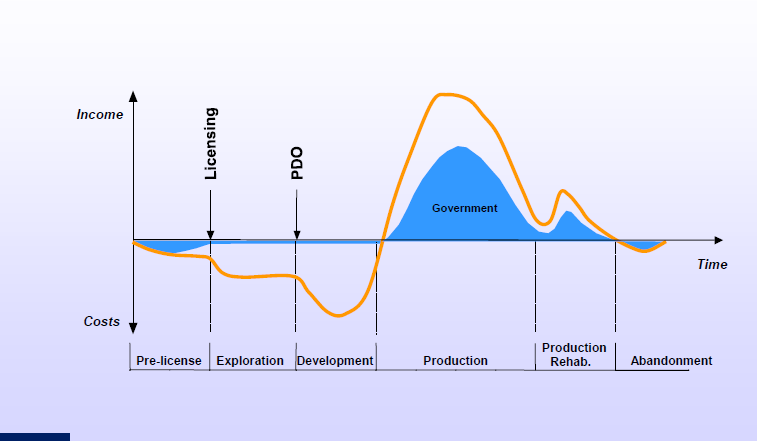

Figure 20: Cash flows during the different phases of upstream oil activities (Dr. Alfred Kjemperud, 2007)
