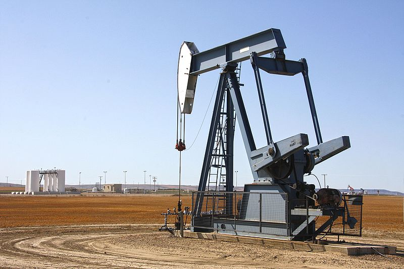

# Front Matter

Preface

**CONTENTS**

**FOREWORD**

**GENERAL INTRODUCTION**

**PART I: GENERAL INFORMATION ON THE OIL INDUSTRY AND THE CHALLENGES OF
RESEARCH AND EXPLOITATION IN WEST AFRICA**
### Hydrocarbon sector value chain
### Different phases of upstream oil and the roles of states

**PART TWO: OIL CONTRACTS AND OIL TAXATION IN WEST AFRICA**
### Tax regimes in the oil sector

4.  **Comparative study of tax regimes in selected West African
    countries**

**PART THREE: POLITICAL STABILITY, GOVERNANCE AND CORRUPTION IN THE OIL
SECTOR**
### Key socio-political determinants of oil sector performance
### West Africa – in-depth country analysis

**GENERAL CONCLUSION**

**GLOSSARY**

**BIBLIOGRAPHICAL REFERENCES**

**List of Figures**

Figure 1: Petroleum sector value chain
16

Figure 2: a and b Map showing the MSGBC Basin and Map showing the
basins of the northern part of the Gulf of Guinea in West Africa
20

Figure 3: Map showing the sedimentary basins of Mali and Niger
20

Figure 4: Synthetic diagram showing the different oil cuts
30

Figure 5: Different phases of upstream oil
32

Figure 6: Process for allocating oil blocks to the IPC for petroleum
exploration and exploitation 35

Figure 7: Gravimetric acquisition (a) showing anomalies in the Coastal
Sedimentary Basin of Benin (CGG 2013) and aeromagnetic (b) to
characterize the basement and sedimentary formations
37

Figure 8: 3D acquisition principle (a) and seismic cube (b)
38

Figure 9: Seismic amplitude anomalies showing Brightspots and Flatspots
38

Figure 10: Electromagnetism coupled with seismic reflection showing the
resistivity contrast at the traps highlighted by seismic
39

Figure 11: Geological section showing the stratigraphic extent of the
fictitious Deer-Boar oil system at the critical time (250 Ma). The
thermally immature source rock is above the oil window. The active
source rock is down-dip of the oil window (Magoon and Dow 1994)
40

Figure 12: Geoseismic section showing petroleum systems in the Benin
Coastal Sedimentary Basin, Kerr McGee, 2003
41

Figure 13: Seismic interpretation showing a structural trap (anticline)
42

Figure 14: Some types of traps 42

Figure 15: Depth map showing the roof of a tank
43

Figure 16: Photos showing the core library of Côte d'Ivoire at the
Directorate of the PETROCI Analysis and Research Center
47

Figure 17: Methodology Tank Evaluation
50

Figure 18: Diagram showing a reservoir model (Vilgeir Dalen,
StatoilHydro, 2007) 51

Figure 19: Oil field production profile showing the life cycle of an
oil field 55

Figure 20: Cash flows during the different phases of upstream oil
activities (Dr. Alfred Kjemperud, 2007)
62

Figure 21: Economic Value of Hydrocarbon Resources
65

Figure 22: Distribution of income from production (After Johnson, 1995)
66

Figure 23: Classification of tax systems
67

Figure 24: Graph showing the cost stops applied in selected West
African countries 75

Figure 25: Simplified organizational chart showing the share of the
State and the Contractor in the taxation associated with the CPP of
Benin 85

Figure 26: Simplified Organizational Chart Showing the State and
Contractor's Share of the Taxation Used in Ghana's Model Contract
86

Figure 27: Simplified organizational chart showing the share of the
State and the contractor resulting from the taxation associated with the
CPP of Côte d'Ivoire 87

Figure 28: Simplified organizational chart showing the share of the
State and the Contractor in the taxation associated with the CPP of
Nigeria 88

Figure 29: Simplified organizational chart showing the share of the
State and the Contractor resulting from the taxation associated with the
Senegalese CPP 89

Figure 30: Simplified diagram showing the share of the State and the
Contractor resulting from the taxation associated with the CPP of Niger
90

Figure 31: Graph showing the share of net profit accruing to the CPI
and the States according to the tax regime applicable in these States
92

Figure 32: Graph showing the distribution of the cash flow between the
government and the contractor considering 100 barrels of oil extracted
92

**List of Tables**

Table 1: Estimation of hydrocarbon resources in West Africa
17

Table 2: Daily output of countries (Trading Economics, 2025)
18

Table 3: Type of crude oil in selected West African countries
21

Table 4: Calculation of financial losses resulting from a measurement
error of 0.4 % 58

Table 5: Summary of ad valorem royalty rates applied in selected West
African countries 73

Table 6: Oil-profit sharing mechanisms in selected West African
countries 78

Table 7: Profit tax rates applied in selected West African countries in
the oil sector 80

Table 8: State participation rates in selected West African countries
81

Table 9: Summary of the key tax terms for determining the share of the
parties' overall cash flows for oil
83

Table 10: Distribution of the net revenues (share) of the State and the
Contractor arising from the tax regimes of the petroleum laws and
regulations of the countries studied
91

Table 11: Cash flow representing the share of each part per 100 barrels
of oil produced 91

**Abbreviations, Acronyms and Abbreviations**

**ABEX :** Abandon Expenditures

**AFREC**: African Energy Commission

**IEA**: International Energy Agency

**APPO**: Organization of African Petroleum Producers

**AVO :** Amplitude Variation with Offset

**API :** American Petroleum Institute

**BBL/D/1K**: One Thousand Barrels Per Day

**BCF**: Billion cubic feet

**CAPEX :** Capital Expenditures 

**ECOWAS:** Economic Community of West African States

**CO2:** Carbon Dioxide

**CPI:** International Oil Company

**CPP**: Production Sharing Contract

**CNPC:** China National Petroleum Corporation

UNCTAD: United Nations Conference on Trade and Development

**DHI**: Direct Hydrocarbons Indicator

**DPB** : Benin Oil Depot Company

**DW:** Deep Water

**IMF:** International Monetary Fund

**GAO:** West Africa Gas Pipeline

**LNG:** Liquefied Natural Gas

**GNPC :** Ghanean National Petroleum Company

**LPG:** Liquefied Petroleum Gas

**EITI**: Extractive Industries Transparency Initiative

**MMBBLS:** Million de barils

**NNPC:** Nigerian National Petroleum Company

**NOx**: x Nitrogen oxide

**OPEX:** Operating Expenditures

**NATO :** North Atlantic Treaty Organization

**PDO:** Development and Operation Plan

**PETROCI:** National Company of Petroleum Operations of Côte d'Ivoire

**PETROSEN:** Société Nationale des Pétroles du Sénégal

**GDP:** Gross Domestic Product

**PPS**: Sèmè Oil Project

**PSA** : Production Sharing Contract

**SAPETRO:** South Atlantic Petroleum

**SAR:** Société Africaine de Raffinage

**SIR:** Société Ivoirienne de Raffinage

**SMB:** Multinational Bitumen Company

**SONANGOL :** Société Nationale des Pétroles de l’Angola

**SONATRACH:** National Hydrocarbons Company of Algeria

**SONIDEP:** Nigerien Oil Company

**SORAZ:** Zinder Refining Company

**SW :** Shallow Water

**TCF:** Trillion Cubic Feet (1000 BCF)

**TOR:** Tema Oil Refinery

**UDW**: Ultra Deep Water

**VSP**: Vertical Seismic Profil

**WAPCo:** West African gaz Pipeline Company

**WAPCO**: West African Oil Pipeline Company

**AfCFTA:** African Continental Free Trade Area
